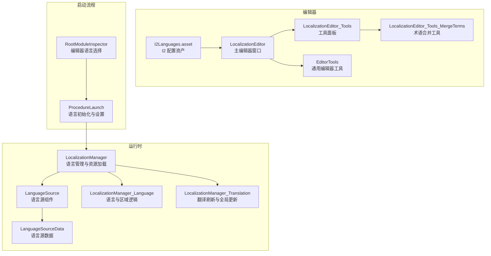
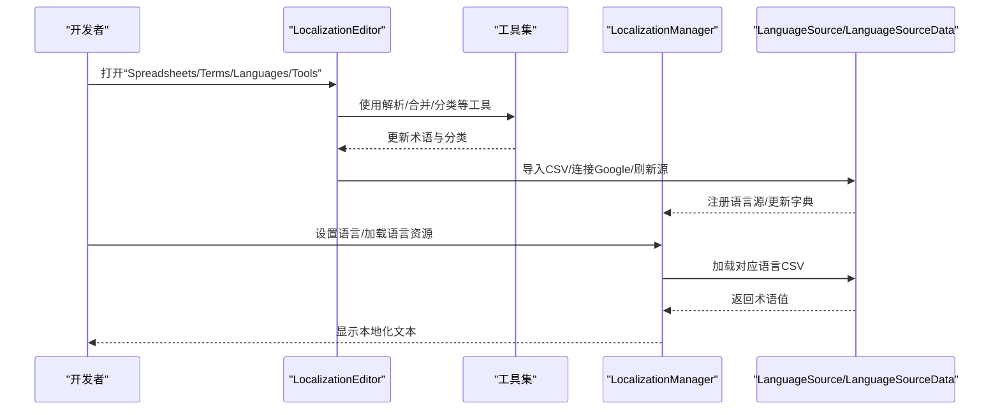
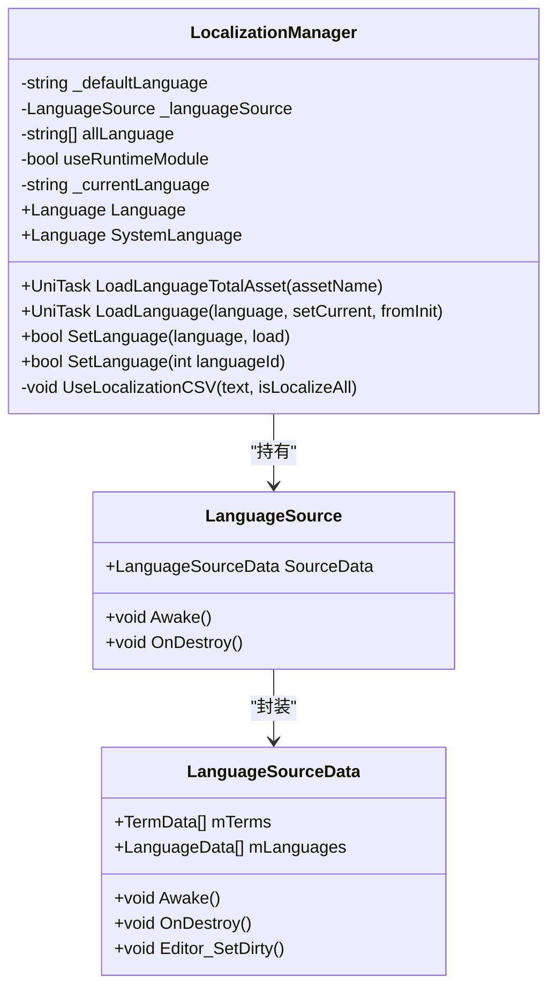
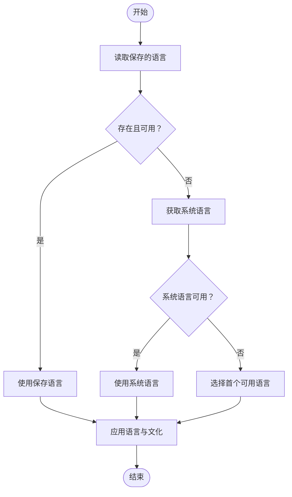
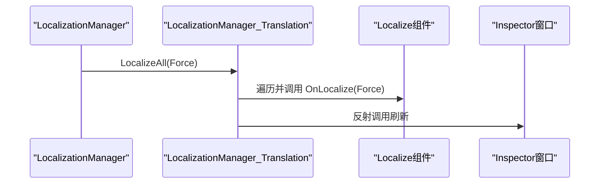
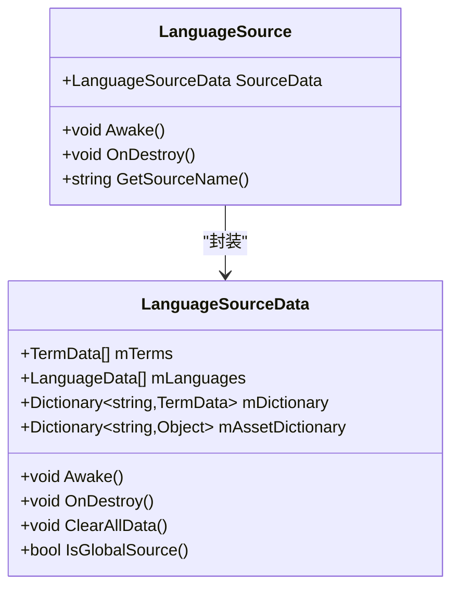
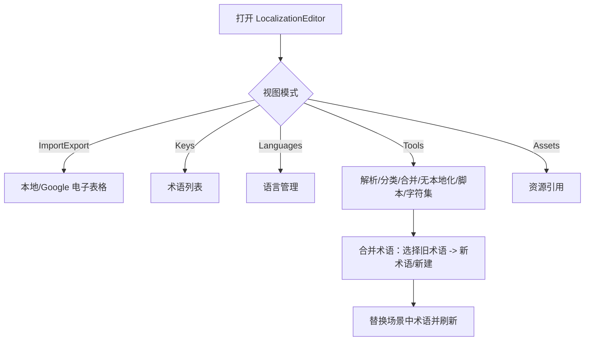
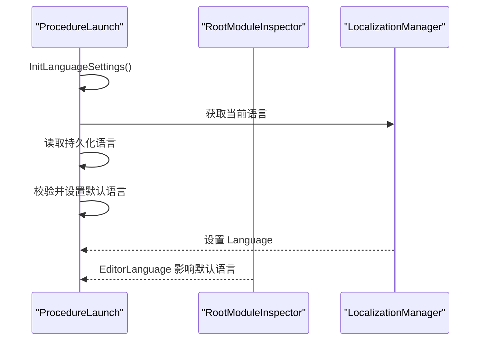
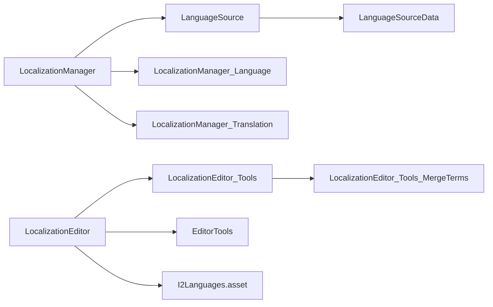

# 本地化工具

<cite>
**本文引用的文件**
- [Assets/TEngine/Runtime/Module/LocalizationModule/LocalizationManager.cs](file://Assets/TEngine/Runtime/Module/LocalizationModule/LocalizationManager.cs)
- [Assets/TEngine/Runtime/Module/LocalizationModule/Core/Manager/LocalizationManager_Language.cs](file://Assets/TEngine/Runtime/Module/LocalizationModule/Core/Manager/LocalizationManager_Language.cs)
- [Assets/TEngine/Runtime/Module/LocalizationModule/Core/Manager/LocalizationManager_Translation.cs](file://Assets/TEngine/Runtime/Module/LocalizationModule/Core/Manager/LocalizationManager_Translation.cs)
- [Assets/TEngine/Runtime/Module/LocalizationModule/Core/LanguageSource/LanguageSource.cs](file://Assets/TEngine/Runtime/Module/LocalizationModule/Core/LanguageSource/LanguageSource.cs)
- [Assets/TEngine/Runtime/Module/LocalizationModule/Core/LanguageSource/LanguageSourceData.cs](file://Assets/TEngine/Runtime/Module/LocalizationModule/Core/LanguageSource/LanguageSourceData.cs)
- [Assets/TEngine/Editor/Localization/Localization/LocalizationEditor.cs](file://Assets/TEngine/Editor/Localization/Localization/LocalizationEditor.cs)
- [Assets/TEngine/Editor/Localization/Localization/LocalizationEditor_Tools.cs](file://Assets/TEngine/Editor/Localization/Localization/LocalizationEditor_Tools.cs)
- [Assets/TEngine/Editor/Localization/Localization/LocalizationEditor_Tools_MergeTerms.cs](file://Assets/TEngine/Editor/Localization/Localization/LocalizationEditor_Tools_MergeTerms.cs)
- [Assets/TEngine/Editor/Localization/EditorTools.cs](file://Assets/TEngine/Editor/Localization/EditorTools.cs)
- [Assets/Editor/I2Localization/I2Languages.asset](file://Assets/Editor/I2Localization/I2Languages.asset)
- [Assets/GameScripts/Procedure/ProcedureLaunch.cs](file://Assets/GameScripts/Procedure/ProcedureLaunch.cs)
- [Assets/TEngine/Editor/Inspector/RootModuleInspector.cs](file://Assets/TEngine/Editor/Inspector/RootModuleInspector.cs)
</cite>

## 目录
1. [简介](#简介)
2. [项目结构](#项目结构)
3. [核心组件](#核心组件)
4. [架构总览](#架构总览)
5. [详细组件分析](#详细组件分析)
6. [依赖关系分析](#依赖关系分析)
7. [性能考量](#性能考量)
8. [故障排查指南](#故障排查指南)
9. [结论](#结论)
10. [附录：本地化流程与最佳实践](#附录本地化流程与最佳实践)

## 简介
本文件面向本地化工具集的技术文档，聚焦于基于 I2 Localization 的集成实现，涵盖多语言资源管理、翻译同步（本地 CSV 与 Google 表格）、术语管理、翻译进度跟踪、语言设置与切换、批量处理与测试、以及在编辑器与运行时的完整工作流。文档同时提供架构图、流程图与类图，帮助开发者快速理解与高效使用本地化工具。

## 项目结构
本地化相关代码主要分布在以下位置：
- 运行时模块：TEngine/Runtime/Module/LocalizationModule
- 编辑器工具：TEngine/Editor/Localization
- 配置资产：Assets/Editor/I2Localization/I2Languages.asset
- 启动流程与语言设置：GameScripts/Procedure/ProcedureLaunch.cs
- 编辑器 Inspector 扩展：TEngine/Editor/Inspector/RootModuleInspector.cs

**图表来源**
- [Assets/TEngine/Runtime/Module/LocalizationModule/LocalizationManager.cs:1-312](file://Assets/TEngine/Runtime/Module/LocalizationModule/LocalizationManager.cs#L1-L312)
- [Assets/TEngine/Runtime/Module/LocalizationModule/Core/LanguageSource/LanguageSource.cs:1-179](file://Assets/TEngine/Runtime/Module/LocalizationModule/Core/LanguageSource/LanguageSource.cs#L1-L179)
- [Assets/TEngine/Runtime/Module/LocalizationModule/Core/LanguageSource/LanguageSourceData.cs:1-177](file://Assets/TEngine/Runtime/Module/LocalizationModule/Core/LanguageSource/LanguageSourceData.cs#L1-L177)
- [Assets/TEngine/Runtime/Module/LocalizationModule/Core/Manager/LocalizationManager_Language.cs:1-349](file://Assets/TEngine/Runtime/Module/LocalizationModule/Core/Manager/LocalizationManager_Language.cs#L1-L349)
- [Assets/TEngine/Runtime/Module/LocalizationModule/Core/Manager/LocalizationManager_Translation.cs:139-182](file://Assets/TEngine/Runtime/Module/LocalizationModule/Core/Manager/LocalizationManager_Translation.cs#L139-L182)
- [Assets/TEngine/Editor/Localization/Localization/LocalizationEditor.cs:1-308](file://Assets/TEngine/Editor/Localization/Localization/LocalizationEditor.cs#L1-L308)
- [Assets/TEngine/Editor/Localization/Localization/LocalizationEditor_Tools.cs:1-49](file://Assets/TEngine/Editor/Localization/Localization/LocalizationEditor_Tools.cs#L1-L49)
- [Assets/TEngine/Editor/Localization/Localization/LocalizationEditor_Tools_MergeTerms.cs:1-157](file://Assets/TEngine/Editor/Localization/Localization/LocalizationEditor_Tools_MergeTerms.cs#L1-L157)
- [Assets/TEngine/Editor/Localization/EditorTools.cs:1-769](file://Assets/TEngine/Editor/Localization/EditorTools.cs#L1-L769)
- [Assets/Editor/I2Localization/I2Languages.asset:1-41](file://Assets/Editor/I2Localization/I2Languages.asset#L1-L41)
- [Assets/GameScripts/Procedure/ProcedureLaunch.cs:30-78](file://Assets/GameScripts/Procedure/ProcedureLaunch.cs#L30-L78)
- [Assets/TEngine/Editor/Inspector/RootModuleInspector.cs:16-42](file://Assets/TEngine/Editor/Inspector/RootModuleInspector.cs#L16-L42)

**章节来源**
- [Assets/TEngine/Runtime/Module/LocalizationModule/LocalizationManager.cs:1-312](file://Assets/TEngine/Runtime/Module/LocalizationModule/LocalizationManager.cs#L1-L312)
- [Assets/TEngine/Editor/Localization/Localization/LocalizationEditor.cs:1-308](file://Assets/TEngine/Editor/Localization/Localization/LocalizationEditor.cs#L1-L308)

## 核心组件
- 语言管理器（LocalizationManager）
  - 负责语言初始化、加载语言 CSV、设置当前语言、语言切换、资源加载与刷新。
  - 支持编辑器模式与运行时模式的不同行为。
- 语言源（LanguageSource / LanguageSourceData）
  - 封装语言与术语数据，支持导入导出、Google 同步、资产引用字典等。
- 语言逻辑（LocalizationManager_Language）
  - 提供语言名称/代码映射、区域设置、文化信息、默认语言选择策略。
- 翻译刷新（LocalizationManager_Translation）
  - 触发全局翻译刷新与编辑器 Inspector 刷新。
- 编辑器主窗体（LocalizationEditor）
  - 提供“外部电子表格（本地/Google）”、“术语列表”、“语言”、“工具”、“资源引用”视图。
- 工具集（LocalizationEditor_Tools / MergeTerms）
  - 解析脚本、分类、合并术语、无本地化项检测、字符集分析等。
- 编辑器工具（EditorTools）
  - 提供通用 UI 组件、对象数组绘制、场景操作、反射调用等。

**章节来源**
- [Assets/TEngine/Runtime/Module/LocalizationModule/LocalizationManager.cs:1-312](file://Assets/TEngine/Runtime/Module/LocalizationModule/LocalizationManager.cs#L1-L312)
- [Assets/TEngine/Runtime/Module/LocalizationModule/Core/LanguageSource/LanguageSource.cs:1-179](file://Assets/TEngine/Runtime/Module/LocalizationModule/Core/LanguageSource/LanguageSource.cs#L1-L179)
- [Assets/TEngine/Runtime/Module/LocalizationModule/Core/LanguageSource/LanguageSourceData.cs:1-177](file://Assets/TEngine/Runtime/Module/LocalizationModule/Core/LanguageSource/LanguageSourceData.cs#L1-L177)
- [Assets/TEngine/Runtime/Module/LocalizationModule/Core/Manager/LocalizationManager_Language.cs:1-349](file://Assets/TEngine/Runtime/Module/LocalizationModule/Core/Manager/LocalizationManager_Language.cs#L1-L349)
- [Assets/TEngine/Runtime/Module/LocalizationModule/Core/Manager/LocalizationManager_Translation.cs:139-182](file://Assets/TEngine/Runtime/Module/LocalizationModule/Core/Manager/LocalizationManager_Translation.cs#L139-L182)
- [Assets/TEngine/Editor/Localization/Localization/LocalizationEditor.cs:1-308](file://Assets/TEngine/Editor/Localization/Localization/LocalizationEditor.cs#L1-L308)
- [Assets/TEngine/Editor/Localization/Localization/LocalizationEditor_Tools.cs:1-49](file://Assets/TEngine/Editor/Localization/Localization/LocalizationEditor_Tools.cs#L1-L49)
- [Assets/TEngine/Editor/Localization/Localization/LocalizationEditor_Tools_MergeTerms.cs:1-157](file://Assets/TEngine/Editor/Localization/Localization/LocalizationEditor_Tools_MergeTerms.cs#L1-L157)
- [Assets/TEngine/Editor/Localization/EditorTools.cs:1-769](file://Assets/TEngine/Editor/Localization/EditorTools.cs#L1-L769)

## 架构总览
本地化系统由“运行时语言管理器 + 语言源 + 编辑器工具”构成，形成“编辑器导入/维护 + 运行时加载/切换”的闭环。

**图表来源**
- [Assets/TEngine/Editor/Localization/Localization/LocalizationEditor.cs:60-125](file://Assets/TEngine/Editor/Localization/Localization/LocalizationEditor.cs#L60-L125)
- [Assets/TEngine/Editor/Localization/Localization/LocalizationEditor_Tools.cs:22-45](file://Assets/TEngine/Editor/Localization/Localization/LocalizationEditor_Tools.cs#L22-L45)
- [Assets/TEngine/Runtime/Module/LocalizationModule/LocalizationManager.cs:124-193](file://Assets/TEngine/Runtime/Module/LocalizationModule/LocalizationManager.cs#L124-L193)
- [Assets/TEngine/Runtime/Module/LocalizationModule/Core/LanguageSource/LanguageSource.cs:77-100](file://Assets/TEngine/Runtime/Module/LocalizationModule/Core/LanguageSource/LanguageSource.cs#L77-L100)
- [Assets/TEngine/Runtime/Module/LocalizationModule/Core/LanguageSource/LanguageSourceData.cs:106-117](file://Assets/TEngine/Runtime/Module/LocalizationModule/Core/LanguageSource/LanguageSourceData.cs#L106-L117)

## 详细组件分析

### 运行时语言管理器（LocalizationManager）
- 职责
  - 初始化默认语言（编辑器语言优先于系统语言）
  - 在编辑器模式与运行时模式分别注册语言源、加载语言、设置当前语言
  - 从资源加载语言 CSV 并触发全局刷新
- 关键点
  - useRuntimeModule 控制是否启用运行时模块路径
  - LoadLanguageTotalAsset 用于加载“语言总表”，UseLocalizationCSV 导入并可选刷新全部
  - SetLanguage 支持按名称/枚举/索引切换语言，并检查可用性

**图表来源**
- [Assets/TEngine/Runtime/Module/LocalizationModule/LocalizationManager.cs:1-312](file://Assets/TEngine/Runtime/Module/LocalizationModule/LocalizationManager.cs#L1-L312)
- [Assets/TEngine/Runtime/Module/LocalizationModule/Core/LanguageSource/LanguageSource.cs:1-179](file://Assets/TEngine/Runtime/Module/LocalizationModule/Core/LanguageSource/LanguageSource.cs#L1-L179)
- [Assets/TEngine/Runtime/Module/LocalizationModule/Core/LanguageSource/LanguageSourceData.cs:1-177](file://Assets/TEngine/Runtime/Module/LocalizationModule/Core/LanguageSource/LanguageSourceData.cs#L1-L177)

**章节来源**
- [Assets/TEngine/Runtime/Module/LocalizationModule/LocalizationManager.cs:66-193](file://Assets/TEngine/Runtime/Module/LocalizationModule/LocalizationManager.cs#L66-L193)

### 语言逻辑与区域设置（LocalizationManager_Language）
- 职责
  - 语言名称与代码互转、区域识别与设置
  - 默认语言选择策略：优先用户保存语言，其次系统语言，最后首个可用语言
  - 文化信息设置、右到左语言与联词特性
- 关键点
  - GetSupportedLanguage 支持精确匹配与忽略区域的回退
  - SetLanguageAndCode 更新当前语言、代码、文化并触发全局刷新

**图表来源**
- [Assets/TEngine/Runtime/Module/LocalizationModule/Core/Manager/LocalizationManager_Language.cs:163-205](file://Assets/TEngine/Runtime/Module/LocalizationModule/Core/Manager/LocalizationManager_Language.cs#L163-L205)

**章节来源**
- [Assets/TEngine/Runtime/Module/LocalizationModule/Core/Manager/LocalizationManager_Language.cs:114-205](file://Assets/TEngine/Runtime/Module/LocalizationModule/Core/Manager/LocalizationManager_Language.cs#L114-L205)

### 翻译刷新与全局更新（LocalizationManager_Translation）
- 职责
  - 触发所有 Localize 组件刷新
  - 编辑器模式下刷新 Inspector
- 关键点
  - Localize 全量遍历并调用 OnLocalize
  - 反射调用 InspectorWindow 刷新以显示最新翻译

**图表来源**
- [Assets/TEngine/Runtime/Module/LocalizationModule/Core/Manager/LocalizationManager_Translation.cs:139-182](file://Assets/TEngine/Runtime/Module/LocalizationModule/Core/Manager/LocalizationManager_Translation.cs#L139-L182)

**章节来源**
- [Assets/TEngine/Runtime/Module/LocalizationModule/Core/Manager/LocalizationManager_Translation.cs:139-182](file://Assets/TEngine/Runtime/Module/LocalizationModule/Core/Manager/LocalizationManager_Translation.cs#L139-L182)

### 语言源与数据（LanguageSource / LanguageSourceData）
- 职责
  - 作为语言与术语的容器，支持序列化与反序列化
  - 提供导入导出、Google 同步、资产字典、缺失翻译策略等
- 关键点
  - Awake 注册到管理器并建立字典；OnDestroy 移除
  - 支持编辑器下的本地 CSV 与 Google 配置

**图表来源**
- [Assets/TEngine/Runtime/Module/LocalizationModule/Core/LanguageSource/LanguageSource.cs:1-179](file://Assets/TEngine/Runtime/Module/LocalizationModule/Core/LanguageSource/LanguageSource.cs#L1-L179)
- [Assets/TEngine/Runtime/Module/LocalizationModule/Core/LanguageSource/LanguageSourceData.cs:1-177](file://Assets/TEngine/Runtime/Module/LocalizationModule/Core/LanguageSource/LanguageSourceData.cs#L1-L177)

**章节来源**
- [Assets/TEngine/Runtime/Module/LocalizationModule/Core/LanguageSource/LanguageSource.cs:77-179](file://Assets/TEngine/Runtime/Module/LocalizationModule/Core/LanguageSource/LanguageSource.cs#L77-L179)
- [Assets/TEngine/Runtime/Module/LocalizationModule/Core/LanguageSource/LanguageSourceData.cs:106-177](file://Assets/TEngine/Runtime/Module/LocalizationModule/Core/LanguageSource/LanguageSourceData.cs#L106-L177)

### 编辑器主窗体与工具（LocalizationEditor / Tools / MergeTerms）
- 职责
  - 主窗体提供“外部电子表格（本地/Google）”、“术语列表”、“语言”、“工具”、“资源引用”视图
  - 工具面板支持解析脚本、分类、合并术语、无本地化项检测、脚本生成、字符集分析
  - 合并工具支持在场景中替换术语并更新分类
- 关键点
  - 视图切换与错误提示统一管理
  - 场景选择与批量处理

**图表来源**
- [Assets/TEngine/Editor/Localization/Localization/LocalizationEditor.cs:60-125](file://Assets/TEngine/Editor/Localization/Localization/LocalizationEditor.cs#L60-L125)
- [Assets/TEngine/Editor/Localization/Localization/LocalizationEditor_Tools.cs:22-45](file://Assets/TEngine/Editor/Localization/Localization/LocalizationEditor_Tools.cs#L22-L45)
- [Assets/TEngine/Editor/Localization/Localization/LocalizationEditor_Tools_MergeTerms.cs:86-140](file://Assets/TEngine/Editor/Localization/Localization/LocalizationEditor_Tools_MergeTerms.cs#L86-L140)

**章节来源**
- [Assets/TEngine/Editor/Localization/Localization/LocalizationEditor.cs:60-125](file://Assets/TEngine/Editor/Localization/Localization/LocalizationEditor.cs#L60-L125)
- [Assets/TEngine/Editor/Localization/Localization/LocalizationEditor_Tools.cs:22-45](file://Assets/TEngine/Editor/Localization/Localization/LocalizationEditor_Tools.cs#L22-L45)
- [Assets/TEngine/Editor/Localization/Localization/LocalizationEditor_Tools_MergeTerms.cs:86-140](file://Assets/TEngine/Editor/Localization/Localization/LocalizationEditor_Tools_MergeTerms.cs#L86-L140)

### 启动流程与语言设置（ProcedureLaunch / RootModuleInspector）
- 职责
  - 启动阶段根据编辑器语言与持久化设置初始化语言
  - 编辑器 Inspector 中可设置 EditorLanguage，影响默认语言选择
- 关键点
  - 仅允许英文、简体中文、繁体中文三种语言
  - 保存语言设置到 PlayerPrefs

**图表来源**
- [Assets/GameScripts/Procedure/ProcedureLaunch.cs:44-78](file://Assets/GameScripts/Procedure/ProcedureLaunch.cs#L44-L78)
- [Assets/TEngine/Editor/Inspector/RootModuleInspector.cs:16-42](file://Assets/TEngine/Editor/Inspector/RootModuleInspector.cs#L16-L42)

**章节来源**
- [Assets/GameScripts/Procedure/ProcedureLaunch.cs:44-78](file://Assets/GameScripts/Procedure/ProcedureLaunch.cs#L44-L78)
- [Assets/TEngine/Editor/Inspector/RootModuleInspector.cs:16-42](file://Assets/TEngine/Editor/Inspector/RootModuleInspector.cs#L16-L42)

## 依赖关系分析
- 运行时依赖
  - LocalizationManager 依赖 LanguageSource/LanguageSourceData 完成数据装载与刷新
  - 语言逻辑依赖 GoogleLanguages 与持久化存储进行语言与区域设置
- 编辑器依赖
  - LocalizationEditor 依赖 EditorTools 提供 UI 与场景操作
  - 工具面板依赖 LanguageSourceData 的术语与分类接口
- 配置依赖
  - I2Languages.asset 提供 Google 服务参数与本地 CSV 分隔符、编码等

**图表来源**
- [Assets/TEngine/Runtime/Module/LocalizationModule/LocalizationManager.cs:1-312](file://Assets/TEngine/Runtime/Module/LocalizationModule/LocalizationManager.cs#L1-L312)
- [Assets/TEngine/Runtime/Module/LocalizationModule/Core/LanguageSource/LanguageSource.cs:1-179](file://Assets/TEngine/Runtime/Module/LocalizationModule/Core/LanguageSource/LanguageSource.cs#L1-L179)
- [Assets/TEngine/Runtime/Module/LocalizationModule/Core/LanguageSource/LanguageSourceData.cs:1-177](file://Assets/TEngine/Runtime/Module/LocalizationModule/Core/LanguageSource/LanguageSourceData.cs#L1-L177)
- [Assets/TEngine/Runtime/Module/LocalizationModule/Core/Manager/LocalizationManager_Language.cs:1-349](file://Assets/TEngine/Runtime/Module/LocalizationModule/Core/Manager/LocalizationManager_Language.cs#L1-L349)
- [Assets/TEngine/Runtime/Module/LocalizationModule/Core/Manager/LocalizationManager_Translation.cs:139-182](file://Assets/TEngine/Runtime/Module/LocalizationModule/Core/Manager/LocalizationManager_Translation.cs#L139-L182)
- [Assets/TEngine/Editor/Localization/Localization/LocalizationEditor.cs:1-308](file://Assets/TEngine/Editor/Localization/Localization/LocalizationEditor.cs#L1-L308)
- [Assets/TEngine/Editor/Localization/Localization/LocalizationEditor_Tools.cs:1-49](file://Assets/TEngine/Editor/Localization/Localization/LocalizationEditor_Tools.cs#L1-L49)
- [Assets/TEngine/Editor/Localization/Localization/LocalizationEditor_Tools_MergeTerms.cs:1-157](file://Assets/TEngine/Editor/Localization/Localization/LocalizationEditor_Tools_MergeTerms.cs#L1-L157)
- [Assets/TEngine/Editor/Localization/EditorTools.cs:1-769](file://Assets/TEngine/Editor/Localization/EditorTools.cs#L1-L769)
- [Assets/Editor/I2Localization/I2Languages.asset:1-41](file://Assets/Editor/I2Localization/I2Languages.asset#L1-L41)

**章节来源**
- [Assets/Editor/I2Localization/I2Languages.asset:1-41](file://Assets/Editor/I2Localization/I2Languages.asset#L1-L41)

## 性能考量
- 语言切换
  - 通过检查可用语言避免无效切换，减少不必要的加载与刷新
- 刷新策略
  - 局部刷新与全量刷新结合，避免频繁全量刷新导致卡顿
- 编辑器延迟刷新
  - 使用延迟回调与反射刷新 Inspector，降低编辑器交互阻塞
- 资源加载
  - 仅在运行时加载所需语言资源，避免一次性加载全部语言造成内存压力

[本节为通用指导，无需列出具体文件来源]

## 故障排查指南
- 无法切换语言
  - 检查语言是否已加载（CheckLanguage），若未加载可开启自动加载后再试
  - 参考：[Assets/TEngine/Runtime/Module/LocalizationModule/LocalizationManager.cs:219-281](file://Assets/TEngine/Runtime/Module/LocalizationModule/LocalizationManager.cs#L219-L281)
- 翻译未生效
  - 确认已调用 LocalizeAll 或设置语言后触发刷新
  - 参考：[Assets/TEngine/Runtime/Module/LocalizationModule/Core/Manager/LocalizationManager_Translation.cs:139-182](file://Assets/TEngine/Runtime/Module/LocalizationModule/Core/Manager/LocalizationManager_Translation.cs#L139-L182)
- Google 同步失败
  - 检查 I2Languages.asset 中的 Google 参数（服务地址、密钥、工作表 ID、更新频率）
  - 参考：[Assets/Editor/I2Localization/I2Languages.asset:26-40](file://Assets/Editor/I2Localization/I2Languages.asset#L26-L40)
- 术语合并后场景未更新
  - 使用工具面板执行替换并刷新场景，确认已选择目标场景
  - 参考：[Assets/TEngine/Editor/Localization/Localization/LocalizationEditor_Tools_MergeTerms.cs:86-140](file://Assets/TEngine/Editor/Localization/Localization/LocalizationEditor_Tools_MergeTerms.cs#L86-L140)
- 编辑器语言设置无效
  - 确认 RootModuleInspector 中 EditorLanguage 设置正确，启动流程会据此初始化默认语言
  - 参考：[Assets/TEngine/Editor/Inspector/RootModuleInspector.cs:16-42](file://Assets/TEngine/Editor/Inspector/RootModuleInspector.cs#L16-L42)，[Assets/GameScripts/Procedure/ProcedureLaunch.cs:44-78](file://Assets/GameScripts/Procedure/ProcedureLaunch.cs#L44-L78)

**章节来源**
- [Assets/TEngine/Runtime/Module/LocalizationModule/LocalizationManager.cs:219-281](file://Assets/TEngine/Runtime/Module/LocalizationModule/LocalizationManager.cs#L219-L281)
- [Assets/TEngine/Runtime/Module/LocalizationModule/Core/Manager/LocalizationManager_Translation.cs:139-182](file://Assets/TEngine/Runtime/Module/LocalizationModule/Core/Manager/LocalizationManager_Translation.cs#L139-L182)
- [Assets/Editor/I2Localization/I2Languages.asset:26-40](file://Assets/Editor/I2Localization/I2Languages.asset#L26-L40)
- [Assets/TEngine/Editor/Localization/Localization/LocalizationEditor_Tools_MergeTerms.cs:86-140](file://Assets/TEngine/Editor/Localization/Localization/LocalizationEditor_Tools_MergeTerms.cs#L86-L140)
- [Assets/TEngine/Editor/Inspector/RootModuleInspector.cs:16-42](file://Assets/TEngine/Editor/Inspector/RootModuleInspector.cs#L16-L42)
- [Assets/GameScripts/Procedure/ProcedureLaunch.cs:44-78](file://Assets/GameScripts/Procedure/ProcedureLaunch.cs#L44-L78)

## 结论
本本地化工具集以 I2 Localization 为基础，结合 TEngine 的运行时模块与编辑器工具，实现了从“编辑器导入/维护术语与语言”到“运行时加载与切换”的完整闭环。通过清晰的职责划分与工具化流程，开发者可以高效地完成多语言资源管理、翻译同步、术语治理与质量保障。

[本节为总结性内容，无需列出具体文件来源]

## 附录：本地化流程与最佳实践

### 常用流程示例
- 导入/导出语言资源
  - 在“Spreadsheets”视图选择“Local”或“Google”，导入或导出 CSV
  - 参考：[Assets/TEngine/Editor/Localization/Localization/LocalizationEditor.cs:88-102](file://Assets/TEngine/Editor/Localization/Localization/LocalizationEditor.cs#L88-L102)
- 设置默认语言与切换
  - 在启动流程中设置 EditorLanguage，运行时通过 LocalizationManager.SetLanguage 切换
  - 参考：[Assets/GameScripts/Procedure/ProcedureLaunch.cs:44-78](file://Assets/GameScripts/Procedure/ProcedureLaunch.cs#L44-L78)，[Assets/TEngine/Runtime/Module/LocalizationModule/LocalizationManager.cs:230-281](file://Assets/TEngine/Runtime/Module/LocalizationModule/LocalizationManager.cs#L230-L281)
- 术语合并与分类
  - 使用“Tools”面板的“Merge”与“Categorize”，在场景中批量替换并更新分类
  - 参考：[Assets/TEngine/Editor/Localization/Localization/LocalizationEditor_Tools.cs:22-45](file://Assets/TEngine/Editor/Localization/Localization/LocalizationEditor_Tools.cs#L22-L45)，[Assets/TEngine/Editor/Localization/Localization/LocalizationEditor_Tools_MergeTerms.cs:86-140](file://Assets/TEngine/Editor/Localization/Localization/LocalizationEditor_Tools_MergeTerms.cs#L86-L140)
- 翻译进度跟踪
  - 使用“Keys”视图查看术语列表与缺失翻译状态，结合“Tools/No Localized”检测未本地化项
  - 参考：[Assets/TEngine/Editor/Localization/Localization/LocalizationEditor.cs:80-85](file://Assets/TEngine/Editor/Localization/Localization/LocalizationEditor.cs#L80-L85)

### 最佳实践
- 术语命名规范
  - 使用层级式命名（如 Category/SubCategory/Term）便于分类与检索
- 语言源组织
  - 优先使用全局语言源（I2Languages.prefab），避免在场景中重复定义
- Google 同步
  - 正确配置服务地址、密钥与工作表 ID，合理设置更新频率与同步方式
- 批量处理
  - 合并术语前先备份，合并后在目标场景中执行替换并刷新
- 质量保证
  - 定期使用“无本地化项”检测与字符集分析工具，确保覆盖度与兼容性

[本节为通用指导，无需列出具体文件来源]