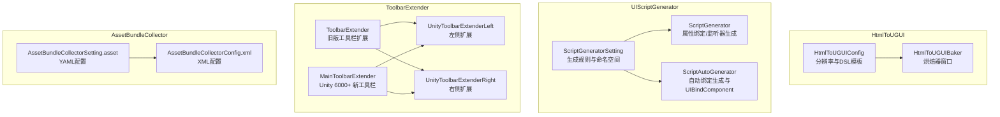
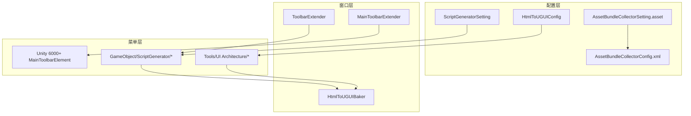
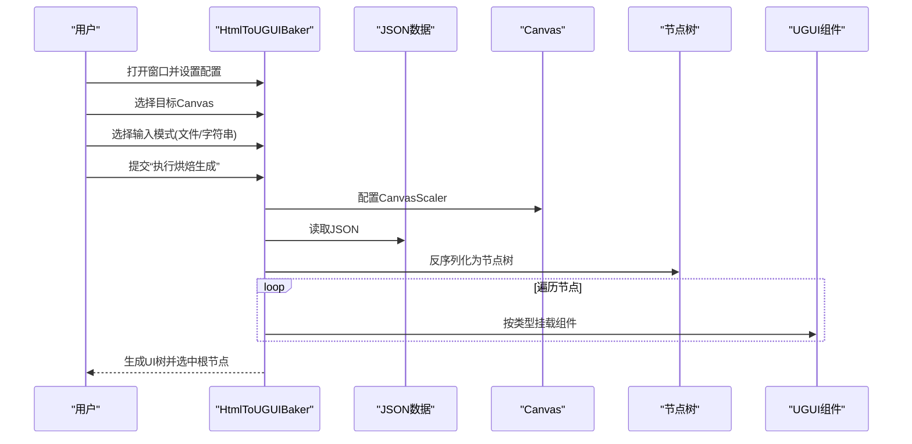
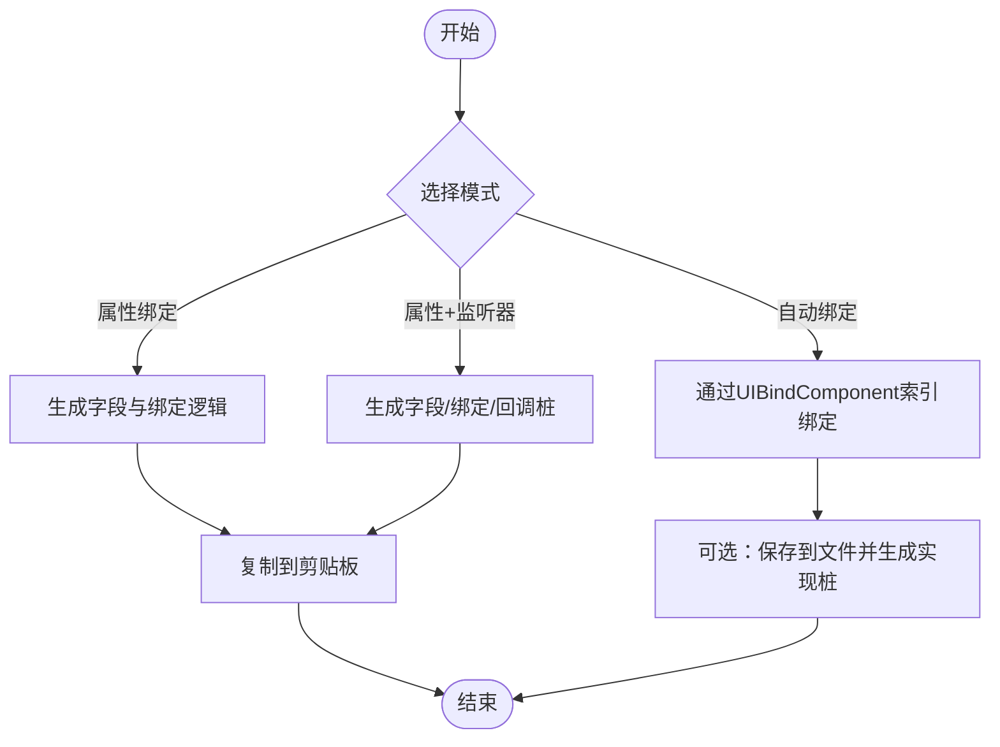
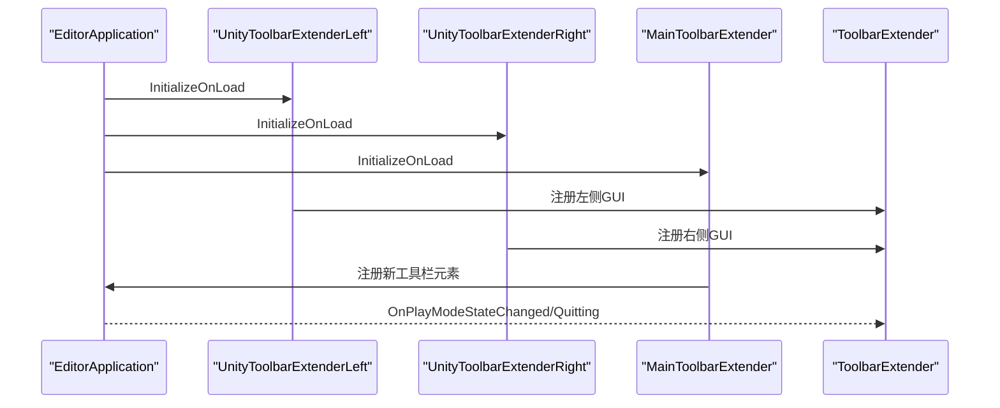
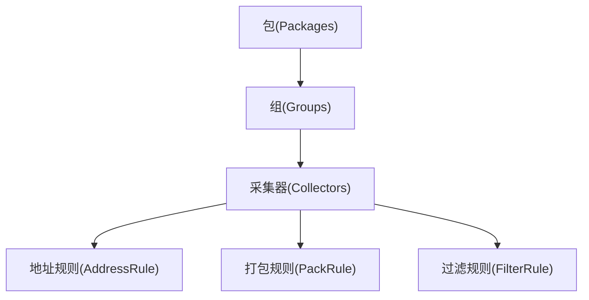
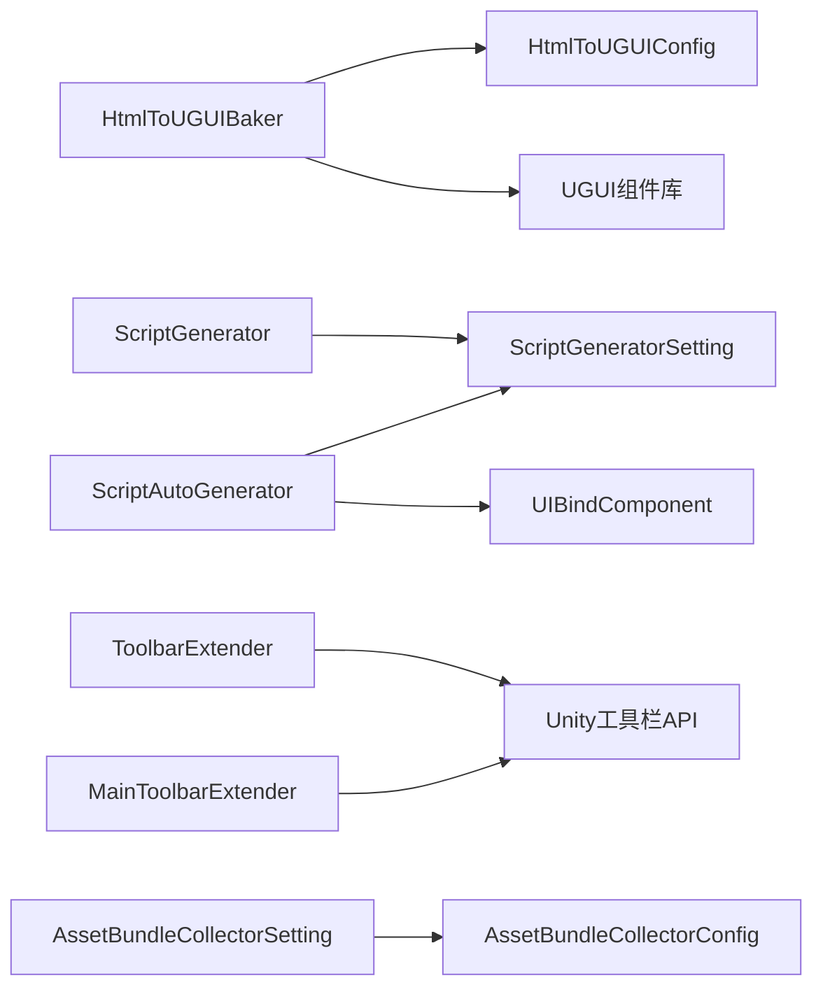

# 编辑器工具

<cite>
**本文引用的文件**
- [HtmlToUGUIConfig.cs](file://Assets/HtmlToUGUI/HtmlToUGUIConfig.cs)
- [HtmlToUGUIBaker.cs](file://Assets/HtmlToUGUI/Editor/HtmlToUGUIBaker.cs)
- [ScriptGenerator.cs](file://Assets/Editor/UIScriptGenerator/ScriptGenerator.cs)
- [ScriptAutoGenerator.cs](file://Assets/Editor/UIScriptGenerator/ScriptAutoGenerator.cs)
- [ScriptGeneratorSetting.cs](file://Assets/Editor/UIScriptGenerator/ScriptGeneratorSetting.cs)
- [ToolbarExtender.cs](file://Assets/Editor/ToolbarExtender/ToolbarExtender.cs)
- [UnityToolbarExtenderLeft.cs](file://Assets/Editor/ToolbarExtender/UnityToolbarExtenderLeft/UnityToolbarExtenderLeft.cs)
- [UnityToolbarExtenderRight.cs](file://Assets/Editor/ToolbarExtender/UnityToolbarExtenderRight/UnityToolbarExtenderRight.cs)
- [MainToolbarExtender.cs](file://Assets/Editor/ToolbarExtender/Unity6000_OR_New/MainToolbarExtender.cs)
- [AssetBundleCollectorSetting.asset](file://Assets/Editor/AssetBundleCollector/AssetBundleCollectorSetting.asset)
- [AssetBundleCollectorConfig.xml](file://Assets/Editor/AssetBundleCollector/AssetBundleCollectorConfig.xml)
</cite>

## 目录
1. [简介](#简介)
2. [项目结构](#项目结构)
3. [核心组件](#核心组件)
4. [架构总览](#架构总览)
5. [详细组件分析](#详细组件分析)
6. [依赖关系分析](#依赖关系分析)
7. [性能考量](#性能考量)
8. [故障排查指南](#故障排查指南)
9. [结论](#结论)
10. [附录](#附录)

## 简介
本文件系统性梳理 TEngine 编辑器工具集，覆盖以下能力：
- UI 生成器：基于 JSON 坐标数据生成 UGUI 树，支持多分辨率与全控件映射（文本、按钮、输入框、滚动、开关、滑条、下拉等），并可一键复制对应分辨率的 DSL 规范。
- 资源收集器：通过配置文件与 XML 描述，对资源分包、打包策略、地址规则、过滤规则进行集中管理，便于构建期资源组织。
- 工具栏扩展：在 Unity 工具栏左右两侧注入自定义按钮与下拉菜单，支持场景快速启动、场景切换、播放模式选择等常用操作；兼容 Unity 6000+ 新工具栏 API。

本指南既面向使用者提供安装、配置与使用技巧，也面向开发者提供扩展与二次开发指引。

## 项目结构
编辑器工具主要分布在以下位置：
- HtmlToUGUI：UI 原型烘焙工具，包含配置与烘焙器窗口。
- Editor/UIScriptGenerator：UI 脚本自动生成器，支持“属性绑定”和“属性+监听器”两种模式，并支持 TextMeshPro 与 UniTask。
- Editor/ToolbarExtender：工具栏扩展，兼容旧版与 Unity 6000+ 新工具栏 API。
- Editor/AssetBundleCollector：资源收集与分包配置，提供 YAML 与 XML 两套配置入口。

**图表来源**
- [HtmlToUGUIConfig.cs:1-35](file://Assets/HtmlToUGUI/HtmlToUGUIConfig.cs#L1-L35)
- [HtmlToUGUIBaker.cs:1-120](file://Assets/HtmlToUGUI/Editor/HtmlToUGUIBaker.cs#L1-L120)
- [ScriptGeneratorSetting.cs:1-120](file://Assets/Editor/UIScriptGenerator/ScriptGeneratorSetting.cs#L1-L120)
- [ScriptGenerator.cs:1-80](file://Assets/Editor/UIScriptGenerator/ScriptGenerator.cs#L1-L80)
- [ScriptAutoGenerator.cs:1-120](file://Assets/Editor/UIScriptGenerator/ScriptAutoGenerator.cs#L1-L120)
- [ToolbarExtender.cs:1-60](file://Assets/Editor/ToolbarExtender/ToolbarExtender.cs#L1-L60)
- [UnityToolbarExtenderLeft.cs:1-21](file://Assets/Editor/ToolbarExtender/UnityToolbarExtenderLeft/UnityToolbarExtenderLeft.cs#L1-L21)
- [UnityToolbarExtenderRight.cs:1-25](file://Assets/Editor/ToolbarExtender/UnityToolbarExtenderRight/UnityToolbarExtenderRight.cs#L1-L25)
- [MainToolbarExtender.cs:1-60](file://Assets/Editor/ToolbarExtender/Unity6000_OR_New/MainToolbarExtender.cs#L1-L60)
- [AssetBundleCollectorSetting.asset:1-60](file://Assets/Editor/AssetBundleCollector/AssetBundleCollectorSetting.asset#L1-L60)
- [AssetBundleCollectorConfig.xml:1-48](file://Assets/Editor/AssetBundleCollector/AssetBundleCollectorConfig.xml#L1-L48)

**章节来源**
- [HtmlToUGUIConfig.cs:1-35](file://Assets/HtmlToUGUI/HtmlToUGUIConfig.cs#L1-L35)
- [ScriptGeneratorSetting.cs:1-120](file://Assets/Editor/UIScriptGenerator/ScriptGeneratorSetting.cs#L1-L120)
- [ToolbarExtender.cs:1-60](file://Assets/Editor/ToolbarExtender/ToolbarExtender.cs#L1-L60)
- [AssetBundleCollectorSetting.asset:1-60](file://Assets/Editor/AssetBundleCollector/AssetBundleCollectorSetting.asset#L1-L60)

## 核心组件
- UI 原型烘焙器（HtmlToUGUIBaker）
  - 支持文件模式与字符串模式输入 JSON。
  - 自动配置 CanvasScaler 以适配选定分辨率。
  - 将 JSON 节点树转换为 UGUI 结构，按类型挂载 Image/Text/TMP/按钮/输入框/滚动/开关/滑条/下拉等组件。
  - 提供 DSL 模板复制功能，一键生成对应分辨率的 UI-DSL 规范。
- UI 脚本生成器（ScriptGenerator/ScriptAutoGenerator）
  - 基于命名规则与命名空间生成 UI 绑定代码，支持“属性绑定”和“属性+监听器”两种模式。
  - 支持 TextMeshPro 与 UniTask，自动生成回调桩函数签名。
  - 自动绑定模式下，通过 UIBindComponent 与索引顺序进行组件查找与绑定。
- 工具栏扩展（ToolbarExtender + MainToolbarExtender）
  - 旧版：通过反射注入 GUI 区域，向左/右侧添加自定义控件。
  - Unity 6000+：使用新 API 注册按钮与下拉菜单，支持场景启动、场景切换、播放模式选择。
- 资源收集器（AssetBundleCollectorSetting/XML）
  - YAML：集中管理包、组、采集器、打包与地址规则。
  - XML：历史配置入口，描述相同内容。

**章节来源**
- [HtmlToUGUIBaker.cs:315-370](file://Assets/HtmlToUGUI/Editor/HtmlToUGUIBaker.cs#L315-L370)
- [ScriptGenerator.cs:60-135](file://Assets/Editor/UIScriptGenerator/ScriptGenerator.cs#L60-L135)
- [ScriptAutoGenerator.cs:89-254](file://Assets/Editor/UIScriptGenerator/ScriptAutoGenerator.cs#L89-L254)
- [ToolbarExtender.cs:62-170](file://Assets/Editor/ToolbarExtender/ToolbarExtender.cs#L62-L170)
- [MainToolbarExtender.cs:22-150](file://Assets/Editor/ToolbarExtender/Unity6000_OR_New/MainToolbarExtender.cs#L22-L150)
- [AssetBundleCollectorSetting.asset:18-80](file://Assets/Editor/AssetBundleCollector/AssetBundleCollectorSetting.asset#L18-L80)
- [AssetBundleCollectorConfig.xml:1-48](file://Assets/Editor/AssetBundleCollector/AssetBundleCollectorConfig.xml#L1-L48)

## 架构总览
编辑器工具采用“配置驱动 + 编辑器窗口 + 菜单入口”的组合方式：
- 配置层：ScriptableObject/ScriptableObject + YAML/XML，统一管理生成规则、分辨率与 DSL 模板、包与组、采集器与打包规则。
- 窗口层：EditorWindow/新工具栏元素，提供可视化交互与快捷操作。
- 菜单层：通过 [MenuItem] 注入上下文菜单，触发生成与绑定流程。

**图表来源**
- [ScriptGeneratorSetting.cs:1-120](file://Assets/Editor/UIScriptGenerator/ScriptGeneratorSetting.cs#L1-L120)
- [HtmlToUGUIConfig.cs:1-35](file://Assets/HtmlToUGUI/HtmlToUGUIConfig.cs#L1-L35)
- [AssetBundleCollectorSetting.asset:1-60](file://Assets/Editor/AssetBundleCollector/AssetBundleCollectorSetting.asset#L1-L60)
- [AssetBundleCollectorConfig.xml:1-48](file://Assets/Editor/AssetBundleCollector/AssetBundleCollectorConfig.xml#L1-L48)
- [ToolbarExtender.cs:62-170](file://Assets/Editor/ToolbarExtender/ToolbarExtender.cs#L62-L170)
- [MainToolbarExtender.cs:22-150](file://Assets/Editor/ToolbarExtender/Unity6000_OR_New/MainToolbarExtender.cs#L22-L150)
- [ScriptGenerator.cs:12-58](file://Assets/Editor/UIScriptGenerator/ScriptGenerator.cs#L12-L58)
- [HtmlToUGUIBaker.cs:64-122](file://Assets/HtmlToUGUI/Editor/HtmlToUGUIBaker.cs#L64-L122)

## 详细组件分析

### UI 生成器（HtmlToUGUIBaker）工作流
- 输入模式
  - 文件模式：从工程中选择 JSON 文本资产。
  - 字符串模式：直接粘贴 JSON 文本，支持保存为工程文件。
- 烘焙流程
  - 选择目标 Canvas，自动配置 CanvasScaler 以适配选定分辨率。
  - 反序列化 JSON 为节点树，递归创建 GameObject 并挂载对应 UGUI 组件。
  - 根据 useLegacyText 切换 Text 或 TextMeshProUGUI。
- 输出
  - 生成的 UI 树作为 Undo 可回滚的对象，选中根节点以便后续编辑。

**图表来源**
- [HtmlToUGUIBaker.cs:315-370](file://Assets/HtmlToUGUI/Editor/HtmlToUGUIBaker.cs#L315-L370)
- [HtmlToUGUIBaker.cs:394-421](file://Assets/HtmlToUGUI/Editor/HtmlToUGUIBaker.cs#L394-L421)
- [HtmlToUGUIBaker.cs:423-778](file://Assets/HtmlToUGUI/Editor/HtmlToUGUIBaker.cs#L423-L778)

**章节来源**
- [HtmlToUGUIBaker.cs:315-370](file://Assets/HtmlToUGUI/Editor/HtmlToUGUIBaker.cs#L315-L370)
- [HtmlToUGUIBaker.cs:372-388](file://Assets/HtmlToUGUI/Editor/HtmlToUGUIBaker.cs#L372-L388)
- [HtmlToUGUIBaker.cs:394-421](file://Assets/HtmlToUGUI/Editor/HtmlToUGUIBaker.cs#L394-L421)
- [HtmlToUGUIBaker.cs:423-778](file://Assets/HtmlToUGUI/Editor/HtmlToUGUIBaker.cs#L423-L778)

### UI 脚本生成器（ScriptGenerator/ScriptAutoGenerator）
- 生成模式
  - 属性绑定：仅生成字段与绑定逻辑。
  - 属性+监听器：额外生成回调桩函数签名（支持 UniTask）。
- 自动绑定模式
  - 通过 UIBindComponent 与索引顺序进行组件查找与绑定，减少手写代码。
  - 支持 TextMeshPro 与多种 UI 控件的事件回调（按钮、开关、滑条、下拉）。
- 规则与命名空间
  - 通过 ScriptGeneratorSetting 统一管理命名风格、命名空间、UI 组件匹配规则、UIWidget 前缀等。

**图表来源**
- [ScriptGenerator.cs:60-135](file://Assets/Editor/UIScriptGenerator/ScriptGenerator.cs#L60-L135)
- [ScriptAutoGenerator.cs:89-254](file://Assets/Editor/UIScriptGenerator/ScriptAutoGenerator.cs#L89-L254)
- [ScriptGeneratorSetting.cs:117-157](file://Assets/Editor/UIScriptGenerator/ScriptGeneratorSetting.cs#L117-L157)

**章节来源**
- [ScriptGenerator.cs:60-135](file://Assets/Editor/UIScriptGenerator/ScriptGenerator.cs#L60-L135)
- [ScriptAutoGenerator.cs:89-254](file://Assets/Editor/UIScriptGenerator/ScriptAutoGenerator.cs#L89-L254)
- [ScriptGeneratorSetting.cs:117-157](file://Assets/Editor/UIScriptGenerator/ScriptGeneratorSetting.cs#L117-L157)

### 工具栏扩展（ToolbarExtender 与 MainToolbarExtender）
- 旧版工具栏（非 6000+）
  - 通过反射获取 Unity Toolbar 的工具数量与布局，计算左右区域矩形，注入自定义 GUI。
  - 左侧：Claude 启动器、场景启动器等。
  - 右侧：场景切换、播放模式等。
- Unity 6000+ 新工具栏
  - 使用 MainToolbarElement 注册按钮与下拉菜单。
  - 场景启动按钮：记录上次编辑场景并在退出播放态后恢复。
  - 场景切换下拉：按分类列出场景，支持编辑态与运行态切换。
  - 播放模式下拉：提供多种资源运行模式选项。

**图表来源**
- [UnityToolbarExtenderLeft.cs:11-17](file://Assets/Editor/ToolbarExtender/UnityToolbarExtenderLeft/UnityToolbarExtenderLeft.cs#L11-L17)
- [UnityToolbarExtenderRight.cs:12-21](file://Assets/Editor/ToolbarExtender/UnityToolbarExtenderRight/UnityToolbarExtenderRight.cs#L12-L21)
- [MainToolbarExtender.cs:14-20](file://Assets/Editor/ToolbarExtender/Unity6000_OR_New/MainToolbarExtender.cs#L14-L20)
- [ToolbarExtender.cs:20-46](file://Assets/Editor/ToolbarExtender/ToolbarExtender.cs#L20-L46)

**章节来源**
- [ToolbarExtender.cs:62-170](file://Assets/Editor/ToolbarExtender/ToolbarExtender.cs#L62-L170)
- [UnityToolbarExtenderLeft.cs:11-17](file://Assets/Editor/ToolbarExtender/UnityToolbarExtenderLeft/UnityToolbarExtenderLeft.cs#L11-L17)
- [UnityToolbarExtenderRight.cs:12-21](file://Assets/Editor/ToolbarExtender/UnityToolbarExtenderRight/UnityToolbarExtenderRight.cs#L12-L21)
- [MainToolbarExtender.cs:22-150](file://Assets/Editor/ToolbarExtender/Unity6000_OR_New/MainToolbarExtender.cs#L22-L150)

### 资源收集器（AssetBundleCollector）
- YAML 配置（AssetBundleCollectorSetting.asset）
  - 包（Packages）：每个包可启用地址化、小写化、忽略默认类型等。
  - 组（Groups）：每组可启用/禁用，定义采集路径、采集器类型、地址规则、打包规则、过滤规则与标签。
  - 采集器（Collectors）：指向具体资源路径，决定如何打包与寻址。
- XML 配置（AssetBundleCollectorConfig.xml）
  - 与 YAML 配置描述相同内容，用于历史迁移或特定流程。

**图表来源**
- [AssetBundleCollectorSetting.asset:18-80](file://Assets/Editor/AssetBundleCollector/AssetBundleCollectorSetting.asset#L18-L80)
- [AssetBundleCollectorConfig.xml:4-36](file://Assets/Editor/AssetBundleCollector/AssetBundleCollectorConfig.xml#L4-L36)

**章节来源**
- [AssetBundleCollectorSetting.asset:1-218](file://Assets/Editor/AssetBundleCollector/AssetBundleCollectorSetting.asset#L1-L218)
- [AssetBundleCollectorConfig.xml:1-48](file://Assets/Editor/AssetBundleCollector/AssetBundleCollectorConfig.xml#L1-L48)

## 依赖关系分析
- 组件耦合
  - HtmlToUGUIBaker 依赖 HtmlToUGUIConfig 进行分辨率与 DSL 模板管理；依赖 Unity UI 组件库进行节点生成。
  - ScriptGenerator/ScriptAutoGenerator 依赖 ScriptGeneratorSetting 进行规则与命名空间解析；在自动绑定模式下依赖 UIBindComponent。
  - ToolbarExtender 与 MainToolbarExtender 依赖 Unity Editor 工具栏 API；MainToolbarExtender 还依赖场景管理 API。
  - AssetBundleCollectorSetting/XML 之间为互补配置，共同描述包与组的采集策略。
- 外部依赖
  - Newtonsoft.Json 用于 JSON 解析。
  - TextMeshPro（可选）用于高级文本渲染。
  - UniTask（可选）用于异步回调。

**图表来源**
- [HtmlToUGUIBaker.cs:315-370](file://Assets/HtmlToUGUI/Editor/HtmlToUGUIBaker.cs#L315-L370)
- [ScriptGenerator.cs:60-135](file://Assets/Editor/UIScriptGenerator/ScriptGenerator.cs#L60-L135)
- [ScriptAutoGenerator.cs:89-254](file://Assets/Editor/UIScriptGenerator/ScriptAutoGenerator.cs#L89-L254)
- [ToolbarExtender.cs:62-170](file://Assets/Editor/ToolbarExtender/ToolbarExtender.cs#L62-L170)
- [MainToolbarExtender.cs:22-150](file://Assets/Editor/ToolbarExtender/Unity6000_OR_New/MainToolbarExtender.cs#L22-L150)
- [AssetBundleCollectorSetting.asset:1-60](file://Assets/Editor/AssetBundleCollector/AssetBundleCollectorSetting.asset#L1-L60)
- [AssetBundleCollectorConfig.xml:1-48](file://Assets/Editor/AssetBundleCollector/AssetBundleCollectorConfig.xml#L1-L48)

**章节来源**
- [HtmlToUGUIBaker.cs:315-370](file://Assets/HtmlToUGUI/Editor/HtmlToUGUIBaker.cs#L315-L370)
- [ScriptGenerator.cs:60-135](file://Assets/Editor/UIScriptGenerator/ScriptGenerator.cs#L60-L135)
- [ScriptAutoGenerator.cs:89-254](file://Assets/Editor/UIScriptGenerator/ScriptAutoGenerator.cs#L89-L254)
- [ToolbarExtender.cs:62-170](file://Assets/Editor/ToolbarExtender/ToolbarExtender.cs#L62-L170)
- [MainToolbarExtender.cs:22-150](file://Assets/Editor/ToolbarExtender/Unity6000_OR_New/MainToolbarExtender.cs#L22-L150)
- [AssetBundleCollectorSetting.asset:1-60](file://Assets/Editor/AssetBundleCollector/AssetBundleCollectorSetting.asset#L1-L60)
- [AssetBundleCollectorConfig.xml:1-48](file://Assets/Editor/AssetBundleCollector/AssetBundleCollectorConfig.xml#L1-L48)

## 性能考量
- UI 生成器
  - JSON 解析与节点树递归创建为 O(N)；建议控制单次烘焙节点规模，避免过深层级导致编辑器卡顿。
  - CanvasScaler 配置一次性完成，避免重复计算。
- 脚本生成器
  - 自动绑定模式通过索引顺序访问，避免逐层查找；建议保持 UI 结构稳定，减少频繁重排导致的索引变化。
  - 生成代码量较大时，优先使用“属性绑定”模式，减少回调桩生成。
- 工具栏扩展
  - 旧版反射计算区域矩形，尽量减少复杂布局；新工具栏 API 更加高效，优先使用 MainToolbarExtender。
- 资源收集器
  - 大型项目建议拆分包与组，合理设置过滤规则，避免不必要的资源进入打包流程。

[本节为通用指导，无需特定文件引用]

## 故障排查指南
- UI 生成器
  - 未指定目标 Canvas：烘焙中断并提示“未指定目标 Canvas”。请先在场景中放置 Canvas 并在窗口中选择。
  - JSON 解析异常：检查 JSON 格式是否符合 UIDataNode 规范；确保包含必要字段（如位置、尺寸、类型等）。
  - 未知节点类型：日志会输出未知类型，检查 JSON 中 type 字段是否为受支持控件。
- 脚本生成器
  - “属性绑定组件”模式不可用：若启用了 UseBindComponent，则相关菜单项会被禁用。切换到“属性+监听器”或关闭绑定组件模式。
  - 自动绑定失败：确认根物体上存在 UIBindComponent；检查子节点命名是否符合规则前缀。
  - TextMeshPro/UniTask 未生效：确保项目中已引入相应依赖。
- 工具栏扩展
  - 旧版工具栏不显示：确认 Unity 版本未达到 6000+；否则应使用 MainToolbarExtender。
  - 新工具栏元素未出现：检查 MainToolbarElement 注解与注册逻辑；确认 EditorApplication 生命周期回调正确。
- 资源收集器
  - 包/组未生效：检查 YAML/XML 配置中的包名、组名与采集路径是否一致；确认过滤规则与标签设置正确。

**章节来源**
- [HtmlToUGUIBaker.cs:317-363](file://Assets/HtmlToUGUI/Editor/HtmlToUGUIBaker.cs#L317-L363)
- [ScriptGenerator.cs:18-28](file://Assets/Editor/UIScriptGenerator/ScriptGenerator.cs#L18-L28)
- [ScriptAutoGenerator.cs:124-129](file://Assets/Editor/UIScriptGenerator/ScriptAutoGenerator.cs#L124-L129)
- [ToolbarExtender.cs:62-170](file://Assets/Editor/ToolbarExtender/ToolbarExtender.cs#L62-L170)
- [MainToolbarExtender.cs:22-150](file://Assets/Editor/ToolbarExtender/Unity6000_OR_New/MainToolbarExtender.cs#L22-L150)
- [AssetBundleCollectorSetting.asset:1-60](file://Assets/Editor/AssetBundleCollector/AssetBundleCollectorSetting.asset#L1-L60)
- [AssetBundleCollectorConfig.xml:1-48](file://Assets/Editor/AssetBundleCollector/AssetBundleCollectorConfig.xml#L1-L48)

## 结论
TEngine 编辑器工具集通过“配置 + 窗口 + 菜单”的方式，实现了从 UI 原型到脚本绑定、从资源分包到工具栏增强的完整工作流。对于使用者，建议先掌握配置与菜单入口；对于开发者，建议理解各组件的职责边界与扩展点，结合现有规则与命名空间进行定制化开发。

[本节为总结性内容，无需特定文件引用]

## 附录

### 使用指南（安装与配置）
- 安装
  - 直接将仓库中的 Assets/Editor 与 Assets/HtmlToUGUI 拖入工程即可使用。
- UI 生成器
  - 在菜单 Tools/UI Architecture 下打开“HTML to UGUI Baker (Full Controls)”。
  - 创建 HtmlToUGUIConfig 并在窗口中选择；配置支持的分辨率与 DSL 模板。
  - 选择目标 Canvas，输入 JSON（文件或字符串），点击“执行烘焙生成”。
- UI 脚本生成器
  - 在菜单 TEngine/Create ScriptGeneratorSetting 创建全局设置，配置命名空间、命名风格与生成规则。
  - 在 GameObject 菜单下选择“ScriptGenerator”系列菜单，生成属性绑定或属性+监听器代码。
  - 自动绑定模式下，先为根物体添加 UIBindComponent，再执行生成。
- 工具栏扩展
  - 旧版 Unity：使用 ToolbarExtender，左侧/右侧扩展会自动注入。
  - Unity 6000+：使用 MainToolbarExtender，场景启动、场景切换、播放模式选择等元素会出现在主工具栏。
- 资源收集器
  - 在菜单中打开 AssetBundleCollector 设置，配置包、组、采集器、打包与地址规则。
  - 如需历史配置，可参考 AssetBundleCollectorConfig.xml。

**章节来源**
- [HtmlToUGUIBaker.cs:64-122](file://Assets/HtmlToUGUI/Editor/HtmlToUGUIBaker.cs#L64-L122)
- [HtmlToUGUIConfig.cs:20-34](file://Assets/HtmlToUGUI/HtmlToUGUIConfig.cs#L20-L34)
- [ScriptGeneratorSetting.cs:100-115](file://Assets/Editor/UIScriptGenerator/ScriptGeneratorSetting.cs#L100-L115)
- [ScriptGenerator.cs:12-58](file://Assets/Editor/UIScriptGenerator/ScriptGenerator.cs#L12-L58)
- [ScriptAutoGenerator.cs:30-76](file://Assets/Editor/UIScriptGenerator/ScriptAutoGenerator.cs#L30-L76)
- [ToolbarExtender.cs:62-170](file://Assets/Editor/ToolbarExtender/ToolbarExtender.cs#L62-L170)
- [MainToolbarExtender.cs:22-150](file://Assets/Editor/ToolbarExtender/Unity6000_OR_New/MainToolbarExtender.cs#L22-L150)
- [AssetBundleCollectorSetting.asset:1-60](file://Assets/Editor/AssetBundleCollector/AssetBundleCollectorSetting.asset#L1-L60)
- [AssetBundleCollectorConfig.xml:1-48](file://Assets/Editor/AssetBundleCollector/AssetBundleCollectorConfig.xml#L1-L48)

### 扩展开发指南
- UI 生成器扩展
  - 在 ApplyComponentByType 中新增控件类型分支，映射到新的 UGUI 组件。
  - 若需支持新的 JSON 字段，可在 UIDataNode 中扩展字段并在节点创建时读取。
- 脚本生成器扩展
  - 在 ScriptGeneratorSetting 的 ScriptGenerateRule 中增加新的命名规则与组件映射。
  - 若需支持新的事件回调，可在 ScriptGenerator/ScriptAutoGenerator 中扩展回调生成逻辑。
- 工具栏扩展
  - 旧版：在 ToolbarExtender.LeftToolbarGUI/RightToolbarGUI 中添加自定义 Action。
  - Unity 6000+：使用 MainToolbarElement 注册按钮或下拉菜单，注意 EditorApplication 生命周期回调。
- 资源收集器扩展
  - 在 YAML/XML 中新增包/组/采集器，配置合适的地址规则与打包规则。
  - 若需自定义过滤规则，可在构建管线中扩展对应逻辑。

**章节来源**
- [HtmlToUGUIBaker.cs:423-778](file://Assets/HtmlToUGUI/Editor/HtmlToUGUIBaker.cs#L423-L778)
- [ScriptGeneratorSetting.cs:68-95](file://Assets/Editor/UIScriptGenerator/ScriptGeneratorSetting.cs#L68-L95)
- [ScriptGenerator.cs:137-151](file://Assets/Editor/UIScriptGenerator/ScriptGenerator.cs#L137-L151)
- [ScriptAutoGenerator.cs:258-273](file://Assets/Editor/UIScriptGenerator/ScriptAutoGenerator.cs#L258-L273)
- [ToolbarExtender.cs:17-18](file://Assets/Editor/ToolbarExtender/ToolbarExtender.cs#L17-L18)
- [MainToolbarExtender.cs:22-150](file://Assets/Editor/ToolbarExtender/Unity6000_OR_New/MainToolbarExtender.cs#L22-L150)
- [AssetBundleCollectorSetting.asset:18-80](file://Assets/Editor/AssetBundleCollector/AssetBundleCollectorSetting.asset#L18-L80)
- [AssetBundleCollectorConfig.xml:4-36](file://Assets/Editor/AssetBundleCollector/AssetBundleCollectorConfig.xml#L4-L36)