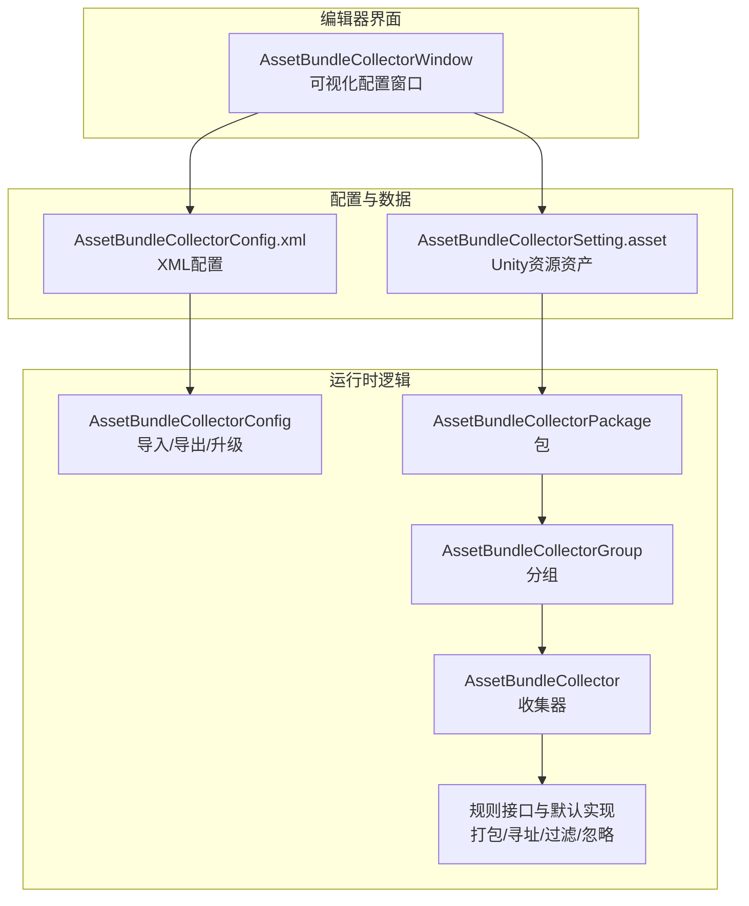
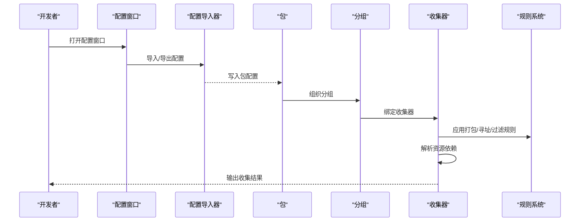
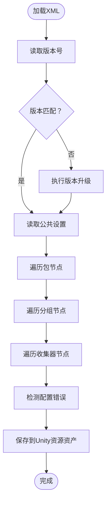
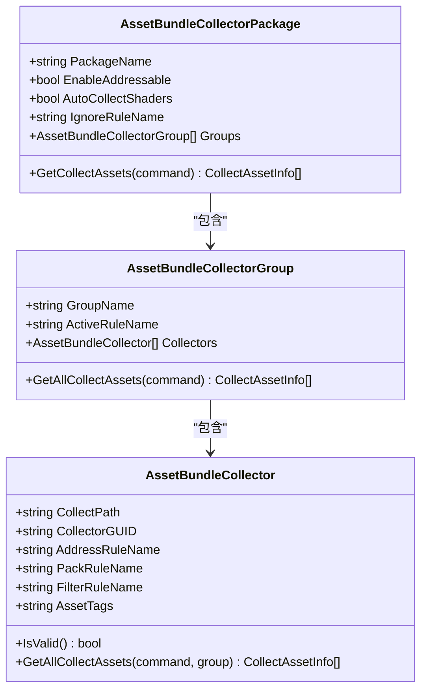
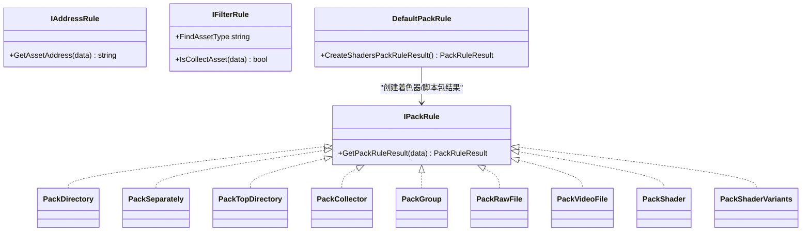
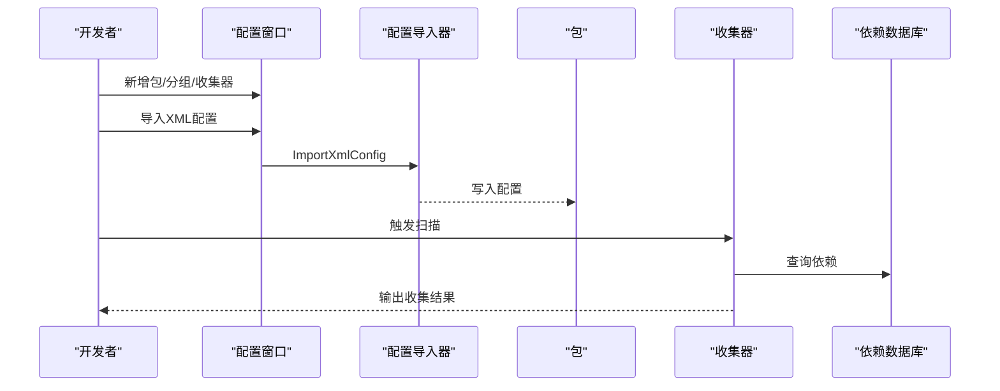
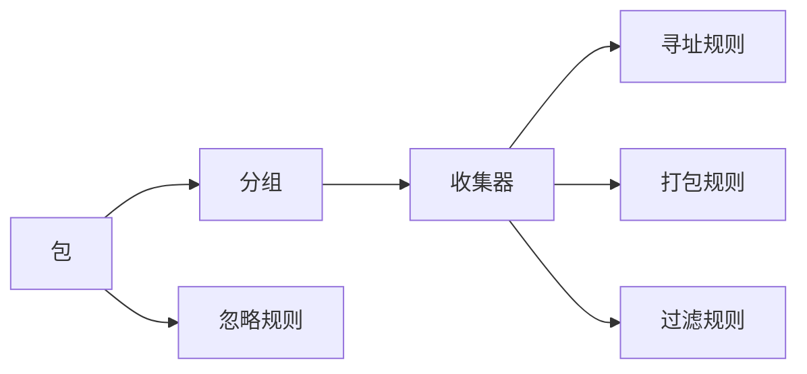

# 资源收集器

<cite>
**本文引用的文件**   
- [AssetBundleCollectorConfig.xml](file://Assets/Editor/AssetBundleCollector/AssetBundleCollectorConfig.xml)
- [AssetBundleCollectorSetting.asset](file://Assets/Editor/AssetBundleCollector/AssetBundleCollectorSetting.asset)
- [AssetBundleCollector.cs](file://Packages/YooAsset/Editor/AssetBundleCollector/AssetBundleCollector.cs)
- [AssetBundleCollectorConfig.cs](file://Packages/YooAsset/Editor/AssetBundleCollector/AssetBundleCollectorConfig.cs)
- [AssetBundleCollectorWindow.cs](file://Packages/YooAsset/Editor/AssetBundleCollector/AssetBundleCollectorWindow.cs)
- [AssetBundleCollectorPackage.cs](file://Packages/YooAsset/Editor/AssetBundleCollector/AssetBundleCollectorPackage.cs)
- [AssetBundleCollectorGroup.cs](file://Packages/YooAsset/Editor/AssetBundleCollector/AssetBundleCollectorGroup.cs)
- [IAddressRule.cs](file://Packages/YooAsset/Editor/AssetBundleCollector/CollectRules/IAddressRule.cs)
- [DefaultPackRule.cs](file://Packages/YooAsset/Editor/AssetBundleCollector/DefaultRules/DefaultPackRule.cs)
- [DefaultFilterRule.cs](file://Packages/YooAsset/Editor/AssetBundleCollector/DefaultRules/DefaultFilterRule.cs)
</cite>

## 目录
1. [简介](#简介)
2. [项目结构](#项目结构)
3. [核心组件](#核心组件)
4. [架构总览](#架构总览)
5. [详细组件分析](#详细组件分析)
6. [依赖分析](#依赖分析)
7. [性能考虑](#性能考虑)
8. [故障排除指南](#故障排除指南)
9. [结论](#结论)
10. [附录](#附录)

## 简介
本文件面向资源收集器（AssetBundle Collector）的使用者与维护者，系统性阐述其架构设计、工作原理与使用方法。重点覆盖以下方面：
- 资源依赖分析与自动收集机制
- 包配置管理与多包策略
- AssetBundleCollectorConfig.xml 的结构与参数详解
- 使用流程：配置编辑、资源扫描、包构建
- 最佳实践与性能优化建议
- 故障排除与常见问题定位

## 项目结构
资源收集器由两部分组成：
- 编辑器可视化配置界面：用于图形化管理包、分组与收集器，并支持导入/导出配置
- 配置文件：以 XML 与 Unity 资源资产形式保存，描述包、分组、收集器及规则

**图表来源**
- [AssetBundleCollectorWindow.cs:12-1160](file://Packages/YooAsset/Editor/AssetBundleCollector/AssetBundleCollectorWindow.cs#L12-L1160)
- [AssetBundleCollectorConfig.xml:1-48](file://Assets/Editor/AssetBundleCollector/AssetBundleCollectorConfig.xml#L1-L48)
- [AssetBundleCollectorSetting.asset:1-218](file://Assets/Editor/AssetBundleCollector/AssetBundleCollectorSetting.asset#L1-L218)
- [AssetBundleCollectorConfig.cs:11-301](file://Packages/YooAsset/Editor/AssetBundleCollector/AssetBundleCollectorConfig.cs#L11-L301)
- [AssetBundleCollectorPackage.cs:11-178](file://Packages/YooAsset/Editor/AssetBundleCollector/AssetBundleCollectorPackage.cs#L11-L178)
- [AssetBundleCollectorGroup.cs:11-126](file://Packages/YooAsset/Editor/AssetBundleCollector/AssetBundleCollectorGroup.cs#L11-L126)
- [AssetBundleCollector.cs:10-300](file://Packages/YooAsset/Editor/AssetBundleCollector/AssetBundleCollector.cs#L10-L300)

**章节来源**
- [AssetBundleCollectorWindow.cs:12-1160](file://Packages/YooAsset/Editor/AssetBundleCollector/AssetBundleCollectorWindow.cs#L12-L1160)
- [AssetBundleCollectorConfig.xml:1-48](file://Assets/Editor/AssetBundleCollector/AssetBundleCollectorConfig.xml#L1-L48)
- [AssetBundleCollectorSetting.asset:1-218](file://Assets/Editor/AssetBundleCollector/AssetBundleCollectorSetting.asset#L1-L218)

## 核心组件
- 包（Package）
  - 描述一组资源的打包策略与全局行为，如是否启用可寻址、是否自动收集着色器、忽略规则等
- 分组（Group）
  - 在包内按业务域划分，支持激活规则控制是否参与收集
- 收集器（Collector）
  - 定义具体资源目录或单文件的收集路径、收集类型、寻址规则、打包规则、过滤规则与用户数据
- 规则系统
  - 打包规则（IPackRule）、寻址规则（IAddressRule）、过滤规则（IFilterRule）、忽略规则（IIgnoreRule）

这些组件共同构成“包-分组-收集器-规则”的层次化配置体系，既保证灵活性，又确保可维护性。

**章节来源**
- [AssetBundleCollectorPackage.cs:11-178](file://Packages/YooAsset/Editor/AssetBundleCollector/AssetBundleCollectorPackage.cs#L11-L178)
- [AssetBundleCollectorGroup.cs:11-126](file://Packages/YooAsset/Editor/AssetBundleCollector/AssetBundleCollectorGroup.cs#L11-L126)
- [AssetBundleCollector.cs:10-300](file://Packages/YooAsset/Editor/AssetBundleCollector/AssetBundleCollector.cs#L10-L300)
- [IAddressRule.cs:1-27](file://Packages/YooAsset/Editor/AssetBundleCollector/CollectRules/IAddressRule.cs#L1-L27)

## 架构总览
资源收集器的运行流程分为“配置导入/编辑”和“收集执行”两个阶段：
- 配置导入/编辑：通过编辑器窗口或 XML/Asset 文件进行配置；支持导入/导出与版本升级
- 收集执行：根据包/分组/收集器与规则，扫描资源、解析依赖、生成打包清单并输出

**图表来源**
- [AssetBundleCollectorWindow.cs:420-445](file://Packages/YooAsset/Editor/AssetBundleCollector/AssetBundleCollectorWindow.cs#L420-L445)
- [AssetBundleCollectorConfig.cs:49-180](file://Packages/YooAsset/Editor/AssetBundleCollector/AssetBundleCollectorConfig.cs#L49-L180)
- [AssetBundleCollectorPackage.cs:108-148](file://Packages/YooAsset/Editor/AssetBundleCollector/AssetBundleCollectorPackage.cs#L108-L148)
- [AssetBundleCollectorGroup.cs:77-124](file://Packages/YooAsset/Editor/AssetBundleCollector/AssetBundleCollectorGroup.cs#L77-L124)
- [AssetBundleCollector.cs:140-218](file://Packages/YooAsset/Editor/AssetBundleCollector/AssetBundleCollector.cs#L140-L218)

## 详细组件分析

### 配置文件结构与参数详解（AssetBundleCollectorConfig.xml）
- 版本字段
  - Version：当前配置版本，用于导入时的兼容性检查与自动升级
- 公共设置（Common）
  - ShowPackageView：是否在编辑器中显示包视图
  - ShowEditorAlias：是否显示规则别名
  - UniqueBundleName：是否启用唯一资源包名
- 包（Package）
  - PackageName、PackageDesc：包名称与描述
  - AutoAddressable、SupportExtensionless、LocationToLower、IncludeAssetGUID：包级行为开关
  - IgnoreRuleName：文件忽略规则类名
- 分组（Group）
  - GroupActiveRule、GroupName、GroupDesc、AssetTags：分组激活规则、名称、描述与标签
- 收集器（Collector）
  - CollectPath：收集路径（文件夹或单个资源）
  - CollectGUID：收集器GUID（用于路径修复）
  - CollectType：收集器类型（主资源/静态资源/依赖资源）
  - AddressRule、PackRule、FilterRule：寻址、打包、过滤规则类名
  - UserData、AssetTags：用户自定义数据与资源标签

**图表来源**
- [AssetBundleCollectorConfig.cs:49-180](file://Packages/YooAsset/Editor/AssetBundleCollector/AssetBundleCollectorConfig.cs#L49-L180)

**章节来源**
- [AssetBundleCollectorConfig.xml:1-48](file://Assets/Editor/AssetBundleCollector/AssetBundleCollectorConfig.xml#L1-L48)
- [AssetBundleCollectorConfig.cs:11-301](file://Packages/YooAsset/Editor/AssetBundleCollector/AssetBundleCollectorConfig.cs#L11-L301)

### 包配置管理（AssetBundleCollectorPackage）
- 行为开关
  - EnableAddressable：启用可寻址资源定位
  - SupportExtensionless：支持无后缀名定位
  - LocationToLower：定位地址大小写不敏感
  - IncludeAssetGUID：包含资源GUID
  - AutoCollectShaders：自动收集所有着色器至统一包
  - IgnoreRuleName：文件忽略规则
- 资源收集
  - GetCollectAssets：聚合分组内的收集结果，去重并校验寻址冲突
  - GetAllTags：汇总分组与收集器的标签

**章节来源**
- [AssetBundleCollectorPackage.cs:11-178](file://Packages/YooAsset/Editor/AssetBundleCollector/AssetBundleCollectorPackage.cs#L11-L178)

### 分组与收集器（AssetBundleCollectorGroup / AssetBundleCollector）
- 分组
  - ActiveRuleName：分组激活规则
  - GetAllCollectAssets：按激活规则筛选后聚合收集器结果，校验寻址冲突
- 收集器
  - 支持路径有效性校验、GUID修复、规则实例化
  - GetAllCollectAssets：扫描资源、应用过滤规则、解析依赖、生成寻址与打包结果
  - 依赖解析：调用依赖数据库获取主资源依赖并排除自身

**图表来源**
- [AssetBundleCollectorPackage.cs:11-178](file://Packages/YooAsset/Editor/AssetBundleCollector/AssetBundleCollectorPackage.cs#L11-L178)
- [AssetBundleCollectorGroup.cs:11-126](file://Packages/YooAsset/Editor/AssetBundleCollector/AssetBundleCollectorGroup.cs#L11-L126)
- [AssetBundleCollector.cs:10-300](file://Packages/YooAsset/Editor/AssetBundleCollector/AssetBundleCollector.cs#L10-L300)

**章节来源**
- [AssetBundleCollectorGroup.cs:11-126](file://Packages/YooAsset/Editor/AssetBundleCollector/AssetBundleCollectorGroup.cs#L11-L126)
- [AssetBundleCollector.cs:10-300](file://Packages/YooAsset/Editor/AssetBundleCollector/AssetBundleCollector.cs#L10-L300)

### 规则系统与默认实现
- 寻址规则（IAddressRule）
  - 输入：资源路径、收集路径、分组名、用户数据
  - 输出：资源定位地址
- 打包规则（IPackRule）
  - 默认实现：按文件路径、父目录、顶级目录、收集器路径、分组名、原生文件、视频文件、着色器等策略生成资源包名
- 过滤规则（IFilterRule）
  - 默认实现：收集所有资源、仅场景、仅预制体、仅精灵纹理、仅着色器、仅着色器变种集合
- 忽略规则（IIgnoreRule）
  - 由包级 IgnoreRuleName 指定，用于排除不需要参与收集的资源

**图表来源**
- [IAddressRule.cs:1-27](file://Packages/YooAsset/Editor/AssetBundleCollector/CollectRules/IAddressRule.cs#L1-L27)
- [DefaultPackRule.cs:7-198](file://Packages/YooAsset/Editor/AssetBundleCollector/DefaultRules/DefaultPackRule.cs#L7-L198)
- [DefaultFilterRule.cs:9-105](file://Packages/YooAsset/Editor/AssetBundleCollector/DefaultRules/DefaultFilterRule.cs#L9-L105)

**章节来源**
- [IAddressRule.cs:1-27](file://Packages/YooAsset/Editor/AssetBundleCollector/CollectRules/IAddressRule.cs#L1-L27)
- [DefaultPackRule.cs:7-198](file://Packages/YooAsset/Editor/AssetBundleCollector/DefaultRules/DefaultPackRule.cs#L7-L198)
- [DefaultFilterRule.cs:9-105](file://Packages/YooAsset/Editor/AssetBundleCollector/DefaultRules/DefaultFilterRule.cs#L9-L105)

### 使用方法与操作流程
- 配置编辑
  - 打开菜单：YooAsset → AssetBundle Collector
  - 支持新增/删除包、分组、收集器，修改包级与分组级规则
  - 导入/导出：从 XML 导入或导出配置
  - 配置修复：自动修复无效 GUID 与路径
- 资源扫描
  - 根据收集器的过滤规则扫描资源，解析依赖，生成收集项
- 包构建
  - 根据打包规则生成资源包名，结合包级行为（如自动收集着色器、大小写不敏感等）输出构建清单

**图表来源**
- [AssetBundleCollectorWindow.cs:420-445](file://Packages/YooAsset/Editor/AssetBundleCollector/AssetBundleCollectorWindow.cs#L420-L445)
- [AssetBundleCollectorConfig.cs:49-180](file://Packages/YooAsset/Editor/AssetBundleCollector/AssetBundleCollectorConfig.cs#L49-L180)
- [AssetBundleCollector.cs:140-218](file://Packages/YooAsset/Editor/AssetBundleCollector/AssetBundleCollector.cs#L140-L218)

**章节来源**
- [AssetBundleCollectorWindow.cs:12-1160](file://Packages/YooAsset/Editor/AssetBundleCollector/AssetBundleCollectorWindow.cs#L12-L1160)
- [AssetBundleCollectorConfig.cs:185-252](file://Packages/YooAsset/Editor/AssetBundleCollector/AssetBundleCollectorConfig.cs#L185-L252)

## 依赖分析
- 组件耦合
  - 包聚合分组，分组聚合收集器，收集器依赖规则系统
- 外部依赖
  - Unity Editor API：资源扫描、路径转换、GUID/路径互转
  - XML DOM：配置导入/导出
- 规则接口契约
  - IPackRule、IAddressRule、IFilterRule、IIgnoreRule 提供扩展点，便于定制策略

**图表来源**
- [AssetBundleCollectorPackage.cs:11-178](file://Packages/YooAsset/Editor/AssetBundleCollector/AssetBundleCollectorPackage.cs#L11-L178)
- [AssetBundleCollectorGroup.cs:11-126](file://Packages/YooAsset/Editor/AssetBundleCollector/AssetBundleCollectorGroup.cs#L11-L126)
- [AssetBundleCollector.cs:10-300](file://Packages/YooAsset/Editor/AssetBundleCollector/AssetBundleCollector.cs#L10-L300)

**章节来源**
- [AssetBundleCollectorPackage.cs:11-178](file://Packages/YooAsset/Editor/AssetBundleCollector/AssetBundleCollectorPackage.cs#L11-L178)
- [AssetBundleCollectorGroup.cs:11-126](file://Packages/YooAsset/Editor/AssetBundleCollector/AssetBundleCollectorGroup.cs#L11-L126)
- [AssetBundleCollector.cs:10-300](file://Packages/YooAsset/Editor/AssetBundleCollector/AssetBundleCollector.cs#L10-L300)

## 性能考虑
- 扫描范围控制
  - 使用过滤规则缩小扫描范围，避免全库扫描
  - 将大目录拆分为多个收集器，降低单次扫描压力
- 依赖解析
  - 合理使用“忽略依赖解析”标志位以减少不必要的依赖查询
- 打包策略
  - 对于高频更新的小资源采用“按文件独立打包”，对稳定大资源采用“按目录/顶级目录打包”
  - 自动收集着色器可减少手工维护成本，但需注意统一包体积
- 寻址与命名
  - 启用唯一资源包名可避免跨包冲突，但会增加包名长度与管理复杂度
  - 定位地址大小写不敏感与包名唯一性不可同时启用（编辑器会给出提示）

[本节为通用指导，无需列出具体文件来源]

## 故障排除指南
- 配置版本不匹配
  - 现象：导入配置时报错，提示版本升级失败
  - 处理：确认配置文件版本与工具版本兼容，必要时手动升级配置
- 无效收集路径或GUID
  - 现象：收集器路径无效或GUID无法映射
  - 处理：使用“修复配置”功能自动移除无效GUID并同步路径
- 寻址地址重复
  - 现象：同一寻址地址被多个资源使用
  - 处理：调整寻址规则或收集器配置，确保地址唯一
- 启用可寻址与定位地址大小写不敏感冲突
  - 现象：编辑器提示两者不能同时启用
  - 处理：二选一，或调整包级设置
- 多包且未启用唯一包名
  - 现象：编辑器提示建议启用唯一包名
  - 处理：启用唯一包名以避免跨包包名冲突

**章节来源**
- [AssetBundleCollectorConfig.cs:64-70](file://Packages/YooAsset/Editor/AssetBundleCollector/AssetBundleCollectorConfig.cs#L64-L70)
- [AssetBundleCollector.cs:80-97](file://Packages/YooAsset/Editor/AssetBundleCollector/AssetBundleCollector.cs#L80-L97)
- [AssetBundleCollector.cs:192-214](file://Packages/YooAsset/Editor/AssetBundleCollector/AssetBundleCollector.cs#L192-L214)
- [AssetBundleCollectorWindow.cs:532-555](file://Packages/YooAsset/Editor/AssetBundleCollector/AssetBundleCollectorWindow.cs#L532-L555)

## 结论
资源收集器通过“包-分组-收集器-规则”的分层设计，提供了灵活而强大的资源组织与打包能力。配合 XML/Asset 双形态配置与可视化编辑器，既能满足日常开发需求，也能支持复杂项目的模块化与多包策略。遵循本文的最佳实践与故障排除建议，可显著提升资源构建的稳定性与效率。

[本节为总结性内容，无需列出具体文件来源]

## 附录

### 配置示例要点（基于现有配置文件）
- 包级行为
  - DefaultPackage：启用自动收集着色器、忽略默认类型、包名唯一
  - OtherPackage/Dlc1Package/Dlc2Package：按需启用扩展包，使用标签区分模型/场景资源
- 分组与收集器
  - 按资源类型划分（Actor、Audios、Configs、DLL、Effects、Fonts、Materials、Scenes、UI、UIRaw）
  - UIRaw 下再细分 Atlas 与 Raw，分别按目录打包
- 规则选择
  - 打包规则：PackDirectory 或 PackSeparately，依据资源更新频率与访问模式选择
  - 寻址规则：AddressByFileName，便于按文件名定位
  - 过滤规则：CollectAll，覆盖全部资源类型

**章节来源**
- [AssetBundleCollectorConfig.xml:4-48](file://Assets/Editor/AssetBundleCollector/AssetBundleCollectorConfig.xml#L4-L48)
- [AssetBundleCollectorSetting.asset:18-218](file://Assets/Editor/AssetBundleCollector/AssetBundleCollectorSetting.asset#L18-L218)