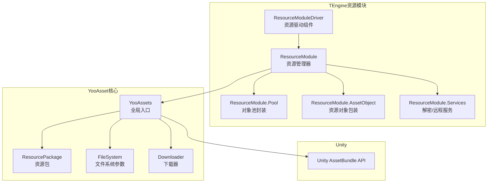
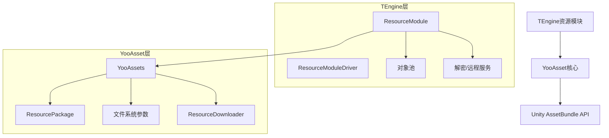
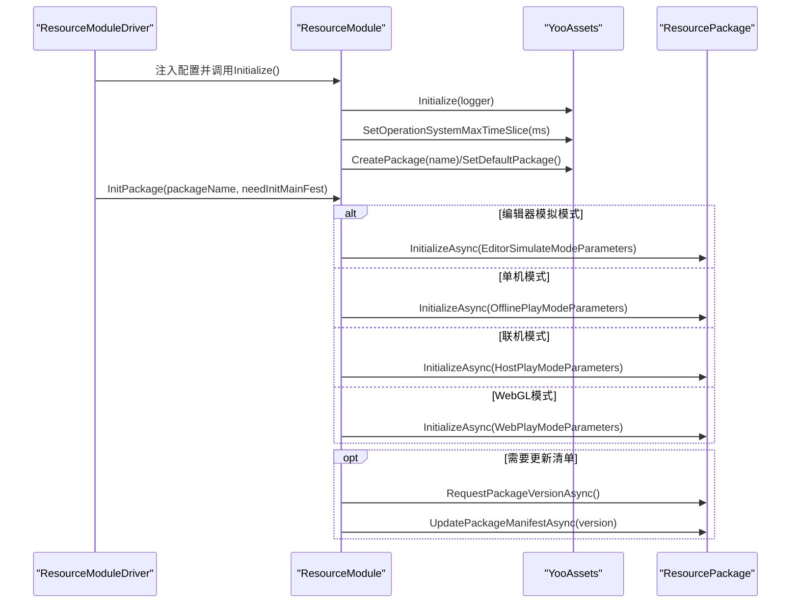
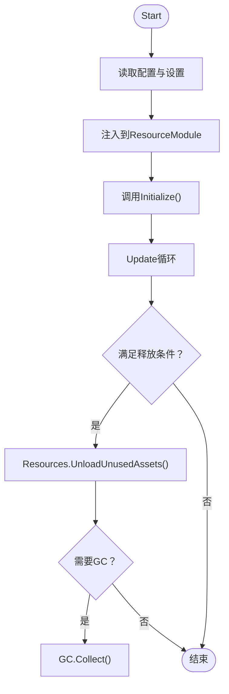
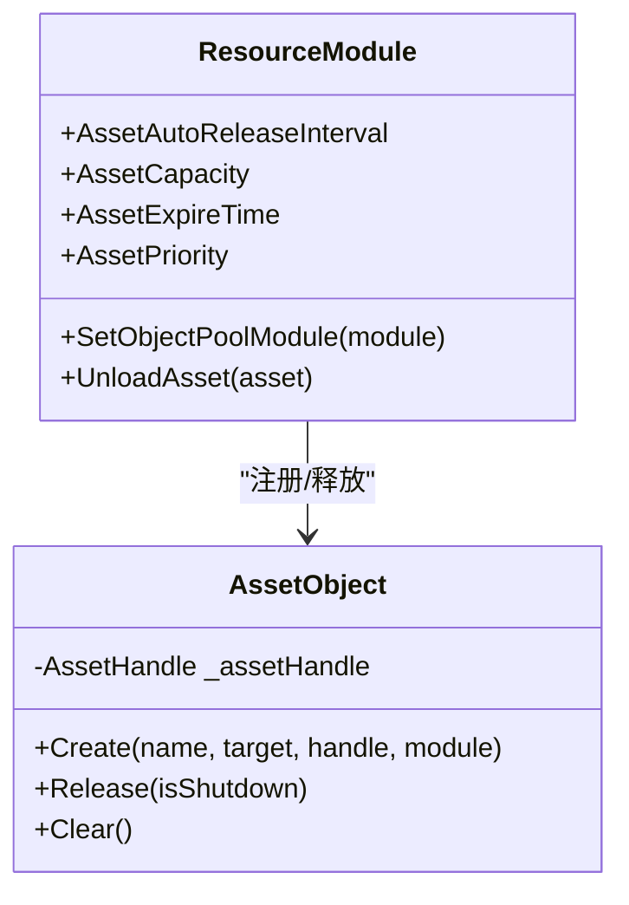
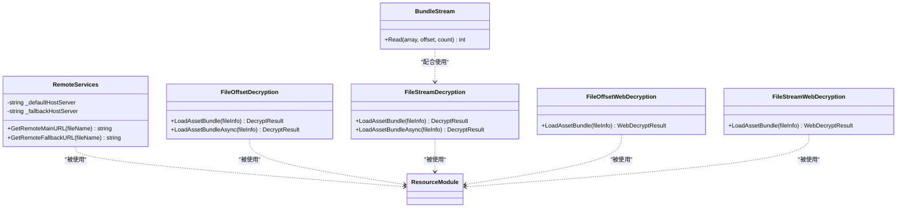
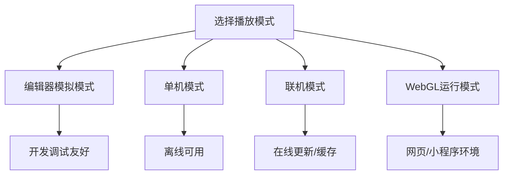
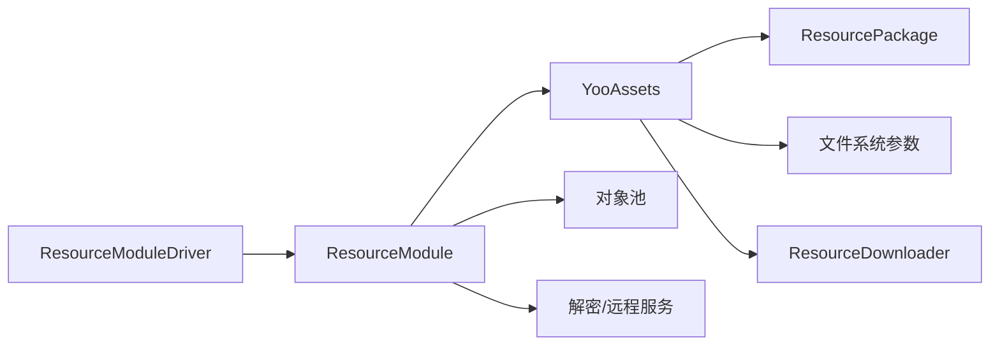

# YooAsset集成

<cite>
**本文档引用的文件**
- [YooAssetSettings.asset](file://Assets/TEngine/Settings/Resources/YooAssetSettings.asset)
- [ResourceModule.cs](file://Assets/TEngine/Runtime/Module/ResourceModule/ResourceModule.cs)
- [ResourceModuleDriver.cs](file://Assets/TEngine/Runtime/Module/ResourceModule/ResourceModuleDriver.cs)
- [ResourceModule.Pool.cs](file://Assets/TEngine/Runtime/Module/ResourceModule/ResourceModule.Pool.cs)
- [ResourceModule.AssetObject.cs](file://Assets/TEngine/Runtime/Module/ResourceModule/ResourceModule.AssetObject.cs)
- [ResourceModule.Services.cs](file://Assets/TEngine/Runtime/Module/ResourceModule/ResourceModule.Services.cs)
- [ResourceModuleDriverInspector.cs](file://Assets/TEngine/Editor/Inspector/ResourceModuleDriverInspector.cs)
- [MainToolbarExtender.cs](file://Assets/Editor/ToolbarExtender/Unity6000_OR_New/MainToolbarExtender.cs)
- [EditorPlayMode.cs](file://Assets/Editor/ToolbarExtender/UnityToolbarExtenderRight/EditorPlayMode.cs)
- [systemPatterns.md](file://memory-bank/systemPatterns.md)
</cite>

## 目录
1. [简介](#简介)
2. [项目结构](#项目结构)
3. [核心组件](#核心组件)
4. [架构总览](#架构总览)
5. [详细组件分析](#详细组件分析)
6. [依赖关系分析](#依赖关系分析)
7. [性能考量](#性能考量)
8. [故障排查指南](#故障排查指南)
9. [结论](#结论)
10. [附录](#附录)

## 简介
本文件面向TEngine中YooAsset的集成方案，系统性阐述其架构设计、配置方式与运行机制。重点覆盖以下方面：
- YooAssetSettings.asset的配置项与作用域
- 播放模式(EPlayMode)的五种模式及其适用场景
- ResourceModule对YooAsset的封装，包括资源包初始化、版本管理、下载器配置、解密服务等
- 最佳实践：资源包命名规范、分包策略、缓存策略
- 常见问题与排错建议

## 项目结构
TEngine将YooAsset作为资源系统的核心，通过ResourceModule提供统一的资源加载、缓存与生命周期管理；ResourceModuleDriver负责在运行时注入配置并驱动初始化流程。

**图表来源**
- [ResourceModule.cs:119-138](file://Assets/TEngine/Runtime/Module/ResourceModule/ResourceModule.cs#L119-L138)
- [ResourceModuleDriver.cs:236-271](file://Assets/TEngine/Runtime/Module/ResourceModule/ResourceModuleDriver.cs#L236-L271)
- [ResourceModule.Services.cs:12-32](file://Assets/TEngine/Runtime/Module/ResourceModule/ResourceModule.Services.cs#L12-L32)

**章节来源**
- [ResourceModule.cs:119-138](file://Assets/TEngine/Runtime/Module/ResourceModule/ResourceModule.cs#L119-L138)
- [ResourceModuleDriver.cs:236-271](file://Assets/TEngine/Runtime/Module/ResourceModule/ResourceModuleDriver.cs#L236-L271)
- [systemPatterns.md:278-303](file://memory-bank/systemPatterns.md#L278-L303)

## 核心组件
- ResourceModule：TEngine对YooAsset的高层封装，提供资源包管理、版本查询与更新、下载器创建、缓存清理、资源加载与卸载等能力。
- ResourceModuleDriver：运行时配置注入与初始化驱动，绑定播放模式、下载并发、失败重试、对象池参数等。
- ResourceModule.Pool：基于对象池的资源缓存与复用。
- ResourceModule.AssetObject：对YooAsset资源句柄的包装，实现引用计数与释放策略。
- ResourceModule.Services：提供解密服务、远程服务接口实现，适配不同平台与加密方式。

**章节来源**
- [ResourceModule.cs:119-138](file://Assets/TEngine/Runtime/Module/ResourceModule/ResourceModule.cs#L119-L138)
- [ResourceModuleDriver.cs:236-271](file://Assets/TEngine/Runtime/Module/ResourceModule/ResourceModuleDriver.cs#L236-L271)
- [ResourceModule.Pool.cs:5-67](file://Assets/TEngine/Runtime/Module/ResourceModule/ResourceModule.Pool.cs#L5-L67)
- [ResourceModule.AssetObject.cs:11-58](file://Assets/TEngine/Runtime/Module/ResourceModule/ResourceModule.AssetObject.cs#L11-L58)
- [ResourceModule.Services.cs:12-32](file://Assets/TEngine/Runtime/Module/ResourceModule/ResourceModule.Services.cs#L12-L32)

## 架构总览
下图展示TEngine与YooAsset的集成层次与交互关系：

**图表来源**
- [systemPatterns.md:278-303](file://memory-bank/systemPatterns.md#L278-L303)
- [ResourceModule.cs:119-138](file://Assets/TEngine/Runtime/Module/ResourceModule/ResourceModule.cs#L119-L138)
- [ResourceModuleDriver.cs:236-271](file://Assets/TEngine/Runtime/Module/ResourceModule/ResourceModuleDriver.cs#L236-L271)

## 详细组件分析

### ResourceModule：YooAsset封装与运行机制
- 初始化与默认包
  - 初始化YooAssets并设置操作系统的每帧时间片切片
  - 创建默认资源包并设为默认包
- 播放模式初始化
  - 根据编辑器或运行时的EPlayMode选择不同的初始化参数：
    - 编辑器模拟模式：使用编辑器文件系统参数
    - 单机模式：内置文件系统参数
    - 联机模式：内置+缓存文件系统参数，结合远程服务
    - WebGL模式：Web服务器/远程文件系统参数，支持微信小游戏环境
- 版本管理
  - 支持请求并更新资源包清单版本
- 下载器
  - 基于当前资源包版本创建下载器，支持并发数与失败重试次数配置
- 解密服务
  - 提供文件偏移与文件流两种解密服务，分别用于常规与Web平台
- 资源加载与缓存
  - 提供同步/异步加载接口，内部通过对象池缓存资源句柄
  - 加载过程中避免重复排队，支持取消与超时控制
- 资源回收
  - 支持卸载未使用资源与强制回收，结合Unity的Resources.UnloadUnusedAssets

**图表来源**
- [ResourceModule.cs:119-261](file://Assets/TEngine/Runtime/Module/ResourceModule/ResourceModule.cs#L119-L261)
- [ResourceModuleDriver.cs:236-271](file://Assets/TEngine/Runtime/Module/ResourceModule/ResourceModuleDriver.cs#L236-L271)

**章节来源**
- [ResourceModule.cs:119-261](file://Assets/TEngine/Runtime/Module/ResourceModule/ResourceModule.cs#L119-L261)
- [ResourceModule.cs:263-287](file://Assets/TEngine/Runtime/Module/ResourceModule/ResourceModule.cs#L263-L287)
- [ResourceModule.cs:294-341](file://Assets/TEngine/Runtime/Module/ResourceModule/ResourceModule.cs#L294-L341)
- [ResourceModule.cs:352-366](file://Assets/TEngine/Runtime/Module/ResourceModule/ResourceModule.cs#L352-L366)
- [ResourceModule.cs:412-442](file://Assets/TEngine/Runtime/Module/ResourceModule/ResourceModule.cs#L412-L442)

### ResourceModuleDriver：配置注入与运行时驱动
- 在Start阶段从配置与设置中读取并注入以下参数：
  - 默认包名、播放模式、加密类型、异步时间片、自动卸载策略
  - 主/回退资源服务器地址、WebGL加载方式
  - 下载并发、失败重试、边玩边下载开关
  - 对象池容量、过期时间、优先级等
- 提供周期性释放未使用资源的调度逻辑，支持触发强制释放与GC

**图表来源**
- [ResourceModuleDriver.cs:236-334](file://Assets/TEngine/Runtime/Module/ResourceModule/ResourceModuleDriver.cs#L236-L334)

**章节来源**
- [ResourceModuleDriver.cs:236-271](file://Assets/TEngine/Runtime/Module/ResourceModule/ResourceModuleDriver.cs#L236-L271)
- [ResourceModuleDriver.cs:301-334](file://Assets/TEngine/Runtime/Module/ResourceModule/ResourceModuleDriver.cs#L301-L334)

### ResourceModule.Pool与AssetObject：缓存与释放策略
- 对象池参数映射：自动释放间隔、容量、过期时间、优先级
- 资源对象包装：持有YooAsset的AssetHandle，在对象池释放时正确Dispose句柄
- 卸载接口：通过Unspawn触发资源句柄释放

**图表来源**
- [ResourceModule.Pool.cs:5-67](file://Assets/TEngine/Runtime/Module/ResourceModule/ResourceModule.Pool.cs#L5-L67)
- [ResourceModule.AssetObject.cs:11-58](file://Assets/TEngine/Runtime/Module/ResourceModule/ResourceModule.AssetObject.cs#L11-L58)

**章节来源**
- [ResourceModule.Pool.cs:5-67](file://Assets/TEngine/Runtime/Module/ResourceModule/ResourceModule.Pool.cs#L5-L67)
- [ResourceModule.AssetObject.cs:11-58](file://Assets/TEngine/Runtime/Module/ResourceModule/ResourceModule.AssetObject.cs#L11-L58)

### ResourceModule.Services：解密与远程服务
- 远程服务：根据主/回退地址拼接远端URL
- 解密服务：
  - 文件偏移解密：从文件偏移处加载AssetBundle
  - 文件流解密：对文件流进行按位异或解密
  - Web平台对应解密：从内存数据解密加载
- BundleStream：提供按字节异或的解密读取

**图表来源**
- [ResourceModule.Services.cs:12-32](file://Assets/TEngine/Runtime/Module/ResourceModule/ResourceModule.Services.cs#L12-L32)
- [ResourceModule.Services.cs:141-197](file://Assets/TEngine/Runtime/Module/ResourceModule/ResourceModule.Services.cs#L141-L197)
- [ResourceModule.Services.cs:204-241](file://Assets/TEngine/Runtime/Module/ResourceModule/ResourceModule.Services.cs#L204-L241)
- [ResourceModule.Services.cs:247-269](file://Assets/TEngine/Runtime/Module/ResourceModule/ResourceModule.Services.cs#L247-L269)

**章节来源**
- [ResourceModule.Services.cs:12-32](file://Assets/TEngine/Runtime/Module/ResourceModule/ResourceModule.Services.cs#L12-L32)
- [ResourceModule.Services.cs:141-197](file://Assets/TEngine/Runtime/Module/ResourceModule/ResourceModule.Services.cs#L141-L197)
- [ResourceModule.Services.cs:204-241](file://Assets/TEngine/Runtime/Module/ResourceModule/ResourceModule.Services.cs#L204-L241)
- [ResourceModule.Services.cs:247-269](file://Assets/TEngine/Runtime/Module/ResourceModule/ResourceModule.Services.cs#L247-L269)

### 播放模式详解与适用场景
- 编辑器模拟模式（EditorSimulateMode）
  - 适用：开发调试阶段，直接使用编辑器文件系统
  - 特点：无需打包，加载快速，便于迭代
- 单机模式（OfflinePlayMode）
  - 适用：离线游戏或本地安装包
  - 特点：使用内置文件系统，无需网络
- 联机模式（HostPlayMode）
  - 适用：联网游戏，需要在线更新与缓存
  - 特点：内置+缓存文件系统，支持远程服务
- WebGL运行模式（WebPlayMode）
  - 适用：网页/小程序发布
  - 特点：Web服务器/远程文件系统，支持微信小游戏路径
- 仿真模式（仿真模式通常指编辑器模拟，非独立枚举项）

**图表来源**
- [ResourceModule.cs:174-233](file://Assets/TEngine/Runtime/Module/ResourceModule/ResourceModule.cs#L174-L233)
- [ResourceModuleDriver.cs:62-91](file://Assets/TEngine/Runtime/Module/ResourceModule/ResourceModuleDriver.cs#L62-L91)
- [ResourceModuleDriverInspector.cs:573-580](file://Assets/TEngine/Editor/Inspector/ResourceModuleDriverInspector.cs#L573-L580)
- [MainToolbarExtender.cs:322-328](file://Assets/Editor/ToolbarExtender/Unity6000_OR_New/MainToolbarExtender.cs#L322-L328)
- [EditorPlayMode.cs:16-22](file://Assets/Editor/ToolbarExtender/UnityToolbarExtenderRight/EditorPlayMode.cs#L16-L22)

**章节来源**
- [ResourceModule.cs:174-233](file://Assets/TEngine/Runtime/Module/ResourceModule/ResourceModule.cs#L174-L233)
- [ResourceModuleDriver.cs:62-91](file://Assets/TEngine/Runtime/Module/ResourceModule/ResourceModuleDriver.cs#L62-L91)
- [ResourceModuleDriverInspector.cs:573-580](file://Assets/TEngine/Editor/Inspector/ResourceModuleDriverInspector.cs#L573-L580)
- [MainToolbarExtender.cs:322-328](file://Assets/Editor/ToolbarExtender/Unity6000_OR_New/MainToolbarExtender.cs#L322-L328)
- [EditorPlayMode.cs:16-22](file://Assets/Editor/ToolbarExtender/UnityToolbarExtenderRight/EditorPlayMode.cs#L16-L22)

## 依赖关系分析
- ResourceModuleDriver依赖于ResourceModule与设置模块（如更新设置），在启动时完成配置注入
- ResourceModule依赖YooAssets全局入口与各文件系统参数，按播放模式构造初始化参数
- 对象池与资源句柄的生命周期由ResourceModule统一管理，确保释放顺序与引用计数一致

**图表来源**
- [ResourceModuleDriver.cs:236-271](file://Assets/TEngine/Runtime/Module/ResourceModule/ResourceModuleDriver.cs#L236-L271)
- [ResourceModule.cs:119-138](file://Assets/TEngine/Runtime/Module/ResourceModule/ResourceModule.cs#L119-L138)
- [ResourceModule.Services.cs:12-32](file://Assets/TEngine/Runtime/Module/ResourceModule/ResourceModule.Services.cs#L12-L32)

**章节来源**
- [ResourceModuleDriver.cs:236-271](file://Assets/TEngine/Runtime/Module/ResourceModule/ResourceModuleDriver.cs#L236-L271)
- [ResourceModule.cs:119-138](file://Assets/TEngine/Runtime/Module/ResourceModule/ResourceModule.cs#L119-L138)
- [ResourceModule.Services.cs:12-32](file://Assets/TEngine/Runtime/Module/ResourceModule/ResourceModule.Services.cs#L12-L32)

## 性能考量
- 异步时间片切片：通过设置每帧最大执行时间，平衡主线程卡顿与加载进度
- 并发与重试：合理设置下载并发数与失败重试次数，避免网络抖动导致长时间阻塞
- 对象池：通过容量、过期时间与自动释放间隔控制内存占用与GC频率
- 低内存回收：提供低内存回调，结合系统卸载与强制回收策略
- WebGL特殊处理：针对Web平台采用内存解密与Web文件系统参数，减少IO开销

**章节来源**
- [ResourceModule.cs:34-93](file://Assets/TEngine/Runtime/Module/ResourceModule/ResourceModule.cs#L34-L93)
- [ResourceModule.cs:352-366](file://Assets/TEngine/Runtime/Module/ResourceModule/ResourceModule.cs#L352-L366)
- [ResourceModule.Pool.cs:10-41](file://Assets/TEngine/Runtime/Module/ResourceModule/ResourceModule.Pool.cs#L10-L41)
- [ResourceModule.cs:392-442](file://Assets/TEngine/Runtime/Module/ResourceModule/ResourceModule.cs#L392-L442)
- [ResourceModule.cs:210-233](file://Assets/TEngine/Runtime/Module/ResourceModule/ResourceModule.cs#L210-L233)

## 故障排查指南
- 初始化失败
  - 检查播放模式与文件系统参数是否匹配
  - 确认默认包名与清单版本请求是否成功
- 加载超时
  - 调整异步时间片切片与对象池等待超时
  - 检查网络连通性与远程服务地址
- 内存异常
  - 触发卸载未使用资源与GC
  - 调整对象池容量与过期时间
- WebGL加载问题
  - 确认Web服务器/远程文件系统参数与微信小游戏路径
  - 校验解密服务与文件偏移/流式解密配置

**章节来源**
- [ResourceModule.cs:119-261](file://Assets/TEngine/Runtime/Module/ResourceModule/ResourceModule.cs#L119-L261)
- [ResourceModule.cs:1197-1219](file://Assets/TEngine/Runtime/Module/ResourceModule/ResourceModule.cs#L1197-L1219)
- [ResourceModule.cs:392-442](file://Assets/TEngine/Runtime/Module/ResourceModule/ResourceModule.cs#L392-L442)
- [ResourceModule.cs:210-233](file://Assets/TEngine/Runtime/Module/ResourceModule/ResourceModule.cs#L210-L233)

## 结论
TEngine通过ResourceModule对YooAsset进行了完整封装，实现了跨播放模式的一致化资源管理与加载体验。结合对象池与解密/远程服务，既保证了开发效率，又兼顾了线上运行的稳定性与性能。遵循本文的最佳实践与排错建议，可显著降低资源系统的维护成本与风险。

## 附录

### YooAssetSettings.asset配置项说明
- DefaultYooFolderName：默认YooAsset输出目录名
- PackageManifestPrefix：资源包清单前缀（用于多包区分）

**章节来源**
- [YooAssetSettings.asset:15-16](file://Assets/TEngine/Settings/Resources/YooAssetSettings.asset#L15-L16)

### 播放模式配置入口
- 编辑器工具栏：提供播放模式下拉菜单，支持切换四种模式
- Inspector刷新/保存：支持刷新类型名与播放模式名，保存配置

**章节来源**
- [MainToolbarExtender.cs:322-328](file://Assets/Editor/ToolbarExtender/Unity6000_OR_New/MainToolbarExtender.cs#L322-L328)
- [EditorPlayMode.cs:16-22](file://Assets/Editor/ToolbarExtender/UnityToolbarExtenderRight/EditorPlayMode.cs#L16-L22)
- [ResourceModuleDriverInspector.cs:549-580](file://Assets/TEngine/Editor/Inspector/ResourceModuleDriverInspector.cs#L549-L580)