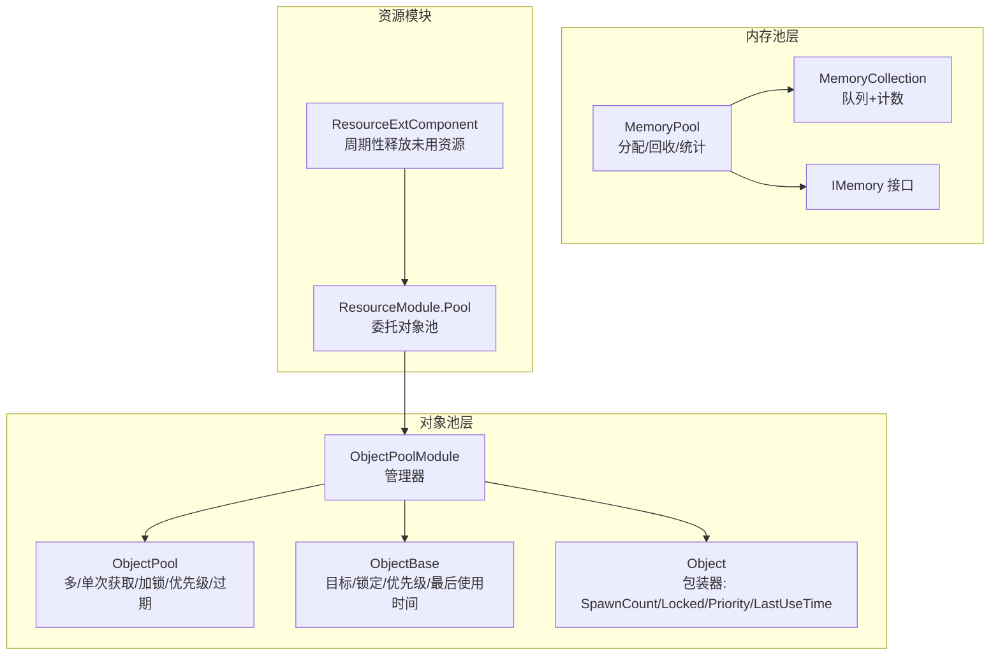
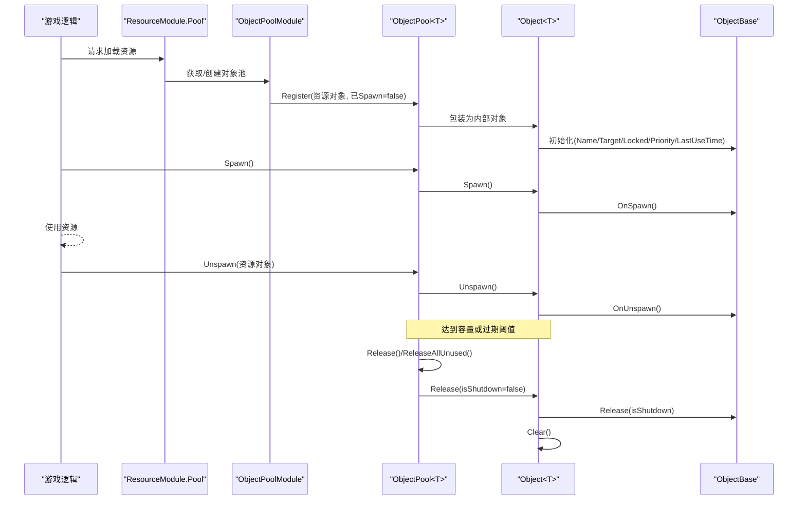
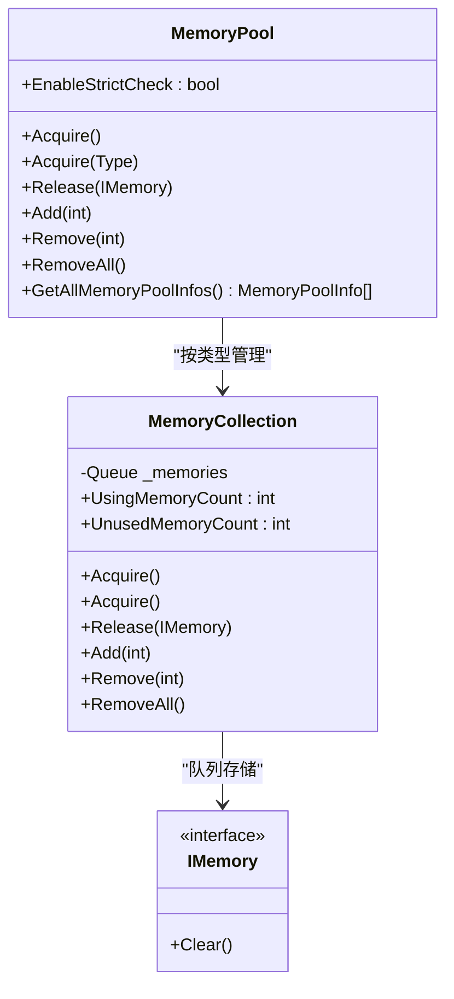
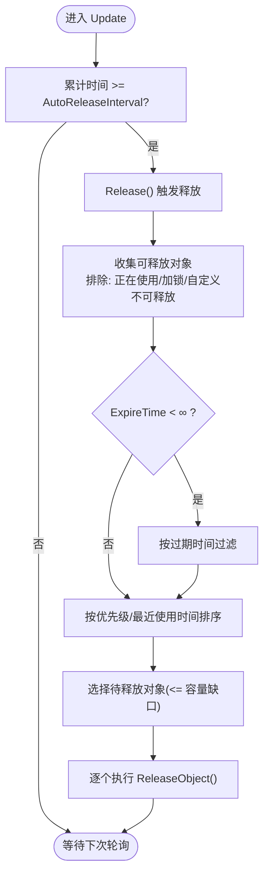
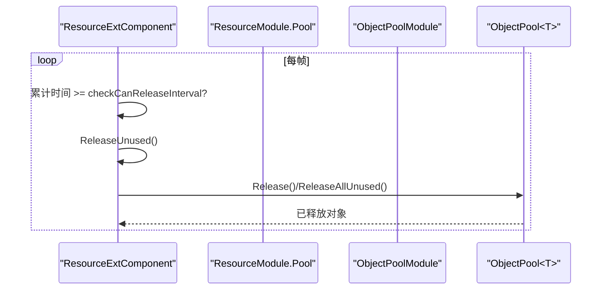
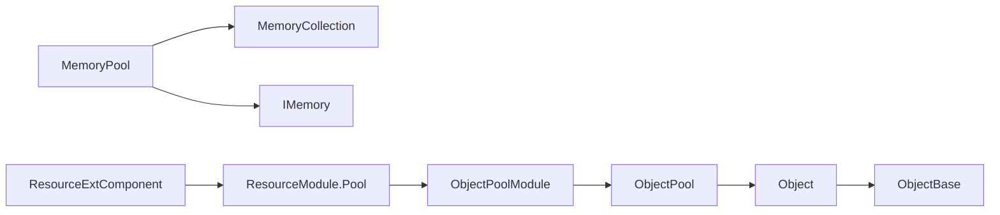

# 内存管理策略

<cite>
**本文档引用的文件**
- [MemoryPool.cs](file://Assets/TEngine/Runtime/Core/MemoryPool/MemoryPool.cs)
- [MemoryPoolExtension.cs](file://Assets/TEngine/Runtime/Core/MemoryPool/MemoryPoolExtension.cs)
- [MemoryPoolSetting.cs](file://Assets/TEngine/Runtime/Core/MemoryPool/MemoryPoolSetting.cs)
- [MemoryPoolInfo.cs](file://Assets/TEngine/Runtime/Core/MemoryPool/MemoryPoolInfo.cs)
- [MemoryPool.MemoryCollection.cs](file://Assets/TEngine/Runtime/Core/MemoryPool/MemoryPool.MemoryCollection.cs)
- [IMemory.cs](file://Assets/TEngine/Runtime/Core/MemoryPool/IMemory.cs)
- [IObjectPool.cs](file://Assets/TEngine/Runtime/Core/ObjectPoolModule/IObjectPool.cs)
- [ObjectPoolModule.cs](file://Assets/TEngine/Runtime/Core/ObjectPoolModule/ObjectPoolModule.cs)
- [ObjectPoolModule.ObjectPool.cs](file://Assets/TEngine/Runtime/Core/ObjectPoolModule/ObjectPoolModule.ObjectPool.cs)
- [ObjectPoolModule.Object.cs](file://Assets/TEngine/Runtime/Core/ObjectPoolModule/ObjectPoolModule.Object.cs)
- [ObjectBase.cs](file://Assets/TEngine/Runtime/Core/ObjectPoolModule/ObjectBase.cs)
- [ObjectInfo.cs](file://Assets/TEngine/Runtime/Core/ObjectPoolModule/ObjectInfo.cs)
- [ResourceModule.Pool.cs](file://Assets/TEngine/Runtime/Module/ResourceModule/ResourceModule.Pool.cs)
- [ResourceExtComponent.cs](file://Assets/TEngine/Runtime/Module/ResourceModule/Extension/ResourceExtComponent.cs)
</cite>

## 目录
1. [引言](#引言)
2. [项目结构](#项目结构)
3. [核心组件](#核心组件)
4. [架构总览](#架构总览)
5. [详细组件分析](#详细组件分析)
6. [依赖关系分析](#依赖关系分析)
7. [性能考量](#性能考量)
8. [故障排查指南](#故障排查指南)
9. [结论](#结论)
10. [附录](#附录)

## 引言
本文件系统性梳理 TEngine 的资源与对象内存管理策略，重点覆盖以下方面：
- 资源内存池与对象池的实现原理、容量管理与过期策略
- 资源引用计数与自动释放机制（含 AssetAutoReleaseInterval、AssetExpireTime 等参数）
- 缓存淘汰策略在资源管理中的应用思路
- 内存优化最佳实践：资源复用、泄漏预防、GC 优化
- 内存监控与调试技巧，以及常见问题诊断与解决

## 项目结构
TEngine 在运行时层提供了两套核心内存管理设施：
- 内存池（MemoryPool）：通用对象池，面向任意实现 IMemory 的对象，支持分配、回收、批量增删、统计与严格检查
- 对象池（ObjectPool）：面向 ObjectBase 的对象池，提供多/单次获取、加锁、优先级、过期时间、自动释放等高级能力

资源模块通过委托给对象池来管理资源对象，暴露 AssetAutoReleaseInterval、AssetCapacity、AssetExpireTime、AssetPriority 等配置项。

图表来源
- [MemoryPool.cs:1-208](file://Assets/TEngine/Runtime/Core/MemoryPool/MemoryPool.cs#L1-L208)
- [MemoryPool.MemoryCollection.cs:1-157](file://Assets/TEngine/Runtime/Core/MemoryPool/MemoryPool.MemoryCollection.cs#L1-L157)
- [ObjectPoolModule.cs:1-800](file://Assets/TEngine/Runtime/Core/ObjectPoolModule/ObjectPoolModule.cs#L1-L800)
- [ObjectPoolModule.ObjectPool.cs:1-602](file://Assets/TEngine/Runtime/Core/ObjectPoolModule/ObjectPoolModule.ObjectPool.cs#L1-L602)
- [ObjectPoolModule.Object.cs:1-190](file://Assets/TEngine/Runtime/Core/ObjectPoolModule/ObjectPoolModule.Object.cs#L1-L190)
- [ObjectBase.cs:1-164](file://Assets/TEngine/Runtime/Core/ObjectPoolModule/ObjectBase.cs#L1-L164)
- [ResourceModule.Pool.cs:1-46](file://Assets/TEngine/Runtime/Module/ResourceModule/ResourceModule.Pool.cs#L1-L46)
- [ResourceExtComponent.cs:84-126](file://Assets/TEngine/Runtime/Module/ResourceModule/Extension/ResourceExtComponent.cs#L84-L126)

章节来源
- [MemoryPool.cs:1-208](file://Assets/TEngine/Runtime/Core/MemoryPool/MemoryPool.cs#L1-L208)
- [ObjectPoolModule.cs:1-800](file://Assets/TEngine/Runtime/Core/ObjectPoolModule/ObjectPoolModule.cs#L1-L800)
- [ResourceModule.Pool.cs:1-46](file://Assets/TEngine/Runtime/Module/ResourceModule/ResourceModule.Pool.cs#L1-L46)

## 核心组件
- 内存池（MemoryPool）
  - 提供泛型与非泛型分配/回收接口，内部按类型维护 MemoryCollection
  - 支持统计信息导出（使用中/未使用/获取/归还/新增/移除）
  - 可选严格检查（类型校验、重复回收检测），用于开发阶段定位问题
- 对象池（ObjectPoolModule + ObjectPool<T>）
  - 面向 ObjectBase 的对象池，支持多/单次获取、加锁、优先级、过期时间
  - 自动释放周期控制（AutoReleaseInterval），到期未使用对象按优先级/时间排序释放
  - 容量控制（Capacity）与过期时间（ExpireTime）联动，超出容量时触发释放
- 资源模块（ResourceModule.Pool + ResourceExtComponent）
  - 将资源对象委托给对象池管理，暴露 AssetAutoReleaseInterval、AssetCapacity、AssetExpireTime、AssetPriority 等参数
  - ResourceExtComponent 周期性调用 ReleaseUnused 进行分帧回收，避免主线程卡顿

章节来源
- [MemoryPool.cs:1-208](file://Assets/TEngine/Runtime/Core/MemoryPool/MemoryPool.cs#L1-L208)
- [MemoryPoolExtension.cs:1-57](file://Assets/TEngine/Runtime/Core/MemoryPool/MemoryPoolExtension.cs#L1-L57)
- [MemoryPoolSetting.cs:1-80](file://Assets/TEngine/Runtime/Core/MemoryPool/MemoryPoolSetting.cs#L1-L80)
- [MemoryPoolInfo.cs:1-119](file://Assets/TEngine/Runtime/Core/MemoryPool/MemoryPoolInfo.cs#L1-L119)
- [ObjectPoolModule.cs:1-800](file://Assets/TEngine/Runtime/Core/ObjectPoolModule/ObjectPoolModule.cs#L1-L800)
- [ObjectPoolModule.ObjectPool.cs:1-602](file://Assets/TEngine/Runtime/Core/ObjectPoolModule/ObjectPoolModule.ObjectPool.cs#L1-L602)
- [ObjectPoolModule.Object.cs:1-190](file://Assets/TEngine/Runtime/Core/ObjectPoolModule/ObjectPoolModule.Object.cs#L1-L190)
- [ObjectBase.cs:1-164](file://Assets/TEngine/Runtime/Core/ObjectPoolModule/ObjectBase.cs#L1-L164)
- [ResourceModule.Pool.cs:1-46](file://Assets/TEngine/Runtime/Module/ResourceModule/ResourceModule.Pool.cs#L1-L46)
- [ResourceExtComponent.cs:84-126](file://Assets/TEngine/Runtime/Module/ResourceModule/Extension/ResourceExtComponent.cs#L84-L126)

## 架构总览
下图展示内存池与对象池在资源模块中的协作关系，以及资源对象的生命周期流转。

图表来源
- [ResourceModule.Pool.cs:1-46](file://Assets/TEngine/Runtime/Module/ResourceModule/ResourceModule.Pool.cs#L1-L46)
- [ObjectPoolModule.cs:1-800](file://Assets/TEngine/Runtime/Core/ObjectPoolModule/ObjectPoolModule.cs#L1-L800)
- [ObjectPoolModule.ObjectPool.cs:1-602](file://Assets/TEngine/Runtime/Core/ObjectPoolModule/ObjectPoolModule.ObjectPool.cs#L1-L602)
- [ObjectPoolModule.Object.cs:1-190](file://Assets/TEngine/Runtime/Core/ObjectPoolModule/ObjectPoolModule.Object.cs#L1-L190)
- [ObjectBase.cs:1-164](file://Assets/TEngine/Runtime/Core/ObjectPoolModule/ObjectBase.cs#L1-L164)

## 详细组件分析

### 内存池（MemoryPool）与内存集合（MemoryCollection）
- 设计要点
  - 以类型为键的字典存储 MemoryCollection，每个集合维护一个对象队列与使用/获取/归还/新增/移除计数
  - 分配时优先从队列取出，否则动态创建；回收时清空并入队
  - 支持批量 Add/Remove/RemoveAll，便于预热与收缩
  - 可选严格检查：类型校验、重复回收检测，开发阶段建议开启
- 复杂度与性能
  - 分配/回收摊销 O(1)，批量操作 O(n)
  - 队列锁保护，适合高并发场景
- 适用范围
  - 通用对象池，适合临时数据结构、缓冲区、消息体等

图表来源
- [MemoryPool.cs:1-208](file://Assets/TEngine/Runtime/Core/MemoryPool/MemoryPool.cs#L1-L208)
- [MemoryPool.MemoryCollection.cs:1-157](file://Assets/TEngine/Runtime/Core/MemoryPool/MemoryPool.MemoryCollection.cs#L1-L157)
- [IMemory.cs:1-14](file://Assets/TEngine/Runtime/Core/MemoryPool/IMemory.cs#L1-L14)

章节来源
- [MemoryPool.cs:1-208](file://Assets/TEngine/Runtime/Core/MemoryPool/MemoryPool.cs#L1-L208)
- [MemoryPool.MemoryCollection.cs:1-157](file://Assets/TEngine/Runtime/Core/MemoryPool/MemoryPool.MemoryCollection.cs#L1-L157)
- [MemoryPoolSetting.cs:1-80](file://Assets/TEngine/Runtime/Core/MemoryPool/MemoryPoolSetting.cs#L1-L80)
- [MemoryPoolInfo.cs:1-119](file://Assets/TEngine/Runtime/Core/MemoryPool/MemoryPoolInfo.cs#L1-L119)

### 对象池（ObjectPoolModule + ObjectPool<T>）
- 设计要点
  - 支持多/单次获取（AllowMultiSpawn），单次获取时内部对象不可再次使用
  - 加锁（Locked）阻止释放；优先级（Priority）参与释放排序
  - 过期时间（ExpireTime）与容量（Capacity）共同决定释放行为
  - 自动释放周期（AutoReleaseInterval）由管理器轮询触发
- 过期与释放策略
  - 默认过期时间与容量为最大值，可通过参数配置
  - 释放时先按过期时间筛选，再按优先级与最近使用时间排序
- 生命周期
  - Register -> Spawn -> Unspawn -> Release/ReleaseAllUnused -> Clear/回收至内存池

图表来源
- [ObjectPoolModule.cs:1-800](file://Assets/TEngine/Runtime/Core/ObjectPoolModule/ObjectPoolModule.cs#L1-L800)
- [ObjectPoolModule.ObjectPool.cs:1-602](file://Assets/TEngine/Runtime/Core/ObjectPoolModule/ObjectPoolModule.ObjectPool.cs#L1-L602)

章节来源
- [ObjectPoolModule.cs:1-800](file://Assets/TEngine/Runtime/Core/ObjectPoolModule/ObjectPoolModule.cs#L1-L800)
- [ObjectPoolModule.ObjectPool.cs:1-602](file://Assets/TEngine/Runtime/Core/ObjectPoolModule/ObjectPoolModule.ObjectPool.cs#L1-L602)
- [ObjectPoolModule.Object.cs:1-190](file://Assets/TEngine/Runtime/Core/ObjectPoolModule/ObjectPoolModule.Object.cs#L1-L190)
- [ObjectBase.cs:1-164](file://Assets/TEngine/Runtime/Core/ObjectPoolModule/ObjectBase.cs#L1-L164)
- [ObjectInfo.cs:1-73](file://Assets/TEngine/Runtime/Core/ObjectPoolModule/ObjectInfo.cs#L1-L73)

### 资源模块与资源对象池
- 资源模块通过委托对象池管理资源对象，提供如下参数：
  - AssetAutoReleaseInterval：自动释放间隔（秒）
  - AssetCapacity：对象池容量
  - AssetExpireTime：对象过期时间（秒）
  - AssetPriority：对象优先级
- 资源扩展组件（ResourceExtComponent）周期性调用 ReleaseUnused，采用分帧处理避免卡顿

图表来源
- [ResourceModule.Pool.cs:1-46](file://Assets/TEngine/Runtime/Module/ResourceModule/ResourceModule.Pool.cs#L1-L46)
- [ResourceExtComponent.cs:84-126](file://Assets/TEngine/Runtime/Module/ResourceModule/Extension/ResourceExtComponent.cs#L84-L126)
- [ObjectPoolModule.cs:1-800](file://Assets/TEngine/Runtime/Core/ObjectPoolModule/ObjectPoolModule.cs#L1-L800)
- [ObjectPoolModule.ObjectPool.cs:1-602](file://Assets/TEngine/Runtime/Core/ObjectPoolModule/ObjectPoolModule.ObjectPool.cs#L1-L602)

章节来源
- [ResourceModule.Pool.cs:1-46](file://Assets/TEngine/Runtime/Module/ResourceModule/ResourceModule.Pool.cs#L1-L46)
- [ResourceExtComponent.cs:84-126](file://Assets/TEngine/Runtime/Module/ResourceModule/Extension/ResourceExtComponent.cs#L84-L126)

## 依赖关系分析
- 内存池层
  - MemoryPool 依赖 MemoryCollection 与 IMemory
  - MemoryPoolSetting 控制严格检查开关
- 对象池层
  - ObjectPoolModule 管理多个 ObjectPool<T>
  - ObjectPool<T> 内部使用 Object<T> 包装 ObjectBase，记录使用状态与时间
- 资源模块
  - ResourceModule.Pool 委托对象池参数
  - ResourceExtComponent 周期性触发释放

图表来源
- [MemoryPool.cs:1-208](file://Assets/TEngine/Runtime/Core/MemoryPool/MemoryPool.cs#L1-L208)
- [ObjectPoolModule.cs:1-800](file://Assets/TEngine/Runtime/Core/ObjectPoolModule/ObjectPoolModule.cs#L1-L800)
- [ObjectPoolModule.ObjectPool.cs:1-602](file://Assets/TEngine/Runtime/Core/ObjectPoolModule/ObjectPoolModule.ObjectPool.cs#L1-L602)
- [ObjectPoolModule.Object.cs:1-190](file://Assets/TEngine/Runtime/Core/ObjectPoolModule/ObjectPoolModule.Object.cs#L1-L190)
- [ObjectBase.cs:1-164](file://Assets/TEngine/Runtime/Core/ObjectPoolModule/ObjectBase.cs#L1-L164)
- [ResourceModule.Pool.cs:1-46](file://Assets/TEngine/Runtime/Module/ResourceModule/ResourceModule.Pool.cs#L1-L46)
- [ResourceExtComponent.cs:84-126](file://Assets/TEngine/Runtime/Module/ResourceModule/Extension/ResourceExtComponent.cs#L84-L126)

章节来源
- [MemoryPool.cs:1-208](file://Assets/TEngine/Runtime/Core/MemoryPool/MemoryPool.cs#L1-L208)
- [ObjectPoolModule.cs:1-800](file://Assets/TEngine/Runtime/Core/ObjectPoolModule/ObjectPoolModule.cs#L1-L800)
- [ResourceModule.Pool.cs:1-46](file://Assets/TEngine/Runtime/Module/ResourceModule/ResourceModule.Pool.cs#L1-L46)

## 性能考量
- 对象池释放策略
  - 优先级与最近使用时间排序，确保“低价值/久未用”对象优先释放
  - 过期时间过滤优先于容量缺口，避免释放“刚用过”的对象
- 分帧释放
  - ResourceExtComponent 采用链表+分帧处理，避免一次性回收造成卡顿
- 内存池严格检查
  - 开启严格检查会显著影响性能，仅在开发/调试阶段启用
- 建议
  - 合理设置 AutoReleaseInterval，避免过于频繁的释放
  - 为热点资源提升 Priority，降低被释放概率
  - 使用 Capacity 限制峰值内存占用，结合 ExpireTime 平衡新鲜度与内存

[本节为通用性能指导，不直接分析具体文件]

## 故障排查指南
- 常见问题与定位
  - 重复回收异常：开启严格检查后，重复 Release 会抛出异常，可用于定位回收逻辑错误
  - 类型不匹配：MemoryPool 内部对类型进行严格校验，避免误用
  - 资源未释放：检查 ResourceExtComponent 的 ReleaseUnused 是否被调用，确认 AssetAutoReleaseInterval 设置合理
  - 容量不足：当 Count 超过 Capacity 时会触发释放，必要时增大容量或缩短过期时间
- 调试技巧
  - 使用 MemoryPool.GetAllMemoryPoolInfos() 输出各类型内存池统计
  - 使用 ObjectPoolModule.GetAllObjectPools(true) 获取按优先级排序的对象池列表
  - 使用 ObjectPool<T>.GetAllObjectInfos() 查看对象的锁定、优先级、最近使用时间等

章节来源
- [MemoryPool.cs:1-208](file://Assets/TEngine/Runtime/Core/MemoryPool/MemoryPool.cs#L1-L208)
- [MemoryPoolSetting.cs:1-80](file://Assets/TEngine/Runtime/Core/MemoryPool/MemoryPoolSetting.cs#L1-L80)
- [ObjectPoolModule.cs:1-800](file://Assets/TEngine/Runtime/Core/ObjectPoolModule/ObjectPoolModule.cs#L1-L800)
- [ObjectPoolModule.ObjectPool.cs:1-602](file://Assets/TEngine/Runtime/Core/ObjectPoolModule/ObjectPoolModule.ObjectPool.cs#L1-L602)

## 结论
TEngine 的内存管理以“内存池 + 对象池”为核心，前者提供通用对象复用，后者提供面向业务对象的高级生命周期管理。资源模块通过对象池参数化控制释放节奏与容量，配合分帧释放策略，在保证性能的同时有效降低内存峰值。建议在开发阶段开启严格检查以尽早发现回收问题，并结合统计接口持续优化参数配置。

[本节为总结性内容，不直接分析具体文件]

## 附录

### 参数与配置速查
- 内存池
  - EnableStrictCheck：是否开启严格检查（开发/调试建议开启）
- 对象池（通过 ResourceModule.Pool 委托）
  - AssetAutoReleaseInterval：自动释放间隔（秒）
  - AssetCapacity：对象池容量
  - AssetExpireTime：对象过期时间（秒）
  - AssetPriority：对象优先级

章节来源
- [MemoryPoolSetting.cs:1-80](file://Assets/TEngine/Runtime/Core/MemoryPool/MemoryPoolSetting.cs#L1-L80)
- [ResourceModule.Pool.cs:1-46](file://Assets/TEngine/Runtime/Module/ResourceModule/ResourceModule.Pool.cs#L1-L46)