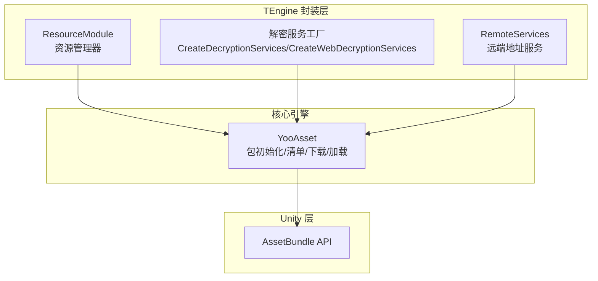
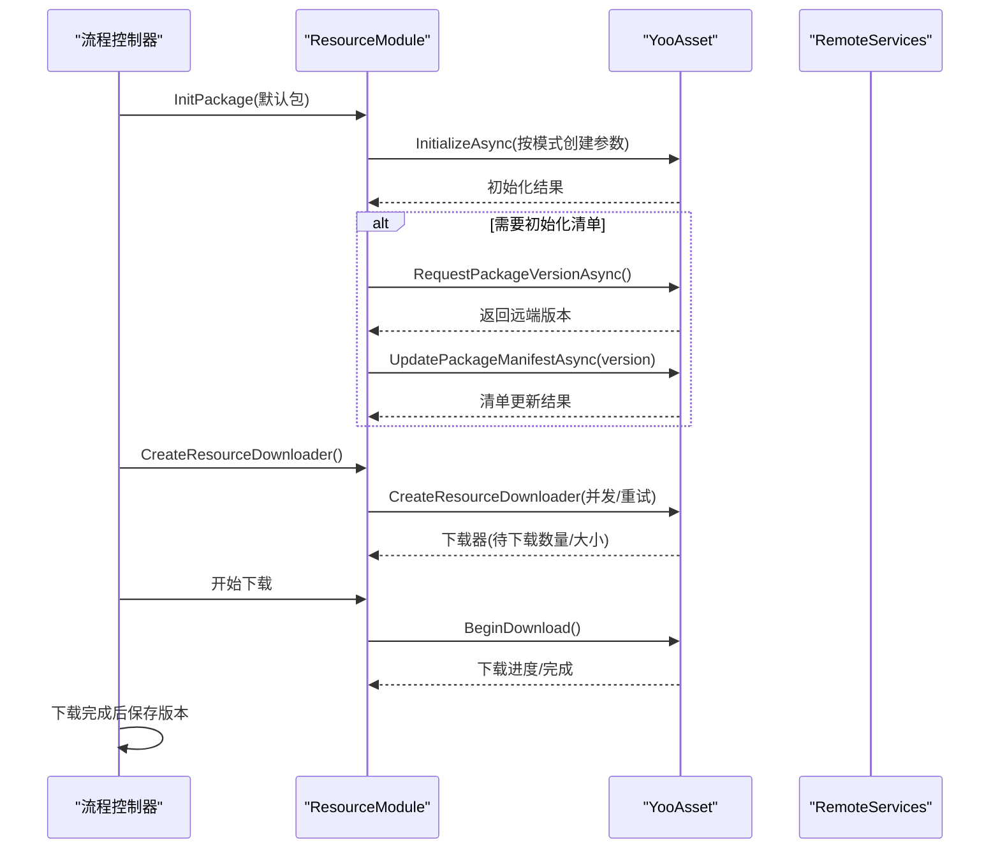
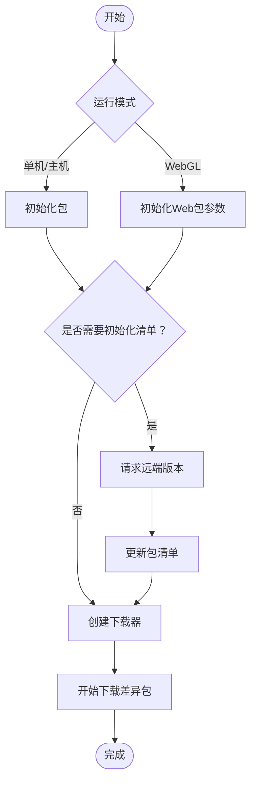
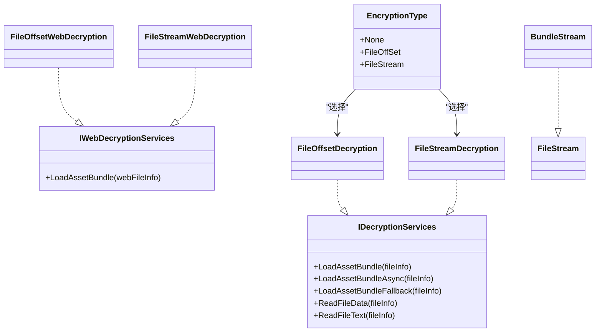
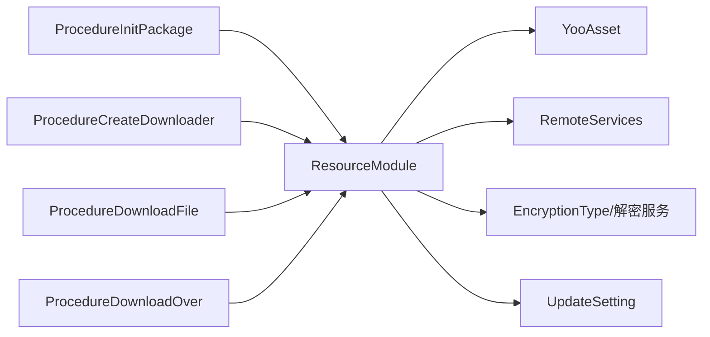

# 热更新资源处理

<cite>
**本文档引用的文件**
- [ResourceModule.cs](file://Assets/TEngine/Runtime/Module/ResourceModule/ResourceModule.cs)
- [IResourceModule.cs](file://Assets/TEngine/Runtime/Module/ResourceModule/IResourceModule.cs)
- [EncryptionType.cs](file://Assets/TEngine/Runtime/Module/ResourceModule/EncryptionType.cs)
- [ResourceModule.Services.cs](file://Assets/TEngine/Runtime/Module/ResourceModule/ResourceModule.Services.cs)
- [UpdateSetting.cs](file://Assets/TEngine/Runtime/Core/UpdateSetting.cs)
- [ProcedureInitPackage.cs](file://Assets/GameScripts/Procedure/ProcedureInitPackage.cs)
- [ProcedureCreateDownloader.cs](file://Assets/GameScripts/Procedure/ProcedureCreateDownloader.cs)
- [ProcedureDownloadFile.cs](file://Assets/GameScripts/Procedure/ProcedureDownloadFile.cs)
- [ProcedureDownloadOver.cs](file://Assets/GameScripts/Procedure/ProcedureDownloadOver.cs)
- [ProcedureInitResources.cs](file://Assets/GameScripts/Procedure/ProcedureInitResources.cs)
- [systemPatterns.md](file://memory-bank/systemPatterns.md)
</cite>

## 目录
1. [简介](#简介)
2. [项目结构](#项目结构)
3. [核心组件](#核心组件)
4. [架构总览](#架构总览)
5. [详细组件分析](#详细组件分析)
6. [依赖关系分析](#依赖关系分析)
7. [性能考量](#性能考量)
8. [故障排查指南](#故障排查指南)
9. [结论](#结论)
10. [附录](#附录)

## 简介
本文件面向TEngine中的热更新资源处理机制，系统性阐述以下主题：
- 资源版本管理与清单更新流程
- 增量更新与资源下载器工作原理
- 加密资源处理与EncryptionType枚举选项
- 资源加载策略（本地优先、远程回退）
- 资源包版本对比与差异计算
- 更新的原子性与回滚思路
- 调试与测试方法（包体校验、完整性检查、回滚）
- 最佳实践与常见问题解决

## 项目结构
TEngine采用“封装层 + 核心引擎（YooAsset） + Unity API”的分层架构，资源模块通过统一入口管理不同运行模式（单机、联机、WebGL），并提供加密解密、下载器、清单更新等能力。

图表来源
- [systemPatterns.md](file://memory-bank/systemPatterns.md)
- [ResourceModule.cs](file://Assets/TEngine/Runtime/Module/ResourceModule/ResourceModule.cs)

章节来源
- [systemPatterns.md](file://memory-bank/systemPatterns.md)
- [ResourceModule.cs](file://Assets/TEngine/Runtime/Module/ResourceModule/ResourceModule.cs)

## 核心组件
- 资源管理器（ResourceModule）：负责包初始化、清单更新、下载器创建、资源加载、内存回收、加密服务选择等。
- 接口（IResourceModule）：定义资源模块对外能力，如初始化、加载、下载、清单更新、版本查询等。
- 加密类型（EncryptionType）：定义三种加密方式（None/FileOffSet/FileStream），驱动解密服务工厂。
- 解密服务（ResourceModule.Services）：提供文件偏移与文件流两种解密方案，分别用于本地/远程与WebGL场景。
- 更新配置（UpdateSetting）：集中管理更新样式、提示策略、资源下载地址、WebGL加载策略等。
- 流程控制器（Procedure*）：串联“初始化包 -> 请求远端版本 -> 更新清单 -> 创建下载器 -> 下载 -> 完成”等步骤。

章节来源
- [IResourceModule.cs](file://Assets/TEngine/Runtime/Module/ResourceModule/IResourceModule.cs)
- [EncryptionType.cs](file://Assets/TEngine/Runtime/Module/ResourceModule/EncryptionType.cs)
- [ResourceModule.Services.cs](file://Assets/TEngine/Runtime/Module/ResourceModule/ResourceModule.Services.cs)
- [UpdateSetting.cs](file://Assets/TEngine/Runtime/Core/UpdateSetting.cs)

## 架构总览
TEngine的热更新资源处理以ResourceModule为核心，围绕YooAsset的包生命周期展开：初始化包（按运行模式选择文件系统参数）→ 请求远端版本 → 更新清单 → 创建下载器 → 下载差异包 → 完成后持久化版本。

图表来源
- [ResourceModule.cs](file://Assets/TEngine/Runtime/Module/ResourceModule/ResourceModule.cs)
- [ProcedureInitPackage.cs](file://Assets/GameScripts/Procedure/ProcedureInitPackage.cs)
- [ProcedureCreateDownloader.cs](file://Assets/GameScripts/Procedure/ProcedureCreateDownloader.cs)
- [ProcedureDownloadFile.cs](file://Assets/GameScripts/Procedure/ProcedureDownloadFile.cs)
- [ProcedureDownloadOver.cs](file://Assets/GameScripts/Procedure/ProcedureDownloadOver.cs)

## 详细组件分析

### 资源版本管理与清单更新
- 包初始化：根据运行模式（编辑器模拟/单机/主机/WebView）选择不同的文件系统参数，支持本地内置、缓存、远程与Web服务器文件系统。
- 远端版本请求：向远端服务器查询最新包版本；若启用“需要初始化清单”，则基于远端版本调用更新清单。
- 版本持久化：下载完成后将远端版本写入本地持久化存储，作为后续“是否需要下载”的依据。

图表来源
- [ResourceModule.cs](file://Assets/TEngine/Runtime/Module/ResourceModule/ResourceModule.cs)
- [ProcedureInitPackage.cs](file://Assets/GameScripts/Procedure/ProcedureInitPackage.cs)
- [ProcedureCreateDownloader.cs](file://Assets/GameScripts/Procedure/ProcedureCreateDownloader.cs)
- [ProcedureDownloadFile.cs](file://Assets/GameScripts/Procedure/ProcedureDownloadFile.cs)
- [ProcedureDownloadOver.cs](file://Assets/GameScripts/Procedure/ProcedureDownloadOver.cs)

章节来源
- [ResourceModule.cs](file://Assets/TEngine/Runtime/Module/ResourceModule/ResourceModule.cs)
- [ProcedureInitPackage.cs](file://Assets/GameScripts/Procedure/ProcedureInitPackage.cs)
- [ProcedureCreateDownloader.cs](file://Assets/GameScripts/Procedure/ProcedureCreateDownloader.cs)
- [ProcedureDownloadFile.cs](file://Assets/GameScripts/Procedure/ProcedureDownloadFile.cs)
- [ProcedureDownloadOver.cs](file://Assets/GameScripts/Procedure/ProcedureDownloadOver.cs)

### 增量更新与下载器
- 下载器创建：基于当前清单与本地缓存，计算出需要下载的资源包数量与总大小。
- 并发与重试：通过“同时下载最大数量”和“失败重试次数”控制下载吞吐与稳定性。
- 进度回调：提供下载进度、错误回调，便于UI展示与异常处理。
- 下载完成：持久化远端版本，进入预加载或清理缓存流程。

章节来源
- [ResourceModule.cs](file://Assets/TEngine/Runtime/Module/ResourceModule/ResourceModule.cs)
- [ProcedureCreateDownloader.cs](file://Assets/GameScripts/Procedure/ProcedureCreateDownloader.cs)
- [ProcedureDownloadFile.cs](file://Assets/GameScripts/Procedure/ProcedureDownloadFile.cs)
- [ProcedureDownloadOver.cs](file://Assets/GameScripts/Procedure/ProcedureDownloadOver.cs)

### 加密资源处理与EncryptionType
- EncryptionType枚举：
  - None：不加密，直接加载。
  - FileOffSet：在文件头添加固定偏移，加载时按偏移读取。
  - FileStream：对文件内容进行逐字节异或加密，加载时通过自定义流解密。
- 解密服务工厂：
  - CreateDecryptionServices：针对本地/缓存文件系统选择对应解密服务。
  - CreateWebDecryptionServices：针对WebGL远程内存加载选择对应解密服务。
- 解密实现要点：
  - 文件偏移：在加载时使用偏移参数，避免读取头部数据。
  - 文件流：通过自定义BundleStream在读取时进行异或解密，确保解密与加载一体化。

图表来源
- [EncryptionType.cs](file://Assets/TEngine/Runtime/Module/ResourceModule/EncryptionType.cs)
- [ResourceModule.Services.cs](file://Assets/TEngine/Runtime/Module/ResourceModule/ResourceModule.Services.cs)

章节来源
- [EncryptionType.cs](file://Assets/TEngine/Runtime/Module/ResourceModule/EncryptionType.cs)
- [ResourceModule.Services.cs](file://Assets/TEngine/Runtime/Module/ResourceModule/ResourceModule.Services.cs)

### 资源加载策略（本地优先、远程回退）
- 运行模式与文件系统：
  - 单机模式：优先使用内置文件系统，必要时回退至缓存/远程。
  - 主机模式：内置+缓存+远程三段式，优先本地，失败回退远端。
  - WebGL模式：可选远程内存加载或本地Web服务器加载，结合Web解密服务。
- 资源定位与有效性检查：提供资源定位地址有效性校验与存在性判断，避免无效加载。
- 加载句柄与缓存：统一通过YooAsset的AssetHandle进行加载，内部维护对象池与缓存键，避免重复加载。

章节来源
- [ResourceModule.cs](file://Assets/TEngine/Runtime/Module/ResourceModule/ResourceModule.cs)

### 资源包版本对比与差异计算
- 版本来源：远端服务器返回的包版本号。
- 差异计算：由YooAsset根据本地清单与远端清单对比，确定需要下载的资源包集合。
- 清单更新：先请求版本，再更新清单，最后创建下载器，确保下载范围准确。

章节来源
- [ResourceModule.cs](file://Assets/TEngine/Runtime/Module/ResourceModule/ResourceModule.cs)
- [ProcedureInitResources.cs](file://Assets/GameScripts/Procedure/ProcedureInitResources.cs)

### 更新的原子性与回滚思路
- 原子性保障建议：
  - 使用“先下载后切换版本”的双阶段策略：下载完成后才写入持久化版本。
  - 对关键资源包采用“下载完成再替换”的策略，避免部分覆盖导致的不一致。
- 回滚机制建议：
  - 记录上一个稳定版本号，下载失败时回退到该版本。
  - 提供“清空缓存文件”接口，用于彻底回滚到内置资源。
- 本仓库未实现自动回滚逻辑，建议在应用层补充版本记录与回滚流程。

章节来源
- [ProcedureDownloadOver.cs](file://Assets/GameScripts/Procedure/ProcedureDownloadOver.cs)
- [ResourceModule.cs](file://Assets/TEngine/Runtime/Module/ResourceModule/ResourceModule.cs)

## 依赖关系分析
- ResourceModule依赖YooAsset的包生命周期API（初始化、请求版本、更新清单、创建下载器、加载资源）。
- RemoteServices提供远端URL拼接，支持主备地址切换。
- UpdateSetting提供运行时配置（下载地址、WebGL加载策略、更新样式等）。
- 流程控制器（Procedure*）编排整个热更新流程。

图表来源
- [ResourceModule.cs](file://Assets/TEngine/Runtime/Module/ResourceModule/ResourceModule.cs)
- [UpdateSetting.cs](file://Assets/TEngine/Runtime/Core/UpdateSetting.cs)
- [ProcedureInitPackage.cs](file://Assets/GameScripts/Procedure/ProcedureInitPackage.cs)
- [ProcedureCreateDownloader.cs](file://Assets/GameScripts/Procedure/ProcedureCreateDownloader.cs)
- [ProcedureDownloadFile.cs](file://Assets/GameScripts/Procedure/ProcedureDownloadFile.cs)
- [ProcedureDownloadOver.cs](file://Assets/GameScripts/Procedure/ProcedureDownloadOver.cs)

章节来源
- [ResourceModule.cs](file://Assets/TEngine/Runtime/Module/ResourceModule/ResourceModule.cs)
- [UpdateSetting.cs](file://Assets/TEngine/Runtime/Core/UpdateSetting.cs)
- [ProcedureInitPackage.cs](file://Assets/GameScripts/Procedure/ProcedureInitPackage.cs)
- [ProcedureCreateDownloader.cs](file://Assets/GameScripts/Procedure/ProcedureCreateDownloader.cs)
- [ProcedureDownloadFile.cs](file://Assets/GameScripts/Procedure/ProcedureDownloadFile.cs)
- [ProcedureDownloadOver.cs](file://Assets/GameScripts/Procedure/ProcedureDownloadOver.cs)

## 性能考量
- 异步与时间片：通过设置异步系统每帧最大时间切片，平衡主线程卡顿与加载效率。
- 并发与重试：合理设置“同时下载最大数量”和“失败重试次数”，兼顾吞吐与稳定性。
- 内存与GC：提供低内存回调与强制卸载接口，结合对象池减少GC压力。
- WebGL优化：WebGL模式下可选择远程内存加载或本地Web服务器加载，结合Web解密服务降低延迟。

章节来源
- [ResourceModule.cs](file://Assets/TEngine/Runtime/Module/ResourceModule/ResourceModule.cs)
- [ResourceModule.Services.cs](file://Assets/TEngine/Runtime/Module/ResourceModule/ResourceModule.Services.cs)

## 故障排查指南
- 初始化失败：
  - 若提示清单版本不存在，检查StreamingAssets中对应包的清单是否存在。
  - 参考流程控制器中的错误弹窗与重试逻辑。
- 下载失败：
  - 检查网络连通性与远端地址可用性。
  - 查看下载器错误回调，确认具体文件与错误码。
- 加载失败：
  - 使用HasAsset/CheckLocationValid进行前置校验。
  - 检查资源定位地址是否正确，包名是否匹配。
- 加密相关：
  - 确认EncryptionType与解密服务匹配（本地/远程/WebGL）。
  - 文件偏移/文件流的解密参数需与打包时一致。

章节来源
- [ProcedureInitPackage.cs](file://Assets/GameScripts/Procedure/ProcedureInitPackage.cs)
- [ProcedureDownloadFile.cs](file://Assets/GameScripts/Procedure/ProcedureDownloadFile.cs)
- [ResourceModule.cs](file://Assets/TEngine/Runtime/Module/ResourceModule/ResourceModule.cs)
- [ResourceModule.Services.cs](file://Assets/TEngine/Runtime/Module/ResourceModule/ResourceModule.Services.cs)

## 结论
TEngine的热更新资源处理以YooAsset为核心，通过ResourceModule统一封装了包初始化、清单更新、下载器、加密解密与资源加载等关键能力。结合流程控制器，实现了从版本请求到下载完成的完整闭环。建议在应用层补充版本回滚与完整性校验机制，进一步提升稳定性与可运维性。

## 附录

### 调试与测试方法
- 资源包验证：在下载完成后，记录并比对远端版本号与本地持久化版本号，确保一致性。
- 完整性检查：可扩展下载器回调，在下载完成后对关键包进行哈希校验（建议在应用层实现）。
- 回滚机制：提供“清空缓存文件”与“回退到上一稳定版本”的操作入口（建议在应用层实现）。
- 日志与监控：利用ResourceModule的日志输出与流程控制器的状态提示，快速定位问题。

章节来源
- [ProcedureDownloadOver.cs](file://Assets/GameScripts/Procedure/ProcedureDownloadOver.cs)
- [ResourceModule.cs](file://Assets/TEngine/Runtime/Module/ResourceModule/ResourceModule.cs)