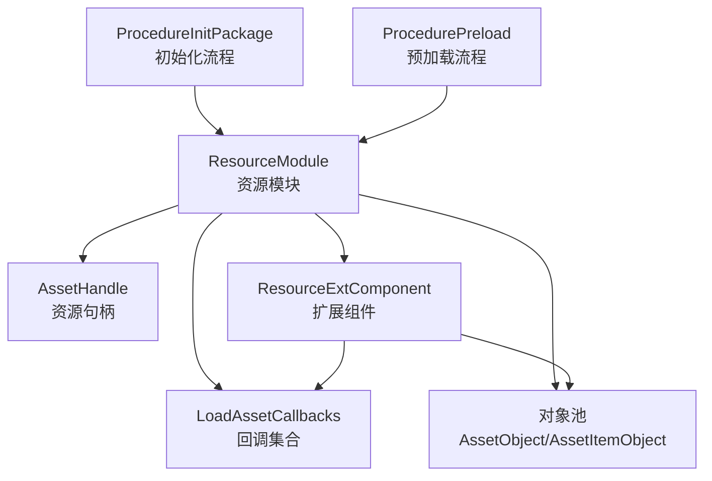
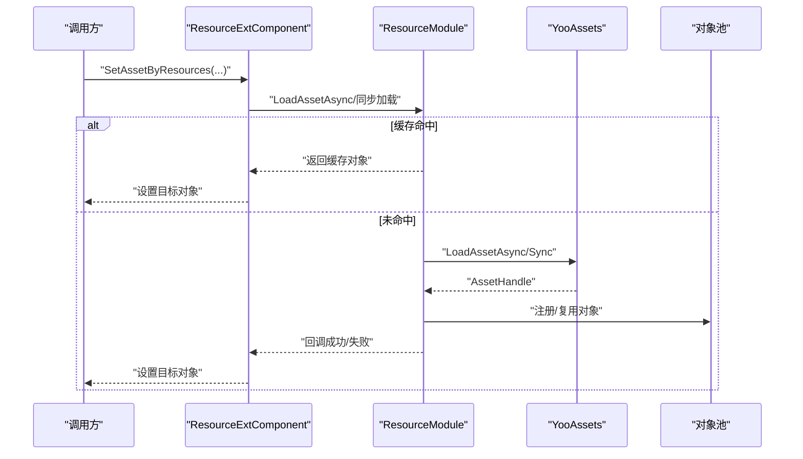
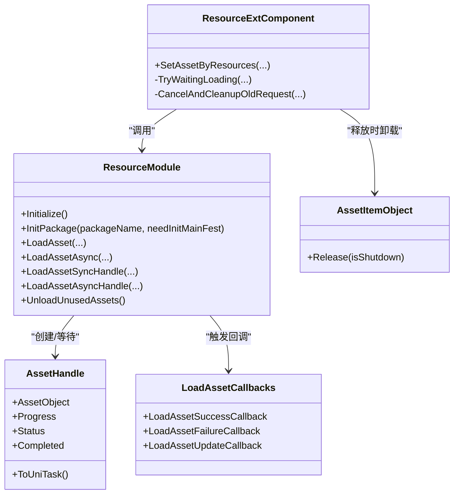
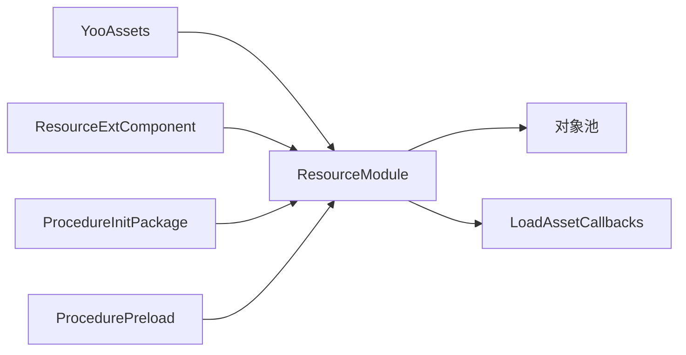

# 资源加载机制

<cite>
**本文档引用的文件**
- [ResourceModule.cs](file://Assets/TEngine/Runtime/Module/ResourceModule/ResourceModule.cs)
- [LoadAssetCallbacks.cs](file://Assets/TEngine/Runtime/Module/ResourceModule/Callback/LoadAssetCallbacks.cs)
- [LoadAssetSuccessCallback.cs](file://Assets/TEngine/Runtime/Module/ResourceModule/Callback/LoadAssetSuccessCallback.cs)
- [LoadAssetFailureCallback.cs](file://Assets/TEngine/Runtime/Module/ResourceModule/Callback/LoadAssetFailureCallback.cs)
- [LoadAssetUpdateCallback.cs](file://Assets/TEngine/Runtime/Module/ResourceModule/Callback/LoadAssetUpdateCallback.cs)
- [LoadResourceStatus.cs](file://Assets/TEngine/Runtime/Module/ResourceModule/Callback/LoadResourceStatus.cs)
- [ResourceExtComponent.Resource.cs](file://Assets/TEngine/Runtime/Module/ResourceModule/Extension/ResourceExtComponent.Resource.cs)
- [AssetItemObject.cs](file://Assets/TEngine/Runtime/Module/ResourceModule/Extension/AssetItemObject.cs)
- [LoadAssetObject.cs](file://Assets/TEngine/Runtime/Module/ResourceModule/Extension/LoadAssetObject.cs)
- [ProcedureInitPackage.cs](file://Assets/GameScripts/Procedure/ProcedureInitPackage.cs)
- [ProcedurePreload.cs](file://Assets/GameScripts/Procedure/ProcedurePreload.cs)
</cite>

## 目录
1. [简介](#简介)
2. [项目结构](#项目结构)
3. [核心组件](#核心组件)
4. [架构总览](#架构总览)
5. [详细组件分析](#详细组件分析)
6. [依赖关系分析](#依赖关系分析)
7. [性能考虑](#性能考虑)
8. [故障排查指南](#故障排查指南)
9. [结论](#结论)
10. [附录](#附录)

## 简介
本文件系统性梳理TEngine中的资源加载机制，覆盖同步与异步两种模式、LoadAssetCallbacks回调体系（成功/失败/更新）、优先级、超时与重试、AssetHandle资源句柄与生命周期、以及性能优化策略与最佳实践。内容以仓库现有实现为依据，配合图示帮助读者快速理解与落地。

## 项目结构
TEngine的资源加载主要集中在“资源模块”下，围绕ResourceModule为核心，结合扩展组件与回调系统协同工作；同时在流程层有初始化与预加载流程参与。

图表来源
- [ResourceModule.cs](file://Assets/TEngine/Runtime/Module/ResourceModule/ResourceModule.cs)
- [LoadAssetCallbacks.cs](file://Assets/TEngine/Runtime/Module/ResourceModule/Callback/LoadAssetCallbacks.cs)
- [ResourceExtComponent.Resource.cs](file://Assets/TEngine/Runtime/Module/ResourceModule/Extension/ResourceExtComponent.Resource.cs)
- [ProcedureInitPackage.cs](file://Assets/GameScripts/Procedure/ProcedureInitPackage.cs)
- [ProcedurePreload.cs](file://Assets/GameScripts/Procedure/ProcedurePreload.cs)

章节来源
- [ResourceModule.cs:119-138](file://Assets/TEngine/Runtime/Module/ResourceModule/ResourceModule.cs#L119-L138)
- [ResourceExtComponent.Resource.cs:35-39](file://Assets/TEngine/Runtime/Module/ResourceModule/Extension/ResourceExtComponent.Resource.cs#L35-L39)

## 核心组件
- ResourceModule：资源模块主控制器，负责包初始化、资源查询、同步/异步加载、句柄获取、缓存与卸载、下载器配置、低内存回收等。
- LoadAssetCallbacks：封装成功/失败/更新三类回调，作为异步加载的统一入口。
- AssetHandle：YooAsset提供的资源加载句柄，承载进度、状态与最终资源对象。
- ResourceExtComponent：面向Unity对象的资源设置扩展，内置去重、等待、取消与缓存命中逻辑。
- 对象池与AssetItemObject：资源对象缓存与生命周期管理，支持自动卸载。

章节来源
- [ResourceModule.cs:624-1191](file://Assets/TEngine/Runtime/Module/ResourceModule/ResourceModule.cs#L624-L1191)
- [LoadAssetCallbacks.cs:6-91](file://Assets/TEngine/Runtime/Module/ResourceModule/Callback/LoadAssetCallbacks.cs#L6-L91)
- [AssetItemObject.cs:3-20](file://Assets/TEngine/Runtime/Module/ResourceModule/Extension/AssetItemObject.cs#L3-L20)
- [ResourceExtComponent.Resource.cs:87-138](file://Assets/TEngine/Runtime/Module/ResourceModule/Extension/ResourceExtComponent.Resource.cs#L87-L138)

## 架构总览
下图展示从调用到回调的完整链路，涵盖同步/异步、缓存命中、句柄进度、失败与成功回调、以及对象池注册。

图表来源
- [ResourceExtComponent.Resource.cs:87-138](file://Assets/TEngine/Runtime/Module/ResourceModule/Extension/ResourceExtComponent.Resource.cs#L87-L138)
- [ResourceModule.cs:762-821](file://Assets/TEngine/Runtime/Module/ResourceModule/ResourceModule.cs#L762-L821)
- [ResourceModule.cs:823-920](file://Assets/TEngine/Runtime/Module/ResourceModule/ResourceModule.cs#L823-L920)
- [ResourceModule.cs:933-1127](file://Assets/TEngine/Runtime/Module/ResourceModule/ResourceModule.cs#L933-L1127)

## 详细组件分析

### 同步加载与异步加载对比
- 同步加载
  - 使用同步句柄接口直接阻塞等待资源就绪，适合编辑器或极少数确定不会卡顿的场景。
  - 关键路径：ResourceModule.LoadAsset(...) -> GetHandleSync(...) -> 返回资源对象。
- 异步加载
  - 使用异步句柄与UniTask，支持进度回调、取消、超时等待与对象池注册。
  - 关键路径：ResourceModule.LoadAssetAsync(...) -> GetHandleAsync(...) -> ToUniTask() -> 注册对象 -> 回调成功。

章节来源
- [ResourceModule.cs:692-760](file://Assets/TEngine/Runtime/Module/ResourceModule/ResourceModule.cs#L692-L760)
- [ResourceModule.cs:762-821](file://Assets/TEngine/Runtime/Module/ResourceModule/ResourceModule.cs#L762-L821)
- [ResourceModule.cs:823-920](file://Assets/TEngine/Runtime/Module/ResourceModule/ResourceModule.cs#L823-L920)

### LoadAssetCallbacks回调系统
- 成功回调：LoadAssetSuccessCallback，参数含资源名、资源对象、耗时、用户数据。
- 失败回调：LoadAssetFailureCallback，参数含资源名、状态码、错误信息、用户数据。
- 更新回调：LoadAssetUpdateCallback，参数含资源名、进度、用户数据。
- 回调集合：LoadAssetCallbacks构造支持仅成功、成功+失败、成功+更新、全量组合。

章节来源
- [LoadAssetCallbacks.cs:6-91](file://Assets/TEngine/Runtime/Module/ResourceModule/Callback/LoadAssetCallbacks.cs#L6-L91)
- [LoadAssetSuccessCallback.cs:6-10](file://Assets/TEngine/Runtime/Module/ResourceModule/Callback/LoadAssetSuccessCallback.cs#L6-L10)
- [LoadAssetFailureCallback.cs:6-10](file://Assets/TEngine/Runtime/Module/ResourceModule/Callback/LoadAssetFailureCallback.cs#L6-L10)
- [LoadAssetUpdateCallback.cs:6-9](file://Assets/TEngine/Runtime/Module/ResourceModule/Callback/LoadAssetUpdateCallback.cs#L6-L9)

### 加载优先级、超时与重试
- 优先级
  - 异步加载接口支持priority参数，便于调度器排序与并发控制。
- 超时
  - TryWaitingLoading在编辑器下通过TimeoutController与CancellationToken实现等待超时，避免死等。
- 重试
  - 初始化阶段失败时，流程层提供重试入口与提示，引导用户重试或退出。

章节来源
- [ResourceModule.cs:933-1127](file://Assets/TEngine/Runtime/Module/ResourceModule/ResourceModule.cs#L933-L1127)
- [ResourceModule.cs:1197-1219](file://Assets/TEngine/Runtime/Module/ResourceModule/ResourceModule.cs#L1197-L1219)
- [ProcedureInitPackage.cs:69-120](file://Assets/GameScripts/Procedure/ProcedureInitPackage.cs#L69-L120)

### AssetHandle资源句柄与生命周期
- 句柄作用
  - 承载资源加载进度与状态，支持Completed事件、进度轮询与UniTask转换。
- 生命周期
  - 加载成功后通过对象池注册，随引用计数与模块策略释放；AssetItemObject在释放时触发卸载。
- 与回调联动
  - 异步加载中，若存在更新回调则持续轮询进度；完成后根据结果触发成功或失败回调。

章节来源
- [ResourceModule.cs:626-672](file://Assets/TEngine/Runtime/Module/ResourceModule/ResourceModule.cs#L626-L672)
- [ResourceModule.cs:1129-1145](file://Assets/TEngine/Runtime/Module/ResourceModule/ResourceModule.cs#L1129-L1145)
- [AssetItemObject.cs:12-19](file://Assets/TEngine/Runtime/Module/ResourceModule/Extension/AssetItemObject.cs#L12-L19)

### 预加载与批量加载策略
- 预加载
  - 通过标签“PRELOAD”批量拉取资源，统一设置优先级并异步加载，失败记录但不影响后续流程。
- 批量加载
  - 扩展组件支持按目标对象去重与等待，避免重复加载同一资源；支持取消与替换。

章节来源
- [ProcedurePreload.cs:126-162](file://Assets/GameScripts/Procedure/ProcedurePreload.cs#L126-L162)
- [ResourceExtComponent.Resource.cs:87-138](file://Assets/TEngine/Runtime/Module/ResourceModule/Extension/ResourceExtComponent.Resource.cs#L87-L138)

### 错误处理与状态码
- 状态码枚举LoadResourceStatus覆盖成功、不存在、未就绪、依赖错误、类型错误、资源错误等。
- 失败回调统一由ResourceModule在不同分支触发，确保上层可感知具体原因。

章节来源
- [LoadResourceStatus.cs:6-37](file://Assets/TEngine/Runtime/Module/ResourceModule/Callback/LoadResourceStatus.cs#L6-L37)
- [ResourceModule.cs:949-952](file://Assets/TEngine/Runtime/Module/ResourceModule/ResourceModule.cs#L949-L952)
- [ResourceModule.cs:980-984](file://Assets/TEngine/Runtime/Module/ResourceModule/ResourceModule.cs#L980-L984)
- [ResourceModule.cs:1003-1007](file://Assets/TEngine/Runtime/Module/ResourceModule/ResourceModule.cs#L1003-L1007)
- [ResourceModule.cs:1051-1054](file://Assets/TEngine/Runtime/Module/ResourceModule/ResourceModule.cs#L1051-L1054)
- [ResourceModule.cs:1082-1086](file://Assets/TEngine/Runtime/Module/ResourceModule/ResourceModule.cs#L1082-L1086)
- [ResourceModule.cs:1105-1109](file://Assets/TEngine/Runtime/Module/ResourceModule/ResourceModule.cs#L1105-L1109)

### 类关系与职责

图表来源
- [ResourceModule.cs:624-1191](file://Assets/TEngine/Runtime/Module/ResourceModule/ResourceModule.cs#L624-L1191)
- [LoadAssetCallbacks.cs:6-91](file://Assets/TEngine/Runtime/Module/ResourceModule/Callback/LoadAssetCallbacks.cs#L6-L91)
- [ResourceExtComponent.Resource.cs:87-138](file://Assets/TEngine/Runtime/Module/ResourceModule/Extension/ResourceExtComponent.Resource.cs#L87-L138)
- [AssetItemObject.cs:12-19](file://Assets/TEngine/Runtime/Module/ResourceModule/Extension/AssetItemObject.cs#L12-L19)

## 依赖关系分析
- ResourceModule依赖YooAssets进行实际加载与句柄管理，同时维护本地资产信息表与对象池。
- ResourceExtComponent作为桥接层，面向Unity对象设置，内部协调去重、等待、取消与缓存。
- 流程层（ProcedureInitPackage/ProcedurePreload）驱动资源模块初始化与预加载。

图表来源
- [ResourceModule.cs:119-138](file://Assets/TEngine/Runtime/Module/ResourceModule/ResourceModule.cs#L119-L138)
- [ResourceExtComponent.Resource.cs:35-39](file://Assets/TEngine/Runtime/Module/ResourceModule/Extension/ResourceExtComponent.Resource.cs#L35-L39)
- [ProcedureInitPackage.cs:69-120](file://Assets/GameScripts/Procedure/ProcedureInitPackage.cs#L69-L120)
- [ProcedurePreload.cs:126-162](file://Assets/GameScripts/Procedure/ProcedurePreload.cs#L126-L162)

## 性能考虑
- 批量预加载
  - 使用标签“PRELOAD”与高优先级批量加载常用资源，降低首帧延迟。
- 去重与等待
  - 扩展组件对同一目标对象的重复加载进行去重与等待，避免重复IO。
- 进度与取消
  - 异步加载支持进度回调与外部取消令牌，便于UI反馈与中断长任务。
- 低内存回收
  - 提供强制与非强制卸载接口，结合模块策略定期释放无引用资源。
- 缓存命中
  - 对象池与缓存键（含包名）提升重复访问性能。

章节来源
- [ProcedurePreload.cs:126-162](file://Assets/GameScripts/Procedure/ProcedurePreload.cs#L126-L162)
- [ResourceExtComponent.Resource.cs:107-138](file://Assets/TEngine/Runtime/Module/ResourceModule/Extension/ResourceExtComponent.Resource.cs#L107-L138)
- [ResourceModule.cs:412-447](file://Assets/TEngine/Runtime/Module/ResourceModule/ResourceModule.cs#L412-L447)

## 故障排查指南
- 初始化失败
  - 若清单版本请求失败或更新失败，流程层弹窗提示并提供重试按钮；可检查清单文件是否存在。
- 加载超时
  - 编辑器下等待其他加载完成时可能发生超时，日志会记录原因；可适当提高等待阈值或减少并发。
- 资源不存在/未就绪
  - 根据状态码区分“不存在”“未就绪”，优先检查资源定位地址与包内清单；必要时启用预加载。
- 失败回调
  - 在ResourceModule中统一触发失败回调，便于上层统计与重试策略。

章节来源
- [ProcedureInitPackage.cs:69-120](file://Assets/GameScripts/Procedure/ProcedureInitPackage.cs#L69-L120)
- [ResourceModule.cs:1197-1219](file://Assets/TEngine/Runtime/Module/ResourceModule/ResourceModule.cs#L1197-L1219)
- [ResourceModule.cs:949-952](file://Assets/TEngine/Runtime/Module/ResourceModule/ResourceModule.cs#L949-L952)
- [ResourceModule.cs:1003-1007](file://Assets/TEngine/Runtime/Module/ResourceModule/ResourceModule.cs#L1003-L1007)
- [ResourceModule.cs:1051-1054](file://Assets/TEngine/Runtime/Module/ResourceModule/ResourceModule.cs#L1051-L1054)
- [ResourceModule.cs:1105-1109](file://Assets/TEngine/Runtime/Module/ResourceModule/ResourceModule.cs#L1105-L1109)

## 结论
TEngine的资源加载以ResourceModule为中心，结合YooAsset句柄与回调系统，形成清晰的同步/异步双通道、完善的错误与进度反馈、以及可扩展的预加载与去重策略。通过对象池与低内存回收机制，整体具备良好的性能与稳定性。建议在实际工程中充分利用优先级、预加载与失败回调，构建健壮的资源加载管线。

## 附录

### API使用要点与最佳实践
- 同步加载
  - 适用于确定性场景；注意避免主线程阻塞。
- 异步加载
  - 推荐使用LoadAssetAsync与LoadAssetAsyncHandle，结合LoadAssetCallbacks获取进度与结果。
- 回调设计
  - 成功回调用于设置UI或继续业务流程；失败回调用于记录与重试；更新回调用于进度条。
- 句柄与生命周期
  - 通过对象池注册的资源会在合适时机自动释放；AssetItemObject释放时会触发卸载。
- 预加载与批量
  - 使用标签“PRELOAD”与高优先级批量加载；对同一目标对象的重复加载会被去重等待。

章节来源
- [ResourceModule.cs:692-760](file://Assets/TEngine/Runtime/Module/ResourceModule/ResourceModule.cs#L692-L760)
- [ResourceModule.cs:762-920](file://Assets/TEngine/Runtime/Module/ResourceModule/ResourceModule.cs#L762-L920)
- [ResourceModule.cs:933-1127](file://Assets/TEngine/Runtime/Module/ResourceModule/ResourceModule.cs#L933-L1127)
- [AssetItemObject.cs:12-19](file://Assets/TEngine/Runtime/Module/ResourceModule/Extension/AssetItemObject.cs#L12-L19)
- [ProcedurePreload.cs:126-162](file://Assets/GameScripts/Procedure/ProcedurePreload.cs#L126-L162)