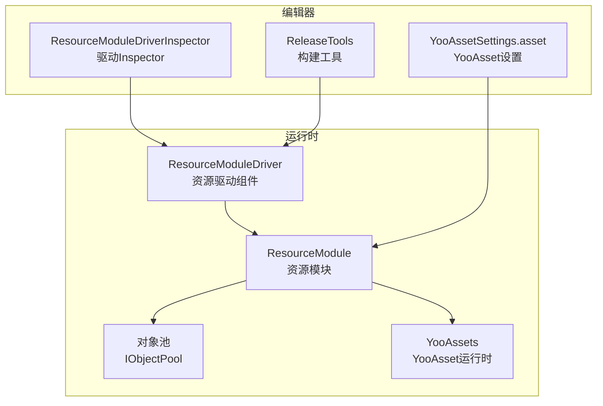
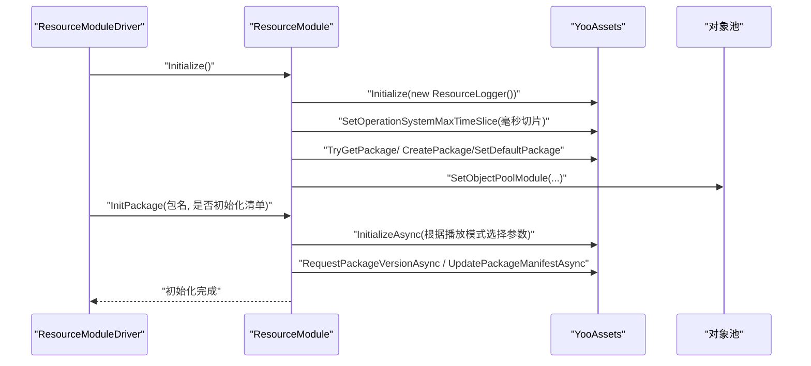
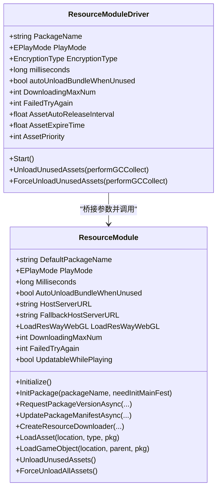
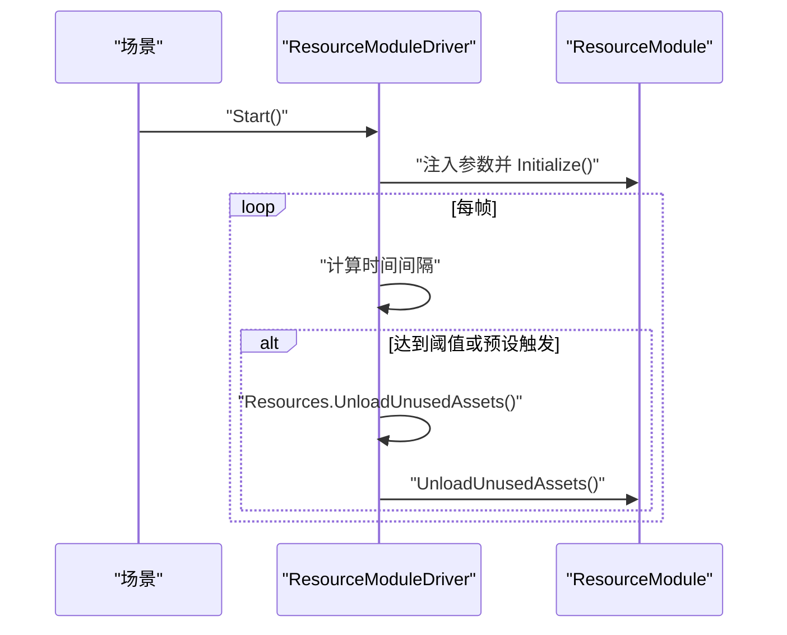
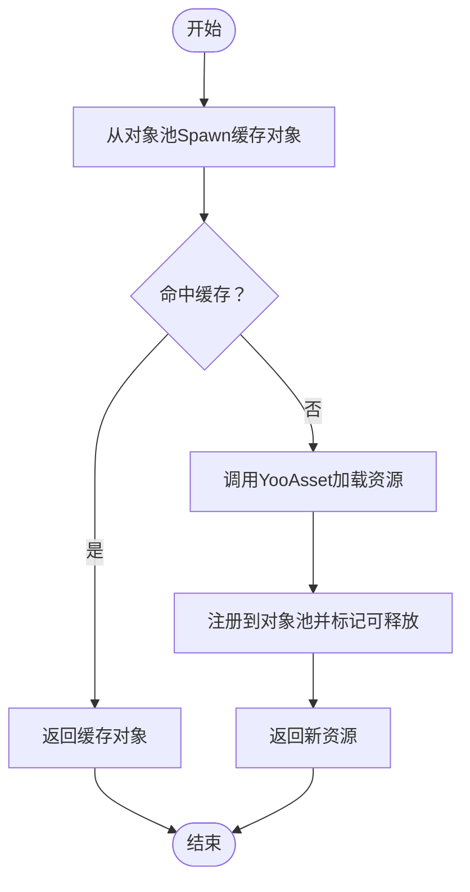
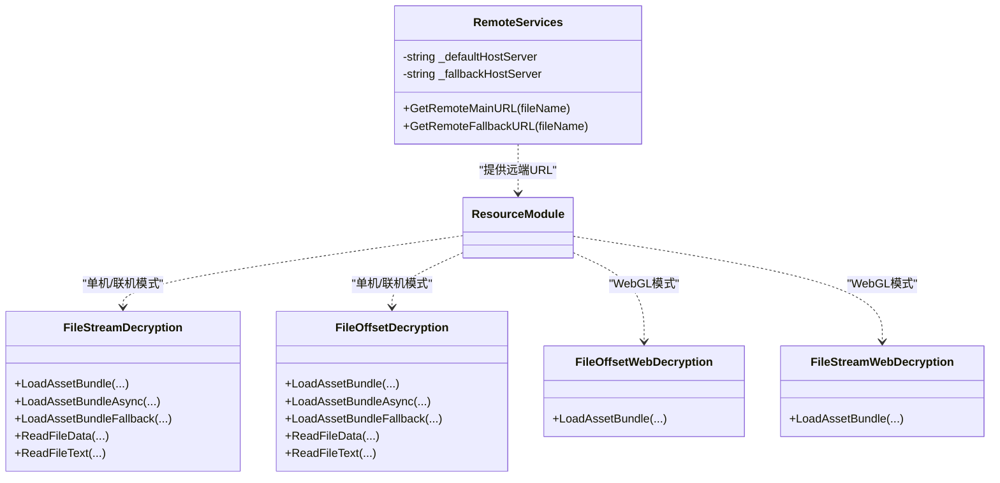
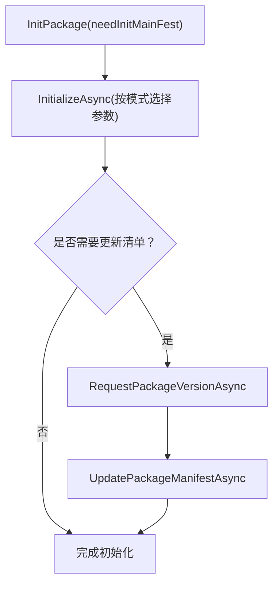
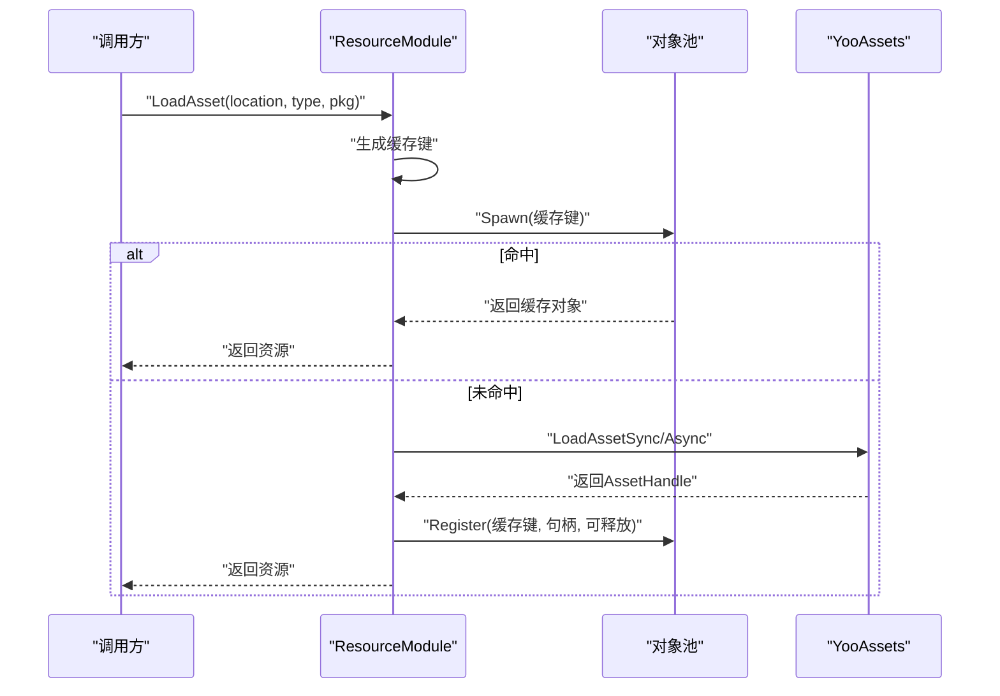
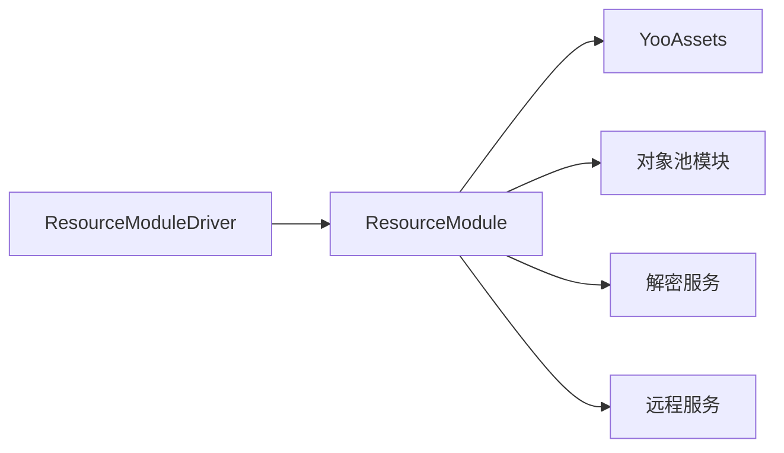

# 资源管理

<cite>
**本文档引用的文件**
- [ResourceModule.cs](file://Assets/TEngine/Runtime/Module/ResourceModule/ResourceModule.cs)
- [ResourceModuleDriver.cs](file://Assets/TEngine/Runtime/Module/ResourceModule/ResourceModuleDriver.cs)
- [ResourceModule.Pool.cs](file://Assets/TEngine/Runtime/Module/ResourceModule/ResourceModule.Pool.cs)
- [ResourceModule.Services.cs](file://Assets/TEngine/Runtime/Module/ResourceModule/ResourceModule.Services.cs)
- [YooAssetSettings.asset](file://Assets/TEngine/Settings/Resources/YooAssetSettings.asset)
- [GameEntry.cs](file://Assets/GameScripts/GameEntry.cs)
- [GameModule.cs](file://Assets/GameScripts/HotFix/GameLogic/GameModule.cs)
- [ResourceModuleDriverInspector.cs](file://Assets/TEngine/Editor/Inspector/ResourceModuleDriverInspector.cs)
- [ResourceManagerInspector.cs](file://Assets/TEngine/Editor/Localization/Inspectors/ResourceManagerInspector.cs)
- [ReleaseTools.cs](file://Assets/TEngine/Editor/ReleaseTools/ReleaseTools.cs)
</cite>

## 目录
1. [简介](#简介)
2. [项目结构](#项目结构)
3. [核心组件](#核心组件)
4. [架构总览](#架构总览)
5. [详细组件分析](#详细组件分析)
6. [依赖关系分析](#依赖关系分析)
7. [性能考量](#性能考量)
8. [故障排查指南](#故障排查指南)
9. [结论](#结论)
10. [附录](#附录)

## 简介
本文件面向TEngine资源管理系统，聚焦于YooAsset集成方案与资源包管理机制，系统性阐述资源打包、分包策略、版本管理、异步/同步加载、资源缓存与自动释放、引用计数与内存优化策略（LRU/ARC思想）、热更新流程与最佳实践，并提供API使用示例与常见问题解决方案。

## 项目结构
TEngine将资源管理能力封装在模块化体系下，核心位于TEngine/Runtime/Module/ResourceModule目录，配合YooAsset运行时实现多平台资源加载与热更新。关键文件职责如下：
- ResourceModule.cs：资源模块主实现，负责包初始化、版本管理、下载器、缓存与回收、加载接口等。
- ResourceModuleDriver.cs：资源驱动组件，挂载于场景，承载运行参数（播放模式、下载并发、加密类型等），桥接模块与设置。
- ResourceModule.Pool.cs：资源对象池配置与释放接口。
- ResourceModule.Services.cs：远程服务与多种解密服务实现（文件流/偏移加密、Web端解密）。
- YooAssetSettings.asset：YooAsset默认包名等全局设置。
- GameEntry.cs / GameModule.cs：应用入口与模块访问入口，展示如何获取IResourceModule。
- Editor Inspector与ReleaseTools：编辑器可视化配置与构建时参数注入。

**图表来源**
- [ResourceModule.cs:119-138](file://Assets/TEngine/Runtime/Module/ResourceModule/ResourceModule.cs#L119-L138)
- [ResourceModuleDriver.cs:236-271](file://Assets/TEngine/Runtime/Module/ResourceModule/ResourceModuleDriver.cs#L236-L271)
- [ResourceModule.Pool.cs:59-66](file://Assets/TEngine/Runtime/Module/ResourceModule/ResourceModule.Pool.cs#L59-L66)
- [YooAssetSettings.asset:15-16](file://Assets/TEngine/Settings/Resources/YooAssetSettings.asset#L15-L16)
- [ResourceModuleDriverInspector.cs:8-127](file://Assets/TEngine/Editor/Inspector/ResourceModuleDriverInspector.cs#L8-L127)
- [ReleaseTools.cs:225-280](file://Assets/TEngine/Editor/ReleaseTools/ReleaseTools.cs#L225-L280)

**章节来源**
- [ResourceModule.cs:119-138](file://Assets/TEngine/Runtime/Module/ResourceModule/ResourceModule.cs#L119-L138)
- [ResourceModuleDriver.cs:236-271](file://Assets/TEngine/Runtime/Module/ResourceModule/ResourceModuleDriver.cs#L236-L271)
- [YooAssetSettings.asset:15-16](file://Assets/TEngine/Settings/Resources/YooAssetSettings.asset#L15-L16)

## 核心组件
- 资源模块（ResourceModule）
  - 包初始化与多模式支持：编辑器模拟、单机、联机、WebGL。
  - 版本管理：请求包版本、更新清单、获取当前版本。
  - 下载器：创建下载器、并发控制、失败重试。
  - 缓存与回收：对象池缓存、按需卸载、强制回收。
  - 加载接口：同步/异步加载资源、GameObject实例化、缓存键生成。
- 资源驱动（ResourceModuleDriver）
  - 参数桥接：播放模式、加密类型、下载并发、失败重试、WebGL加载方式。
  - 生命周期：启动时初始化模块，定时触发资源回收。
- 对象池（ResourceModule.Pool）
  - 容量、过期时间、自动释放间隔、优先级配置；提供资源卸载接口。
- 解密与远程服务（ResourceModule.Services）
  - 文件流/偏移加密与解密（含Web端）。
  - 远端URL拼装（主/备用服务器）。

**章节来源**
- [ResourceModule.cs:140-261](file://Assets/TEngine/Runtime/Module/ResourceModule/ResourceModule.cs#L140-L261)
- [ResourceModule.cs:342-381](file://Assets/TEngine/Runtime/Module/ResourceModule/ResourceModule.cs#L342-L381)
- [ResourceModule.cs:409-447](file://Assets/TEngine/Runtime/Module/ResourceModule/ResourceModule.cs#L409-L447)
- [ResourceModule.cs:692-760](file://Assets/TEngine/Runtime/Module/ResourceModule/ResourceModule.cs#L692-L760)
- [ResourceModule.cs:769-820](file://Assets/TEngine/Runtime/Module/ResourceModule/ResourceModule.cs#L769-L820)
- [ResourceModuleDriver.cs:236-271](file://Assets/TEngine/Runtime/Module/ResourceModule/ResourceModuleDriver.cs#L236-L271)
- [ResourceModule.Pool.cs:59-66](file://Assets/TEngine/Runtime/Module/ResourceModule/ResourceModule.Pool.cs#L59-L66)
- [ResourceModule.Services.cs:12-32](file://Assets/TEngine/Runtime/Module/ResourceModule/ResourceModule.Services.cs#L12-L32)
- [ResourceModule.Services.cs:37-117](file://Assets/TEngine/Runtime/Module/ResourceModule/ResourceModule.Services.cs#L37-L117)
- [ResourceModule.Services.cs:141-197](file://Assets/TEngine/Runtime/Module/ResourceModule/ResourceModule.Services.cs#L141-L197)
- [ResourceModule.Services.cs:204-241](file://Assets/TEngine/Runtime/Module/ResourceModule/ResourceModule.Services.cs#L204-L241)

## 架构总览
下图展示了从驱动组件到资源模块、YooAsset以及对象池的整体交互关系，体现初始化、版本管理、下载与加载的主干流程。

**图表来源**
- [ResourceModuleDriver.cs:236-271](file://Assets/TEngine/Runtime/Module/ResourceModule/ResourceModuleDriver.cs#L236-L271)
- [ResourceModule.cs:119-138](file://Assets/TEngine/Runtime/Module/ResourceModule/ResourceModule.cs#L119-L138)
- [ResourceModule.cs:140-261](file://Assets/TEngine/Runtime/Module/ResourceModule/ResourceModule.cs#L140-L261)

## 详细组件分析

### 组件A：ResourceModule（资源模块）
- 职责
  - 多模式包初始化（编辑器模拟、单机、联机、WebGL）。
  - 版本管理与清单更新。
  - 下载器创建与并发控制。
  - 资源缓存与对象池集成。
  - 同步/异步加载资源与GameObject实例化。
  - 内存回收与低内存保护。
- 关键点
  - 初始化阶段设置YooAsset运行参数与默认包。
  - 根据播放模式构造不同FileSystemParameters与DecryptionServices。
  - 提供缓存键生成规则，避免跨包冲突。
  - 通过对象池实现资源复用与自动释放。

**图表来源**
- [ResourceModule.cs:17-138](file://Assets/TEngine/Runtime/Module/ResourceModule/ResourceModule.cs#L17-L138)
- [ResourceModuleDriver.cs:12-271](file://Assets/TEngine/Runtime/Module/ResourceModule/ResourceModuleDriver.cs#L12-L271)

**章节来源**
- [ResourceModule.cs:17-138](file://Assets/TEngine/Runtime/Module/ResourceModule/ResourceModule.cs#L17-L138)
- [ResourceModule.cs:140-261](file://Assets/TEngine/Runtime/Module/ResourceModule/ResourceModule.cs#L140-L261)
- [ResourceModule.cs:342-381](file://Assets/TEngine/Runtime/Module/ResourceModule/ResourceModule.cs#L342-L381)
- [ResourceModule.cs:409-447](file://Assets/TEngine/Runtime/Module/ResourceModule/ResourceModule.cs#L409-L447)
- [ResourceModule.cs:692-760](file://Assets/TEngine/Runtime/Module/ResourceModule/ResourceModule.cs#L692-L760)
- [ResourceModule.cs:769-820](file://Assets/TEngine/Runtime/Module/ResourceModule/ResourceModule.cs#L769-L820)

### 组件B：ResourceModuleDriver（资源驱动）
- 职责
  - 在场景中挂载，承载运行参数（播放模式、加密类型、下载并发、失败重试、WebGL加载方式）。
  - 启动时将参数注入资源模块并初始化。
  - 定时触发资源回收，支持预设与强制两种模式。
- 关键点
  - 编辑器模式下优先读取EditorPrefs中的播放模式。
  - 将下载路径、回退路径、WebGL加载方式等注入模块。
  - Update循环中按间隔触发Resources.UnloadUnusedAssets与模块回收。

**图表来源**
- [ResourceModuleDriver.cs:236-271](file://Assets/TEngine/Runtime/Module/ResourceModule/ResourceModuleDriver.cs#L236-L271)
- [ResourceModuleDriver.cs:301-330](file://Assets/TEngine/Runtime/Module/ResourceModule/ResourceModuleDriver.cs#L301-L330)

**章节来源**
- [ResourceModuleDriver.cs:236-271](file://Assets/TEngine/Runtime/Module/ResourceModule/ResourceModuleDriver.cs#L236-L271)
- [ResourceModuleDriver.cs:301-330](file://Assets/TEngine/Runtime/Module/ResourceModule/ResourceModuleDriver.cs#L301-L330)

### 组件C：对象池与缓存（ResourceModule.Pool）
- 职责
  - 创建多实例对象池，管理资源对象生命周期。
  - 提供容量、过期时间、自动释放间隔、优先级配置。
  - 支持按对象卸载资源，触发对象池回收。
- 关键点
  - 通过IObjectPoolModule创建池，命名“Asset Pool”。
  - 与资源加载流程结合，命中缓存直接返回，未命中则注册新对象。

**图表来源**
- [ResourceModule.Pool.cs:5-66](file://Assets/TEngine/Runtime/Module/ResourceModule/ResourceModule.Pool.cs#L5-L66)
- [ResourceModule.cs:711-722](file://Assets/TEngine/Runtime/Module/ResourceModule/ResourceModule.cs#L711-L722)

**章节来源**
- [ResourceModule.Pool.cs:5-66](file://Assets/TEngine/Runtime/Module/ResourceModule/ResourceModule.Pool.cs#L5-L66)
- [ResourceModule.cs:711-722](file://Assets/TEngine/Runtime/Module/ResourceModule/ResourceModule.cs#L711-L722)

### 组件D：解密与远程服务（ResourceModule.Services）
- 职责
  - 实现多种解密服务：文件流加密/解密、文件偏移加密/解密、Web端解密。
  - 提供远端服务接口，拼装主/备用服务器URL。
- 关键点
  - 不同播放模式选择不同DecryptionServices与WebDecryptionServices。
  - BundleStream提供按字节异或的解密流。

**图表来源**
- [ResourceModule.Services.cs:12-32](file://Assets/TEngine/Runtime/Module/ResourceModule/ResourceModule.Services.cs#L12-L32)
- [ResourceModule.Services.cs:37-117](file://Assets/TEngine/Runtime/Module/ResourceModule/ResourceModule.Services.cs#L37-L117)
- [ResourceModule.Services.cs:141-197](file://Assets/TEngine/Runtime/Module/ResourceModule/ResourceModule.Services.cs#L141-L197)
- [ResourceModule.Services.cs:204-241](file://Assets/TEngine/Runtime/Module/ResourceModule/ResourceModule.Services.cs#L204-L241)

**章节来源**
- [ResourceModule.Services.cs:12-32](file://Assets/TEngine/Runtime/Module/ResourceModule/ResourceModule.Services.cs#L12-L32)
- [ResourceModule.Services.cs:37-117](file://Assets/TEngine/Runtime/Module/ResourceModule/ResourceModule.Services.cs#L37-L117)
- [ResourceModule.Services.cs:141-197](file://Assets/TEngine/Runtime/Module/ResourceModule/ResourceModule.Services.cs#L141-L197)
- [ResourceModule.Services.cs:204-241](file://Assets/TEngine/Runtime/Module/ResourceModule/ResourceModule.Services.cs#L204-L241)

### 组件E：版本管理与热更新流程
- 要点
  - 请求包版本：RequestPackageVersionAsync。
  - 更新清单：UpdatePackageManifestAsync。
  - 初始化清单：InitPackage(needInitMainFest=true)。
  - 下载器：CreateResourceDownloader，控制并发与失败重试。
- 流程

**图表来源**
- [ResourceModule.cs:140-261](file://Assets/TEngine/Runtime/Module/ResourceModule/ResourceModule.cs#L140-L261)
- [ResourceModule.cs:314-341](file://Assets/TEngine/Runtime/Module/ResourceModule/ResourceModule.cs#L314-L341)
- [ResourceModule.cs:352-366](file://Assets/TEngine/Runtime/Module/ResourceModule/ResourceModule.cs#L352-L366)

**章节来源**
- [ResourceModule.cs:140-261](file://Assets/TEngine/Runtime/Module/ResourceModule/ResourceModule.cs#L140-L261)
- [ResourceModule.cs:314-341](file://Assets/TEngine/Runtime/Module/ResourceModule/ResourceModule.cs#L314-L341)
- [ResourceModule.cs:352-366](file://Assets/TEngine/Runtime/Module/ResourceModule/ResourceModule.cs#L352-L366)

### 组件F：加载流程（同步/异步）
- 同步加载
  - 生成缓存键 → 对象池Spawn → 命中则直接返回 → 未命中则同步加载 → 注册到对象池 → 返回资源。
- 异步加载
  - 生成缓存键 → 等待正在加载任务 → 对象池Spawn → 命中则回调 → 未命中则异步加载 → 注册到对象池 → 回调返回。

**图表来源**
- [ResourceModule.cs:692-760](file://Assets/TEngine/Runtime/Module/ResourceModule/ResourceModule.cs#L692-L760)
- [ResourceModule.cs:769-820](file://Assets/TEngine/Runtime/Module/ResourceModule/ResourceModule.cs#L769-L820)

**章节来源**
- [ResourceModule.cs:692-760](file://Assets/TEngine/Runtime/Module/ResourceModule/ResourceModule.cs#L692-L760)
- [ResourceModule.cs:769-820](file://Assets/TEngine/Runtime/Module/ResourceModule/ResourceModule.cs#L769-L820)

## 依赖关系分析
- 模块耦合
  - ResourceModuleDriver强依赖ResourceModule，负责参数注入与生命周期调度。
  - ResourceModule依赖YooAsset运行时与对象池模块，提供统一的资源加载与缓存接口。
  - 解密服务与远程服务作为可插拔组件注入到不同播放模式。
- 外部依赖
  - YooAsset运行时与扩展（UniTask.YooAsset.dll）。
  - Unity引擎对象池与Resources.UnloadUnusedAssets。
- 潜在风险
  - WebGL平台不支持强制回收全部资源。
  - 编辑器模式与运行时模式参数差异需谨慎配置。

**图表来源**
- [ResourceModuleDriver.cs:236-271](file://Assets/TEngine/Runtime/Module/ResourceModule/ResourceModuleDriver.cs#L236-L271)
- [ResourceModule.cs:119-138](file://Assets/TEngine/Runtime/Module/ResourceModule/ResourceModule.cs#L119-L138)
- [ResourceModule.Services.cs:12-32](file://Assets/TEngine/Runtime/Module/ResourceModule/ResourceModule.Services.cs#L12-L32)

**章节来源**
- [ResourceModuleDriver.cs:236-271](file://Assets/TEngine/Runtime/Module/ResourceModule/ResourceModuleDriver.cs#L236-L271)
- [ResourceModule.cs:119-138](file://Assets/TEngine/Runtime/Module/ResourceModule/ResourceModule.cs#L119-L138)
- [ResourceModule.Services.cs:12-32](file://Assets/TEngine/Runtime/Module/ResourceModule/ResourceModule.Services.cs#L12-L32)

## 性能考量
- 时间片切片
  - 通过SetOperationSystemMaxTimeSlice控制YooAsset异步操作每帧最大耗时，避免卡顿。
- 并发与重试
  - CreateResourceDownloader支持DownloadingMaxNum与FailedTryAgain，平衡下载速度与稳定性。
- 缓存与对象池
  - 命中缓存直接返回，减少重复加载；对象池自动释放降低GC压力。
- 回收策略
  - 定时触发UnloadUnusedAssets，必要时配合GC.Collect，注意WebGL限制。
- WebGL优化
  - 根据LoadResWayWebGL选择远程或本地Web服务器加载，减少首帧延迟。

**章节来源**
- [ResourceModule.cs:34-34](file://Assets/TEngine/Runtime/Module/ResourceModule/ResourceModule.cs#L34-L34)
- [ResourceModule.cs:352-366](file://Assets/TEngine/Runtime/Module/ResourceModule/ResourceModule.cs#L352-L366)
- [ResourceModule.cs:409-447](file://Assets/TEngine/Runtime/Module/ResourceModule/ResourceModule.cs#L409-L447)
- [ResourceModuleDriver.cs:124-142](file://Assets/TEngine/Runtime/Module/ResourceModule/ResourceModuleDriver.cs#L124-L142)
- [ResourceModuleDriver.cs:301-330](file://Assets/TEngine/Runtime/Module/ResourceModule/ResourceModuleDriver.cs#L301-L330)

## 故障排查指南
- 资源定位无效
  - 现象：HasAsset返回NotValid或CheckLocationValid失败。
  - 排查：确认资源定位地址正确，包名一致。
- 需要从远端下载
  - 现象：IsNeedDownloadFromRemote返回true。
  - 排查：检查HostServerURL/FallbackHostServerURL配置，网络连通性。
- 加载回调为空
  - 现象：异步LoadAsset回调为null。
  - 排查：确认资源存在、定位地址有效、未触发错误分支。
- WebGL无法强制回收
  - 现象：ForceUnloadAllAssets在WebGL警告不支持。
  - 处理：避免在WebGL调用该接口，使用UnloadUnusedAssets替代。
- 编辑器与运行时差异
  - 现象：编辑器模式与运行时行为不一致。
  - 处理：确保EditorPrefs中的PlayMode与实际运行环境一致。

**章节来源**
- [ResourceModule.cs:577-602](file://Assets/TEngine/Runtime/Module/ResourceModule/ResourceModule.cs#L577-L602)
- [ResourceModule.cs:782-787](file://Assets/TEngine/Runtime/Module/ResourceModule/ResourceModule.cs#L782-L787)
- [ResourceModule.cs:427-442](file://Assets/TEngine/Runtime/Module/ResourceModule/ResourceModule.cs#L427-L442)
- [ResourceModuleDriver.cs:73-90](file://Assets/TEngine/Runtime/Module/ResourceModule/ResourceModuleDriver.cs#L73-L90)

## 结论
TEngine通过ResourceModule与ResourceModuleDriver将YooAsset无缝集成，形成覆盖多平台、多模式的资源管理体系。借助对象池与缓存、版本管理与热更新、解密与远程服务等机制，实现了高性能、可维护、可扩展的资源加载与管理能力。建议在实际工程中遵循命名规范、合理分包与版本策略、优化加载与回收时机，以获得更佳的用户体验与开发效率。

## 附录

### 最佳实践
- 资源命名规范
  - 使用稳定、可追踪的定位地址（location），避免相对路径歧义。
  - 包名与资源定位组合唯一标识资源，避免跨包冲突。
- 依赖关系管理
  - 明确资源标签与依赖图，避免循环依赖。
  - 利用YooAsset的清单与版本管理，统一依赖解析。
- 热更新处理
  - 在InitPackage中启用needInitMainFest，确保清单与远端一致。
  - 配置HostServerURL/FallbackHostServerURL与下载并发参数。
- 内存优化
  - 合理设置对象池容量、过期时间与自动释放间隔。
  - 定时触发UnloadUnusedAssets，必要时触发GC。
- WebGL注意事项
  - 选择合适的LoadResWayWebGL，避免强制回收全部资源。

### API使用示例（路径指引）
- 初始化与版本管理
  - [ResourceModule.InitPackage:140-261](file://Assets/TEngine/Runtime/Module/ResourceModule/ResourceModule.cs#L140-L261)
  - [ResourceModule.RequestPackageVersionAsync:314-321](file://Assets/TEngine/Runtime/Module/ResourceModule/ResourceModule.cs#L314-L321)
  - [ResourceModule.UpdatePackageManifestAsync:335-341](file://Assets/TEngine/Runtime/Module/ResourceModule/ResourceModule.cs#L335-L341)
- 下载器
  - [ResourceModule.CreateResourceDownloader:352-366](file://Assets/TEngine/Runtime/Module/ResourceModule/ResourceModule.cs#L352-L366)
- 加载接口
  - [ResourceModule.LoadAsset<T>:692-760](file://Assets/TEngine/Runtime/Module/ResourceModule/ResourceModule.cs#L692-L760)
  - [ResourceModule.LoadAssetAsync<T>:769-820](file://Assets/TEngine/Runtime/Module/ResourceModule/ResourceModule.cs#L769-L820)
  - [ResourceModule.LoadGameObject:727-760](file://Assets/TEngine/Runtime/Module/ResourceModule/ResourceModule.cs#L727-L760)
- 回收与卸载
  - [ResourceModule.UnloadUnusedAssets:412-422](file://Assets/TEngine/Runtime/Module/ResourceModule/ResourceModule.cs#L412-L422)
  - [ResourceModule.ForceUnloadAllAssets:427-442](file://Assets/TEngine/Runtime/Module/ResourceModule/ResourceModule.cs#L427-L442)
  - [ResourceModule.UnloadAsset:47-53](file://Assets/TEngine/Runtime/Module/ResourceModule/ResourceModule.Pool.cs#L47-L53)
- 驱动参数
  - [ResourceModuleDriver.Start 参数注入:253-268](file://Assets/TEngine/Runtime/Module/ResourceModule/ResourceModuleDriver.cs#L253-L268)
- 编辑器配置
  - [ResourceModuleDriverInspector:8-127](file://Assets/TEngine/Editor/Inspector/ResourceModuleDriverInspector.cs#L8-L127)
  - [YooAssetSettings.asset:15-16](file://Assets/TEngine/Settings/Resources/YooAssetSettings.asset#L15-L16)
- 构建注入
  - [ReleaseTools 构建时注入加密类型:225-280](file://Assets/TEngine/Editor/ReleaseTools/ReleaseTools.cs#L225-L280)