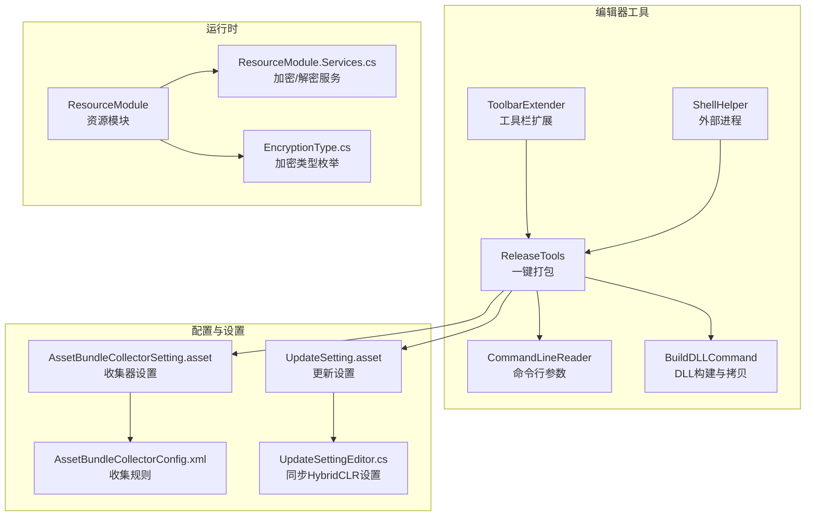
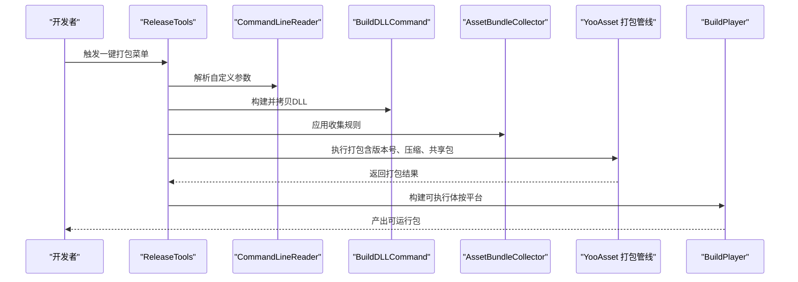
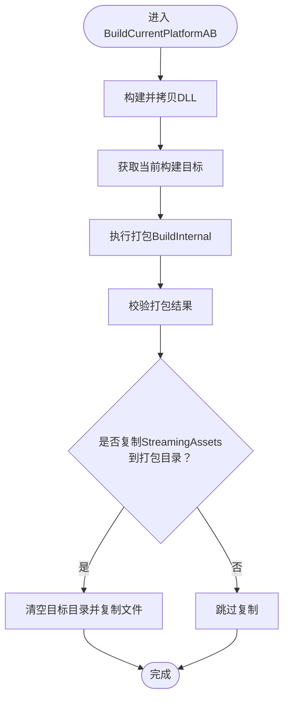
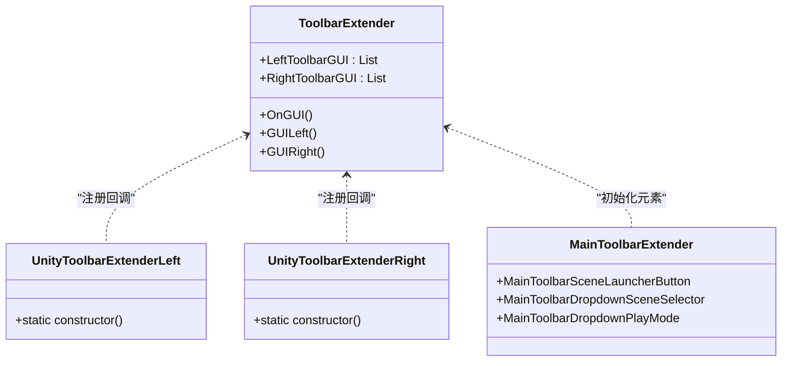
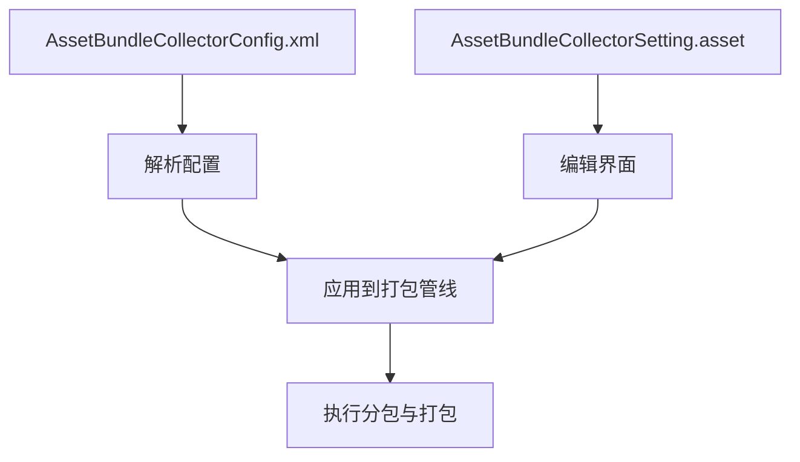
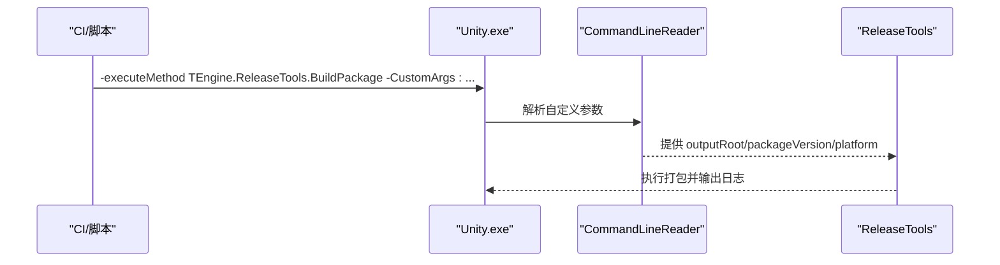
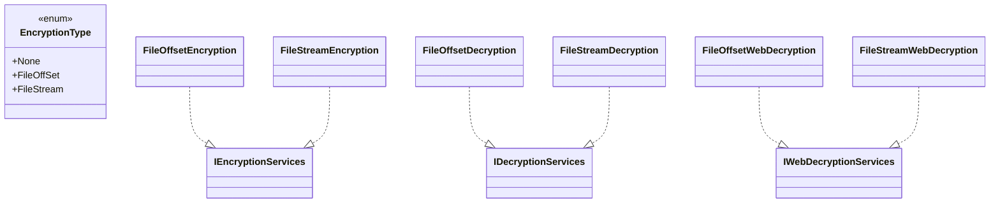
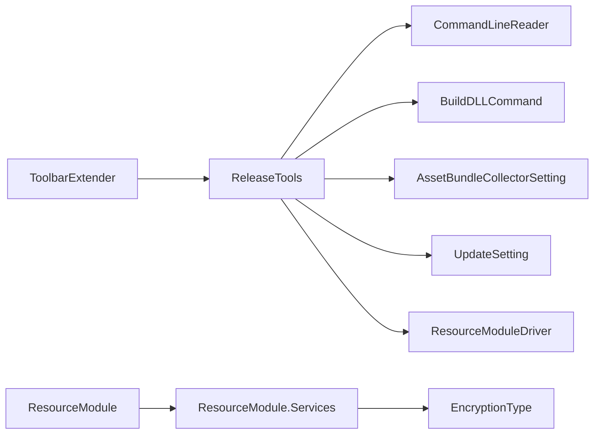

# 发布工具使用

<cite>
**本文引用的文件**
- [ReleaseTools.cs](file://Assets/TEngine/Editor/ReleaseTools/ReleaseTools.cs)
- [CommandLineReader.cs](file://Assets/TEngine/Editor/Utility/CommandLineReader.cs)
- [ShellHelper.cs](file://Assets/TEngine/Editor/Utility/ShellHelper.cs)
- [UpdateSetting.asset](file://Assets/TEngine/Settings/UpdateSetting.asset)
- [UpdateSettingEditor.cs](file://Assets/TEngine/Editor/Utility/UpdateSettingEditor.cs)
- [AssetBundleCollectorConfig.xml](file://Assets/Editor/AssetBundleCollector/AssetBundleCollectorConfig.xml)
- [AssetBundleCollectorSetting.asset](file://Assets/Editor/AssetBundleCollector/AssetBundleCollectorSetting.asset)
- [ToolbarExtender.cs](file://Assets/Editor/ToolbarExtender/ToolbarExtender.cs)
- [UnityToolbarExtenderLeft.cs](file://Assets/Editor/ToolbarExtender/UnityToolbarExtenderLeft/UnityToolbarExtenderLeft.cs)
- [UnityToolbarExtenderRight.cs](file://Assets/Editor/ToolbarExtender/UnityToolbarExtenderRight/UnityToolbarExtenderRight.cs)
- [MainToolbarExtender.cs](file://Assets/Editor/ToolbarExtender/Unity6000_OR_New/MainToolbarExtender.cs)
- [BuildDLLCommand.cs](file://Assets/TEngine/Editor/HybridCLR/BuildDLLCommand.cs)
- [ResourceModule.Services.cs](file://Assets/TEngine/Runtime/Module/ResourceModule/ResourceModule.Services.cs)
- [ResourceModule.cs](file://Assets/TEngine/Runtime/Module/ResourceModule/ResourceModule.cs)
- [EncryptionType.cs](file://Assets/TEngine/Runtime/Module/ResourceModule/EncryptionType.cs)
</cite>

## 目录
1. [简介](#简介)
2. [项目结构](#项目结构)
3. [核心组件](#核心组件)
4. [架构总览](#架构总览)
5. [详细组件分析](#详细组件分析)
6. [依赖分析](#依赖分析)
7. [性能考虑](#性能考虑)
8. [故障排查指南](#故障排查指南)
9. [结论](#结论)
10. [附录](#附录)

## 简介
本指南面向使用 TEngine 的发布与打包团队，系统讲解发布工具链的使用方法与最佳实践，涵盖以下主题：
- ReleaseTools 的完整功能说明与一键打包流程
- ToolbarExtender 的快捷操作与自定义按钮
- 资源收集器（AssetBundleCollector）的配置与分包策略
- 版本标记、资源整理、包体生成、产物交付的全流程
- 发布验证（完整性、性能、兼容性）
- 自动化配置（CI/CD、批处理脚本、自动化测试）
- 定制化与扩展（加密策略、打包管线、平台适配）
- 常见问题与排错技巧

## 项目结构
围绕发布与打包的关键目录与文件如下：
- 发布工具与打包入口：Assets/TEngine/Editor/ReleaseTools
- 命令行参数解析：Assets/TEngine/Editor/Utility
- 设置与配置：Assets/TEngine/Settings、Assets/Editor/AssetBundleCollector
- 工具栏扩展：Assets/Editor/ToolbarExtender
- 热更新与DLL构建：Assets/TEngine/Editor/HybridCLR
- 运行时资源模块与加密：Assets/TEngine/Runtime/Module/ResourceModule

**图表来源**
- [ReleaseTools.cs:1-376](file://Assets/TEngine/Editor/ReleaseTools/ReleaseTools.cs#L1-L376)
- [CommandLineReader.cs:1-121](file://Assets/TEngine/Editor/Utility/CommandLineReader.cs#L1-L121)
- [ShellHelper.cs:1-155](file://Assets/TEngine/Editor/Utility/ShellHelper.cs#L1-L155)
- [ToolbarExtender.cs:1-173](file://Assets/Editor/ToolbarExtender/ToolbarExtender.cs#L1-L173)
- [BuildDLLCommand.cs:1-117](file://Assets/TEngine/Editor/HybridCLR/BuildDLLCommand.cs#L1-L117)
- [AssetBundleCollectorConfig.xml:1-48](file://Assets/Editor/AssetBundleCollector/AssetBundleCollectorConfig.xml#L1-L48)
- [AssetBundleCollectorSetting.asset:1-218](file://Assets/Editor/AssetBundleCollector/AssetBundleCollectorSetting.asset#L1-L218)
- [UpdateSetting.asset:1-37](file://Assets/TEngine/Settings/UpdateSetting.asset#L1-L37)
- [UpdateSettingEditor.cs:1-106](file://Assets/TEngine/Editor/Utility/UpdateSettingEditor.cs#L1-L106)
- [ResourceModule.Services.cs:43-226](file://Assets/TEngine/Runtime/Module/ResourceModule/ResourceModule.Services.cs#L43-L226)
- [ResourceModule.cs:248-288](file://Assets/TEngine/Runtime/Module/ResourceModule/ResourceModule.cs#L248-L288)
- [EncryptionType.cs:1-27](file://Assets/TEngine/Runtime/Module/ResourceModule/EncryptionType.cs#L1-L27)

**章节来源**
- [ReleaseTools.cs:1-376](file://Assets/TEngine/Editor/ReleaseTools/ReleaseTools.cs#L1-L376)
- [AssetBundleCollectorConfig.xml:1-48](file://Assets/Editor/AssetBundleCollector/AssetBundleCollectorConfig.xml#L1-L48)
- [AssetBundleCollectorSetting.asset:1-218](file://Assets/Editor/AssetBundleCollector/AssetBundleCollectorSetting.asset#L1-L218)
- [UpdateSetting.asset:1-37](file://Assets/TEngine/Settings/UpdateSetting.asset#L1-L37)

## 核心组件
- ReleaseTools：提供一键打包、平台选择、版本号生成、资源打包与可执行体构建等功能；支持命令行参数驱动的静默打包。
- CommandLineReader：解析命令行自定义参数，支撑批处理与CI/CD流水线。
- ShellHelper：在编辑器内调用外部命令或脚本，便于集成第三方工具。
- ToolbarExtender：扩展Unity工具栏，提供场景切换、启动器、播放模式等快捷入口。
- AssetBundleCollector：配置资源收集与分包规则，决定打包产物结构。
- UpdateSetting：控制热更新DLL、AOT元数据、下载地址、打包地址等。
- ResourceModule 与加密服务：根据配置在运行时选择合适的加密/解密方案。

**章节来源**
- [ReleaseTools.cs:1-376](file://Assets/TEngine/Editor/ReleaseTools/ReleaseTools.cs#L1-L376)
- [CommandLineReader.cs:1-121](file://Assets/TEngine/Editor/Utility/CommandLineReader.cs#L1-L121)
- [ShellHelper.cs:1-155](file://Assets/TEngine/Editor/Utility/ShellHelper.cs#L1-L155)
- [ToolbarExtender.cs:1-173](file://Assets/Editor/ToolbarExtender/ToolbarExtender.cs#L1-L173)
- [AssetBundleCollectorConfig.xml:1-48](file://Assets/Editor/AssetBundleCollector/AssetBundleCollectorConfig.xml#L1-L48)
- [AssetBundleCollectorSetting.asset:1-218](file://Assets/Editor/AssetBundleCollector/AssetBundleCollectorSetting.asset#L1-L218)
- [UpdateSetting.asset:1-37](file://Assets/TEngine/Settings/UpdateSetting.asset#L1-L37)
- [ResourceModule.Services.cs:43-226](file://Assets/TEngine/Runtime/Module/ResourceModule/ResourceModule.Services.cs#L43-L226)

## 架构总览
发布工具链以 ReleaseTools 为核心，贯穿资源收集、打包、产物生成与运行时加载的全链路。

**图表来源**
- [ReleaseTools.cs:60-376](file://Assets/TEngine/Editor/ReleaseTools/ReleaseTools.cs#L60-L376)
- [CommandLineReader.cs:64-119](file://Assets/TEngine/Editor/Utility/CommandLineReader.cs#L64-L119)
- [BuildDLLCommand.cs:86-102](file://Assets/TEngine/Editor/HybridCLR/BuildDLLCommand.cs#L86-L102)
- [AssetBundleCollectorSetting.asset:18-165](file://Assets/Editor/AssetBundleCollector/AssetBundleCollectorSetting.asset#L18-L165)

## 详细组件分析

### ReleaseTools：一键打包与平台构建
- 功能要点
  - 一键打包 AssetBundle：自动构建DLL、执行打包、刷新资源、可选复制StreamingAssets到打包目录。
  - 平台构建：Windows、Android、iOS等平台的打包入口，生成对应产物。
  - 版本号生成：基于日期与分钟数生成版本字符串，保证每次构建唯一。
  - 加密策略：从资源模块驱动读取加密类型，动态选择加密/解密服务。
  - 命令行支持：通过自定义参数传递输出根目录、版本号、平台等，支持批处理与CI。
- 关键流程
  - 参数校验与平台映射
  - 构建参数配置（压缩、共享包、文件名风格、内置着色器包名等）
  - 打包执行与结果判定
  - 可执行体构建（BuildPlayer）

**图表来源**
- [ReleaseTools.cs:60-142](file://Assets/TEngine/Editor/ReleaseTools/ReleaseTools.cs#L60-L142)

**章节来源**
- [ReleaseTools.cs:18-376](file://Assets/TEngine/Editor/ReleaseTools/ReleaseTools.cs#L18-L376)

### ToolbarExtender：工具栏快捷操作
- 左侧工具栏：添加Claude与场景启动器按钮，订阅播放状态变化与退出事件。
- 右侧工具栏：场景切换下拉框、播放模式下拉框，支持初始化场景、默认场景与其他场景分类管理。
- Unity 6000+：新增主工具栏元素（场景启动器、场景选择器、播放模式），支持图标与状态持久化。

**图表来源**
- [ToolbarExtender.cs:1-173](file://Assets/Editor/ToolbarExtender/ToolbarExtender.cs#L1-L173)
- [UnityToolbarExtenderLeft.cs:1-21](file://Assets/Editor/ToolbarExtender/UnityToolbarExtenderLeft/UnityToolbarExtenderLeft.cs#L1-L21)
- [UnityToolbarExtenderRight.cs:1-25](file://Assets/Editor/ToolbarExtender/UnityToolbarExtenderRight/UnityToolbarExtenderRight.cs#L1-L25)
- [MainToolbarExtender.cs:1-382](file://Assets/Editor/ToolbarExtender/Unity6000_OR_New/MainToolbarExtender.cs#L1-L382)

**章节来源**
- [ToolbarExtender.cs:1-173](file://Assets/Editor/ToolbarExtender/ToolbarExtender.cs#L1-L173)
- [UnityToolbarExtenderLeft.cs:1-21](file://Assets/Editor/ToolbarExtender/UnityToolbarExtenderLeft/UnityToolbarExtenderLeft.cs#L1-L21)
- [UnityToolbarExtenderRight.cs:1-25](file://Assets/Editor/ToolbarExtender/UnityToolbarExtenderRight/UnityToolbarExtenderRight.cs#L1-L25)
- [MainToolbarExtender.cs:1-382](file://Assets/Editor/ToolbarExtender/Unity6000_OR_New/MainToolbarExtender.cs#L1-L382)

### 资源收集器：配置与分包
- XML配置：定义通用选项与多个包（如DefaultPackage、OtherPackage、Dlc1Package等），每个包下包含若干组（Group），每组包含若干收集器（Collector）。
- Setting资产：提供更直观的编辑界面，定义包名、描述、扩展名、忽略规则、着色器自动收集等。
- 分包策略：按目录打包、按文件名命名、独立打包、共享包规则等，确保资源组织清晰、加载高效。

**图表来源**
- [AssetBundleCollectorConfig.xml:1-48](file://Assets/Editor/AssetBundleCollector/AssetBundleCollectorConfig.xml#L1-L48)
- [AssetBundleCollectorSetting.asset:18-165](file://Assets/Editor/AssetBundleCollector/AssetBundleCollectorSetting.asset#L18-L165)

**章节来源**
- [AssetBundleCollectorConfig.xml:1-48](file://Assets/Editor/AssetBundleCollector/AssetBundleCollectorConfig.xml#L1-L48)
- [AssetBundleCollectorSetting.asset:1-218](file://Assets/Editor/AssetBundleCollector/AssetBundleCollectorSetting.asset#L1-L218)

### 命令行与批处理：静默打包与CI
- 命令行参数：通过 -CustomArgs: 传递 outputRoot、packageVersion、platform 等键值对。
- 批处理示例：在命令行中指定执行方法与日志文件，配合 ReleaseTools 的 BuildAssetBundle 或一键打包菜单。
- 外部脚本：ShellHelper 支持在编辑器内执行外部命令，便于集成签名、压缩、上传等步骤。

**图表来源**
- [CommandLineReader.cs:10-23](file://Assets/TEngine/Editor/Utility/CommandLineReader.cs#L10-L23)
- [ReleaseTools.cs:32-58](file://Assets/TEngine/Editor/ReleaseTools/ReleaseTools.cs#L32-L58)
- [ShellHelper.cs:13-105](file://Assets/TEngine/Editor/Utility/ShellHelper.cs#L13-L105)

**章节来源**
- [CommandLineReader.cs:1-121](file://Assets/TEngine/Editor/Utility/CommandLineReader.cs#L1-L121)
- [ReleaseTools.cs:32-58](file://Assets/TEngine/Editor/ReleaseTools/ReleaseTools.cs#L32-L58)
- [ShellHelper.cs:1-155](file://Assets/TEngine/Editor/Utility/ShellHelper.cs#L1-L155)

### 运行时加密与解密：策略选择
- 加密类型：None、FileOffSet、FileStream。
- 打包阶段：根据 ResourceModuleDriver 的加密类型，动态选择 IEncryptionServices 实现。
- 运行时：ResourceModule 根据配置创建对应的 IDecryptionServices 或 IWebDecryptionServices。

**图表来源**
- [EncryptionType.cs:1-27](file://Assets/TEngine/Runtime/Module/ResourceModule/EncryptionType.cs#L1-L27)
- [ResourceModule.Services.cs:43-226](file://Assets/TEngine/Runtime/Module/ResourceModule/ResourceModule.Services.cs#L43-L226)
- [ResourceModule.cs:248-288](file://Assets/TEngine/Runtime/Module/ResourceModule/ResourceModule.cs#L248-L288)

**章节来源**
- [EncryptionType.cs:1-27](file://Assets/TEngine/Runtime/Module/ResourceModule/EncryptionType.cs#L1-L27)
- [ResourceModule.Services.cs:43-226](file://Assets/TEngine/Runtime/Module/ResourceModule/ResourceModule.Services.cs#L43-L226)
- [ResourceModule.cs:248-288](file://Assets/TEngine/Runtime/Module/ResourceModule/ResourceModule.cs#L248-L288)

## 依赖分析
- ReleaseTools 依赖：
  - CommandLineReader：参数解析
  - BuildDLLCommand：DLL构建与拷贝
  - AssetBundleCollectorSetting：分包规则
  - UpdateSetting：打包地址、替换路径、热更新DLL列表
  - ResourceModuleDriver：加密类型
- ToolbarExtender 依赖：
  - UnityEditor 工具栏API
  - 场景管理与播放模式状态
- 运行时依赖：
  - ResourceModule 与加密服务实现

**图表来源**
- [ReleaseTools.cs:1-376](file://Assets/TEngine/Editor/ReleaseTools/ReleaseTools.cs#L1-L376)
- [CommandLineReader.cs:1-121](file://Assets/TEngine/Editor/Utility/CommandLineReader.cs#L1-L121)
- [BuildDLLCommand.cs:1-117](file://Assets/TEngine/Editor/HybridCLR/BuildDLLCommand.cs#L1-L117)
- [AssetBundleCollectorSetting.asset:1-218](file://Assets/Editor/AssetBundleCollector/AssetBundleCollectorSetting.asset#L1-L218)
- [UpdateSetting.asset:1-37](file://Assets/TEngine/Settings/UpdateSetting.asset#L1-L37)
- [ToolbarExtender.cs:1-173](file://Assets/Editor/ToolbarExtender/ToolbarExtender.cs#L1-L173)
- [ResourceModule.Services.cs:43-226](file://Assets/TEngine/Runtime/Module/ResourceModule/ResourceModule.Services.cs#L43-L226)
- [EncryptionType.cs:1-27](file://Assets/TEngine/Runtime/Module/ResourceModule/EncryptionType.cs#L1-L27)

**章节来源**
- [ReleaseTools.cs:1-376](file://Assets/TEngine/Editor/ReleaseTools/ReleaseTools.cs#L1-L376)
- [ToolbarExtender.cs:1-173](file://Assets/Editor/ToolbarExtender/ToolbarExtender.cs#L1-L173)

## 性能考虑
- 增量构建：打包参数中默认不清空缓存，启用资源依赖数据库，提升打包速度。
- 压缩策略：统一采用 LZ4 压缩，平衡体积与加载性能。
- 共享包规则：启用共享包打包，减少重复资源，降低包体大小。
- 平台适配：不同平台可选择不同的打包管线与参数组合，避免不必要的重复工作。

**章节来源**
- [ReleaseTools.cs:180-239](file://Assets/TEngine/Editor/ReleaseTools/ReleaseTools.cs#L180-L239)

## 故障排查指南
- 打包失败
  - 检查命令行参数是否完整（outputRoot、packageVersion、platform）。
  - 查看打包日志中的错误信息，确认资源路径与收集规则是否正确。
- StreamingAssets 复制失败
  - 确认 UpdateSetting 中的打包地址与自动复制开关。
  - 检查目标目录是否存在且可写。
- 加密相关问题
  - 确认 ResourceModuleDriver 的加密类型与运行时解密服务匹配。
  - 若使用WebGL，确认Web解密服务实现可用。
- DLL构建异常
  - 确认 HybridCLR 已安装并启用，热更新DLL与AOT元数据列表正确。
  - 如需混淆，检查混淆设置与输出路径。

**章节来源**
- [ReleaseTools.cs:32-58](file://Assets/TEngine/Editor/ReleaseTools/ReleaseTools.cs#L32-L58)
- [UpdateSetting.asset:35-37](file://Assets/TEngine/Settings/UpdateSetting.asset#L35-L37)
- [ResourceModule.Services.cs:43-226](file://Assets/TEngine/Runtime/Module/ResourceModule/ResourceModule.Services.cs#L43-L226)
- [BuildDLLCommand.cs:86-117](file://Assets/TEngine/Editor/HybridCLR/BuildDLLCommand.cs#L86-L117)

## 结论
本指南提供了 TEngine 发布工具链的完整使用手册，从资源收集、打包、平台构建到运行时加载与加密策略，均给出了可操作的步骤与可视化图示。建议在团队内统一参数约定、分包策略与加密方案，配合命令行与工具栏扩展，形成标准化的发布流程。

## 附录

### 一键打包流程清单
- 准备工作
  - 确认 UpdateSetting 中的打包地址、热更新DLL列表、下载地址等。
  - 配置 AssetBundleCollector 的包与分组规则。
- 执行打包
  - 使用“一键打包AssetBundle”或对应平台菜单。
  - 或通过命令行传参执行静默打包。
- 产物交付
  - 检查打包目录与可执行体产物。
  - 如需，复制StreamingAssets至打包目录。

**章节来源**
- [ReleaseTools.cs:60-376](file://Assets/TEngine/Editor/ReleaseTools/ReleaseTools.cs#L60-L376)
- [UpdateSetting.asset:1-37](file://Assets/TEngine/Settings/UpdateSetting.asset#L1-L37)
- [AssetBundleCollectorSetting.asset:1-218](file://Assets/Editor/AssetBundleCollector/AssetBundleCollectorSetting.asset#L1-L218)

### 发布验证清单
- 完整性检查
  - 校验打包目录结构与文件数量。
  - 对比版本号与构建时间戳。
- 性能测试
  - 加载时间、内存占用、帧率稳定性。
- 兼容性验证
  - 多平台对比（Windows、Android、iOS、WebGL）。
  - 不同分辨率与设备上的表现。

### 自动化配置建议
- CI/CD 集成
  - 在流水线中调用 Unity -executeMethod，传入 -CustomArgs:outputRoot;packageVersion;platform。
  - 使用 ShellHelper 执行签名、压缩、上传等步骤。
- 批处理脚本
  - Windows 批处理或 PowerShell 脚本封装 Unity 调用与参数拼接。
- 自动化测试
  - 在打包后自动运行回归测试，确保核心流程可用。

**章节来源**
- [CommandLineReader.cs:10-23](file://Assets/TEngine/Editor/Utility/CommandLineReader.cs#L10-L23)
- [ShellHelper.cs:13-105](file://Assets/TEngine/Editor/Utility/ShellHelper.cs#L13-L105)

### 定制化与扩展
- 扩展打包管线
  - 在 BuildInternal 中调整压缩选项、共享包规则、文件名风格等。
- 自定义加密
  - 新增 IEncryptionServices 实现并在打包时选择。
  - 运行时在 ResourceModule 中创建对应的 IDecryptionServices。
- 工具栏扩展
  - 在 UnityToolbarExtenderLeft/Right 或 MainToolbarExtender 中添加自定义按钮与下拉菜单。

**章节来源**
- [ReleaseTools.cs:180-239](file://Assets/TEngine/Editor/ReleaseTools/ReleaseTools.cs#L180-L239)
- [ResourceModule.Services.cs:43-226](file://Assets/TEngine/Runtime/Module/ResourceModule/ResourceModule.Services.cs#L43-L226)
- [MainToolbarExtender.cs:1-382](file://Assets/Editor/ToolbarExtender/Unity6000_OR_New/MainToolbarExtender.cs#L1-L382)