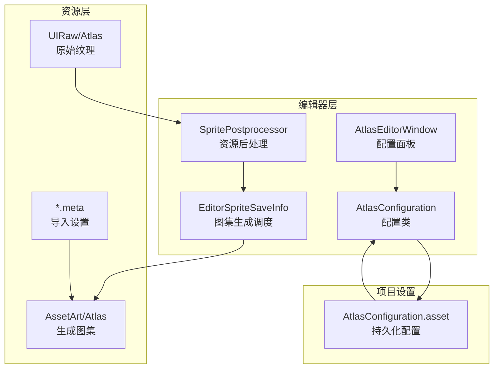
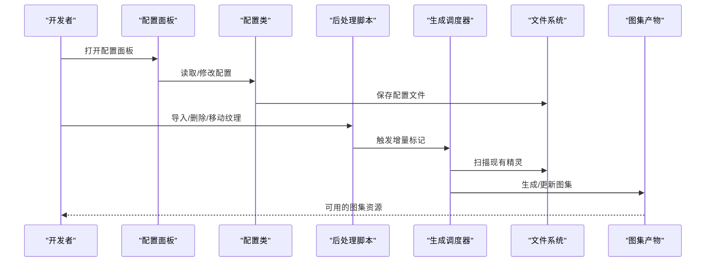
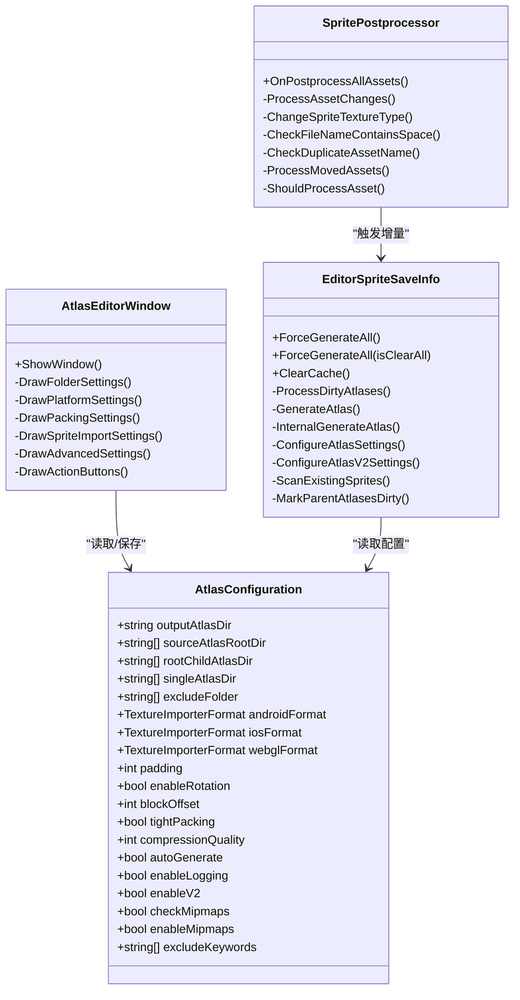

# 图集优化配置

<cite>
**本文档引用的文件**
- [AtlasConfiguration.cs](file://Assets/TEngine/Editor/AtlasMakerEditor/AtlasConfiguration.cs)
- [AtlasEditorWindow.cs](file://Assets/TEngine/Editor/AtlasMakerEditor/AtlasEditorWindow.cs)
- [EditorSpriteSaveInfo.cs](file://Assets/TEngine/Editor/AtlasMakerEditor/EditorSpriteSaveInfo.cs)
- [SpritePostprocessor.cs](file://Assets/TEngine/Editor/AtlasMakerEditor/SpritePostprocessor.cs)
- [AtlasConfiguration.asset](file://ProjectSettings/AtlasConfiguration.asset)
- [Atlas_Battle.spriteatlasv2.meta](file://Assets/AssetArt/Atlas/Atlas_Battle.spriteatlasv2.meta)
- [Play_Joystick_bg.png.meta](file://Assets/AssetRaw/UIRaw/Atlas/Battle/Play_Joystick_bg.png.meta)
</cite>

## 目录
1. [简介](#简介)
2. [项目结构](#项目结构)
3. [核心组件](#核心组件)
4. [架构概览](#架构概览)
5. [详细组件分析](#详细组件分析)
6. [依赖关系分析](#依赖关系分析)
7. [性能考量](#性能考量)
8. [故障排查指南](#故障排查指南)
9. [结论](#结论)
10. [附录](#附录)

## 简介
本文件面向TEngine项目的图集优化配置与使用，系统性阐述图集生成的配置选项、优化策略、编辑器使用方法以及跨平台差异。内容涵盖：
- AtlasConfiguration的参数详解与最佳实践
- 纹理压缩格式选择与平台适配
- 图集编辑器的批量处理、自动布局与纹理优化功能
- 移动端内存优化与桌面端性能考虑
- 调试方法与性能分析技巧

## 项目结构
TEngine的图集系统由配置类、编辑器窗口、后处理脚本与运行时图集导入器组成，形成“配置驱动 + 自动化生成 + 平台适配”的闭环。

图表来源
- [AtlasConfiguration.cs:1-55](file://Assets/TEngine/Editor/AtlasMakerEditor/AtlasConfiguration.cs#L1-L55)
- [AtlasEditorWindow.cs:1-269](file://Assets/TEngine/Editor/AtlasMakerEditor/AtlasEditorWindow.cs#L1-L269)
- [SpritePostprocessor.cs:1-405](file://Assets/TEngine/Editor/AtlasMakerEditor/SpritePostprocessor.cs#L1-L405)
- [EditorSpriteSaveInfo.cs:1-739](file://Assets/TEngine/Editor/AtlasMakerEditor/EditorSpriteSaveInfo.cs#L1-L739)

章节来源
- [AtlasConfiguration.cs:1-55](file://Assets/TEngine/Editor/AtlasMakerEditor/AtlasConfiguration.cs#L1-L55)
- [AtlasEditorWindow.cs:1-269](file://Assets/TEngine/Editor/AtlasMakerEditor/AtlasEditorWindow.cs#L1-L269)
- [SpritePostprocessor.cs:1-405](file://Assets/TEngine/Editor/AtlasMakerEditor/SpritePostprocessor.cs#L1-L405)
- [EditorSpriteSaveInfo.cs:1-739](file://Assets/TEngine/Editor/AtlasMakerEditor/EditorSpriteSaveInfo.cs#L1-L739)

## 核心组件
- AtlasConfiguration：集中管理图集生成的目录、平台格式、打包设置、导入设置与高级选项，支持持久化保存。
- AtlasEditorWindow：可视化配置面板，提供目录选择、平台格式枚举、打包参数调整与一键批量操作。
- SpritePostprocessor：资源导入后处理器，负责检测、过滤与预处理资源，触发图集生成调度。
- EditorSpriteSaveInfo：图集生成的核心调度器，负责扫描、增量计算、生成与缓存管理。

章节来源
- [AtlasConfiguration.cs:1-55](file://Assets/TEngine/Editor/AtlasMakerEditor/AtlasConfiguration.cs#L1-L55)
- [AtlasEditorWindow.cs:1-269](file://Assets/TEngine/Editor/AtlasMakerEditor/AtlasEditorWindow.cs#L1-L269)
- [SpritePostprocessor.cs:1-405](file://Assets/TEngine/Editor/AtlasMakerEditor/SpritePostprocessor.cs#L1-L405)
- [EditorSpriteSaveInfo.cs:1-739](file://Assets/TEngine/Editor/AtlasMakerEditor/EditorSpriteSaveInfo.cs#L1-L739)

## 架构概览
图集生成的端到端流程如下：

图表来源
- [AtlasEditorWindow.cs:27-51](file://Assets/TEngine/Editor/AtlasMakerEditor/AtlasEditorWindow.cs#L27-L51)
- [SpritePostprocessor.cs:105-156](file://Assets/TEngine/Editor/AtlasMakerEditor/SpritePostprocessor.cs#L105-L156)
- [EditorSpriteSaveInfo.cs:220-277](file://Assets/TEngine/Editor/AtlasMakerEditor/EditorSpriteSaveInfo.cs#L220-L277)

## 详细组件分析

### AtlasConfiguration 参数详解
- 目录设置
  - 输出目录：生成的图集存放位置
  - 收集目录：需要生成图集的UI根目录集合
  - 根子目录图集：按子级目录生成独立图集的目录集合
  - 单图图集：每张图单独生成图集的目录集合
  - 排除目录：不参与图集生成的目录集合
- 平台格式设置
  - Android/iOS/WebGL：各平台纹理压缩格式
- 打包设置
  - Padding、Block Offset、Enable Rotation、Tight Packing
- 导入设置
  - 检查Mipmap导入设置、允许Mipmap
- 高级设置
  - 自动生成、启用日志、启用V2打包、排除关键词

章节来源
- [AtlasConfiguration.cs:10-51](file://Assets/TEngine/Editor/AtlasMakerEditor/AtlasConfiguration.cs#L10-L51)
- [AtlasConfiguration.asset:15-39](file://ProjectSettings/AtlasConfiguration.asset#L15-L39)

### AtlasEditorWindow 配置面板
- 目录设置区：提供目录选择器与动态数组管理，支持折叠展开与清空
- 平台设置区：枚举选择各平台纹理格式，滑动条设置压缩质量
- 打包设置区：下拉选择Padding，输入Block Offset，开关旋转与剔除透明区域
- 导入设置区：可选检查Mipmap导入设置并控制是否允许Mipmap
- 高级设置区：开关自动生成、日志与V2打包；可配置排除关键词数组
- 行为按钮：立即重新生成、重新生成有变动的数据、清空缓存

章节来源
- [AtlasEditorWindow.cs:69-265](file://Assets/TEngine/Editor/AtlasMakerEditor/AtlasEditorWindow.cs#L69-L265)

### SpritePostprocessor 资源后处理
- 资源扫描与过滤：仅处理指定目录内的图片资源，排除包含特定关键词的路径
- 缓存机制：基于文件名的小写映射，快速检测同名冲突与过期路径
- 预处理逻辑：修正纹理类型为Sprite，按配置控制Mipmap开关，必要时重新导入
- 变更处理：导入、删除、移动均触发增量标记与父级图集标记

章节来源
- [SpritePostprocessor.cs:105-333](file://Assets/TEngine/Editor/AtlasMakerEditor/SpritePostprocessor.cs#L105-L333)

### EditorSpriteSaveInfo 图集生成调度
- 增量生成：基于脏图集集合与时间戳比较，仅更新变更的图集
- 扫描现有精灵：遍历收集目录与根子目录，构建图集映射
- 生成策略：支持V1/V2两种图集格式，按配置设置平台格式与打包参数
- 缓存管理：维护图集路径映射、脏图集集合，支持清空缓存与全量重建

章节来源
- [EditorSpriteSaveInfo.cs:97-181](file://Assets/TEngine/Editor/AtlasMakerEditor/EditorSpriteSaveInfo.cs#L97-L181)
- [EditorSpriteSaveInfo.cs:229-401](file://Assets/TEngine/Editor/AtlasMakerEditor/EditorSpriteSaveInfo.cs#L229-L401)

### 图集导入设置与平台适配
- 平台设置：Android/iOS/WebGL分别覆盖纹理格式与压缩质量
- 打包设置：Padding、Block Offset、Enable Rotation、Tight Packing
- V2/V1差异：V2通过SpriteAtlasImporter或SpriteAtlasAsset进行平台设置与打包设置

章节来源
- [EditorSpriteSaveInfo.cs:427-508](file://Assets/TEngine/Editor/AtlasMakerEditor/EditorSpriteSaveInfo.cs#L427-L508)
- [Atlas_Battle.spriteatlasv2.meta:16-76](file://Assets/AssetArt/Atlas/Atlas_Battle.spriteatlasv2.meta#L16-L76)

## 依赖关系分析

图表来源
- [AtlasConfiguration.cs:8-51](file://Assets/TEngine/Editor/AtlasMakerEditor/AtlasConfiguration.cs#L8-L51)
- [AtlasEditorWindow.cs:8-266](file://Assets/TEngine/Editor/AtlasMakerEditor/AtlasEditorWindow.cs#L8-L266)
- [SpritePostprocessor.cs:11-404](file://Assets/TEngine/Editor/AtlasMakerEditor/SpritePostprocessor.cs#L11-L404)
- [EditorSpriteSaveInfo.cs:13-739](file://Assets/TEngine/Editor/AtlasMakerEditor/EditorSpriteSaveInfo.cs#L13-L739)

## 性能考量
- 移动端内存优化
  - 选择合适的压缩格式：Android优先ASTC_6x6，iOS优先ASTC_5x5，WebGL保持ASTC_6x6
  - 控制Padding与Tight Packing：减少空白区域，提高内存利用率
  - 合理设置Block Offset与Enable Rotation：平衡打包密度与渲染性能
  - Mipmap控制：移动端按需开启，避免不必要的内存占用
- 桌面端性能考虑
  - 桌面端可适当放宽压缩质量，提升视觉效果
  - 打包设置可偏向高密度，减少Draw Call
- 加载性能优化
  - 使用增量生成：仅更新变更的图集，缩短构建时间
  - 启用V2打包：获得更好的平台适配与导入性能
  - 清理缓存与全量重建：在配置重大变更时使用，确保一致性

章节来源
- [AtlasConfiguration.cs:25-48](file://Assets/TEngine/Editor/AtlasMakerEditor/AtlasConfiguration.cs#L25-L48)
- [EditorSpriteSaveInfo.cs:427-508](file://Assets/TEngine/Editor/AtlasMakerEditor/EditorSpriteSaveInfo.cs#L427-L508)

## 故障排查指南
- 资源命名问题
  - 空格检测：导入时若发现文件名含空格，会记录错误并删除该资源
  - 同名冲突：检测到同名资源冲突时，记录错误并删除重复项
- 导入设置异常
  - 纹理类型修正：自动将非Sprite纹理类型修正为Sprite
  - Mipmap开关：根据配置自动开启或关闭Mipmap
- 图集生成失败
  - 检查输出目录权限与磁盘空间
  - 清空缓存后重试：使用“清空缓存”按钮
  - 全量重建：使用“立即重新生成”按钮，删除并重建所有图集
- 日志定位
  - 开启日志：在配置面板勾选“启用日志”，查看生成过程中的详细信息

章节来源
- [SpritePostprocessor.cs:134-155](file://Assets/TEngine/Editor/AtlasMakerEditor/SpritePostprocessor.cs#L134-L155)
- [SpritePostprocessor.cs:238-299](file://Assets/TEngine/Editor/AtlasMakerEditor/SpritePostprocessor.cs#L238-L299)
- [AtlasEditorWindow.cs:240-265](file://Assets/TEngine/Editor/AtlasMakerEditor/AtlasEditorWindow.cs#L240-L265)

## 结论
TEngine的图集优化配置体系通过“配置驱动 + 自动化生成 + 平台适配”的方式，实现了高效、可控且跨平台的图集生成流程。合理设置压缩格式、打包参数与导入策略，结合增量生成与日志调试，可在保证视觉质量的同时显著优化内存与加载性能。

## 附录

### 最佳实践清单
- 目录规划
  - 将需要合图的UI纹理统一放置于收集目录，按业务拆分根子目录图集与单图图集
  - 使用排除目录避免无关资源参与图集生成
- 压缩格式选择
  - Android：ASTC_6x6
  - iOS：ASTC_5x5
  - WebGL：ASTC_6x6
- 打包参数建议
  - Padding：4
  - Tight Packing：开启
  - Enable Rotation：开启
  - Block Offset：1
- 导入设置
  - 检查Mipmap导入设置：开启
  - 允许Mipmap：按需开启
- 高级设置
  - 自动生成：开启
  - 启用日志：开发阶段开启
  - 启用V2打包：推荐开启
  - 排除关键词：如“_Delete”、“_Temp”

章节来源
- [AtlasConfiguration.cs:10-51](file://Assets/TEngine/Editor/AtlasMakerEditor/AtlasConfiguration.cs#L10-L51)
- [AtlasConfiguration.asset:15-39](file://ProjectSettings/AtlasConfiguration.asset#L15-L39)

### 调试与性能分析步骤
- 打开配置面板，调整参数并保存
- 导入/删除/移动纹理，观察日志输出
- 使用“重新生成有变动的图集数据”进行增量验证
- 使用“立即重新生成”进行全量重建验证
- 使用“清空缓存”清理异常状态
- 分析生成的图集.meta文件，确认平台设置与打包参数生效

章节来源
- [AtlasEditorWindow.cs:240-265](file://Assets/TEngine/Editor/AtlasMakerEditor/AtlasEditorWindow.cs#L240-L265)
- [Atlas_Battle.spriteatlasv2.meta:16-76](file://Assets/AssetArt/Atlas/Atlas_Battle.spriteatlasv2.meta#L16-L76)