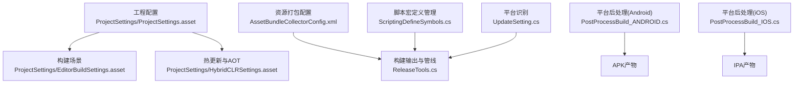
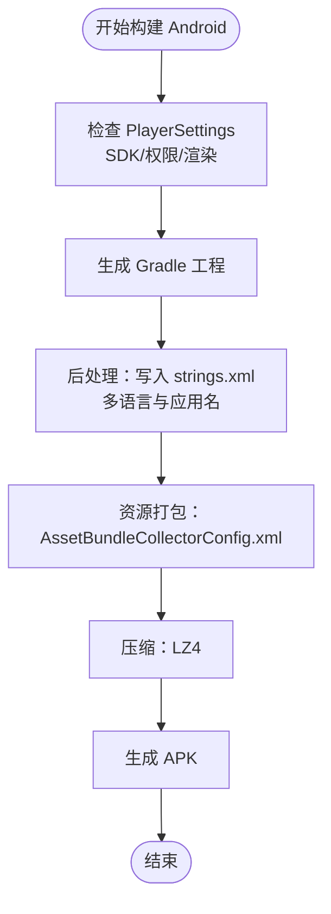
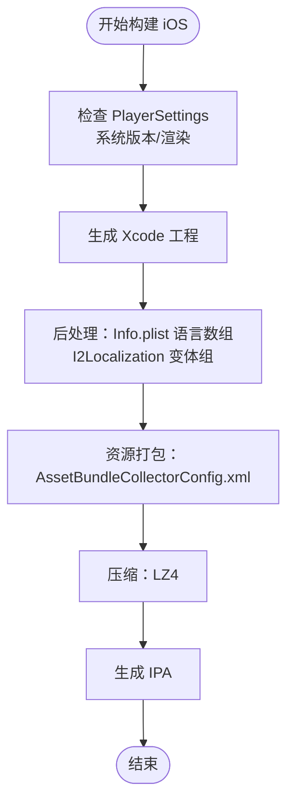
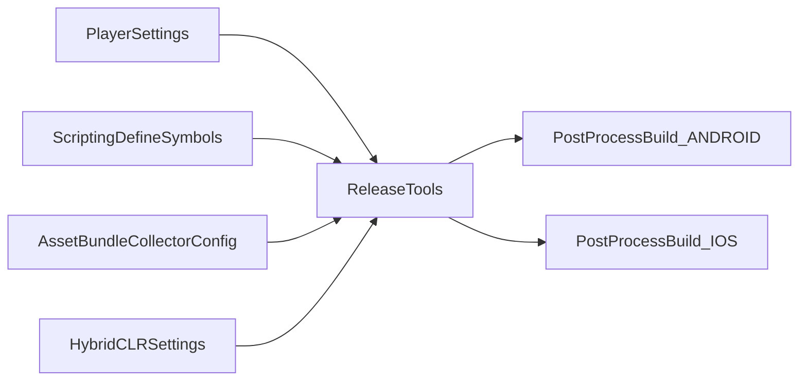

# 多平台构建配置

<cite>
**本文引用的文件**
- [ProjectSettings.asset](file://ProjectSettings/ProjectSettings.asset)
- [EditorBuildSettings.asset](file://ProjectSettings/EditorBuildSettings.asset)
- [HybridCLRSettings.asset](file://ProjectSettings/HybridCLRSettings.asset)
- [UpdateSetting.cs](file://Assets/TEngine/Runtime/Core/UpdateSetting.cs)
- [ProjectSettings.asset（片段）](file://ProjectSettings/ProjectSettings.asset)
- [PostProcessBuild_ANDROID.cs](file://Assets/TEngine/Editor/Localization/PostProcessBuild_ANDROID.cs)
- [PostProcessBuild_IOS.cs](file://Assets/TEngine/Editor/Localization/PostProcessBuild_IOS.cs)
- [ScriptingDefineSymbols.cs](file://Assets/TEngine/Editor/DefineSymbols/ScriptingDefineSymbols.cs)
- [AssetBundleCollectorConfig.xml](file://Assets/Editor/AssetBundleCollector/AssetBundleCollectorConfig.xml)
- [ReleaseTools.cs](file://Assets/TEngine/Editor/ReleaseTools/ReleaseTools.cs)
- [Xcode.txt](file://Assets/TEngine/Editor/Localization/Unity XCode/Xcode.txt)
- [zd_img_light.png.meta](file://Assets/AssetRaw/UIRaw/Atlas/Battle/zd_img_light.png.meta)
- [Slider11_Fill_Red.png.meta](file://Assets/AssetRaw/UIRaw/Atlas/Battle/Slider11_Fill_Red.png.meta)
- [Play_Joystick_bg.png.meta](file://Assets/AssetRaw/UIRaw/Atlas/Battle/Play_Joystick_bg.png.meta)
- [Slider11_Frame.png.meta](file://Assets/AssetRaw/UIRaw/Atlas/Battle/Slider11_Frame.png.meta)
- [Slider11_Fill_Yellow.png.meta](file://Assets/AssetRaw/UIRaw/Atlas/Battle/Slider11_Fill_Yellow.png.meta)
- [Play_Joystick_handle.png.meta](file://Assets/AssetRaw/UIRaw/Atlas/Battle/Play_Joystick_handle.png.meta)
</cite>

## 目录
1. [引言](#引言)
2. [项目结构](#项目结构)
3. [核心组件](#核心组件)
4. [架构总览](#架构总览)
5. [详细组件分析](#详细组件分析)
6. [依赖关系分析](#依赖关系分析)
7. [性能考量](#性能考量)
8. [故障排查指南](#故障排查指南)
9. [结论](#结论)
10. [附录](#附录)

## 引言
本文件面向TEngine在多平台（Android、iOS、Windows、WebGL）的构建配置与流程，系统梳理Unity工程级配置、平台特定设置、资源打包策略、后处理脚本、脚本宏定义以及构建管线选择，并给出平台切换流程、注意事项、优化建议与常见问题排查方法。内容基于仓库中实际存在的配置文件与脚本进行归纳总结，帮助开发者在不同平台上实现稳定、可复用且高性能的构建。

## 项目结构
TEngine的多平台构建涉及以下关键层面：
- 工程配置层：Unity PlayerSettings、Graphics Jobs、API选择、移动渲染模式等
- 构建场景层：EditorBuildSettings中的场景列表
- 热更新与AOT层：HybridCLR设置（热更新程序集、AOT补丁）
- 资源打包层：AssetBundle收集器配置与打包策略
- 平台后处理层：Android/iOS构建后的本地化与资源注入
- 构建工具层：脚本宏定义管理、发布工具与构建管线选择



图表来源
- [ProjectSettings.asset](file://ProjectSettings/ProjectSettings.asset)
- [EditorBuildSettings.asset](file://ProjectSettings/EditorBuildSettings.asset)
- [HybridCLRSettings.asset](file://ProjectSettings/HybridCLRSettings.asset)
- [AssetBundleCollectorConfig.xml](file://Assets/Editor/AssetBundleCollector/AssetBundleCollectorConfig.xml)
- [ReleaseTools.cs](file://Assets/TEngine/Editor/ReleaseTools/ReleaseTools.cs)
- [ScriptingDefineSymbols.cs](file://Assets/TEngine/Editor/DefineSymbols/ScriptingDefineSymbols.cs)
- [PostProcessBuild_ANDROID.cs](file://Assets/TEngine/Editor/Localization/PostProcessBuild_ANDROID.cs)
- [PostProcessBuild_IOS.cs](file://Assets/TEngine/Editor/Localization/PostProcessBuild_IOS.cs)
- [UpdateSetting.cs](file://Assets/TEngine/Runtime/Core/UpdateSetting.cs)

章节来源
- [ProjectSettings.asset](file://ProjectSettings/ProjectSettings.asset)
- [EditorBuildSettings.asset](file://ProjectSettings/EditorBuildSettings.asset)
- [HybridCLRSettings.asset](file://ProjectSettings/HybridCLRSettings.asset)
- [AssetBundleCollectorConfig.xml](file://Assets/Editor/AssetBundleCollector/AssetBundleCollectorConfig.xml)
- [ReleaseTools.cs](file://Assets/TEngine/Editor/ReleaseTools/ReleaseTools.cs)
- [ScriptingDefineSymbols.cs](file://Assets/TEngine/Editor/DefineSymbols/ScriptingDefineSymbols.cs)
- [PostProcessBuild_ANDROID.cs](file://Assets/TEngine/Editor/Localization/PostProcessBuild_ANDROID.cs)
- [PostProcessBuild_IOS.cs](file://Assets/TEngine/Editor/Localization/PostProcessBuild_IOS.cs)
- [UpdateSetting.cs](file://Assets/TEngine/Runtime/Core/UpdateSetting.cs)

## 核心组件
- 工程配置（PlayerSettings）
  - 包含屏幕尺寸、渲染模式、移动设备渲染开关、颜色空间、图形API选择、目标SDK版本、权限与特性开关等。
  - 关键点：Android最小/目标SDK版本、iOS最低系统版本、移动设备多线程渲染开关、图形API自动选择等。
- 构建场景（EditorBuildSettings）
  - 定义参与构建的场景路径与启用状态。
- 热更新与AOT（HybridCLR）
  - 控制是否启用、热更新程序集集合、AOT补丁程序集、输出目录与链接文件等。
- 资源打包（AssetBundleCollectorConfig）
  - 定义包名、分组规则、收集路径、打包策略与地址规则。
- 平台后处理（Android/iOS）
  - 在Gradle生成或Xcode工程阶段写入本地化字符串、Info.plist语言数组、I2Localization资源等。
- 脚本宏定义（ScriptingDefineSymbols）
  - 针对不同平台增删宏定义，支持全平台批量操作。
- 构建工具（ReleaseTools）
  - 选择构建管线（内置/可脚本化），设置压缩方式、内置着色器包名、替换资源地址等。

章节来源
- [ProjectSettings.asset](file://ProjectSettings/ProjectSettings.asset)
- [EditorBuildSettings.asset](file://ProjectSettings/EditorBuildSettings.asset)
- [HybridCLRSettings.asset](file://ProjectSettings/HybridCLRSettings.asset)
- [AssetBundleCollectorConfig.xml](file://Assets/Editor/AssetBundleCollector/AssetBundleCollectorConfig.xml)
- [PostProcessBuild_ANDROID.cs](file://Assets/TEngine/Editor/Localization/PostProcessBuild_ANDROID.cs)
- [PostProcessBuild_IOS.cs](file://Assets/TEngine/Editor/Localization/PostProcessBuild_IOS.cs)
- [ScriptingDefineSymbols.cs](file://Assets/TEngine/Editor/DefineSymbols/ScriptingDefineSymbols.cs)
- [ReleaseTools.cs](file://Assets/TEngine/Editor/ReleaseTools/ReleaseTools.cs)

## 架构总览
下图展示从配置到产物的关键交互链路，涵盖平台识别、宏定义、资源打包与后处理。

```mermaid
sequenceDiagram
participant Dev as "开发者"
participant PS as "PlayerSettings<br/>ProjectSettings.asset"
participant ABS as "资源打包<br/>AssetBundleCollectorConfig.xml"
participant RT as "构建工具<br/>ReleaseTools.cs"
participant SD as "宏定义<br/>ScriptingDefineSymbols.cs"
participant AND as "Android后处理<br/>PostProcessBuild_ANDROID.cs"
participant IOS as "iOS后处理<br/>PostProcessBuild_IOS.cs"
participant OUT as "构建产物"
Dev->>PS : 配置平台参数API/权限/版本
Dev->>SD : 设置平台宏定义
Dev->>ABS : 配置打包规则
Dev->>RT : 选择构建管线与压缩
RT->>OUT : 生成中间产物
RT->>AND : Android后处理写入strings.xml
RT->>IOS : iOS后处理Info.plist与Xcode工程
AND-->>OUT : APK
IOS-->>OUT : IPA
```

图表来源
- [ProjectSettings.asset](file://ProjectSettings/ProjectSettings.asset)
- [AssetBundleCollectorConfig.xml](file://Assets/Editor/AssetBundleCollector/AssetBundleCollectorConfig.xml)
- [ReleaseTools.cs](file://Assets/TEngine/Editor/ReleaseTools/ReleaseTools.cs)
- [ScriptingDefineSymbols.cs](file://Assets/TEngine/Editor/DefineSymbols/ScriptingDefineSymbols.cs)
- [PostProcessBuild_ANDROID.cs](file://Assets/TEngine/Editor/Localization/PostProcessBuild_ANDROID.cs)
- [PostProcessBuild_IOS.cs](file://Assets/TEngine/Editor/Localization/PostProcessBuild_IOS.cs)

## 详细组件分析

### Android 平台构建配置
- 编译与运行时
  - 最小/目标SDK版本、权限与特性开关、移动设备渲染、窗口与安全区域、启动模式等。
- 图形API与渲染
  - 移动端多线程渲染开启、图形API自动选择、颜色空间与HDR显示支持等。
- 后处理
  - Gradle生成阶段写入多语言字符串资源，确保应用名称按语言变体正确显示；支持 zh-CN/zh-TW 到 Android 约定的 zh-rCN/zh-rTW 映射。
- 资源与打包
  - 使用AssetBundleCollector按目录打包UIRaw与其它资源，结合构建工具设置压缩与内置着色器包名。



图表来源
- [ProjectSettings.asset](file://ProjectSettings/ProjectSettings.asset)
- [PostProcessBuild_ANDROID.cs](file://Assets/TEngine/Editor/Localization/PostProcessBuild_ANDROID.cs)
- [AssetBundleCollectorConfig.xml](file://Assets/Editor/AssetBundleCollector/AssetBundleCollectorConfig.xml)
- [ReleaseTools.cs](file://Assets/TEngine/Editor/ReleaseTools/ReleaseTools.cs)

章节来源
- [ProjectSettings.asset](file://ProjectSettings/ProjectSettings.asset)
- [PostProcessBuild_ANDROID.cs](file://Assets/TEngine/Editor/Localization/PostProcessBuild_ANDROID.cs)
- [AssetBundleCollectorConfig.xml](file://Assets/Editor/AssetBundleCollector/AssetBundleCollectorConfig.xml)
- [ReleaseTools.cs](file://Assets/TEngine/Editor/ReleaseTools/ReleaseTools.cs)

### iOS 平台构建配置
- 编译与运行时
  - 最低系统版本、权限与特性开关、移动设备渲染、窗口与方向控制等。
- 图形API与渲染
  - 图形API自动选择、颜色空间与HDR显示支持等。
- 后处理
  - 写入 Info.plist 的 CFBundleLocalizations 数组，设置开发区域；通过Xcode API添加 I2Localization 资源变体组，生成 InfoPlist.strings 与 Localizable.strings。
- 资源与打包
  - 与Android一致的资源打包策略，配合构建工具完成压缩与内置着色器包名设置。



图表来源
- [ProjectSettings.asset](file://ProjectSettings/ProjectSettings.asset)
- [PostProcessBuild_IOS.cs](file://Assets/TEngine/Editor/Localization/PostProcessBuild_IOS.cs)
- [AssetBundleCollectorConfig.xml](file://Assets/Editor/AssetBundleCollector/AssetBundleCollectorConfig.xml)
- [ReleaseTools.cs](file://Assets/TEngine/Editor/ReleaseTools/ReleaseTools.cs)
- [Xcode.txt](file://Assets/TEngine/Editor/Localization/Unity XCode/Xcode.txt)

章节来源
- [ProjectSettings.asset](file://ProjectSettings/ProjectSettings.asset)
- [PostProcessBuild_IOS.cs](file://Assets/TEngine/Editor/Localization/PostProcessBuild_IOS.cs)
- [AssetBundleCollectorConfig.xml](file://Assets/Editor/AssetBundleCollector/AssetBundleCollectorConfig.xml)
- [ReleaseTools.cs](file://Assets/TEngine/Editor/ReleaseTools/ReleaseTools.cs)
- [Xcode.txt](file://Assets/TEngine/Editor/Localization/Unity XCode/Xcode.txt)

### Windows 平台构建配置
- 编译与运行时
  - 默认屏幕尺寸、渲染模式、帧率与窗口模式、多线程渲染、HDR显示支持等。
- 图形API与渲染
  - 图形API自动选择、颜色空间、移动设备渲染关闭等。
- 资源与打包
  - 采用与移动端一致的资源打包策略，构建工具设置压缩与内置着色器包名。

章节来源
- [ProjectSettings.asset](file://ProjectSettings/ProjectSettings.asset)
- [AssetBundleCollectorConfig.xml](file://Assets/Editor/AssetBundleCollector/AssetBundleCollectorConfig.xml)
- [ReleaseTools.cs](file://Assets/TEngine/Editor/ReleaseTools/ReleaseTools.cs)

### WebGL 平台构建配置
- 编译与运行时
  - Web默认分辨率、渲染模式、HDR显示支持、颜色空间等。
- 图形API与渲染
  - 图形API自动选择、OpenGL ES要求级别等。
- 资源与打包
  - 资源打包策略与移动端一致，构建工具设置压缩与内置着色器包名。

章节来源
- [ProjectSettings.asset](file://ProjectSettings/ProjectSettings.asset)
- [AssetBundleCollectorConfig.xml](file://Assets/Editor/AssetBundleCollector/AssetBundleCollectorConfig.xml)
- [ReleaseTools.cs](file://Assets/TEngine/Editor/ReleaseTools/ReleaseTools.cs)

### 热更新与AOT（HybridCLR）
- 热更新程序集：GameProto、GameLogic
- AOT补丁程序集：mscorlib.dll、System.dll、System.Core.dll、TEngine.Runtime.dll、YooAsset.dll、UniTask.dll、UnityEngine.CoreModule.dll
- 输出目录与链接文件：热更新DLL输出根目录、AOT通用引用文件、链接文件等
- 作用：减少首次启动体积、提升运行时性能、支持动态逻辑更新

章节来源
- [HybridCLRSettings.asset](file://ProjectSettings/HybridCLRSettings.asset)

### 资源打包与平台特定纹理格式
- 资源打包
  - 通过AssetBundleCollectorConfig.xml定义包与分组，按目录打包Actor、Audios、Configs、DLL、Effects、Fonts、Materials、Scenes、UI、UIRaw等。
- 平台纹理格式
  - 通过平台设置为Android/iPhone/WebGL分别指定纹理格式与压缩质量，结合精灵图集打包设置（旋转、紧致打包、填充等）以优化包体与内存占用。

章节来源
- [AssetBundleCollectorConfig.xml](file://Assets/Editor/AssetBundleCollector/AssetBundleCollectorConfig.xml)
- [zd_img_light.png.meta](file://Assets/AssetRaw/UIRaw/Atlas/Battle/zd_img_light.png.meta)
- [Slider11_Fill_Red.png.meta](file://Assets/AssetRaw/UIRaw/Atlas/Battle/Slider11_Fill_Red.png.meta)
- [Play_Joystick_bg.png.meta](file://Assets/AssetRaw/UIRaw/Atlas/Battle/Play_Joystick_bg.png.meta)
- [Slider11_Frame.png.meta](file://Assets/AssetRaw/UIRaw/Atlas/Battle/Slider11_Frame.png.meta)
- [Slider11_Fill_Yellow.png.meta](file://Assets/AssetRaw/UIRaw/Atlas/Battle/Slider11_Fill_Yellow.png.meta)
- [Play_Joystick_handle.png.meta](file://Assets/AssetRaw/UIRaw/Atlas/Battle/Play_Joystick_handle.png.meta)

### 平台切换流程与注意事项
- 流程
  - 选择构建目标平台 → 更新PlayerSettings（API/权限/版本）→ 设置脚本宏定义 → 配置资源打包 → 选择构建管线与压缩 → 执行构建 → 平台后处理（Android/iOS）→ 产物校验
- 注意事项
  - Android/iOS最低系统版本与目标SDK需匹配；移动设备渲染在移动端开启更优；WebGL注意纹理格式与着色器兼容性；热更新与AOT补丁需同步维护

章节来源
- [ProjectSettings.asset](file://ProjectSettings/ProjectSettings.asset)
- [ScriptingDefineSymbols.cs](file://Assets/TEngine/Editor/DefineSymbols/ScriptingDefineSymbols.cs)
- [AssetBundleCollectorConfig.xml](file://Assets/Editor/AssetBundleCollector/AssetBundleCollectorConfig.xml)
- [ReleaseTools.cs](file://Assets/TEngine/Editor/ReleaseTools/ReleaseTools.cs)
- [PostProcessBuild_ANDROID.cs](file://Assets/TEngine/Editor/Localization/PostProcessBuild_ANDROID.cs)
- [PostProcessBuild_IOS.cs](file://Assets/TEngine/Editor/Localization/PostProcessBuild_IOS.cs)

## 依赖关系分析
- 组件耦合
  - 构建工具依赖资源打包配置与宏定义；平台后处理依赖构建目标与本地化数据；热更新与AOT配置影响运行时加载策略。
- 外部依赖
  - Android使用Gradle生成流程；iOS使用Xcode工程与Info.plist；WebGL遵循浏览器与Unity WebGL限制。



图表来源
- [ProjectSettings.asset](file://ProjectSettings/ProjectSettings.asset)
- [ReleaseTools.cs](file://Assets/TEngine/Editor/ReleaseTools/ReleaseTools.cs)
- [ScriptingDefineSymbols.cs](file://Assets/TEngine/Editor/DefineSymbols/ScriptingDefineSymbols.cs)
- [AssetBundleCollectorConfig.xml](file://Assets/Editor/AssetBundleCollector/AssetBundleCollectorConfig.xml)
- [PostProcessBuild_ANDROID.cs](file://Assets/TEngine/Editor/Localization/PostProcessBuild_ANDROID.cs)
- [PostProcessBuild_IOS.cs](file://Assets/TEngine/Editor/Localization/PostProcessBuild_IOS.cs)
- [HybridCLRSettings.asset](file://ProjectSettings/HybridCLRSettings.asset)

章节来源
- [ProjectSettings.asset](file://ProjectSettings/ProjectSettings.asset)
- [ReleaseTools.cs](file://Assets/TEngine/Editor/ReleaseTools/ReleaseTools.cs)
- [ScriptingDefineSymbols.cs](file://Assets/TEngine/Editor/DefineSymbols/ScriptingDefineSymbols.cs)
- [AssetBundleCollectorConfig.xml](file://Assets/Editor/AssetBundleCollector/AssetBundleCollectorConfig.xml)
- [PostProcessBuild_ANDROID.cs](file://Assets/TEngine/Editor/Localization/PostProcessBuild_ANDROID.cs)
- [PostProcessBuild_IOS.cs](file://Assets/TEngine/Editor/Localization/PostProcessBuild_IOS.cs)
- [HybridCLRSettings.asset](file://ProjectSettings/HybridCLRSettings.asset)

## 性能考量
- 包体大小控制
  - 使用LZ4压缩、按目录打包UIRaw与其它资源、合理设置纹理压缩质量与格式、剔除未使用资源（Strip Unused Mesh Components）。
- 运行时性能
  - 移动端开启多线程渲染、选择合适图形API、避免过度的着色器变体、使用AOT补丁减少首次启动开销。
- WebGL优化
  - 降低纹理尺寸与格式复杂度、减少着色器数量、避免大体积资源一次性加载。

章节来源
- [ReleaseTools.cs](file://Assets/TEngine/Editor/ReleaseTools/ReleaseTools.cs)
- [AssetBundleCollectorConfig.xml](file://Assets/Editor/AssetBundleCollector/AssetBundleCollectorConfig.xml)
- [ProjectSettings.asset](file://ProjectSettings/ProjectSettings.asset)

## 故障排查指南
- Android构建后语言字符串缺失
  - 检查后处理脚本是否执行、语言代码映射是否正确（zh-CN/zh-TW到zh-rCN/zh-rTW）、strings.xml是否生成。
- iOS构建后本地化不生效
  - 检查Info.plist中CFBundleLocalizations数组、Xcode工程中I2Localization变体组是否添加成功、InfoPlist.strings与Localizable.strings是否生成。
- 纹理格式异常或包体过大
  - 检查平台纹理格式设置、压缩质量、是否启用Alpha膨胀、是否使用了不必要的高分辨率资源。
- 热更新或AOT相关问题
  - 检查热更新程序集与AOT补丁列表是否完整、链接文件与AOT通用引用文件是否生成、输出目录是否正确。

章节来源
- [PostProcessBuild_ANDROID.cs](file://Assets/TEngine/Editor/Localization/PostProcessBuild_ANDROID.cs)
- [PostProcessBuild_IOS.cs](file://Assets/TEngine/Editor/Localization/PostProcessBuild_IOS.cs)
- [zd_img_light.png.meta](file://Assets/AssetRaw/UIRaw/Atlas/Battle/zd_img_light.png.meta)
- [HybridCLRSettings.asset](file://ProjectSettings/HybridCLRSettings.asset)

## 结论
TEngine的多平台构建体系围绕工程配置、资源打包、平台后处理与热更新AOT展开。通过统一的配置入口与脚本化工具，可在Android、iOS、Windows与WebGL上实现一致的构建体验与性能表现。建议在团队内固化平台切换流程、建立宏定义与资源打包规范，并持续优化纹理与着色器策略以平衡包体与性能。

## 附录
- 平台识别参考
  - 运行时平台到字符串映射用于模块化与日志输出，便于跨平台调试与诊断。

章节来源
- [UpdateSetting.cs](file://Assets/TEngine/Runtime/Core/UpdateSetting.cs)