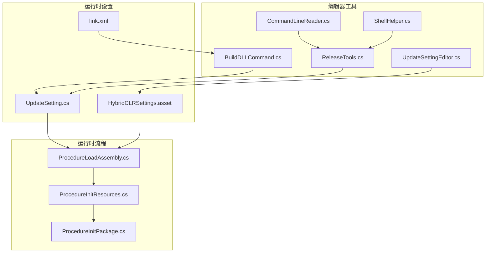
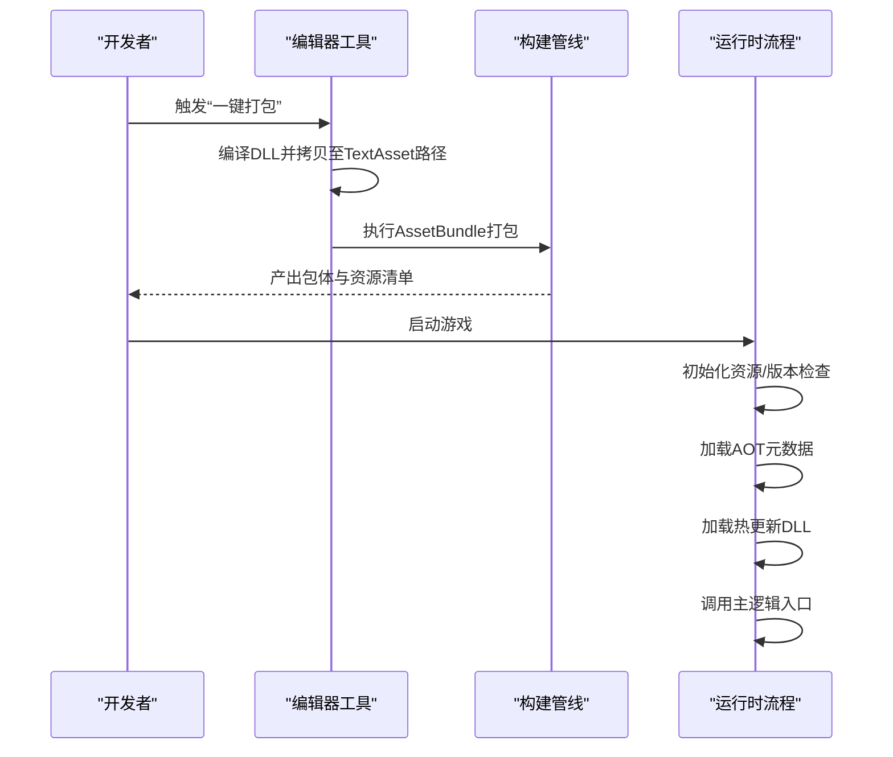
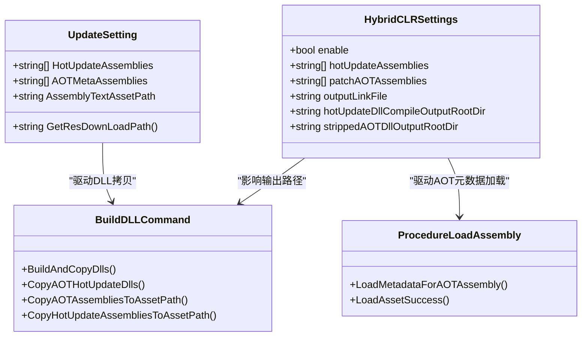
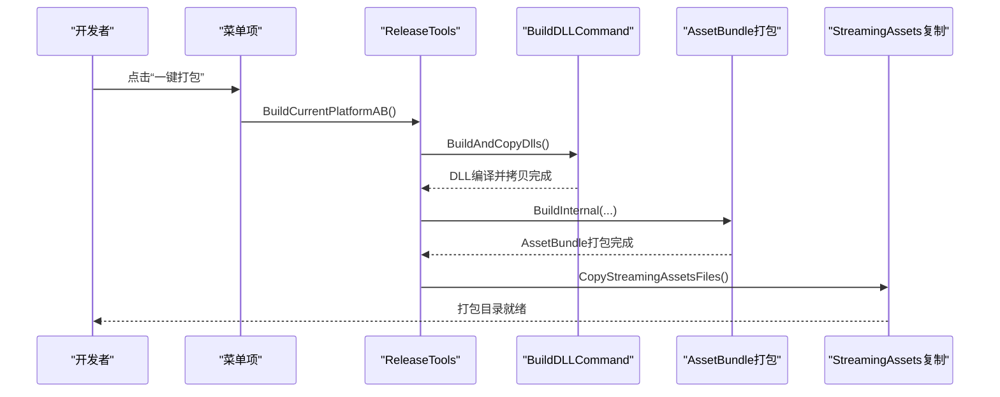
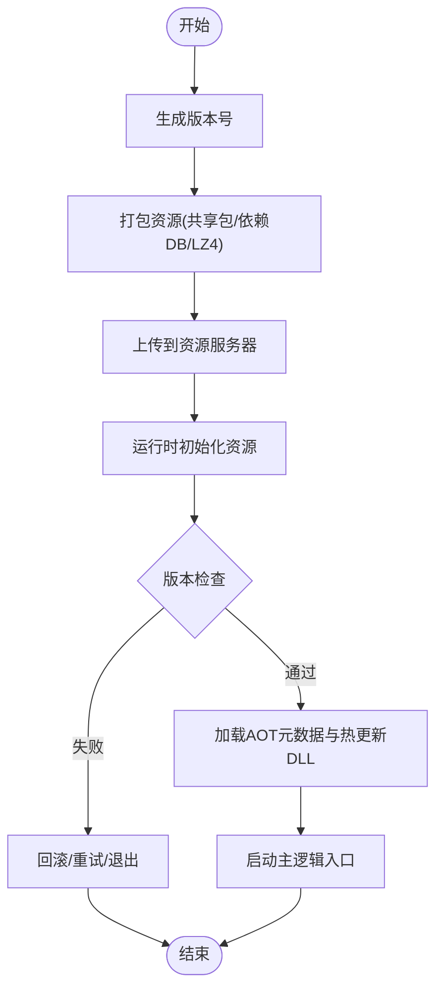
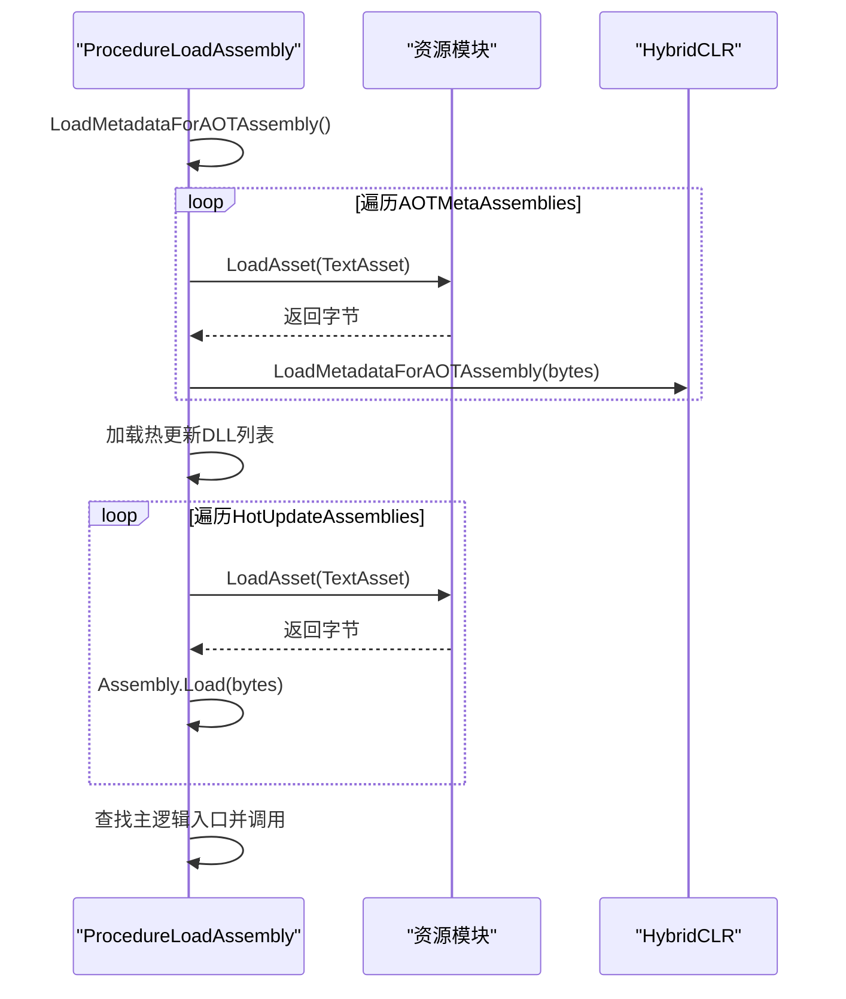
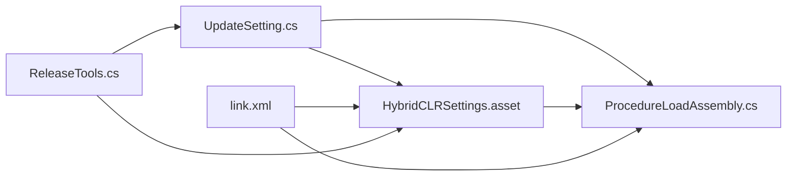

# 热更新发布流程

<cite>
**本文档引用的文件**
- [HybridCLRSettings.asset](file://ProjectSettings/HybridCLRSettings.asset)
- [BuildDLLCommand.cs](file://Assets/TEngine/Editor/HybridCLR/BuildDLLCommand.cs)
- [UpdateSettingEditor.cs](file://Assets/TEngine/Editor/Utility/UpdateSettingEditor.cs)
- [ReleaseTools.cs](file://Assets/TEngine/Editor/ReleaseTools/ReleaseTools.cs)
- [UpdateSetting.cs](file://Assets/TEngine/Runtime/Core/UpdateSetting.cs)
- [ProcedureLoadAssembly.cs](file://Assets/GameScripts/Procedure/ProcedureLoadAssembly.cs)
- [link.xml](file://Assets/HybridCLRGenerate/link.xml)
- [ProcedureInitResources.cs](file://Assets/GameScripts/Procedure/ProcedureInitResources.cs)
- [ProcedureInitPackage.cs](file://Assets/GameScripts/Procedure/ProcedureInitPackage.cs)
- [CommandLineReader.cs](file://Assets/TEngine/Editor/Utility/CommandLineReader.cs)
- [ShellHelper.cs](file://Assets/TEngine/Editor/Utility/ShellHelper.cs)
</cite>

## 目录
1. [简介](#简介)
2. [项目结构](#项目结构)
3. [核心组件](#核心组件)
4. [架构总览](#架构总览)
5. [详细组件分析](#详细组件分析)
6. [依赖关系分析](#依赖关系分析)
7. [性能考量](#性能考量)
8. [故障排查指南](#故障排查指南)
9. [结论](#结论)
10. [附录](#附录)

## 简介
本文件系统性梳理TEngine项目的热更新发布流程，涵盖从代码编译、DLL生成、AOT预编译、资源打包到运行时加载的全链路。重点说明HybridCLR的配置与使用（热更新程序集、AOT程序集、链接文件生成），并给出版本管理策略（版本号规则、增量更新、回滚）、发布工具使用指南（一键发布、版本检查、发布验证）以及最佳实践与常见问题解决方案。

## 项目结构
TEngine采用模块化与分层架构，热更新相关能力主要分布在以下区域：
- 编辑器工具：HybridCLR编译与拷贝、打包工具、命令行参数解析、Shell执行
- 运行时设置：热更新程序集列表、AOT元数据程序集、资源下载路径、打包地址等
- 运行时流程：资源初始化、热更新程序集加载、AOT元数据补全
- 构建产物：link.xml链接文件、裁剪后的AOT DLL、热更新DLL

**图表来源**
- [BuildDLLCommand.cs:86-134](file://Assets/TEngine/Editor/HybridCLR/BuildDLLCommand.cs#L86-L134)
- [ReleaseTools.cs:60-69](file://Assets/TEngine/Editor/ReleaseTools/ReleaseTools.cs#L60-L69)
- [UpdateSettingEditor.cs:16-72](file://Assets/TEngine/Editor/Utility/UpdateSettingEditor.cs#L16-L72)
- [UpdateSetting.cs:50-220](file://Assets/TEngine/Runtime/Core/UpdateSetting.cs#L50-L220)
- [ProcedureLoadAssembly.cs:19-122](file://Assets/GameScripts/Procedure/ProcedureLoadAssembly.cs#L19-L122)
- [ProcedureInitResources.cs:38-105](file://Assets/GameScripts/Procedure/ProcedureInitResources.cs#L38-L105)
- [ProcedureInitPackage.cs:69-103](file://Assets/GameScripts/Procedure/ProcedureInitPackage.cs#L69-L103)
- [link.xml:1-186](file://Assets/HybridCLRGenerate/link.xml#L1-L186)

**章节来源**
- [BuildDLLCommand.cs:86-134](file://Assets/TEngine/Editor/HybridCLR/BuildDLLCommand.cs#L86-L134)
- [ReleaseTools.cs:60-69](file://Assets/TEngine/Editor/ReleaseTools/ReleaseTools.cs#L60-L69)
- [UpdateSettingEditor.cs:16-72](file://Assets/TEngine/Editor/Utility/UpdateSettingEditor.cs#L16-L72)
- [UpdateSetting.cs:50-220](file://Assets/TEngine/Runtime/Core/UpdateSetting.cs#L50-L220)
- [ProcedureLoadAssembly.cs:19-122](file://Assets/GameScripts/Procedure/ProcedureLoadAssembly.cs#L19-L122)
- [ProcedureInitResources.cs:38-105](file://Assets/GameScripts/Procedure/ProcedureInitResources.cs#L38-L105)
- [ProcedureInitPackage.cs:69-103](file://Assets/GameScripts/Procedure/ProcedureInitPackage.cs#L69-L103)
- [link.xml:1-186](file://Assets/HybridCLRGenerate/link.xml#L1-L186)

## 核心组件
- 热更新配置与设置
  - UpdateSetting：集中管理热更新程序集、AOT元数据程序集、资源下载路径、打包地址、版本号规则等
  - HybridCLRSettings：全局热更新开关、热更新程序集、AOT程序集、输出目录、链接文件路径等
- 编辑器构建工具
  - BuildDLLCommand：编译DLL并拷贝至StreamingAssets/TextAsset路径
  - ReleaseTools：一键打包AssetBundle、复制StreamingAssets、构建最终可执行文件
  - UpdateSettingEditor：同步UpdateSetting与HybridCLRSettings
  - CommandLineReader/ShellHelper：批处理与命令行参数传递
- 运行时加载流程
  - ProcedureLoadAssembly：按配置加载热更新DLL与AOT元数据
  - ProcedureInitResources/ProcedureInitPackage：资源初始化与版本检查、下载与回滚

**章节来源**
- [UpdateSetting.cs:50-220](file://Assets/TEngine/Runtime/Core/UpdateSetting.cs#L50-L220)
- [HybridCLRSettings.asset:15-39](file://ProjectSettings/HybridCLRSettings.asset#L15-L39)
- [BuildDLLCommand.cs:86-134](file://Assets/TEngine/Editor/HybridCLR/BuildDLLCommand.cs#L86-L134)
- [ReleaseTools.cs:60-69](file://Assets/TEngine/Editor/ReleaseTools/ReleaseTools.cs#L60-L69)
- [UpdateSettingEditor.cs:16-72](file://Assets/TEngine/Editor/Utility/UpdateSettingEditor.cs#L16-L72)
- [ProcedureLoadAssembly.cs:19-122](file://Assets/GameScripts/Procedure/ProcedureLoadAssembly.cs#L19-L122)
- [ProcedureInitResources.cs:38-105](file://Assets/GameScripts/Procedure/ProcedureInitResources.cs#L38-L105)
- [ProcedureInitPackage.cs:69-103](file://Assets/GameScripts/Procedure/ProcedureInitPackage.cs#L69-L103)

## 架构总览
热更新发布流程由“编辑器构建”和“运行时加载”两大部分组成。编辑器侧负责编译、生成链接文件、拷贝DLL、打包资源；运行时侧负责资源版本检查、热更新DLL与AOT元数据加载、启动主逻辑入口。

**图表来源**
- [ReleaseTools.cs:60-69](file://Assets/TEngine/Editor/ReleaseTools/ReleaseTools.cs#L60-L69)
- [BuildDLLCommand.cs:86-134](file://Assets/TEngine/Editor/HybridCLR/BuildDLLCommand.cs#L86-L134)
- [ProcedureInitResources.cs:38-105](file://Assets/GameScripts/Procedure/ProcedureInitResources.cs#L38-L105)
- [ProcedureLoadAssembly.cs:19-122](file://Assets/GameScripts/Procedure/ProcedureLoadAssembly.cs#L19-L122)

## 详细组件分析

### HybridCLR配置与使用
- 热更新程序集设置
  - UpdateSetting.HotUpdateAssemblies：声明需要热更新的程序集集合
  - UpdateSettingEditor同步：将UpdateSetting变更写入HybridCLRSettings，确保构建与运行一致
- AOT程序集与元数据
  - HybridCLRSettings.patchAOTAssemblies：声明需要补充元数据的AOT程序集
  - ProcedureLoadAssembly.LoadMetadataForAOTAssembly：运行时加载AOT元数据，保证泛型等特性可用
- 链接文件生成
  - link.xml：定义需要保留的类型/成员，避免AOT裁剪导致运行时缺失
  - 输出位置：HybridCLRSettings.outputLinkFile指定生成路径

**图表来源**
- [UpdateSetting.cs:70-90](file://Assets/TEngine/Runtime/Core/UpdateSetting.cs#L70-L90)
- [HybridCLRSettings.asset:15-39](file://ProjectSettings/HybridCLRSettings.asset#L15-L39)
- [BuildDLLCommand.cs:86-134](file://Assets/TEngine/Editor/HybridCLR/BuildDLLCommand.cs#L86-L134)
- [ProcedureLoadAssembly.cs:224-292](file://Assets/GameScripts/Procedure/ProcedureLoadAssembly.cs#L224-L292)

**章节来源**
- [UpdateSetting.cs:70-90](file://Assets/TEngine/Runtime/Core/UpdateSetting.cs#L70-L90)
- [HybridCLRSettings.asset:15-39](file://ProjectSettings/HybridCLRSettings.asset#L15-L39)
- [UpdateSettingEditor.cs:44-70](file://Assets/TEngine/Editor/Utility/UpdateSettingEditor.cs#L44-L70)
- [BuildDLLCommand.cs:86-134](file://Assets/TEngine/Editor/HybridCLR/BuildDLLCommand.cs#L86-L134)
- [ProcedureLoadAssembly.cs:224-292](file://Assets/GameScripts/Procedure/ProcedureLoadAssembly.cs#L224-L292)
- [link.xml:1-186](file://Assets/HybridCLRGenerate/link.xml#L1-L186)

### 发布工具与一键发布流程
- 一键打包（编辑器）
  - ReleaseTools.BuildCurrentPlatformAB：编译DLL并拷贝至TextAsset路径，随后打包AssetBundle，最后复制StreamingAssets文件
  - ReleaseTools.AutomationBuild/Android/IOS：自动化构建各平台可执行文件
- 命令行参数
  - CommandLineReader：解析自定义参数（如outputRoot、packageVersion、platform），支持批处理
  - ShellHelper：在编辑器内执行外部命令，便于CI集成

**图表来源**
- [ReleaseTools.cs:60-69](file://Assets/TEngine/Editor/ReleaseTools/ReleaseTools.cs#L60-L69)
- [ReleaseTools.cs:180-239](file://Assets/TEngine/Editor/ReleaseTools/ReleaseTools.cs#L180-L239)
- [ReleaseTools.cs:73-142](file://Assets/TEngine/Editor/ReleaseTools/ReleaseTools.cs#L73-L142)
- [BuildDLLCommand.cs:86-134](file://Assets/TEngine/Editor/HybridCLR/BuildDLLCommand.cs#L86-L134)

**章节来源**
- [ReleaseTools.cs:60-69](file://Assets/TEngine/Editor/ReleaseTools/ReleaseTools.cs#L60-L69)
- [ReleaseTools.cs:180-239](file://Assets/TEngine/Editor/ReleaseTools/ReleaseTools.cs#L180-L239)
- [ReleaseTools.cs:73-142](file://Assets/TEngine/Editor/ReleaseTools/ReleaseTools.cs#L73-L142)
- [BuildDLLCommand.cs:86-134](file://Assets/TEngine/Editor/HybridCLR/BuildDLLCommand.cs#L86-L134)
- [CommandLineReader.cs:64-99](file://Assets/TEngine/Editor/Utility/CommandLineReader.cs#L64-L99)
- [ShellHelper.cs:13-105](file://Assets/TEngine/Editor/Utility/ShellHelper.cs#L13-105)

### 版本管理策略
- 版本号规则
  - ReleaseTools.GetBuildPackageVersion：基于日期与分钟数生成版本号，确保唯一性
- 增量更新机制
  - YooAsset打包参数：启用共享资源打包、使用资源依赖数据库、LZ4压缩、可寻址资源替代路径等，提升增量效率
- 回滚方案
  - ProcedureInitPackage/ProcedureInitResources：当资源初始化失败或版本获取失败时，提供重试与退出选项，保障稳定性

**图表来源**
- [ReleaseTools.cs:320-326](file://Assets/TEngine/Editor/ReleaseTools/ReleaseTools.cs#L320-L326)
- [ReleaseTools.cs:212-228](file://Assets/TEngine/Editor/ReleaseTools/ReleaseTools.cs#L212-L228)
- [ProcedureInitPackage.cs:69-103](file://Assets/GameScripts/Procedure/ProcedureInitPackage.cs#L69-L103)
- [ProcedureInitResources.cs:38-105](file://Assets/GameScripts/Procedure/ProcedureInitResources.cs#L38-L105)

**章节来源**
- [ReleaseTools.cs:320-326](file://Assets/TEngine/Editor/ReleaseTools/ReleaseTools.cs#L320-L326)
- [ReleaseTools.cs:212-228](file://Assets/TEngine/Editor/ReleaseTools/ReleaseTools.cs#L212-L228)
- [ProcedureInitPackage.cs:69-103](file://Assets/GameScripts/Procedure/ProcedureInitPackage.cs#L69-L103)
- [ProcedureInitResources.cs:38-105](file://Assets/GameScripts/Procedure/ProcedureInitResources.cs#L38-L105)

### 运行时加载流程
- AOT元数据加载
  - ProcedureLoadAssembly.LoadMetadataForAOTAssembly：从TextAsset加载AOT元数据，确保泛型等特性可用
- 热更新DLL加载
  - 按UpdateSetting.HotUpdateAssemblies逐个加载，完成后进入启动流程
- 启动主逻辑
  - 查找主逻辑程序集与类型方法，调用入口方法

**图表来源**
- [ProcedureLoadAssembly.cs:224-292](file://Assets/GameScripts/Procedure/ProcedureLoadAssembly.cs#L224-L292)
- [ProcedureLoadAssembly.cs:50-122](file://Assets/GameScripts/Procedure/ProcedureLoadAssembly.cs#L50-L122)

**章节来源**
- [ProcedureLoadAssembly.cs:224-292](file://Assets/GameScripts/Procedure/ProcedureLoadAssembly.cs#L224-L292)
- [ProcedureLoadAssembly.cs:50-122](file://Assets/GameScripts/Procedure/ProcedureLoadAssembly.cs#L50-L122)

## 依赖关系分析
- 配置耦合
  - UpdateSetting与HybridCLRSettings双向同步，确保构建与运行一致
- 构建产物依赖
  - link.xml决定AOT裁剪范围，直接影响运行时行为
  - 裁剪后的AOT DLL需与Unity构建产物一致，否则元数据加载失败
- 运行时依赖
  - ProcedureLoadAssembly依赖UpdateSetting与资源模块，负责热更新DLL与AOT元数据加载

**图表来源**
- [UpdateSetting.cs:70-90](file://Assets/TEngine/Runtime/Core/UpdateSetting.cs#L70-L90)
- [HybridCLRSettings.asset:15-39](file://ProjectSettings/HybridCLRSettings.asset#L15-L39)
- [ProcedureLoadAssembly.cs:224-292](file://Assets/GameScripts/Procedure/ProcedureLoadAssembly.cs#L224-L292)
- [link.xml:1-186](file://Assets/HybridCLRGenerate/link.xml#L1-L186)
- [ReleaseTools.cs:60-69](file://Assets/TEngine/Editor/ReleaseTools/ReleaseTools.cs#L60-L69)

**章节来源**
- [UpdateSetting.cs:70-90](file://Assets/TEngine/Runtime/Core/UpdateSetting.cs#L70-L90)
- [HybridCLRSettings.asset:15-39](file://ProjectSettings/HybridCLRSettings.asset#L15-L39)
- [ProcedureLoadAssembly.cs:224-292](file://Assets/GameScripts/Procedure/ProcedureLoadAssembly.cs#L224-L292)
- [link.xml:1-186](file://Assets/HybridCLRGenerate/link.xml#L1-L186)
- [ReleaseTools.cs:60-69](file://Assets/TEngine/Editor/ReleaseTools/ReleaseTools.cs#L60-L69)

## 性能考量
- 增量打包
  - 启用共享资源打包与资源依赖数据库，减少重复打包与传输
  - LZ4压缩在保证速度的同时兼顾体积
- 运行时加载
  - 将热更新DLL与AOT元数据以TextAsset形式加载，避免额外IO开销
  - 仅在必要时加载AOT元数据，减少启动时间

[本节为通用指导，无需具体文件分析]

## 故障排查指南
- DLL拷贝失败
  - 确认BuildDLLCommand已执行且目标路径存在
  - 检查UpdateSetting.AssemblyTextAssetPath与HybridCLRSettings配置一致
- AOT元数据加载失败
  - 确认裁剪后的AOT DLL已生成并拷贝至TextAsset路径
  - 检查ProcedureLoadAssembly.LoadMetadataForAOTAssembly日志与异常
- 版本检查失败
  - ProcedureInitResources/ProcedureInitPackage提供重试与错误提示
  - 检查资源服务器地址与网络连通性
- 命令行参数缺失
  - 使用CommandLineReader校验CustomArgs传入参数
  - ShellHelper执行外部命令时关注输出与错误日志

**章节来源**
- [BuildDLLCommand.cs:104-134](file://Assets/TEngine/Editor/HybridCLR/BuildDLLCommand.cs#L104-L134)
- [ProcedureLoadAssembly.cs:224-292](file://Assets/GameScripts/Procedure/ProcedureLoadAssembly.cs#L224-L292)
- [ProcedureInitResources.cs:112-131](file://Assets/GameScripts/Procedure/ProcedureInitResources.cs#L112-L131)
- [ProcedureInitPackage.cs:69-103](file://Assets/GameScripts/Procedure/ProcedureInitPackage.cs#L69-L103)
- [CommandLineReader.cs:64-99](file://Assets/TEngine/Editor/Utility/CommandLineReader.cs#L64-L99)
- [ShellHelper.cs:13-105](file://Assets/TEngine/Editor/Utility/ShellHelper.cs#L13-L105)

## 结论
TEngine的热更新发布流程通过“编辑器构建+运行时加载”的双轨设计，实现了稳定的热更新能力。HybridCLR配置与UpdateSetting紧密配合，结合link.xml与AOT元数据补全，确保运行时特性完备。ReleaseTools提供一键式打包与自动化构建，结合YooAsset的增量策略与版本管理，形成可落地的发布体系。建议在实际项目中严格遵循配置同步、版本号规则与回滚策略，并在CI中集成命令行参数与ShellHelper，以实现持续交付。

[本节为总结性内容，无需具体文件分析]

## 附录
- 最佳实践
  - 在UpdateSetting中明确声明热更新与AOT程序集，避免遗漏
  - 定期更新link.xml，确保反射/泛型相关类型不被裁剪
  - 使用ReleaseTools的“一键打包”流程，确保构建一致性
  - 在CI中通过CommandLineReader传入outputRoot与packageVersion，实现可追溯的版本发布
- 常见问题
  - DLL拷贝路径不一致：检查UpdateSetting.AssemblyTextAssetPath与HybridCLRSettings输出目录
  - AOT元数据缺失：确认Unity构建后已生成裁剪后的AOT DLL并拷贝
  - 版本获取失败：检查资源服务器地址、网络连通性与版本号格式

[本节为通用指导，无需具体文件分析]