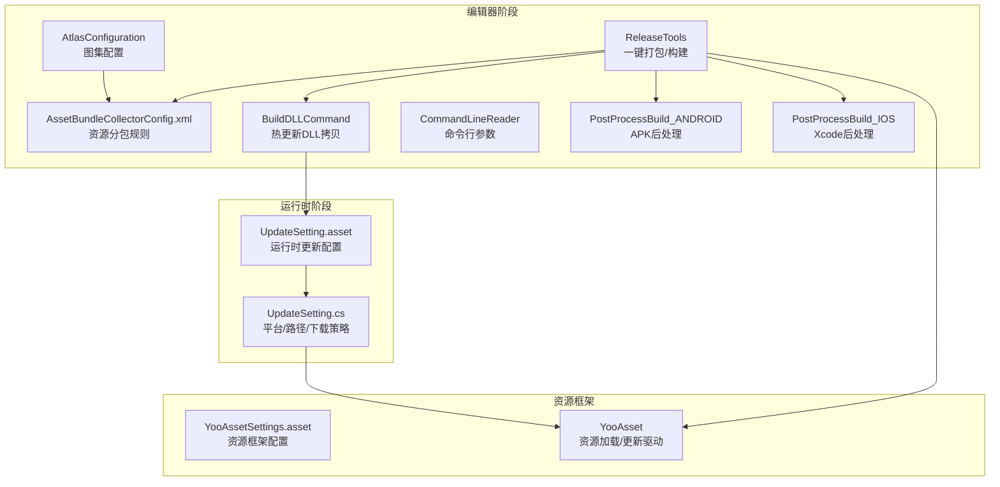
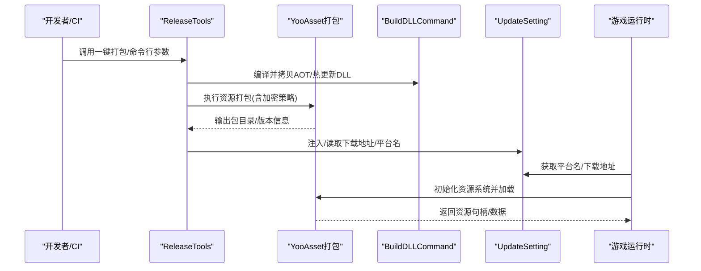
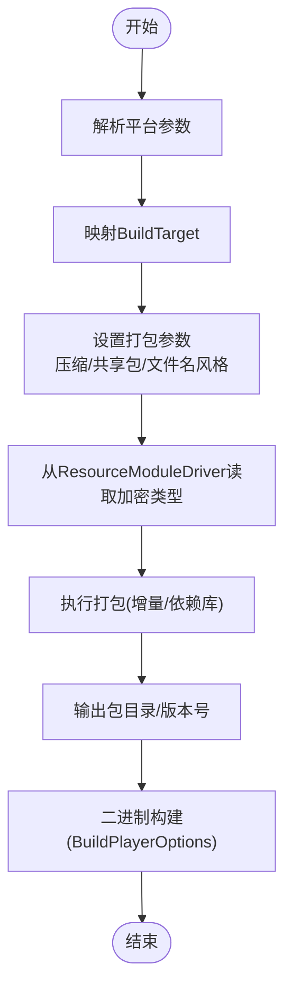
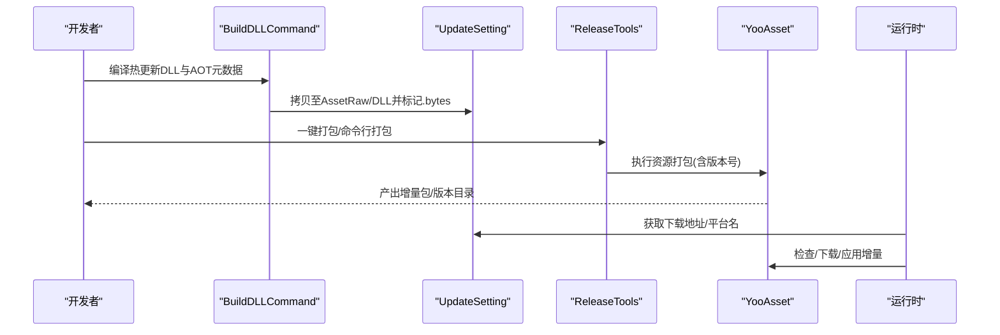
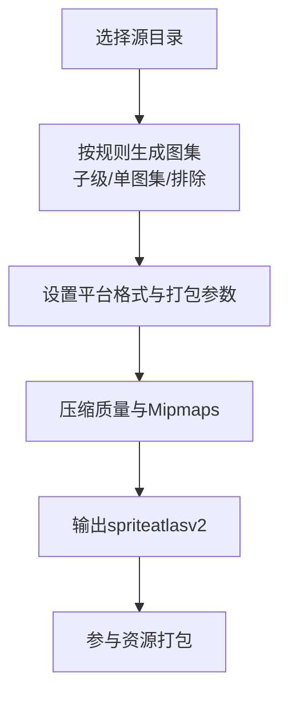
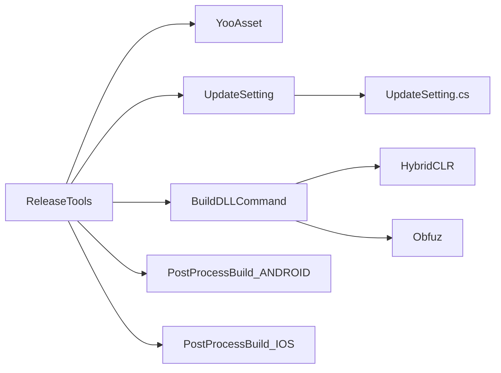

# 部署发布

<cite>
**本文引用的文件**   
- [ReleaseTools.cs](file://Assets/TEngine/Editor/ReleaseTools/ReleaseTools.cs)
- [AssetBundleCollectorConfig.xml](file://Assets/Editor/AssetBundleCollector/AssetBundleCollectorConfig.xml)
- [UpdateSetting.asset](file://Assets/TEngine/Settings/UpdateSetting.asset)
- [UpdateSetting.cs](file://Assets/TEngine/Runtime/Core/UpdateSetting.cs)
- [AtlasConfiguration.cs](file://Assets/TEngine/Editor/AtlasMakerEditor/AtlasConfiguration.cs)
- [PostProcessBuild_ANDROID.cs](file://Assets/TEngine/Editor/Localization/PostProcessBuild_ANDROID.cs)
- [PostProcessBuild_IOS.cs](file://Assets/TEngine/Editor/Localization/PostProcessBuild_IOS.cs)
- [CommandLineReader.cs](file://Assets/TEngine/Editor/Utility/CommandLineReader.cs)
- [BuildDLLCommand.cs](file://Assets/TEngine/Editor/HybridCLR/BuildDLLCommand.cs)
- [AssetBundleCollectorSetting.asset](file://Assets/Editor/AssetBundleCollector/AssetBundleCollectorSetting.asset)
- [YooAssetSettings.asset](file://Assets/TEngine/Settings/Resources/YooAssetSettings.asset)
- [BuildPlayerOptions](file://Assets/TEngine/Editor/ReleaseTools/ReleaseTools.cs)
- [BuildTarget](file://Assets/TEngine/Editor/ReleaseTools/ReleaseTools.cs)
- [BuildResult](file://Assets/TEngine/Editor/ReleaseTools/ReleaseTools.cs)
- [IEncryptionServices](file://Assets/TEngine/Editor/ReleaseTools/ReleaseTools.cs)
- [ResourceModuleDriver](file://Assets/TEngine/Editor/ReleaseTools/ReleaseTools.cs)
- [GameEntry.prefab](file://Assets/TEngine/Settings/Prefab/GameEntry.prefab)
- [EditorBuildSettings](file://Assets/TEngine/Editor/ReleaseTools/ReleaseTools.cs)
- [BuildPipeline](file://Assets/TEngine/Editor/ReleaseTools/ReleaseTools.cs)
- [BuildParameters](file://Assets/TEngine/Editor/ReleaseTools/ReleaseTools.cs)
- [IBuildPipeline](file://Assets/TEngine/Editor/ReleaseTools/ReleaseTools.cs)
- [BuiltinBuildParameters](file://Assets/TEngine/Editor/ReleaseTools/ReleaseTools.cs)
- [ScriptableBuildParameters](file://Assets/TEngine/Editor/ReleaseTools/ReleaseTools.cs)
- [DefaultPackRule](file://Assets/TEngine/Editor/ReleaseTools/ReleaseTools.cs)
- [AssetBundleBuilderHelper](file://Assets/TEngine/Editor/ReleaseTools/ReleaseTools.cs)
- [YooAsset](file://Assets/TEngine/Editor/ReleaseTools/ReleaseTools.cs)
- [HybridCLR](file://Assets/TEngine/Editor/HybridCLR/BuildDLLCommand.cs)
- [Obfuz](file://Assets/TEngine/Editor/HybridCLR/BuildDLLCommand.cs)
- [UpdateSettingEditor.cs](file://Assets/TEngine/Editor/Utility/UpdateSettingEditor.cs)
- [HtmlToUGUI README.md](file://Assets/HtmlToUGUI/README.md)
</cite>

## 目录
1. [简介](#简介)
2. [项目结构](#项目结构)
3. [核心组件](#核心组件)
4. [架构总览](#架构总览)
5. [详细组件分析](#详细组件分析)
6. [依赖分析](#依赖分析)
7. [性能考虑](#性能考虑)
8. [故障排查指南](#故障排查指南)
9. [结论](#结论)
10. [附录](#附录)

## 简介
本文件面向TEngine部署发布系统，围绕多平台构建（Android、iOS、Windows、WebGL等）、热更新发布流程（资源打包、版本管理、增量更新）、图集生成与优化（Atlas配置、纹理压缩、分辨率适配）、发布工具使用（一键打包、版本检查、发布验证）、自动化与CI/CD集成、发布示例与常见问题展开，帮助研发与运营团队高效、稳定地交付产品。

## 项目结构
TEngine的发布体系由“编辑器打包工具 + 资源收集配置 + 热更新DLL拷贝 + 平台后处理 + 运行时配置”构成，核心文件分布如下：
- 发布工具与构建流程：Assets/TEngine/Editor/ReleaseTools/ReleaseTools.cs
- 资源打包配置：Assets/Editor/AssetBundleCollector/AssetBundleCollectorConfig.xml
- 热更新DLL拷贝与宏定义：Assets/TEngine/Editor/HybridCLR/BuildDLLCommand.cs
- 命令行参数解析：Assets/TEngine/Editor/Utility/CommandLineReader.cs
- 图集生成配置：Assets/TEngine/Editor/AtlasMakerEditor/AtlasConfiguration.cs
- 平台后处理（Android/iOS本地化）：Assets/TEngine/Editor/Localization/PostProcessBuild_ANDROID.cs、PostProcessBuild_IOS.cs
- 运行时更新配置：Assets/TEngine/Settings/UpdateSetting.asset、Runtime/Core/UpdateSetting.cs
- HTML到UGUI动态适配：Assets/HtmlToUGUI/README.md

**图表来源**
- [ReleaseTools.cs:180-239](file://Assets/TEngine/Editor/ReleaseTools/ReleaseTools.cs#L180-L239)
- [AssetBundleCollectorConfig.xml:1-48](file://Assets/Editor/AssetBundleCollector/AssetBundleCollectorConfig.xml#L1-L48)
- [BuildDLLCommand.cs:86-134](file://Assets/TEngine/Editor/HybridCLR/BuildDLLCommand.cs#L86-L134)
- [UpdateSetting.asset:15-36](file://Assets/TEngine/Settings/UpdateSetting.asset#L15-L36)
- [UpdateSetting.cs:164-178](file://Assets/TEngine/Runtime/Core/UpdateSetting.cs#L164-L178)
- [YooAssetSettings.asset](file://Assets/TEngine/Settings/Resources/YooAssetSettings.asset)

**章节来源**
- [ReleaseTools.cs:1-376](file://Assets/TEngine/Editor/ReleaseTools/ReleaseTools.cs#L1-L376)
- [AssetBundleCollectorConfig.xml:1-48](file://Assets/Editor/AssetBundleCollector/AssetBundleCollectorConfig.xml#L1-L48)
- [BuildDLLCommand.cs:1-174](file://Assets/TEngine/Editor/HybridCLR/BuildDLLCommand.cs#L1-L174)
- [UpdateSetting.asset:1-37](file://Assets/TEngine/Settings/UpdateSetting.asset#L1-L37)
- [UpdateSetting.cs:1-220](file://Assets/TEngine/Runtime/Core/UpdateSetting.cs#L1-L220)
- [YooAssetSettings.asset](file://Assets/TEngine/Settings/Resources/YooAssetSettings.asset)

## 核心组件
- 发布工具（ReleaseTools）：提供一键打包、平台选择、版本号生成、资源打包、二进制构建、加密策略注入、StreamingAssets复制等能力。
- 资源收集配置（AssetBundleCollectorConfig.xml）：定义包组、采集器、打包规则、地址规则等，支撑YooAsset分包与寻址。
- 热更新DLL拷贝（BuildDLLCommand）：编译并拷贝AOT与热更新DLL至指定目录，配合运行时UpdateSetting进行加载。
- 命令行参数（CommandLineReader）：支持批处理与CI/CD调用，传递outputRoot、packageVersion、platform等参数。
- 图集配置（AtlasConfiguration）：集中管理图集输出目录、源目录、平台格式、打包参数、压缩质量、排除关键词等。
- 平台后处理（PostProcessBuild_ANDROID/IOS）：在构建APK/Xcode工程后写入本地化字符串或Info.plist字段。
- 运行时更新配置（UpdateSetting.asset & UpdateSetting.cs）：定义下载地址、WebGL加载策略、可寻址资源替换、打包地址等。

**章节来源**
- [ReleaseTools.cs:18-376](file://Assets/TEngine/Editor/ReleaseTools/ReleaseTools.cs#L18-L376)
- [AssetBundleCollectorConfig.xml:1-48](file://Assets/Editor/AssetBundleCollector/AssetBundleCollectorConfig.xml#L1-L48)
- [BuildDLLCommand.cs:86-174](file://Assets/TEngine/Editor/HybridCLR/BuildDLLCommand.cs#L86-L174)
- [CommandLineReader.cs:1-121](file://Assets/TEngine/Editor/Utility/CommandLineReader.cs#L1-L121)
- [AtlasConfiguration.cs:1-55](file://Assets/TEngine/Editor/AtlasMakerEditor/AtlasConfiguration.cs#L1-L55)
- [PostProcessBuild_ANDROID.cs:1-151](file://Assets/TEngine/Editor/Localization/PostProcessBuild_ANDROID.cs#L1-L151)
- [PostProcessBuild_IOS.cs:1-102](file://Assets/TEngine/Editor/Localization/PostProcessBuild_IOS.cs#L1-L102)
- [UpdateSetting.asset:15-36](file://Assets/TEngine/Settings/UpdateSetting.asset#L15-L36)
- [UpdateSetting.cs:164-178](file://Assets/TEngine/Runtime/Core/UpdateSetting.cs#L164-L178)

## 架构总览
下图展示从编辑器到运行时的关键交互：编辑器侧通过ReleaseTools执行资源打包与二进制构建，同时根据UpdateSetting注入加密策略；运行时通过YooAsset加载资源，按UpdateSetting的下载策略与平台名称拼接资源路径。

**图表来源**
- [ReleaseTools.cs:180-239](file://Assets/TEngine/Editor/ReleaseTools/ReleaseTools.cs#L180-L239)
- [BuildDLLCommand.cs:86-134](file://Assets/TEngine/Editor/HybridCLR/BuildDLLCommand.cs#L86-L134)
- [UpdateSetting.cs:164-178](file://Assets/TEngine/Runtime/Core/UpdateSetting.cs#L164-L178)

## 详细组件分析

### 多平台构建配置与流程
- 平台映射与构建目标：ReleaseTools根据传入platform参数映射到具体BuildTarget，并在BuildImp中使用BuildPlayerOptions进行二进制构建。
- 资源打包参数：BuildInternal设置打包管线、压缩选项、共享包规则、文件名风格、内置文件复制策略、加密服务、增量构建与依赖库等。
- 增量构建与缓存：通过禁用清理构建缓存与启用依赖数据库，显著提升重复打包速度。
- 加密策略注入：从GameEntry的ResourceModuleDriver读取加密类型，动态创建IEncryptionServices实例注入打包流程。
- 一键打包菜单：提供Windows/Android/iOS等平台的快捷入口，自动刷新资源并触发打包与二进制构建。

**图表来源**
- [ReleaseTools.cs:143-178](file://Assets/TEngine/Editor/ReleaseTools/ReleaseTools.cs#L143-L178)
- [ReleaseTools.cs:180-239](file://Assets/TEngine/Editor/ReleaseTools/ReleaseTools.cs#L180-L239)
- [ReleaseTools.cs:351-374](file://Assets/TEngine/Editor/ReleaseTools/ReleaseTools.cs#L351-L374)

**章节来源**
- [ReleaseTools.cs:143-178](file://Assets/TEngine/Editor/ReleaseTools/ReleaseTools.cs#L143-L178)
- [ReleaseTools.cs:180-239](file://Assets/TEngine/Editor/ReleaseTools/ReleaseTools.cs#L180-L239)
- [ReleaseTools.cs:351-374](file://Assets/TEngine/Editor/ReleaseTools/ReleaseTools.cs#L351-L374)

### 热更新发布流程（DLL、版本管理、增量更新）
- DLL编译与拷贝：BuildDLLCommand负责编译热更新DLL与AOT补充元数据，并将其复制到UpdateSetting指定的资源路径，供运行时加载。
- 热更新DLL集合：UpdateSetting中维护HotUpdateAssemblies与AOTMetaAssemblies，运行时通过ProcedureLoadAssembly识别主业务DLL与热更新DLL并加载。
- 版本管理：ReleaseTools生成基于日期与分钟数的版本号，作为包版本号参与资源打包与下载路径拼接。
- 增量更新：YooAsset支持增量更新，ReleaseTools通过启用依赖数据库与禁用清理缓存，配合YooAsset的版本对比实现增量打包与下发。

**图表来源**
- [BuildDLLCommand.cs:86-134](file://Assets/TEngine/Editor/HybridCLR/BuildDLLCommand.cs#L86-L134)
- [UpdateSetting.cs:164-178](file://Assets/TEngine/Runtime/Core/UpdateSetting.cs#L164-L178)
- [ReleaseTools.cs:322-326](file://Assets/TEngine/Editor/ReleaseTools/ReleaseTools.cs#L322-L326)

**章节来源**
- [BuildDLLCommand.cs:86-134](file://Assets/TEngine/Editor/HybridCLR/BuildDLLCommand.cs#L86-L134)
- [UpdateSetting.cs:72-90](file://Assets/TEngine/Runtime/Core/UpdateSetting.cs#L72-L90)
- [ReleaseTools.cs:322-326](file://Assets/TEngine/Editor/ReleaseTools/ReleaseTools.cs#L322-L326)

### 图集生成与优化配置
- 目录与格式：AtlasConfiguration集中定义输出目录、源目录（含子级图集、单图集、排除目录）、平台纹理格式（Android/iOS/WebGL）。
- 打包参数：padding、rotation、blockOffset、tightPacking等影响图集密度与旋转策略。
- 压缩与Mipmaps：compressionQuality控制压缩质量；checkMipmaps/enableMipmaps控制mipmap生成策略。
- 排除关键词：excludeKeywords用于过滤不需要进入图集的资源。
- 与资源收集联动：图集生成通常在资源打包前完成，AtlasConfiguration与AssetBundleCollectorConfig共同决定最终包体结构。

**图表来源**
- [AtlasConfiguration.cs:10-51](file://Assets/TEngine/Editor/AtlasMakerEditor/AtlasConfiguration.cs#L10-L51)
- [AssetBundleCollectorConfig.xml:32-35](file://Assets/Editor/AssetBundleCollector/AssetBundleCollectorConfig.xml#L32-L35)

**章节来源**
- [AtlasConfiguration.cs:10-51](file://Assets/TEngine/Editor/AtlasMakerEditor/AtlasConfiguration.cs#L10-L51)
- [AssetBundleCollectorConfig.xml:32-35](file://Assets/Editor/AssetBundleCollector/AssetBundleCollectorConfig.xml#L32-L35)

### 发布工具使用指南（一键打包、版本检查、发布验证）
- 一键打包：通过菜单项“TEngine/Build/一键打包AssetBundle”或“一键打包Windows/Android/iOS”触发，自动刷新资源、执行资源打包与二进制构建。
- 版本检查：ReleaseTools生成版本号，可在打包日志中核对；UpdateSetting提供下载地址与备用地址，便于验证资源可达性。
- 发布验证：构建完成后检查输出包目录与二进制产物，运行时通过UpdateSetting的平台名与下载地址确认资源加载路径正确。

**章节来源**
- [ReleaseTools.cs:60-69](file://Assets/TEngine/Editor/ReleaseTools/ReleaseTools.cs#L60-L69)
- [ReleaseTools.cs:310-349](file://Assets/TEngine/Editor/ReleaseTools/ReleaseTools.cs#L310-L349)
- [UpdateSetting.asset:32-36](file://Assets/TEngine/Settings/UpdateSetting.asset#L32-L36)

### 平台后处理（Android/iOS本地化）
- Android：在Gradle生成后写入strings.xml与应用名称，支持多语言变体。
- iOS：修改Info.plist的本地化数组与开发区域，生成I2Localization本地化资源并加入Xcode工程。

**章节来源**
- [PostProcessBuild_ANDROID.cs:50-90](file://Assets/TEngine/Editor/Localization/PostProcessBuild_ANDROID.cs#L50-L90)
- [PostProcessBuild_IOS.cs:15-51](file://Assets/TEngine/Editor/Localization/PostProcessBuild_IOS.cs#L15-L51)

### HTML到UGUI动态适配（UI分辨率与坐标烘焙）
- 多分辨率预设：通过HtmlToUGUIConfig集中管理不同设备分辨率，烘焙时自动配置CanvasScaler。
- DSL规范导出：编辑器内一键复制对应分辨率的DSL规范，AI生成HTML后直接烘焙为UGUI。
- Web端坐标提取：浏览器工具一键烘焙并复制JSON，Unity端粘贴执行烘焙生成。

**章节来源**
- [HtmlToUGUI README.md:10-54](file://Assets/HtmlToUGUI/README.md#L10-L54)

## 依赖分析
- 组件耦合
  - ReleaseTools依赖YooAsset打包管线、UpdateSetting运行时配置、BuildDLLCommand热更新DLL拷贝。
  - BuildDLLCommand依赖HybridCLR/Obfuz宏定义与SettingsUtil路径，受UpdateSetting影响。
  - 平台后处理依赖LocalizationManager与Xcode/Gradle API。
- 外部依赖
  - YooAsset：资源打包与加载。
  - HybridCLR：热更新DLL编译与加载。
  - Obfuz：可选的热更新DLL混淆。
- 可能的循环依赖
  - UpdateSetting在运行时读取平台名，ReleaseTools在构建时读取加密策略，二者通过GameEntry关联，未见直接循环依赖。

**图表来源**
- [ReleaseTools.cs:180-239](file://Assets/TEngine/Editor/ReleaseTools/ReleaseTools.cs#L180-L239)
- [BuildDLLCommand.cs:86-134](file://Assets/TEngine/Editor/HybridCLR/BuildDLLCommand.cs#L86-L134)
- [UpdateSetting.cs:164-178](file://Assets/TEngine/Runtime/Core/UpdateSetting.cs#L164-L178)

**章节来源**
- [ReleaseTools.cs:180-239](file://Assets/TEngine/Editor/ReleaseTools/ReleaseTools.cs#L180-L239)
- [BuildDLLCommand.cs:86-134](file://Assets/TEngine/Editor/HybridCLR/BuildDLLCommand.cs#L86-L134)
- [UpdateSetting.cs:164-178](file://Assets/TEngine/Runtime/Core/UpdateSetting.cs#L164-L178)

## 性能考虑
- 增量构建：ReleaseTools禁用清理构建缓存并启用依赖数据库，显著缩短重复打包时间。
- 压缩与共享包：打包参数中启用共享包规则与LZ4压缩，平衡包体大小与加载性能。
- 图集优化：通过padding、tightPacking、旋转与压缩质量控制图集密度与内存占用。
- 热更新DLL：AOT元数据与热更新DLL分离，减少运行时加载压力；混淆可选，兼顾安全性与性能。

**章节来源**
- [ReleaseTools.cs:227-228](file://Assets/TEngine/Editor/ReleaseTools/ReleaseTools.cs#L227-L228)
- [AtlasConfiguration.cs:32-40](file://Assets/TEngine/Editor/AtlasMakerEditor/AtlasConfiguration.cs#L32-L40)

## 故障排查指南
- 构建失败
  - 检查BuildTarget映射与平台SDK配置；查看BuildResult与错误信息。
  - 确认加密策略注入成功，ResourceModuleDriver存在且加密类型有效。
- DLL拷贝失败
  - 确认AOT元数据DLL在BuildPlayer后生成；检查UpdateSetting中AssemblyTextAssetPath与.bytes后缀。
- 资源下载异常
  - 核对UpdateSetting中的ResDownLoadPath/FallbackResDownLoadPath与项目名、平台名拼接结果。
- 图集生成异常
  - 检查AtlasConfiguration的源目录与排除关键词；确认平台格式与压缩质量设置合理。
- 平台后处理无效
  - Android/iOS后处理需在构建APK/Xcode工程后执行，确认回调顺序与路径正确。

**章节来源**
- [ReleaseTools.cs:235-238](file://Assets/TEngine/Editor/ReleaseTools/ReleaseTools.cs#L235-L238)
- [BuildDLLCommand.cs:146-150](file://Assets/TEngine/Editor/HybridCLR/BuildDLLCommand.cs#L146-L150)
- [UpdateSetting.cs:167-178](file://Assets/TEngine/Runtime/Core/UpdateSetting.cs#L167-L178)
- [AtlasConfiguration.cs:14-23](file://Assets/TEngine/Editor/AtlasMakerEditor/AtlasConfiguration.cs#L14-L23)
- [PostProcessBuild_ANDROID.cs:50-90](file://Assets/TEngine/Editor/Localization/PostProcessBuild_ANDROID.cs#L50-L90)
- [PostProcessBuild_IOS.cs:15-51](file://Assets/TEngine/Editor/Localization/PostProcessBuild_IOS.cs#L15-L51)

## 结论
TEngine的部署发布体系以ReleaseTools为核心，结合YooAsset资源打包、HybridCLR热更新DLL、平台后处理与运行时UpdateSetting，形成从编辑器到运行时的完整闭环。通过增量构建、共享包与压缩策略优化包体与性能，借助命令行与菜单实现一键打包与批处理集成，满足多平台、多场景的发布需求。

## 附录

### CI/CD集成建议
- 使用CommandLineReader传递outputRoot、packageVersion、platform等参数，结合批处理模式执行ReleaseTools。
- 在流水线中先执行BuildDLLCommand，再执行ReleaseTools，最后进行二进制构建与上传制品库。
- 使用UpdateSetting的备用下载地址与平台名拼接，保障资源可用性与一致性。

**章节来源**
- [CommandLineReader.cs:10-22](file://Assets/TEngine/Editor/Utility/CommandLineReader.cs#L10-L22)
- [ReleaseTools.cs:32-58](file://Assets/TEngine/Editor/ReleaseTools/ReleaseTools.cs#L32-L58)
- [UpdateSetting.cs:167-178](file://Assets/TEngine/Runtime/Core/UpdateSetting.cs#L167-L178)