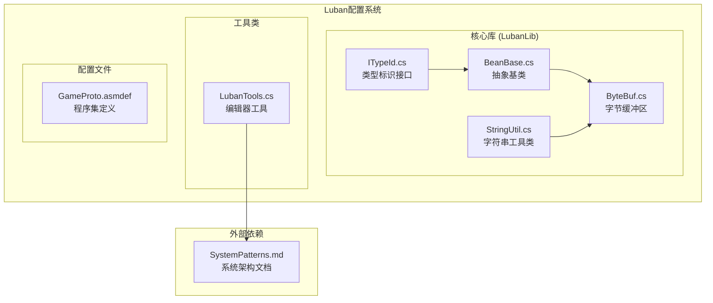
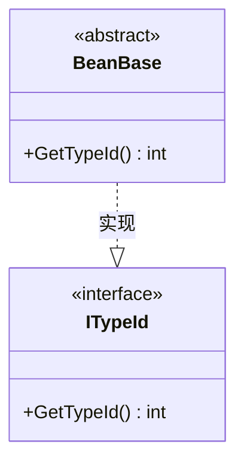
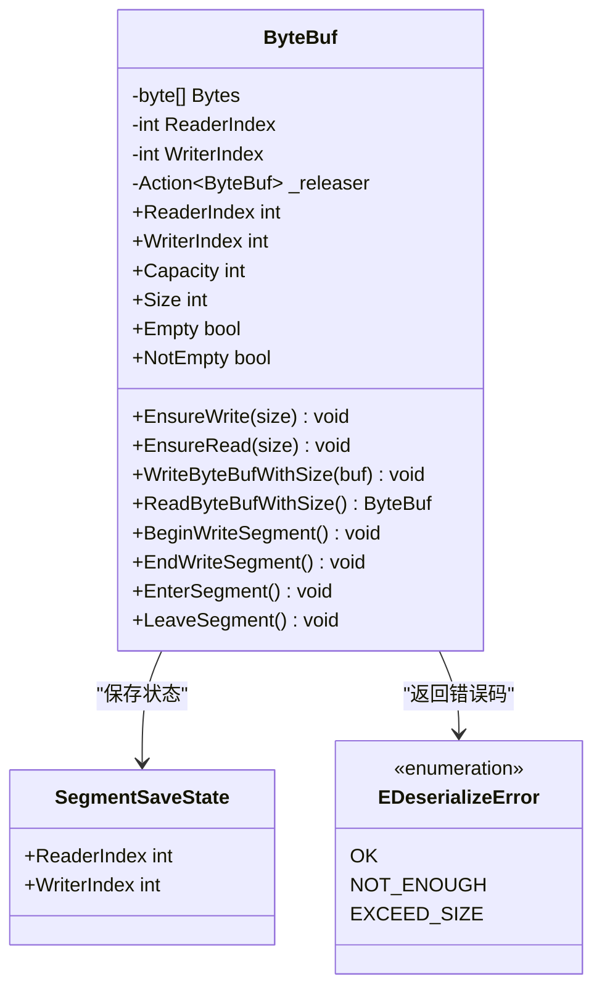
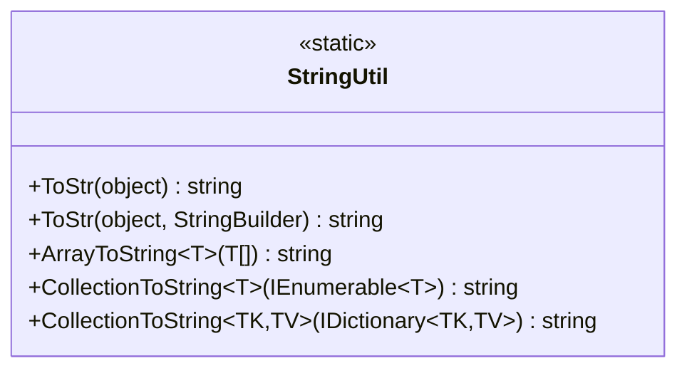
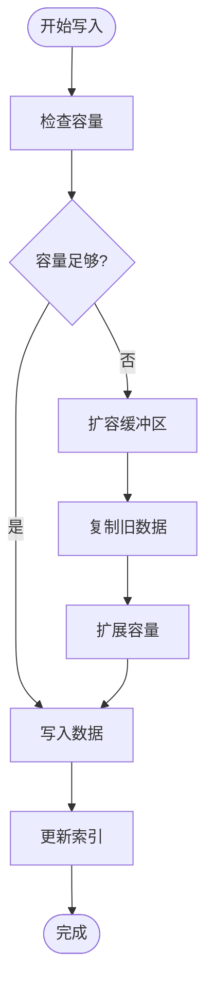
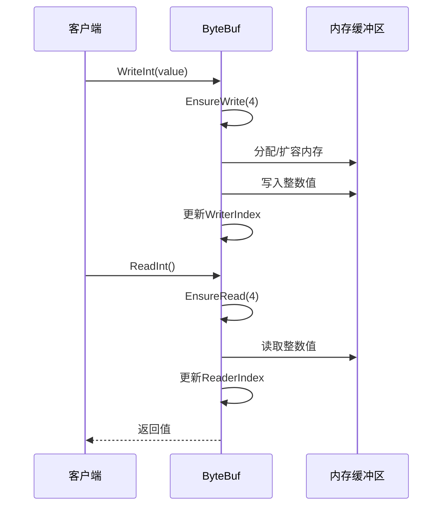
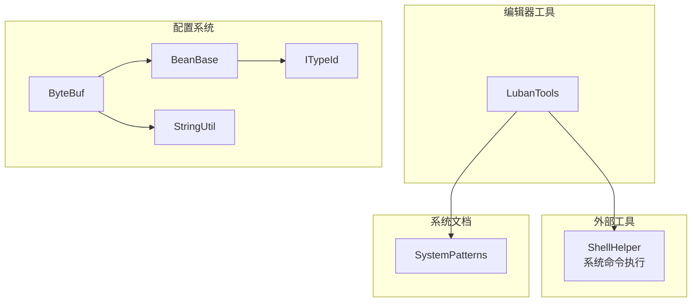

# Luban配置系统集成

<cite>
**本文档引用的文件**
- [BeanBase.cs](file://Assets/GameScripts/HotFix/GameProto/LubanLib/BeanBase.cs)
- [ByteBuf.cs](file://Assets/GameScripts/HotFix/GameProto/LubanLib/ByteBuf.cs)
- [ITypeId.cs](file://Assets/GameScripts/HotFix/GameProto/LubanLib/ITypeId.cs)
- [StringUtil.cs](file://Assets/GameScripts/HotFix/GameProto/LubanLib/StringUtil.cs)
- [LubanTools.cs](file://Assets/TEngine/Editor/LubanTools/LubanTools.cs)
- [GameProto.asmdef](file://Assets/GameScripts/HotFix/GameProto/GameProto.asmdef)
- [systemPatterns.md](file://memory-bank/systemPatterns.md)
</cite>

## 目录
1. [简介](#简介)
2. [项目结构](#项目结构)
3. [核心组件](#核心组件)
4. [架构概览](#架构概览)
5. [详细组件分析](#详细组件分析)
6. [依赖关系分析](#依赖关系分析)
7. [性能考虑](#性能考虑)
8. [故障排除指南](#故障排除指南)
9. [结论](#结论)
10. [附录](#附录)

## 简介

Luban配置系统是TEngine框架中的重要组成部分，负责游戏配置数据的生成、序列化和反序列化。该系统采用编译时生成代码的方式，提供类型安全的配置访问能力，支持多种数据格式的转换和高性能的数据传输。

系统的核心设计理念包括：
- **编译时生成**：通过Luban编译器在构建时生成强类型配置代码
- **类型安全**：提供编译期类型检查，避免运行时错误
- **高性能序列化**：自定义高效的二进制序列化机制
- **内存优化**：智能的内存管理和缓冲区复用

## 项目结构

Luban配置系统主要位于GameScripts/HotFix/GameProto/LubanLib目录下，包含以下核心文件：



**图表来源**
- [BeanBase.cs:1-8](file://Assets/GameScripts/HotFix/GameProto/LubanLib/BeanBase.cs#L1-L8)
- [ByteBuf.cs:1-1569](file://Assets/GameScripts/HotFix/GameProto/LubanLib/ByteBuf.cs#L1-L1569)
- [ITypeId.cs:1-8](file://Assets/GameScripts/HotFix/GameProto/LubanLib/ITypeId.cs#L1-L8)
- [StringUtil.cs:1-52](file://Assets/GameScripts/HotFix/GameProto/LubanLib/StringUtil.cs#L1-L52)
- [LubanTools.cs:1-20](file://Assets/TEngine/Editor/LubanTools/LubanTools.cs#L1-L20)

**章节来源**
- [GameProto.asmdef:1-20](file://Assets/GameScripts/HotFix/GameProto/GameProto.asmdef#L1-L20)

## 核心组件

### BeanBase抽象基类

BeanBase是所有配置数据类型的抽象基类，提供统一的类型标识机制：



**图表来源**
- [BeanBase.cs:3-6](file://Assets/GameScripts/HotFix/GameProto/LubanLib/BeanBase.cs#L3-L6)
- [ITypeId.cs:3-6](file://Assets/GameScripts/HotFix/GameProto/LubanLib/ITypeId.cs#L3-L6)

BeanBase的设计特点：
- **抽象设计**：所有配置Bean都继承自该基类
- **类型标识**：通过GetTypeId()方法提供统一的类型识别
- **扩展性**：支持自定义类型标识符的分配

### ByteBuf字节缓冲区

ByteBuf是Luban系统的核心序列化组件，提供高效的内存管理和数据读写功能：



**图表来源**
- [ByteBuf.cs:41-1569](file://Assets/GameScripts/HotFix/GameProto/LubanLib/ByteBuf.cs#L41-L1569)

**章节来源**
- [ByteBuf.cs:10-1569](file://Assets/GameScripts/HotFix/GameProto/LubanLib/ByteBuf.cs#L10-L1569)

### StringUtil字符串工具类

StringUtil提供配置数据的字符串化显示功能：



**图表来源**
- [StringUtil.cs:6-52](file://Assets/GameScripts/HotFix/GameProto/LubanLib/StringUtil.cs#L6-L52)

**章节来源**
- [StringUtil.cs:1-52](file://Assets/GameScripts/HotFix/GameProto/LubanLib/StringUtil.cs#L1-L52)

## 架构概览

Luban配置系统采用分层架构设计，从底层的序列化机制到上层的配置访问：

```mermaid
graph TB
subgraph "配置生成流程"
CD[配置数据<br/>(Excel/JSON/XML)]
LC[Luban编译器]
GC[生成代码<br/>(强类型Bean)]
GD[二进制数据<br/>(序列化)]
end
subgraph "运行时系统"
CM[配置模块]
TM[类型管理器]
SM[序列化引擎]
UM[使用模块]
end
subgraph "序列化机制"
BB[BeanBase]
BY[ByteBuf]
IT[ITypeId]
ST[StringUtil]
end
CD --> LC
LC --> GC
LC --> GD
GC --> CM
GD --> CM
CM --> TM
TM --> SM
SM --> BY
BY --> BB
BB --> IT
ST --> BY
CM --> UM
```

**图表来源**
- [systemPatterns.md:468-482](file://memory-bank/systemPatterns.md#L468-L482)
- [BeanBase.cs:1-8](file://Assets/GameScripts/HotFix/GameProto/LubanLib/BeanBase.cs#L1-L8)
- [ByteBuf.cs:1-1569](file://Assets/GameScripts/HotFix/GameProto/LubanLib/ByteBuf.cs#L1-L1569)
- [ITypeId.cs:1-8](file://Assets/GameScripts/HotFix/GameProto/LubanLib/ITypeId.cs#L1-L8)
- [StringUtil.cs:1-52](file://Assets/GameScripts/HotFix/GameProto/LubanLib/StringUtil.cs#L1-L52)

## 详细组件分析

### BeanBase基类设计

BeanBase作为所有配置Bean的基类，提供了统一的类型标识机制：

#### 设计理念
- **类型安全**：通过抽象方法确保所有Bean都有唯一的类型标识
- **扩展性**：支持自定义类型分配策略
- **一致性**：为整个配置系统提供统一的基类接口

#### 实现细节
- 抽象方法GetTypeId()必须由所有派生类实现
- 与ITypeId接口配合，提供编译时类型检查
- 支持运行时类型识别和反射操作

**章节来源**
- [BeanBase.cs:1-8](file://Assets/GameScripts/HotFix/GameProto/LubanLib/BeanBase.cs#L1-L8)
- [ITypeId.cs:1-8](file://Assets/GameScripts/HotFix/GameProto/LubanLib/ITypeId.cs#L1-L8)

### ByteBuf序列化引擎

ByteBuf是Luban系统的核心组件，实现了高效的二进制序列化机制：

#### 内存管理机制



**图表来源**
- [ByteBuf.cs:179-206](file://Assets/GameScripts/HotFix/GameProto/LubanLib/ByteBuf.cs#L179-L206)

#### 读写操作流程



**图表来源**
- [ByteBuf.cs:348-357](file://Assets/GameScripts/HotFix/GameProto/LubanLib/ByteBuf.cs#L348-L357)
- [ByteBuf.cs:545-563](file://Assets/GameScripts/HotFix/GameProto/LubanLib/ByteBuf.cs#L545-L563)

#### 性能优化特性

ByteBuf采用了多项性能优化技术：

1. **内存对齐优化**：利用CPU支持的非对齐内存访问
2. **内联方法**：大量使用MethodImplOptions.AggressiveInlining
3. **批量操作**：支持批量数据复制和移动
4. **段式缓冲**：支持无拷贝的段式数据操作

**章节来源**
- [ByteBuf.cs:166-206](file://Assets/GameScripts/HotFix/GameProto/LubanLib/ByteBuf.cs#L166-L206)
- [ByteBuf.cs:313-344](file://Assets/GameScripts/HotFix/GameProto/LubanLib/ByteBuf.cs#L313-L344)

### StringUtil工具类

StringUtil提供了配置数据的字符串化显示功能：

#### 功能特性
- **反射遍历**：自动遍历对象的所有字段和属性
- **格式化输出**：提供统一的字符串化格式
- **集合支持**：支持数组、列表和字典的格式化

#### 使用场景
- **调试输出**：配置数据的可视化展示
- **日志记录**：配置状态的持久化记录
- **开发工具**：配置数据的快速检查和验证

**章节来源**
- [StringUtil.cs:1-52](file://Assets/GameScripts/HotFix/GameProto/LubanLib/StringUtil.cs#L1-L52)

## 依赖关系分析

### 组件依赖图



**图表来源**
- [LubanTools.cs:1-20](file://Assets/TEngine/Editor/LubanTools/LubanTools.cs#L1-L20)
- [BeanBase.cs:1-8](file://Assets/GameScripts/HotFix/GameProto/LubanLib/BeanBase.cs#L1-L8)
- [ByteBuf.cs:1-1569](file://Assets/GameScripts/HotFix/GameProto/LubanLib/ByteBuf.cs#L1-L1569)
- [ITypeId.cs:1-8](file://Assets/GameScripts/HotFix/GameProto/LubanLib/ITypeId.cs#L1-L8)
- [StringUtil.cs:1-52](file://Assets/GameScripts/HotFix/GameProto/LubanLib/StringUtil.cs#L1-L52)

### 程序集依赖

GameProto程序集配置显示了Luban系统与其他模块的关系：

**章节来源**
- [GameProto.asmdef:1-20](file://Assets/GameScripts/HotFix/GameProto/GameProto.asmdef#L1-L20)

## 性能考虑

### 序列化性能优化

Luban配置系统在序列化方面采用了多项优化策略：

1. **变长编码**：对于整数类型使用变长编码，减少存储空间
2. **批量操作**：支持批量数据的高效处理
3. **内存复用**：通过缓冲区复用减少内存分配
4. **无拷贝操作**：支持段式数据的无拷贝传输

### 内存管理策略


**图表来源**
- [ByteBuf.cs:166-177](file://Assets/GameScripts/HotFix/GameProto/LubanLib/ByteBuf.cs#L166-L177)
- [ByteBuf.cs:189-196](file://Assets/GameScripts/HotFix/GameProto/LubanLib/ByteBuf.cs#L189-L196)

## 故障排除指南

### 常见问题及解决方案

#### 序列化异常

**问题**：SerializationException异常
**原因**：读取的数据长度不足或格式不正确
**解决方案**：
1. 检查数据完整性
2. 验证序列化和反序列化的版本一致性
3. 确认缓冲区索引的正确性

#### 内存溢出问题

**问题**：ByteBuf容量不足导致异常
**原因**：写入数据量超过预分配容量
**解决方案**：
1. 预估数据大小并合理设置初始容量
2. 使用EnsureWrite方法自动扩容
3. 定期调用DiscardReadBytes进行内存回收

#### 性能问题

**问题**：序列化/反序列化速度慢
**原因**：频繁的内存分配和拷贝操作
**解决方案**：
1. 复用ByteBuf实例
2. 使用批量操作API
3. 避免不必要的数据转换

**章节来源**
- [ByteBuf.cs:18-26](file://Assets/GameScripts/HotFix/GameProto/LubanLib/ByteBuf.cs#L18-L26)
- [ByteBuf.cs:140-145](file://Assets/GameScripts/HotFix/GameProto/LubanLib/ByteBuf.cs#L140-L145)

## 结论

Luban配置系统通过精心设计的架构和高效的实现，为TEngine框架提供了强大的配置管理能力。系统的主要优势包括：

1. **类型安全**：编译时类型检查确保配置使用的安全性
2. **高性能**：自定义的二进制序列化机制提供优秀的性能表现
3. **内存优化**：智能的内存管理和缓冲区复用减少内存消耗
4. **扩展性强**：模块化的架构设计支持功能的灵活扩展

通过本文档的详细分析，开发者可以更好地理解和使用Luban配置系统，为游戏项目的配置管理提供可靠的技术支撑。

## 附录

### 集成指南

#### 配置文件编写规范

1. **数据格式**：支持Excel、JSON、XML等多种格式
2. **命名规范**：使用清晰的字段命名和数据类型定义
3. **约束规则**：遵循Luban编译器的约束要求

#### 生成命令使用

```bash
# 在Unity编辑器中使用Luban工具
# 菜单路径: TEngine/Luban/转表 &X
```

#### 代码导入步骤

1. 将生成的配置代码添加到GameProto程序集中
2. 确保程序集定义文件包含必要的引用
3. 在配置模块中注册新的配置类型