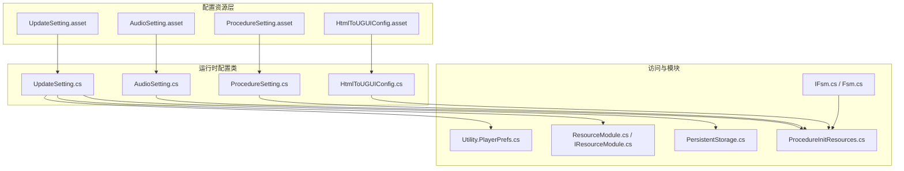
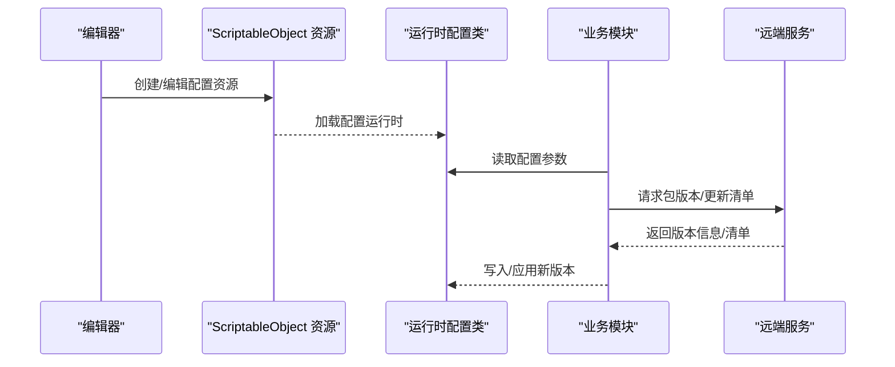
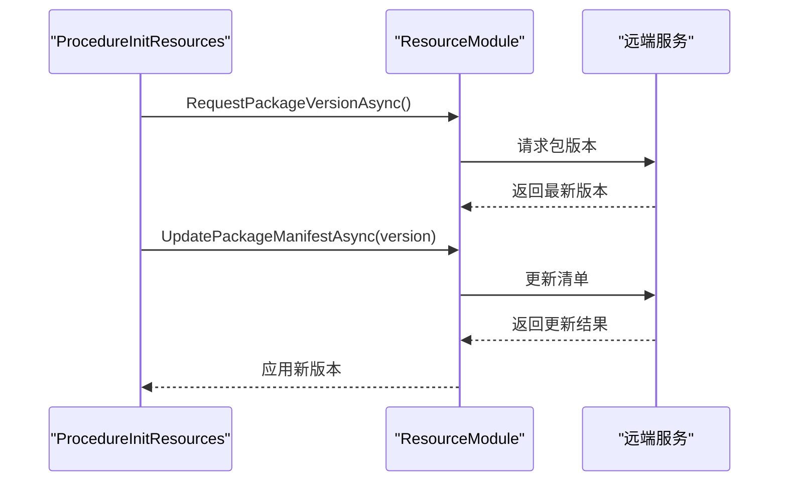
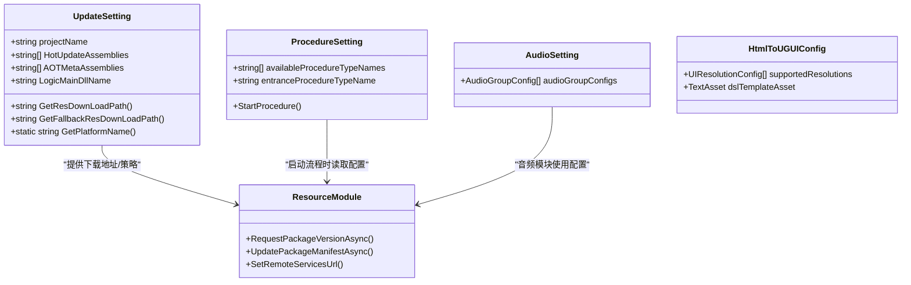

# 配置使用指南

<cite>
**本文引用的文件**
- [Assets/TEngine/Runtime/Core/UpdateSetting.cs](file://Assets/TEngine/Runtime/Core/UpdateSetting.cs)
- [Assets/TEngine/Settings/UpdateSetting.asset](file://Assets/TEngine/Settings/UpdateSetting.asset)
- [Assets/TEngine/Runtime/Module/AudioModule/AudioSetting.cs](file://Assets/TEngine/Runtime/Module/AudioModule/AudioSetting.cs)
- [Assets/TEngine/Settings/AudioSetting.asset](file://Assets/TEngine/Settings/AudioSetting.asset)
- [Assets/TEngine/Runtime/Module/ProcedureModule/ProcedureSetting.cs](file://Assets/TEngine/Runtime/Module/ProcedureModule/ProcedureSetting.cs)
- [Assets/TEngine/Settings/ProcedureSetting.asset](file://Assets/TEngine/Settings/ProcedureSetting.asset)
- [Assets/HtmlToUGUI/HtmlToUGUIConfig.cs](file://Assets/HtmlToUGUI/HtmlToUGUIConfig.cs)
- [Assets/HtmlToUGUI/HtmlToUGUIConfig.asset](file://Assets/HtmlToUGUI/HtmlToUGUIConfig.asset)
- [Assets/TEngine/Runtime/Core/Utility/Utility.PlayerPrefs.cs](file://Assets/TEngine/Runtime/Core/Utility/Utility.PlayerPrefs.cs)
- [Assets/TEngine/Runtime/Module/LocalizationModule/Core/Configurables/PersistentStorage.cs](file://Assets/TEngine/Runtime/Module/LocalizationModule/Core/Configurables/PersistentStorage.cs)
- [Assets/GameScripts/Procedure/ProcedureInitResources.cs](file://Assets/GameScripts/Procedure/ProcedureInitResources.cs)
- [Assets/TEngine/Runtime/Module/ResourceModule/IResourceModule.cs](file://Assets/TEngine/Runtime/Module/ResourceModule/IResourceModule.cs)
- [Assets/TEngine/Runtime/Module/ResourceModule/ResourceModule.cs](file://Assets/TEngine/Runtime/Module/ResourceModule/ResourceModule.cs)
- [Assets/TEngine/Editor/Utility/UpdateSettingEditor.cs](file://Assets/TEngine/Editor/Utility/UpdateSettingEditor.cs)
- [Assets/TEngine/Runtime/Module/FsmModule/IFsm.cs](file://Assets/TEngine/Runtime/Module/FsmModule/IFsm.cs)
- [Assets/TEngine/Runtime/Module/FsmModule/Fsm.cs](file://Assets/TEngine/Runtime/Module/FsmModule/Fsm.cs)
- [Assets/GameScripts/HotFix/GameLogic/SingletonSystem/Singleton.cs](file://Assets/GameScripts/HotFix/GameLogic/SingletonSystem/Singleton.cs)
- [Assets/GameScripts/HotFix/GameLogic/SingletonSystem/SingletonSystem.cs](file://Assets/GameScripts/HotFix/GameLogic/SingletonSystem/SingletonSystem.cs)
- [Assets/Launcher/Scripts/LoadText.cs](file://Assets/Launcher/Scripts/LoadText.cs)
</cite>

## 目录
1. [简介](#简介)
2. [项目结构](#项目结构)
3. [核心组件](#核心组件)
4. [架构总览](#架构总览)
5. [详细组件分析](#详细组件分析)
6. [依赖关系分析](#依赖关系分析)
7. [性能考量](#性能考量)
8. [故障排查指南](#故障排查指南)
9. [结论](#结论)
10. [附录](#附录)

## 简介
本指南面向使用 TEngine 配置系统的开发者，提供从配置文件编写规范、字段定义、数据类型选择，到配置访问方法（静态访问、实例访问、动态获取）、版本管理机制（兼容性、升级策略、回滚方案）、热更新支持（增量更新、在线更新、数据迁移），再到最佳实践（命名规范、数据验证、错误处理）的完整技术文档。同时给出丰富的使用示例与常见问题解答，帮助快速上手并稳定落地。

## 项目结构
TEngine 的配置体系以 Unity 的 ScriptableObject 为核心载体，结合模块化的设置资源与运行时访问接口，形成“配置即代码”的可维护结构。主要配置类别如下：
- 更新与资源设置：UpdateSetting（含热更新、资源下载地址、WebGL 加载策略等）
- 音频分组设置：AudioSetting（按音效类型分组的参数集合）
- 流程控制设置：ProcedureSetting（流程类型清单与入口流程）
- UI 烘焙配置：HtmlToUGUIConfig（多分辨率预设与 DSL 模板）
- 运行时持久化：PlayerPrefs 封装与本地文件存储（用于用户偏好与小体量配置）

图表来源
- [Assets/TEngine/Runtime/Core/UpdateSetting.cs:50-220](file://Assets/TEngine/Runtime/Core/UpdateSetting.cs#L50-L220)
- [Assets/TEngine/Settings/UpdateSetting.asset:1-37](file://Assets/TEngine/Settings/UpdateSetting.asset#L1-L37)
- [Assets/TEngine/Runtime/Module/AudioModule/AudioSetting.cs:1-10](file://Assets/TEngine/Runtime/Module/AudioModule/AudioSetting.cs#L1-L10)
- [Assets/TEngine/Settings/AudioSetting.asset:1-48](file://Assets/TEngine/Settings/AudioSetting.asset#L1-L48)
- [Assets/TEngine/Runtime/Module/ProcedureModule/ProcedureSetting.cs:8-104](file://Assets/TEngine/Runtime/Module/ProcedureModule/ProcedureSetting.cs#L8-L104)
- [Assets/TEngine/Settings/ProcedureSetting.asset:1-28](file://Assets/TEngine/Settings/ProcedureSetting.asset#L1-L28)
- [Assets/HtmlToUGUI/HtmlToUGUIConfig.cs:1-35](file://Assets/HtmlToUGUI/HtmlToUGUIConfig.cs#L1-L35)
- [Assets/HtmlToUGUI/HtmlToUGUIConfig.asset:1-25](file://Assets/HtmlToUGUI/HtmlToUGUIConfig.asset#L1-L25)
- [Assets/TEngine/Runtime/Core/Utility/Utility.PlayerPrefs.cs:177-218](file://Assets/TEngine/Runtime/Core/Utility/Utility.PlayerPrefs.cs#L177-L218)
- [Assets/TEngine/Runtime/Module/LocalizationModule/Core/Configurables/PersistentStorage.cs:41-75](file://Assets/TEngine/Runtime/Module/LocalizationModule/Core/Configurables/PersistentStorage.cs#L41-L75)
- [Assets/TEngine/Runtime/Module/ResourceModule/ResourceModule.cs:315-343](file://Assets/TEngine/Runtime/Module/ResourceModule/ResourceModule.cs#L315-L343)
- [Assets/TEngine/Runtime/Module/ResourceModule/IResourceModule.cs:319-344](file://Assets/TEngine/Runtime/Module/ResourceModule/IResourceModule.cs#L319-L344)
- [Assets/GameScripts/Procedure/ProcedureInitResources.cs:38-131](file://Assets/GameScripts/Procedure/ProcedureInitResources.cs#L38-L131)

章节来源
- [Assets/TEngine/Runtime/Core/UpdateSetting.cs:50-220](file://Assets/TEngine/Runtime/Core/UpdateSetting.cs#L50-L220)
- [Assets/TEngine/Settings/UpdateSetting.asset:1-37](file://Assets/TEngine/Settings/UpdateSetting.asset#L1-L37)
- [Assets/TEngine/Runtime/Module/AudioModule/AudioSetting.cs:1-10](file://Assets/TEngine/Runtime/Module/AudioModule/AudioSetting.cs#L1-L10)
- [Assets/TEngine/Settings/AudioSetting.asset:1-48](file://Assets/TEngine/Settings/AudioSetting.asset#L1-L48)
- [Assets/TEngine/Runtime/Module/ProcedureModule/ProcedureSetting.cs:8-104](file://Assets/TEngine/Runtime/Module/ProcedureModule/ProcedureSetting.cs#L8-L104)
- [Assets/TEngine/Settings/ProcedureSetting.asset:1-28](file://Assets/TEngine/Settings/ProcedureSetting.asset#L1-L28)
- [Assets/HtmlToUGUI/HtmlToUGUIConfig.cs:1-35](file://Assets/HtmlToUGUI/HtmlToUGUIConfig.cs#L1-L35)
- [Assets/HtmlToUGUI/HtmlToUGUIConfig.asset:1-25](file://Assets/HtmlToUGUI/HtmlToUGUIConfig.asset#L1-L25)

## 核心组件
- UpdateSetting：集中管理热更新、资源下载地址、WebGL 加载策略、构建资源路径、可寻址资源替换等。支持根据平台动态拼接下载路径。
- AudioSetting：音频分组配置数组，按类型（音乐、音效、UI、语音）分别设置静音、音量、代理数量、衰减模型与距离范围。
- ProcedureSetting：流程类型清单与入口流程，运行时通过反射创建流程实例并启动流程引擎。
- HtmlToUGUIConfig：多分辨率预设与 DSL 模板，用于 UI 架构的统一配置与批量生成。
- PlayerPrefs 封装：提供用户隔离键、跨场景持久化能力，适合小体量用户偏好配置。
- 本地文件存储：基于 I2CustomPersistentStorage 的文件存取接口，支持检查/保存/删除/读取文件。
- 资源模块：提供请求远端包版本、更新清单、设置远端服务地址等能力，支撑版本管理与热更新。

章节来源
- [Assets/TEngine/Runtime/Core/UpdateSetting.cs:50-220](file://Assets/TEngine/Runtime/Core/UpdateSetting.cs#L50-L220)
- [Assets/TEngine/Runtime/Module/AudioModule/AudioSetting.cs:1-10](file://Assets/TEngine/Runtime/Module/AudioModule/AudioSetting.cs#L1-L10)
- [Assets/TEngine/Runtime/Module/ProcedureModule/ProcedureSetting.cs:8-104](file://Assets/TEngine/Runtime/Module/ProcedureModule/ProcedureSetting.cs#L8-L104)
- [Assets/HtmlToUGUI/HtmlToUGUIConfig.cs:1-35](file://Assets/HtmlToUGUI/HtmlToUGUIConfig.cs#L1-L35)
- [Assets/TEngine/Runtime/Core/Utility/Utility.PlayerPrefs.cs:177-218](file://Assets/TEngine/Runtime/Core/Utility/Utility.PlayerPrefs.cs#L177-L218)
- [Assets/TEngine/Runtime/Module/LocalizationModule/Core/Configurables/PersistentStorage.cs:41-75](file://Assets/TEngine/Runtime/Module/LocalizationModule/Core/Configurables/PersistentStorage.cs#L41-L75)
- [Assets/TEngine/Runtime/Module/ResourceModule/IResourceModule.cs:319-344](file://Assets/TEngine/Runtime/Module/ResourceModule/IResourceModule.cs#L319-L344)
- [Assets/TEngine/Runtime/Module/ResourceModule/ResourceModule.cs:315-343](file://Assets/TEngine/Runtime/Module/ResourceModule/ResourceModule.cs#L315-L343)

## 架构总览
配置系统采用“资源驱动 + 运行时访问 + 模块集成”的架构：
- 配置资源（ScriptableObject）在编辑器中维护，运行时由对应配置类加载并暴露 API。
- 模块（如资源模块、流程模块）通过配置类提供的方法进行版本查询、清单更新、流程启动等。
- 持久化层（PlayerPrefs、本地文件）用于用户级小体量配置与临时数据。

图表来源
- [Assets/TEngine/Runtime/Core/UpdateSetting.cs:160-178](file://Assets/TEngine/Runtime/Core/UpdateSetting.cs#L160-L178)
- [Assets/TEngine/Runtime/Module/ResourceModule/ResourceModule.cs:315-343](file://Assets/TEngine/Runtime/Module/ResourceModule/ResourceModule.cs#L315-L343)
- [Assets/TEngine/Runtime/Module/ResourceModule/IResourceModule.cs:319-344](file://Assets/TEngine/Runtime/Module/ResourceModule/IResourceModule.cs#L319-L344)
- [Assets/GameScripts/Procedure/ProcedureInitResources.cs:96-105](file://Assets/GameScripts/Procedure/ProcedureInitResources.cs#L96-L105)

## 详细组件分析

### UpdateSetting 组件
- 功能要点
  - 热更新相关：热更新程序集列表、AOT 元数据程序集、主逻辑 DLL 名称、程序集打包扩展名与路径。
  - 更新策略：强制/非强制更新、是否提示更新。
  - 资源下载：默认与备用资源下载地址，按项目名与平台拼接最终 URL。
  - WebGL：远程加载或本地 StreamingAssets 加载策略。
  - 构建资源：是否自动复制资源至打包地址、打包地址、是否用可寻址资源替代资源路径。
- 访问方式
  - 静态访问：通过配置类公开的只读属性与静态方法获取平台名、下载地址等。
  - 实例访问：在运行时通过资源引用或模块注入获取实例，调用其公开方法。
  - 动态获取：在流程中根据当前环境动态决定加载策略与下载地址。
- 版本管理
  - 通过资源模块的请求包版本与更新清单接口实现版本拉取与应用。
  - 支持备用地址与错误重试，保障版本获取的稳定性。
- 热更新支持
  - 与编辑器 UpdateSettingEditor 协同，同步 HybridCLR 热更新程序集列表，确保运行时加载正确。
- 最佳实践
  - 使用 CreateAssetMenu 生成资源，便于团队协作与版本控制。
  - 平台差异化配置应通过静态方法统一输出，避免硬编码。
  - 下载地址与备用地址需保持一致性，避免版本错配。

章节来源
- [Assets/TEngine/Runtime/Core/UpdateSetting.cs:50-220](file://Assets/TEngine/Runtime/Core/UpdateSetting.cs#L50-L220)
- [Assets/TEngine/Settings/UpdateSetting.asset:1-37](file://Assets/TEngine/Settings/UpdateSetting.asset#L1-L37)
- [Assets/TEngine/Editor/Utility/UpdateSettingEditor.cs:40-65](file://Assets/TEngine/Editor/Utility/UpdateSettingEditor.cs#L40-L65)
- [Assets/TEngine/Runtime/Module/ResourceModule/ResourceModule.cs:315-343](file://Assets/TEngine/Runtime/Module/ResourceModule/ResourceModule.cs#L315-L343)
- [Assets/TEngine/Runtime/Module/ResourceModule/IResourceModule.cs:319-344](file://Assets/TEngine/Runtime/Module/ResourceModule/IResourceModule.cs#L319-L344)

### AudioSetting 组件
- 功能要点
  - 音频分组配置数组，每组包含名称、静音、音量、代理数量、音效类型、衰减模式与距离范围。
- 访问方式
  - 通过模块读取配置数组，按类型分组应用到具体音频播放器。
- 最佳实践
  - 分组命名清晰，避免重复；音量与代理数量需结合场景规模评估。
  - 使用枚举或常量定义音效类型，减少字符串匹配开销。

章节来源
- [Assets/TEngine/Runtime/Module/AudioModule/AudioSetting.cs:1-10](file://Assets/TEngine/Runtime/Module/AudioModule/AudioSetting.cs#L1-L10)
- [Assets/TEngine/Settings/AudioSetting.asset:1-48](file://Assets/TEngine/Settings/AudioSetting.asset#L1-L48)

### ProcedureSetting 组件
- 功能要点
  - 维护可用流程类型清单与入口流程类型名。
  - 运行时通过反射创建流程实例，初始化流程引擎并启动入口流程。
- 访问方式
  - 通过模块系统获取流程模块，调用 StartProcedure 启动流程。
- 最佳实践
  - 流程类型名需与实际类型完全一致，避免反射失败。
  - 入口流程必须存在于可用清单中，否则启动失败。

章节来源
- [Assets/TEngine/Runtime/Module/ProcedureModule/ProcedureSetting.cs:8-104](file://Assets/TEngine/Runtime/Module/ProcedureModule/ProcedureSetting.cs#L8-L104)
- [Assets/TEngine/Settings/ProcedureSetting.asset:1-28](file://Assets/TEngine/Settings/ProcedureSetting.asset#L1-L28)

### HtmlToUGUIConfig 组件
- 功能要点
  - 多分辨率预设列表，包含显示名与分辨率向量。
  - DSL 模板资源，用于生成 UI 原型规范文档。
- 访问方式
  - 在编辑器脚本中读取预设列表与模板资源，进行 UI 烘焙与生成。
- 最佳实践
  - 分辨率预设应覆盖主流设备，模板需包含占位符以便自动化生成。

章节来源
- [Assets/HtmlToUGUI/HtmlToUGUIConfig.cs:1-35](file://Assets/HtmlToUGUI/HtmlToUGUIConfig.cs#L1-L35)
- [Assets/HtmlToUGUI/HtmlToUGUIConfig.asset:1-25](file://Assets/HtmlToUGUI/HtmlToUGUIConfig.asset#L1-L25)

### 持久化与用户配置
- PlayerPrefs 封装
  - 提供用户隔离键、HasUserKey、SetUserInt/GetUserInt 等方法，支持用户维度的数据隔离。
- 本地文件存储
  - 通过 PersistentStorage 提供 CanAccessFiles、SaveFile、LoadFile、DeleteFile、HasFile 等接口，便于小体量配置与日志等数据的本地持久化。
- 最佳实践
  - 小体量用户偏好使用 PlayerPrefs；大体量或结构化数据使用本地文件存储。
  - 对于用户隔离场景，优先使用封装的用户键方法，避免键冲突。

章节来源
- [Assets/TEngine/Runtime/Core/Utility/Utility.PlayerPrefs.cs:177-218](file://Assets/TEngine/Runtime/Core/Utility/Utility.PlayerPrefs.cs#L177-L218)
- [Assets/TEngine/Runtime/Module/LocalizationModule/Core/Configurables/PersistentStorage.cs:41-75](file://Assets/TEngine/Runtime/Module/LocalizationModule/Core/Configurables/PersistentStorage.cs#L41-L75)

### 版本管理与热更新
- 版本获取与更新
  - 通过资源模块的 RequestPackageVersionAsync 与 UpdatePackageManifestAsync 获取远端最新版本并更新清单。
  - 在流程中记录并应用新版本，支持错误提示与重试。
- 回滚方案
  - 若更新失败，保留旧版本并提示用户重试；备用地址可作为兜底。
- 热更新协同
  - 编辑器 UpdateSettingEditor 同步热更新程序集列表，确保运行时加载正确。
- 最佳实践
  - 版本号与清单需与打包流程一致；更新前做好数据校验与兼容性测试。

图表来源
- [Assets/GameScripts/Procedure/ProcedureInitResources.cs:96-105](file://Assets/GameScripts/Procedure/ProcedureInitResources.cs#L96-L105)
- [Assets/TEngine/Runtime/Module/ResourceModule/ResourceModule.cs:315-343](file://Assets/TEngine/Runtime/Module/ResourceModule/ResourceModule.cs#L315-L343)
- [Assets/TEngine/Runtime/Module/ResourceModule/IResourceModule.cs:319-344](file://Assets/TEngine/Runtime/Module/ResourceModule/IResourceModule.cs#L319-L344)

## 依赖关系分析
- 配置资源与运行时类的绑定：资源文件通过 CreateAssetMenu 生成，运行时类通过序列化字段与资源关联。
- 模块耦合：流程模块依赖 ProcedureSetting；资源模块依赖 UpdateSetting；音频模块依赖 AudioSetting。
- 数据流：配置类提供只读 API，模块通过这些 API 完成初始化与运行时行为控制。
- 持久化层：PlayerPrefs 与本地文件存储为配置系统提供用户级与小体量数据的持久化能力。

图表来源
- [Assets/TEngine/Runtime/Core/UpdateSetting.cs:50-220](file://Assets/TEngine/Runtime/Core/UpdateSetting.cs#L50-L220)
- [Assets/TEngine/Runtime/Module/AudioModule/AudioSetting.cs:1-10](file://Assets/TEngine/Runtime/Module/AudioModule/AudioSetting.cs#L1-L10)
- [Assets/TEngine/Runtime/Module/ProcedureModule/ProcedureSetting.cs:8-104](file://Assets/TEngine/Runtime/Module/ProcedureModule/ProcedureSetting.cs#L8-L104)
- [Assets/HtmlToUGUI/HtmlToUGUIConfig.cs:1-35](file://Assets/HtmlToUGUI/HtmlToUGUIConfig.cs#L1-L35)
- [Assets/TEngine/Runtime/Module/ResourceModule/ResourceModule.cs:315-343](file://Assets/TEngine/Runtime/Module/ResourceModule/ResourceModule.cs#L315-L343)

## 性能考量
- 配置读取
  - ScriptableObject 读取为轻量操作，建议在启动阶段一次性加载并缓存常用配置。
- 热更新
  - 程序集加载与切换需谨慎，避免频繁切换导致卡顿；建议在空闲时段或离线状态下进行。
- 持久化
  - PlayerPrefs 适合小体量数据；大体量或频繁写入建议使用本地文件存储。
- 版本管理
  - 远端请求需设置超时与重试策略，避免阻塞主线程；清单更新可异步执行。

## 故障排查指南
- 配置资源缺失或字段为空
  - 检查资源文件是否正确创建与引用；确认序列化字段是否正确赋值。
- 流程启动失败
  - 确认入口流程类型名存在于可用清单中；检查反射创建是否成功。
- 版本获取失败
  - 检查远端服务地址与备用地址；确认网络连通性；查看错误日志并重试。
- 热更新程序集不生效
  - 确认 UpdateSettingEditor 已同步热更新程序集列表；检查运行时加载顺序。
- 用户配置读取异常
  - 使用封装的用户键方法进行读写；避免直接使用原始键名。

章节来源
- [Assets/TEngine/Runtime/Module/ProcedureModule/ProcedureSetting.cs:55-102](file://Assets/TEngine/Runtime/Module/ProcedureModule/ProcedureSetting.cs#L55-L102)
- [Assets/GameScripts/Procedure/ProcedureInitResources.cs:112-131](file://Assets/GameScripts/Procedure/ProcedureInitResources.cs#L112-L131)
- [Assets/TEngine/Editor/Utility/UpdateSettingEditor.cs:40-65](file://Assets/TEngine/Editor/Utility/UpdateSettingEditor.cs#L40-L65)
- [Assets/TEngine/Runtime/Core/Utility/Utility.PlayerPrefs.cs:177-218](file://Assets/TEngine/Runtime/Core/Utility/Utility.PlayerPrefs.cs#L177-L218)

## 结论
TEngine 的配置系统以 ScriptableObject 为核心，结合运行时访问与模块化集成，提供了清晰、可维护且可扩展的配置管理方案。通过规范的字段定义、明确的访问方式、完善的版本管理与热更新支持，以及合理的持久化策略，能够满足大多数项目的配置需求。建议在团队内统一命名规范与验证流程，确保配置变更的可控与可追溯。

## 附录

### 配置文件编写规范与字段定义
- 字段命名
  - 使用语义化英文命名，避免缩写；布尔字段建议以 enable/disable/require 开头。
- 数据类型选择
  - 列表使用 List<T>；枚举使用枚举类型；路径使用字符串并统一斜杠风格。
- 默认值与注释
  - 为关键字段提供合理默认值；使用 Tooltip/Helpbox 等增强可读性。
- 资源生成
  - 使用 CreateAssetMenu 生成资源，便于团队协作与版本控制。

### 配置数据访问方法
- 静态访问
  - 适用于只读、平台无关的配置，如平台名、下载地址拼接。
- 实例访问
  - 适用于运行时可变或模块内共享的配置，通过资源引用或模块注入获取。
- 动态获取
  - 适用于根据环境动态选择的配置，如 WebGL 加载策略、备用地址。

### 版本管理机制
- 兼容性
  - 新旧版本字段需保持兼容；新增字段应提供默认值。
- 升级策略
  - 强制更新保证功能完整性；非强制更新允许用户选择。
- 回滚方案
  - 失败时保留旧版本并提示重试；备用地址作为兜底。

### 热更新支持
- 增量更新
  - 仅传输差异资源，减少流量与时间。
- 在线更新
  - 运行时动态加载新程序集，需注意加载顺序与依赖。
- 数据迁移
  - 对用户数据进行版本化迁移，确保平滑过渡。

### 最佳实践
- 命名规范
  - 资源文件与类名保持一致；字段名清晰表达用途。
- 数据验证
  - 对输入数据进行边界检查与类型校验；对关键字段提供默认值。
- 错误处理
  - 对网络请求、文件读写、反射创建等易出错环节增加异常捕获与日志记录。
- 示例参考
  - 更新设置：[Assets/TEngine/Settings/UpdateSetting.asset:1-37](file://Assets/TEngine/Settings/UpdateSetting.asset#L1-L37)
  - 音频设置：[Assets/TEngine/Settings/AudioSetting.asset:1-48](file://Assets/TEngine/Settings/AudioSetting.asset#L1-L48)
  - 流程设置：[Assets/TEngine/Settings/ProcedureSetting.asset:1-28](file://Assets/TEngine/Settings/ProcedureSetting.asset#L1-L28)
  - UI 烘焙配置：[Assets/HtmlToUGUI/HtmlToUGUIConfig.asset:1-25](file://Assets/HtmlToUGUI/HtmlToUGUIConfig.asset#L1-L25)

### 常见问题解答
- Q: 如何在流程中读取配置并启动？
  - A: 通过模块系统获取对应设置类实例，调用其公开方法或属性，并在流程中应用。
- Q: 热更新程序集为何不生效？
  - A: 检查 UpdateSettingEditor 是否同步了热更新程序集列表，确认运行时加载顺序。
- Q: WebGL 加载资源如何选择？
  - A: 通过 UpdateSetting 的 WebGL 加载策略配置决定远程或本地加载。
- Q: 如何持久化用户偏好？
  - A: 使用 PlayerPrefs 封装的用户键方法进行读写；大体量数据使用本地文件存储。