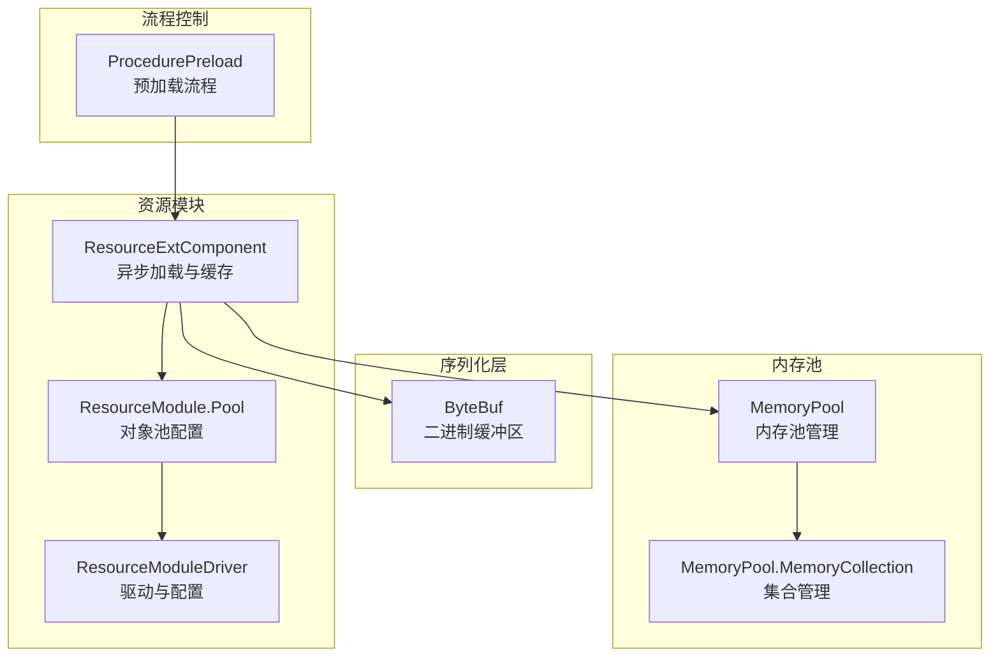
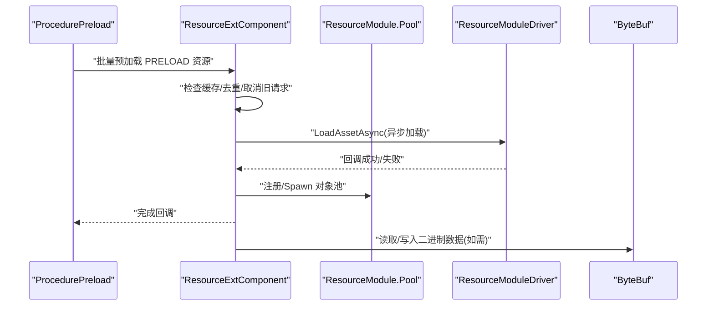
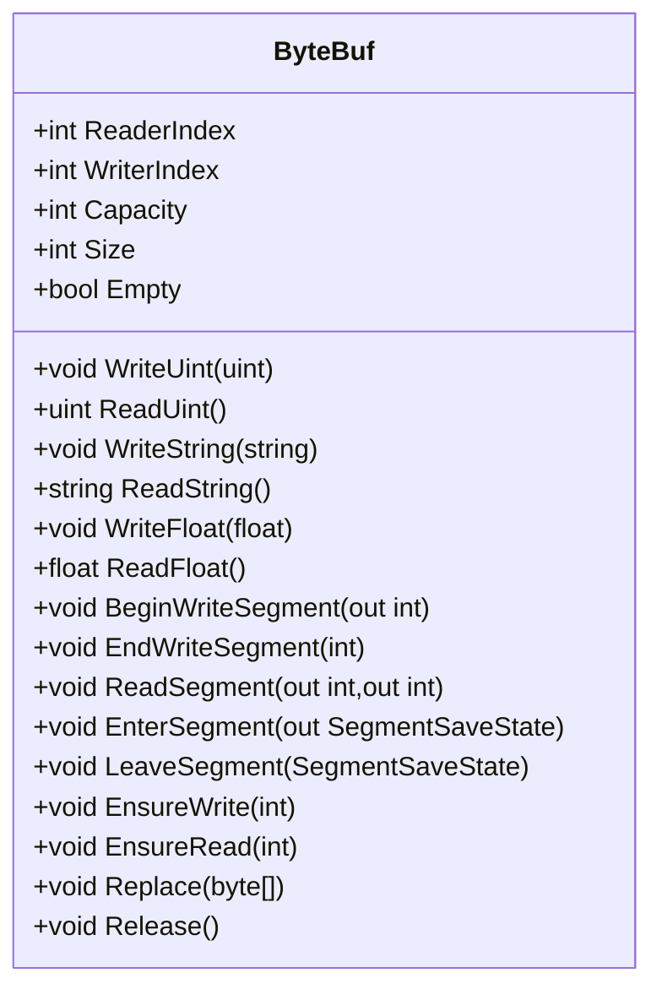
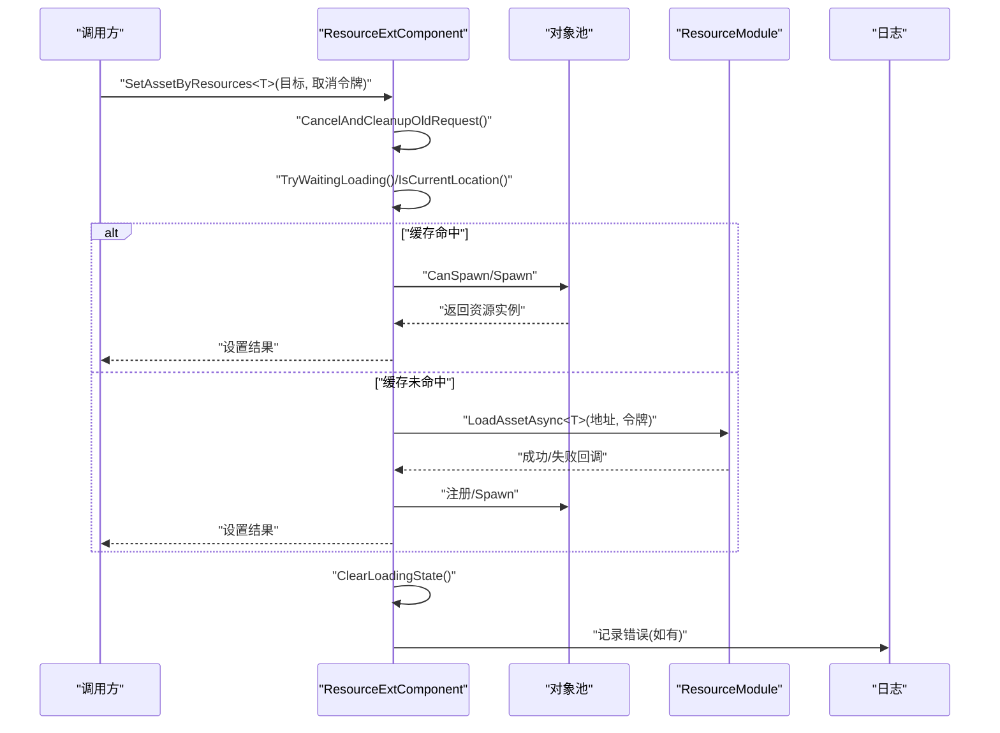
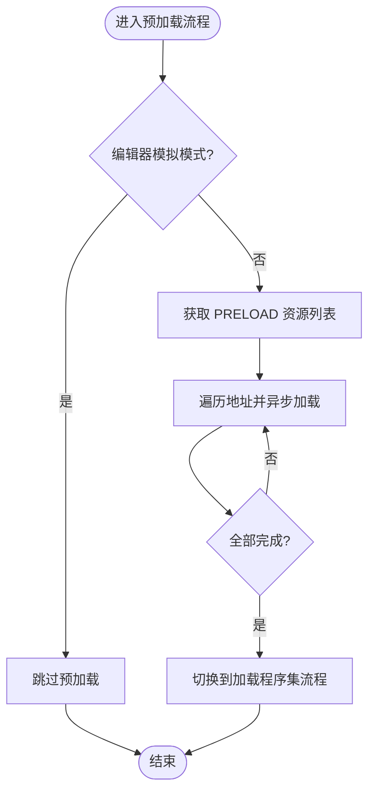
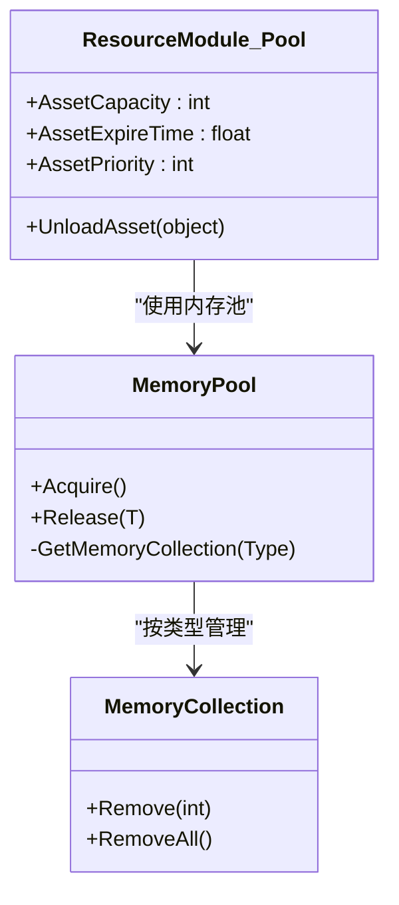
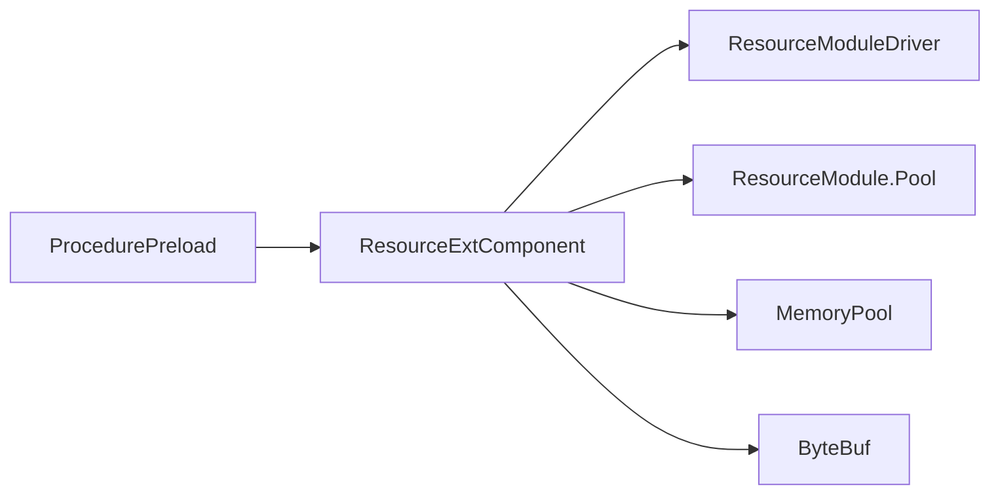

# 配置加载机制

<cite>
**本文档引用的文件**
- [ByteBuf.cs](file://Assets/GameScripts/HotFix/GameProto/LubanLib/ByteBuf.cs)
- [ProcedurePreload.cs](file://Assets/GameScripts/Procedure/ProcedurePreload.cs)
- [ResourceExtComponent.Resource.cs](file://Assets/TEngine/Runtime/Module/ResourceModule/Extension/ResourceExtComponent.Resource.cs)
- [ResourceModule.Pool.cs](file://Assets/TEngine/Runtime/Module/ResourceModule/ResourceModule.Pool.cs)
- [ResourceModuleDriver.cs](file://Assets/TEngine/Runtime/Module/ResourceModule/ResourceModuleDriver.cs)
- [MemoryPool.cs](file://Assets/TEngine/Runtime/Core/MemoryPool/MemoryPool.cs)
- [MemoryPool.MemoryCollection.cs](file://Assets/TEngine/Runtime/Core/MemoryPool/MemoryPool.MemoryCollection.cs)
</cite>

## 目录
1. [简介](#简介)
2. [项目结构](#项目结构)
3. [核心组件](#核心组件)
4. [架构总览](#架构总览)
5. [详细组件分析](#详细组件分析)
6. [依赖关系分析](#依赖关系分析)
7. [性能考量](#性能考量)
8. [故障排查指南](#故障排查指南)
9. [结论](#结论)
10. [附录：配置加载最佳实践与示例路径](#附录配置加载最佳实践与示例路径)

## 简介
本文件系统性梳理 TEngine 项目中的配置加载机制，重点覆盖以下方面：
- 多种加载模式：同步加载、异步加载、预加载（懒加载雏形）
- 序列化与反序列化：基于自研 ByteBuf 的高效二进制编解码与内存管理
- 缓存与失效：对象池缓存、加载去重、过期与取消控制
- 错误处理与异常恢复：统一失败回调、取消令牌、状态清理
- 性能优化与并发安全：内存池、批量预加载、线程安全与资源回收

## 项目结构
围绕配置加载的关键模块与文件如下：
- 配置加载入口与流程控制：ProcedurePreload.cs
- 资源加载与缓存：ResourceExtComponent.Resource.cs、ResourceModule.Pool.cs、ResourceModuleDriver.cs
- 序列化与内存管理：ByteBuf.cs
- 内存池基础设施：MemoryPool.cs、MemoryPool.MemoryCollection.cs

**图表来源**
- [ProcedurePreload.cs:126-150](file://Assets/GameScripts/Procedure/ProcedurePreload.cs#L126-L150)
- [ResourceExtComponent.Resource.cs:87-159](file://Assets/TEngine/Runtime/Module/ResourceModule/Extension/ResourceExtComponent.Resource.cs#L87-L159)
- [ResourceModule.Pool.cs:1-68](file://Assets/TEngine/Runtime/Module/ResourceModule/ResourceModule.Pool.cs#L1-L68)
- [ResourceModuleDriver.cs:236-252](file://Assets/TEngine/Runtime/Module/ResourceModule/ResourceModuleDriver.cs#L236-L252)
- [ByteBuf.cs:41-120](file://Assets/GameScripts/HotFix/GameProto/LubanLib/ByteBuf.cs#L41-L120)
- [MemoryPool.cs:183-207](file://Assets/TEngine/Runtime/Core/MemoryPool/MemoryPool.cs#L183-L207)
- [MemoryPool.MemoryCollection.cs:124-156](file://Assets/TEngine/Runtime/Core/MemoryPool/MemoryPool.MemoryCollection.cs#L124-L156)

**章节来源**
- [ProcedurePreload.cs:126-150](file://Assets/GameScripts/Procedure/ProcedurePreload.cs#L126-L150)
- [ResourceExtComponent.Resource.cs:87-159](file://Assets/TEngine/Runtime/Module/ResourceModule/Extension/ResourceExtComponent.Resource.cs#L87-L159)
- [ResourceModule.Pool.cs:1-68](file://Assets/TEngine/Runtime/Module/ResourceModule/ResourceModule.Pool.cs#L1-L68)
- [ResourceModuleDriver.cs:236-252](file://Assets/TEngine/Runtime/Module/ResourceModule/ResourceModuleDriver.cs#L236-L252)
- [ByteBuf.cs:41-120](file://Assets/GameScripts/HotFix/GameProto/LubanLib/ByteBuf.cs#L41-L120)
- [MemoryPool.cs:183-207](file://Assets/TEngine/Runtime/Core/MemoryPool/MemoryPool.cs#L183-L207)
- [MemoryPool.MemoryCollection.cs:124-156](file://Assets/TEngine/Runtime/Core/MemoryPool/MemoryPool.MemoryCollection.cs#L124-L156)

## 核心组件
- ByteBuf：高性能二进制缓冲区，支持变长整数、字符串、浮点数、向量等类型编解码，内置分段读写与就地解析能力，配套内存释放回调。
- ResourceExtComponent：封装异步加载、缓存命中、重复加载防护、取消与状态清理，结合内存池实现资源复用。
- ResourceModule：提供对象池配置接口，支持容量、过期时间、优先级等参数，配合 ResourceExtComponent 实现缓存策略。
- ProcedurePreload：流程阶段负责批量预加载标记为 PRELOAD 的配置资源，提升首帧体验。

**章节来源**
- [ByteBuf.cs:41-120](file://Assets/GameScripts/HotFix/GameProto/LubanLib/ByteBuf.cs#L41-L120)
- [ResourceExtComponent.Resource.cs:87-159](file://Assets/TEngine/Runtime/Module/ResourceModule/Extension/ResourceExtComponent.Resource.cs#L87-L159)
- [ResourceModule.Pool.cs:1-68](file://Assets/TEngine/Runtime/Module/ResourceModule/ResourceModule.Pool.cs#L1-L68)
- [ProcedurePreload.cs:126-150](file://Assets/GameScripts/Procedure/ProcedurePreload.cs#L126-L150)

## 架构总览
下图展示从流程到资源模块再到序列化层的整体调用链路与职责分工。

**图表来源**
- [ProcedurePreload.cs:126-150](file://Assets/GameScripts/Procedure/ProcedurePreload.cs#L126-L150)
- [ResourceExtComponent.Resource.cs:87-159](file://Assets/TEngine/Runtime/Module/ResourceModule/Extension/ResourceExtComponent.Resource.cs#L87-L159)
- [ResourceModule.Pool.cs:1-68](file://Assets/TEngine/Runtime/Module/ResourceModule/ResourceModule.Pool.cs#L1-L68)
- [ResourceModuleDriver.cs:236-252](file://Assets/TEngine/Runtime/Module/ResourceModule/ResourceModuleDriver.cs#L236-L252)
- [ByteBuf.cs:1266-1327](file://Assets/GameScripts/HotFix/GameProto/LubanLib/ByteBuf.cs#L1266-L1327)

## 详细组件分析

### ByteBuf：序列化与内存管理
- 数据结构与索引
  - ReaderIndex/WriterIndex 双指针控制读写范围，Size/Remaining 提供长度信息。
  - 支持 DiscardReadBytes 就地压缩，减少内存碎片。
- 编解码能力
  - 变长整数：WriteUint/ReadUint、WriteSint/ReadSint、WriteLong/ReadLong 等，兼顾体积与性能。
  - 浮点与定长类型：WriteFloat/ReadFloat、WriteDouble/ReadDouble、WriteFint/ReadFint 等，支持对齐优化。
  - 字符串与字节数组：WriteString/ReadString、WriteBytes/ReadBytes，UTF-8 编码。
  - 向量与矩阵：WriteVector2/ReadVector2、WriteQuaternion/ReadQuaternion、WriteMatrix4x4/ReadMatrix4x4 等。
- 分段读写
  - BeginWriteSegment/EndWriteSegment 与 ReadSegment/EnterSegment/LeaveSegment 支持零拷贝分段读写与就地解析。
  - TryDeserializeInplaceByteBuf 支持在最大尺寸限制内进行就地解析，避免额外分配。
- 内存与释放
  - Replace/EnsureWrite/EnsureRead 等方法保证容量动态扩展与边界安全。
  - Release 回调用于归还外部持有缓冲区，配合上层资源生命周期管理。

**图表来源**
- [ByteBuf.cs:41-120](file://Assets/GameScripts/HotFix/GameProto/LubanLib/ByteBuf.cs#L41-L120)
- [ByteBuf.cs:360-445](file://Assets/GameScripts/HotFix/GameProto/LubanLib/ByteBuf.cs#L360-L445)
- [ByteBuf.cs:1028-1067](file://Assets/GameScripts/HotFix/GameProto/LubanLib/ByteBuf.cs#L1028-L1067)
- [ByteBuf.cs:1355-1484](file://Assets/GameScripts/HotFix/GameProto/LubanLib/ByteBuf.cs#L1355-L1484)
- [ByteBuf.cs:1266-1327](file://Assets/GameScripts/HotFix/GameProto/LubanLib/ByteBuf.cs#L1266-L1327)

**章节来源**
- [ByteBuf.cs:166-206](file://Assets/GameScripts/HotFix/GameProto/LubanLib/ByteBuf.cs#L166-L206)
- [ByteBuf.cs:360-445](file://Assets/GameScripts/HotFix/GameProto/LubanLib/ByteBuf.cs#L360-L445)
- [ByteBuf.cs:1028-1067](file://Assets/GameScripts/HotFix/GameProto/LubanLib/ByteBuf.cs#L1028-L1067)
- [ByteBuf.cs:1266-1327](file://Assets/GameScripts/HotFix/GameProto/LubanLib/ByteBuf.cs#L1266-L1327)
- [ByteBuf.cs:1355-1484](file://Assets/GameScripts/HotFix/GameProto/LubanLib/ByteBuf.cs#L1355-L1484)

### 异步加载与缓存：ResourceExtComponent
- 加载流程
  - 通过 SetAssetByResources<T> 发起异步加载，内部使用 CancellationTokenSource 与 MemoryPool 管理加载状态。
  - TryWaitingLoading 等待其他可能的加载任务，避免并发冲突；再次校验是否仍为当前目标地址。
  - 缓存检查：若对象池 CanSpawn 则直接 Spawn 并设置结果，否则进入加载分支。
  - 去重：_assetLoadingList 防止重复加载同一地址；成功回调中注册到对象池。
- 错误处理
  - OnLoadAssetFailure 记录错误日志并清理状态；OnLoadAssetSuccess 注册对象池并设置结果。
  - 捕获 OperationCanceledException 与通用异常，确保状态清理与日志输出。
- 生命周期与清理
  - CancelAndCleanupOldRequest/ClearLoadingState 与 OnDestroy 统一释放 LoadingState，防止泄漏。

**图表来源**
- [ResourceExtComponent.Resource.cs:87-159](file://Assets/TEngine/Runtime/Module/ResourceModule/Extension/ResourceExtComponent.Resource.cs#L87-L159)
- [ResourceExtComponent.Resource.cs:41-79](file://Assets/TEngine/Runtime/Module/ResourceModule/Extension/ResourceExtComponent.Resource.cs#L41-L79)
- [ResourceModule.Pool.cs:1-68](file://Assets/TEngine/Runtime/Module/ResourceModule/ResourceModule.Pool.cs#L1-L68)

**章节来源**
- [ResourceExtComponent.Resource.cs:87-159](file://Assets/TEngine/Runtime/Module/ResourceModule/Extension/ResourceExtComponent.Resource.cs#L87-L159)
- [ResourceExtComponent.Resource.cs:41-79](file://Assets/TEngine/Runtime/Module/ResourceModule/Extension/ResourceExtComponent.Resource.cs#L41-L79)
- [ResourceModule.Pool.cs:1-68](file://Assets/TEngine/Runtime/Module/ResourceModule/ResourceModule.Pool.cs#L1-L68)

### 预加载流程：ProcedurePreload
- 批量预加载
  - 通过 _resourceModule.GetAssetInfos("PRELOAD") 获取所有标记为预加载的资源地址，逐个调用 LoadAssetAsync 异步加载。
  - 在 WebGL 平台额外加载 "WEBGL_PRELOAD" 标记资源。
- 进度与切换
  - 维护 _loadedFlag 字典跟踪加载进度，更新 UI 进度条；全部完成后切换到加载程序集流程。

**图表来源**
- [ProcedurePreload.cs:126-150](file://Assets/GameScripts/Procedure/ProcedurePreload.cs#L126-L150)
- [ProcedurePreload.cs:152-168](file://Assets/GameScripts/Procedure/ProcedurePreload.cs#L152-L168)

**章节来源**
- [ProcedurePreload.cs:126-150](file://Assets/GameScripts/Procedure/ProcedurePreload.cs#L126-L150)
- [ProcedurePreload.cs:152-168](file://Assets/GameScripts/Procedure/ProcedurePreload.cs#L152-L168)

### 对象池与内存管理：MemoryPool
- 内存池集合
  - MemoryPool 通过类型映射维护 MemoryCollection，按类型隔离内存对象，支持 Acquire/Release 生命周期管理。
  - MemoryCollection 提供队列式回收与批量移除，支持 Remove/RemoveAll 控制容量。
- 资源模块集成
  - ResourceModule.Pool 暴露对象池容量、过期时间、优先级等配置项，与 ResourceExtComponent 的缓存逻辑协同工作。

**图表来源**
- [MemoryPool.cs:183-207](file://Assets/TEngine/Runtime/Core/MemoryPool/MemoryPool.cs#L183-L207)
- [MemoryPool.MemoryCollection.cs:124-156](file://Assets/TEngine/Runtime/Core/MemoryPool/MemoryPool.MemoryCollection.cs#L124-L156)
- [ResourceModule.Pool.cs:1-68](file://Assets/TEngine/Runtime/Module/ResourceModule/ResourceModule.Pool.cs#L1-L68)

**章节来源**
- [MemoryPool.cs:183-207](file://Assets/TEngine/Runtime/Core/MemoryPool/MemoryPool.cs#L183-L207)
- [MemoryPool.MemoryCollection.cs:124-156](file://Assets/TEngine/Runtime/Core/MemoryPool/MemoryPool.MemoryCollection.cs#L124-L156)
- [ResourceModule.Pool.cs:1-68](file://Assets/TEngine/Runtime/Module/ResourceModule/ResourceModule.Pool.cs#L1-L68)

## 依赖关系分析
- 流程到资源模块：ProcedurePreload 依赖 ResourceExtComponent 的异步加载能力，后者再委托 ResourceModuleDriver 完成具体加载。
- 缓存到内存池：ResourceExtComponent 使用 MemoryPool 管理 LoadingState 生命周期，ResourceModule.Pool 提供对象池配置。
- 序列化到数据：ByteBuf 作为底层编解码工具，贯穿配置读取与网络/持久化场景。

**图表来源**
- [ProcedurePreload.cs:126-150](file://Assets/GameScripts/Procedure/ProcedurePreload.cs#L126-L150)
- [ResourceExtComponent.Resource.cs:87-159](file://Assets/TEngine/Runtime/Module/ResourceModule/Extension/ResourceExtComponent.Resource.cs#L87-L159)
- [ResourceModule.Pool.cs:1-68](file://Assets/TEngine/Runtime/Module/ResourceModule/ResourceModule.Pool.cs#L1-L68)
- [ResourceModuleDriver.cs:236-252](file://Assets/TEngine/Runtime/Module/ResourceModule/ResourceModuleDriver.cs#L236-L252)
- [ByteBuf.cs:41-120](file://Assets/GameScripts/HotFix/GameProto/LubanLib/ByteBuf.cs#L41-L120)
- [MemoryPool.cs:183-207](file://Assets/TEngine/Runtime/Core/MemoryPool/MemoryPool.cs#L183-L207)

**章节来源**
- [ProcedurePreload.cs:126-150](file://Assets/GameScripts/Procedure/ProcedurePreload.cs#L126-L150)
- [ResourceExtComponent.Resource.cs:87-159](file://Assets/TEngine/Runtime/Module/ResourceModule/Extension/ResourceExtComponent.Resource.cs#L87-L159)
- [ResourceModule.Pool.cs:1-68](file://Assets/TEngine/Runtime/Module/ResourceModule/ResourceModule.Pool.cs#L1-L68)
- [ResourceModuleDriver.cs:236-252](file://Assets/TEngine/Runtime/Module/ResourceModule/ResourceModuleDriver.cs#L236-L252)
- [ByteBuf.cs:41-120](file://Assets/GameScripts/HotFix/GameProto/LubanLib/ByteBuf.cs#L41-L120)
- [MemoryPool.cs:183-207](file://Assets/TEngine/Runtime/Core/MemoryPool/MemoryPool.cs#L183-L207)

## 性能考量
- 编解码优化
  - 变长整数与分段读写显著降低带宽与内存复制开销；就地解析避免额外分配。
  - 对齐写入与 unsafe 操作在满足平台条件时进一步提升吞吐。
- 异步与去重
  - 异步加载与加载去重有效避免主线程阻塞与重复 IO。
  - 对象池复用减少 GC 压力，提升热路径性能。
- 预加载策略
  - 预加载关键配置资源，缩短首帧等待时间；WebGL 平台单独处理以适配平台差异。

[本节为通用性能讨论，不直接分析具体文件]

## 故障排查指南
- 常见问题
  - 预加载失败：检查资源标签与地址是否正确，确认 EditorSimulateMode 下会跳过预加载。
  - 缓存未命中：确认对象池容量与过期时间配置，确保注册流程正确。
  - 取消与泄漏：确保 CancelAndCleanupOldRequest/ClearLoadingState 被调用，避免 LoadingState 泄漏。
- 关键定位点
  - 预加载失败回调：OnPreLoadAssetFailure
  - 资源加载失败回调：OnLoadAssetFailure
  - 日志输出：统一使用 Log.Error/Log.Warning 输出错误信息

**章节来源**
- [ProcedurePreload.cs:158-162](file://Assets/GameScripts/Procedure/ProcedurePreload.cs#L158-L162)
- [ResourceExtComponent.Resource.cs:41-51](file://Assets/TEngine/Runtime/Module/ResourceModule/Extension/ResourceExtComponent.Resource.cs#L41-L51)
- [ResourceExtComponent.Resource.cs:150-158](file://Assets/TEngine/Runtime/Module/ResourceModule/Extension/ResourceExtComponent.Resource.cs#L150-L158)

## 结论
本机制通过“流程驱动 + 异步加载 + 对象池缓存 + 自研 ByteBuf 编解码”的组合，实现了高可靠、低开销的配置加载体系。ByteBuf 的分段与就地解析能力为数据传输与持久化提供了坚实基础；ResourceExtComponent 的去重与取消机制保障了并发安全与资源回收；预加载策略则显著改善了启动体验。建议在实际工程中结合平台特性与业务需求，合理配置对象池参数与预加载清单，持续监控加载失败率与内存占用。

[本节为总结性内容，不直接分析具体文件]

## 附录：配置加载最佳实践与示例路径
- 最佳实践
  - 使用 PRELOAD 标签集中声明关键配置资源，避免分散加载。
  - 合理设置对象池容量与过期时间，平衡内存占用与命中率。
  - 在 WebGL 等受限平台单独配置预加载清单，规避加载限制。
  - 对大体量配置采用分段读写与就地解析，减少中间对象。
  - 为每个目标对象绑定取消令牌，及时响应取消与替换。
- 示例路径
  - 预加载入口与流程：[ProcedurePreload.cs:126-150](file://Assets/GameScripts/Procedure/ProcedurePreload.cs#L126-L150)
  - 异步加载与缓存：[ResourceExtComponent.Resource.cs:87-159](file://Assets/TEngine/Runtime/Module/ResourceModule/Extension/ResourceExtComponent.Resource.cs#L87-L159)
  - 对象池配置：[ResourceModule.Pool.cs:1-68](file://Assets/TEngine/Runtime/Module/ResourceModule/ResourceModule.Pool.cs#L1-L68)
  - 驱动初始化与模式判断：[ResourceModuleDriver.cs:236-252](file://Assets/TEngine/Runtime/Module/ResourceModule/ResourceModuleDriver.cs#L236-L252)
  - 序列化与分段读写：[ByteBuf.cs:1355-1484](file://Assets/GameScripts/HotFix/GameProto/LubanLib/ByteBuf.cs#L1355-L1484)
  - 就地解析示例：[ByteBuf.cs:1266-1327](file://Assets/GameScripts/HotFix/GameProto/LubanLib/ByteBuf.cs#L1266-L1327)
  - 内存池管理：[MemoryPool.cs:183-207](file://Assets/TEngine/Runtime/Core/MemoryPool/MemoryPool.cs#L183-L207)、[MemoryPool.MemoryCollection.cs:124-156](file://Assets/TEngine/Runtime/Core/MemoryPool/MemoryPool.MemoryCollection.cs#L124-L156)