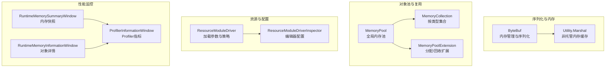
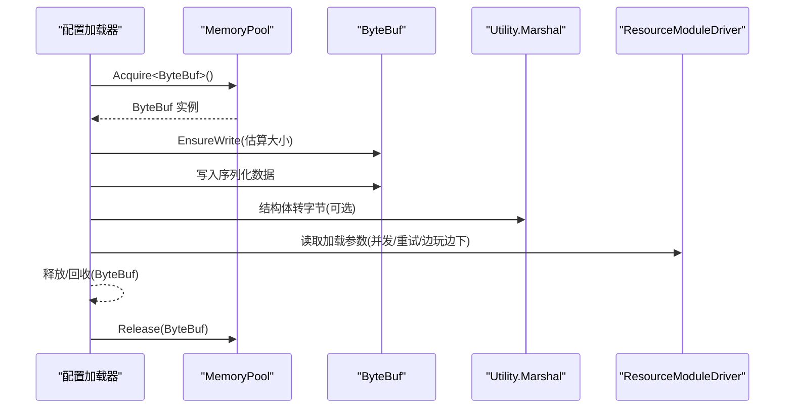
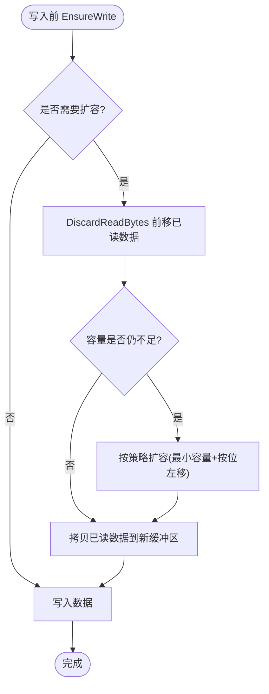
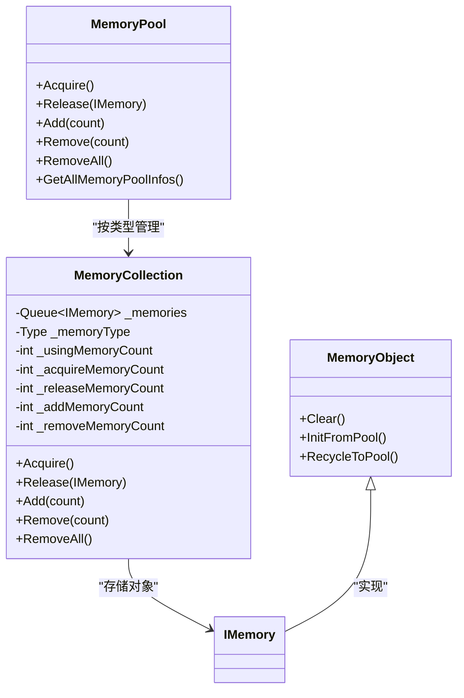
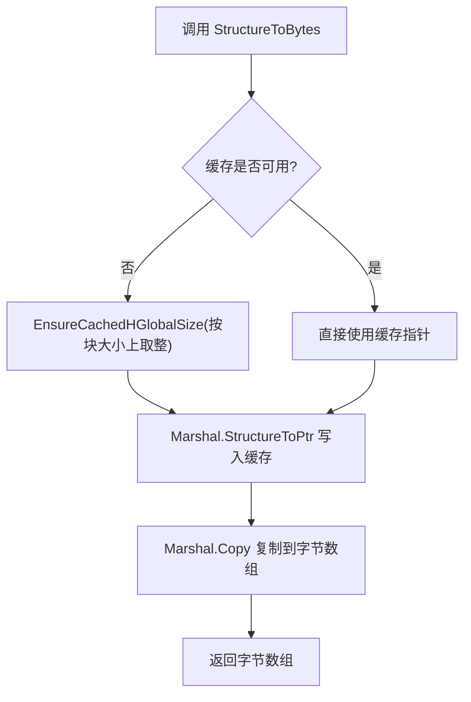
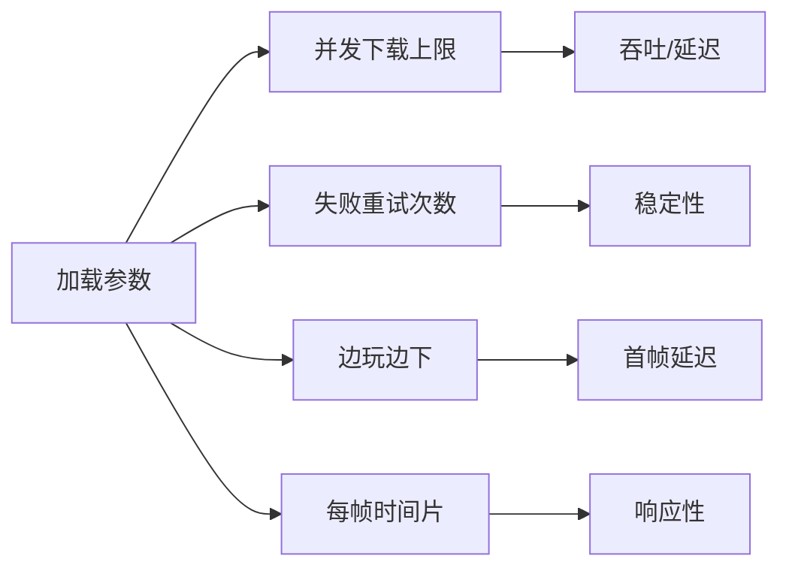
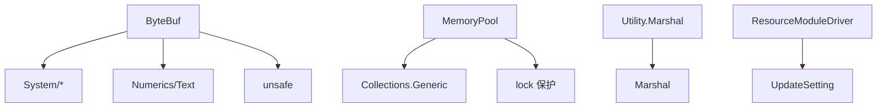

# 配置性能优化

<cite>
**本文档引用的文件**
- [ByteBuf.cs](file://Assets/GameScripts/HotFix/GameProto/LubanLib/ByteBuf.cs)
- [MemoryPool.cs](file://Assets/TEngine/Runtime/Core/MemoryPool/MemoryPool.cs)
- [MemoryPool.MemoryCollection.cs](file://Assets/TEngine/Runtime/Core/MemoryPool/MemoryPool.MemoryCollection.cs)
- [MemoryPoolExtension.cs](file://Assets/TEngine/Runtime/Core/MemoryPool/MemoryPoolExtension.cs)
- [Utility.Marshal.cs](file://Assets/TEngine/Runtime/Core/Utility/Utility.Marshal.cs)
- [DebuggerModule.RuntimeMemorySummaryWindow.cs](file://Assets/TEngine/Runtime/Module/DebugerModule/Component/DebuggerModule.RuntimeMemorySummaryWindow.cs)
- [DebuggerModule.RuntimeMemoryInformationWindow.cs](file://Assets/TEngine/Runtime/Module/DebugerModule/Component/DebuggerModule.RuntimeMemoryInformationWindow.cs)
- [DebuggerModule.ProfilerInformationWindow.cs](file://Assets/TEngine/Runtime/Module/DebugerModule/Component/DebuggerModule.ProfilerInformationWindow.cs)
- [ResourceModuleDriver.cs](file://Assets/TEngine/Runtime/Module/ResourceModule/ResourceModuleDriver.cs)
- [ResourceModuleDriverInspector.cs](file://Assets/Editor/Inspector/ResourceModuleDriverInspector.cs)
</cite>

## 目录
1. [简介](#简介)
2. [项目结构](#项目结构)
3. [核心组件](#核心组件)
4. [架构总览](#架构总览)
5. [详细组件分析](#详细组件分析)
6. [依赖关系分析](#依赖关系分析)
7. [性能考量](#性能考量)
8. [故障排查指南](#故障排查指南)
9. [结论](#结论)
10. [附录](#附录)

## 简介
本技术文档聚焦于配置系统的性能优化，涵盖内存映射与对象池设计、垃圾回收优化、ByteBuf内存管理机制（预分配、复用、碎片整理）、配置数据的压缩与解压策略、并发访问优化（线程安全、锁优化、无锁数据结构），以及性能监控与分析方法（内存使用统计、加载时间分析、缓存命中率）。文档基于仓库中的实际实现进行深入剖析，并提供可操作的优化建议与测试案例。

## 项目结构
本项目在配置与序列化方面主要涉及以下模块：
- 序列化与内存管理：LubanLib 的 ByteBuf 实现
- 对象池与内存复用：TEngine 的 MemoryPool 框架
- 非托管内存缓存：Utility.Marshal 提供的 HGlobal 缓存
- 资源加载与配置加载：ResourceModuleDriver 及其编辑器配置
- 运行时性能监控：调试器模块的内存与性能面板

图表来源
- [ByteBuf.cs:1-1569](file://Assets/GameScripts/HotFix/GameProto/LubanLib/ByteBuf.cs#L1-L1569)
- [MemoryPool.cs:1-208](file://Assets/TEngine/Runtime/Core/MemoryPool/MemoryPool.cs#L1-L208)
- [MemoryPool.MemoryCollection.cs:1-157](file://Assets/TEngine/Runtime/Core/MemoryPool/MemoryPool.MemoryCollection.cs#L1-L157)
- [MemoryPoolExtension.cs:1-57](file://Assets/TEngine/Runtime/Core/MemoryPool/MemoryPoolExtension.cs#L1-L57)
- [Utility.Marshal.cs:1-229](file://Assets/TEngine/Runtime/Core/Utility/Utility.Marshal.cs#L1-L229)
- [ResourceModuleDriver.cs:94-274](file://Assets/TEngine/Runtime/Module/ResourceModule/ResourceModuleDriver.cs#L94-L274)
- [ResourceModuleDriverInspector.cs:353-417](file://Assets/Editor/Inspector/ResourceModuleDriverInspector.cs#L353-L417)
- [DebuggerModule.RuntimeMemorySummaryWindow.cs:57-97](file://Assets/TEngine/Runtime/Module/DebugerModule/Component/DebuggerModule.RuntimeMemorySummaryWindow.cs#L57-L97)
- [DebuggerModule.RuntimeMemoryInformationWindow.cs:74-109](file://Assets/TEngine/Runtime/Module/DebugerModule/Component/DebuggerModule.RuntimeMemoryInformationWindow.cs#L74-L109)
- [DebuggerModule.ProfilerInformationWindow.cs:31-59](file://Assets/TEngine/Runtime/Module/DebugerModule/Component/DebuggerModule.ProfilerInformationWindow.cs#L31-L59)

章节来源
- [ByteBuf.cs:1-1569](file://Assets/GameScripts/HotFix/GameProto/LubanLib/ByteBuf.cs#L1-L1569)
- [MemoryPool.cs:1-208](file://Assets/TEngine/Runtime/Core/MemoryPool/MemoryPool.cs#L1-L208)
- [MemoryPool.MemoryCollection.cs:1-157](file://Assets/TEngine/Runtime/Core/MemoryPool/MemoryPool.MemoryCollection.cs#L1-L157)
- [MemoryPoolExtension.cs:1-57](file://Assets/TEngine/Runtime/Core/MemoryPool/MemoryPoolExtension.cs#L1-L57)
- [Utility.Marshal.cs:1-229](file://Assets/TEngine/Runtime/Core/Utility/Utility.Marshal.cs#L1-L229)
- [ResourceModuleDriver.cs:94-274](file://Assets/TEngine/Runtime/Module/ResourceModule/ResourceModuleDriver.cs#L94-L274)
- [ResourceModuleDriverInspector.cs:353-417](file://Assets/Editor/Inspector/ResourceModuleDriverInspector.cs#L353-L417)
- [DebuggerModule.RuntimeMemorySummaryWindow.cs:57-97](file://Assets/TEngine/Runtime/Module/DebugerModule/Component/DebuggerModule.RuntimeMemorySummaryWindow.cs#L57-L97)
- [DebuggerModule.RuntimeMemoryInformationWindow.cs:74-109](file://Assets/TEngine/Runtime/Module/DebugerModule/Component/DebuggerModule.RuntimeMemoryInformationWindow.cs#L74-L109)
- [DebuggerModule.ProfilerInformationWindow.cs:31-59](file://Assets/TEngine/Runtime/Module/DebugerModule/Component/DebuggerModule.ProfilerInformationWindow.cs#L31-L59)

## 核心组件
- ByteBuf：高性能字节缓冲区，支持变长编码、分段读写、就地替换、预分配与扩容、对齐优化与 unsafe 快速路径。
- MemoryPool：全局对象池，按类型维护队列，提供 Acquire/Release/Add/Remove 接口，支持严格校验与统计。
- MemoryCollection：按类型维护对象队列与计数，负责具体分配与回收逻辑。
- MemoryObject：对象池基类，定义 InitFromPool/RecycleToPool/Clear 生命周期钩子。
- Utility.Marshal：非托管内存缓存，避免频繁分配/释放，提供结构体与字节数组互转。
- ResourceModuleDriver：资源配置加载参数（如并发下载、失败重试、边玩边下等），影响配置加载性能。
- 调试器模块：运行时内存快照、对象详情、Profiler指标展示，用于性能监控与分析。

章节来源
- [ByteBuf.cs:41-1569](file://Assets/GameScripts/HotFix/GameProto/LubanLib/ByteBuf.cs#L41-L1569)
- [MemoryPool.cs:9-207](file://Assets/TEngine/Runtime/Core/MemoryPool/MemoryPool.cs#L9-L207)
- [MemoryPool.MemoryCollection.cs:11-157](file://Assets/TEngine/Runtime/Core/MemoryPool/MemoryPool.MemoryCollection.cs#L11-L157)
- [MemoryPoolExtension.cs:8-57](file://Assets/TEngine/Runtime/Core/MemoryPool/MemoryPoolExtension.cs#L8-L57)
- [Utility.Marshal.cs:11-229](file://Assets/TEngine/Runtime/Core/Utility/Utility.Marshal.cs#L11-L229)
- [ResourceModuleDriver.cs:94-274](file://Assets/TEngine/Runtime/Module/ResourceModule/ResourceModuleDriver.cs#L94-L274)

## 架构总览
配置系统性能优化的总体思路：
- 使用对象池减少 GC 压力，统一生命周期管理。
- 利用 ByteBuf 的预分配与就地复用，降低数组拷贝与扩容成本。
- 通过 Utility.Marshal 的非托管缓存减少跨内存区域复制。
- 结合 ResourceModuleDriver 的加载策略，控制并发与重试，平衡吞吐与稳定性。
- 使用调试器模块持续监控内存与性能指标，指导优化迭代。

图表来源
- [MemoryPool.cs:71-101](file://Assets/TEngine/Runtime/Core/MemoryPool/MemoryPool.cs#L71-L101)
- [ByteBuf.cs:199-206](file://Assets/GameScripts/HotFix/GameProto/LubanLib/ByteBuf.cs#L199-L206)
- [Utility.Marshal.cs:61-85](file://Assets/TEngine/Runtime/Core/Utility/Utility.Marshal.cs#L61-L85)
- [ResourceModuleDriver.cs:248-271](file://Assets/TEngine/Runtime/Module/ResourceModule/ResourceModuleDriver.cs#L248-L271)

## 详细组件分析

### ByteBuf 内存管理与序列化
- 预分配与扩容
  - 最小容量常量与按位左移的扩容策略，避免频繁扩容与拷贝。
  - 扩容前先尝试将已读数据移动到缓冲区前端，减少后续扩容概率。
- 就地复用与分段
  - 支持 Replace/EnterSegment/LeaveSegment，避免额外分配，直接复用底层字节数组。
  - 分段写入采用变长编码记录长度，减少头部开销。
- 变长编码与对齐优化
  - 整数采用变长编码（如 ZigZag、ULEB128 变体），小整数占用更少空间。
  - 读写基础类型提供对齐版本（unsafe/fixed）以提升性能。
- 字符串与字节数组
  - 字符串写入前先写入长度，支持字符串缓存查找回调以减少重复分配。
  - 字节数组读写使用 BlockCopy/Buffer.BlockCopy，提高批量复制效率。

图表来源
- [ByteBuf.cs:179-197](file://Assets/GameScripts/HotFix/GameProto/LubanLib/ByteBuf.cs#L179-L197)
- [ByteBuf.cs:140-145](file://Assets/GameScripts/HotFix/GameProto/LubanLib/ByteBuf.cs#L140-L145)
- [ByteBuf.cs:166-177](file://Assets/GameScripts/HotFix/GameProto/LubanLib/ByteBuf.cs#L166-L177)

章节来源
- [ByteBuf.cs:166-197](file://Assets/GameScripts/HotFix/GameProto/LubanLib/ByteBuf.cs#L166-L197)
- [ByteBuf.cs:140-145](file://Assets/GameScripts/HotFix/GameProto/LubanLib/ByteBuf.cs#L140-L145)
- [ByteBuf.cs:199-206](file://Assets/GameScripts/HotFix/GameProto/LubanLib/ByteBuf.cs#L199-L206)
- [ByteBuf.cs:1028-1096](file://Assets/GameScripts/HotFix/GameProto/LubanLib/ByteBuf.cs#L1028-L1096)
- [ByteBuf.cs:1355-1484](file://Assets/GameScripts/HotFix/GameProto/LubanLib/ByteBuf.cs#L1355-L1484)

### 对象池设计与内存复用
- 全局内存池
  - 按类型维护 MemoryCollection，提供 Acquire/Release/Add/Remove/RemoveAll 接口。
  - 支持严格校验（类型合法性、重复释放检测）。
- 集合内部结构
  - 使用队列存储空闲对象，计数器跟踪使用/获取/释放/增删数量。
  - 通过锁保护集合状态，保证线程安全。
- 分配/回收扩展
  - Alloc/Dealloc 提供生命周期钩子（InitFromPool/RecycleToPool/Clear），便于重置状态。

图表来源
- [MemoryPool.cs:9-207](file://Assets/TEngine/Runtime/Core/MemoryPool/MemoryPool.cs#L9-L207)
- [MemoryPool.MemoryCollection.cs:11-157](file://Assets/TEngine/Runtime/Core/MemoryPool/MemoryPool.MemoryCollection.cs#L11-L157)
- [MemoryPoolExtension.cs:8-26](file://Assets/TEngine/Runtime/Core/MemoryPool/MemoryPoolExtension.cs#L8-L26)

章节来源
- [MemoryPool.cs:71-101](file://Assets/TEngine/Runtime/Core/MemoryPool/MemoryPool.cs#L71-L101)
- [MemoryPool.cs:187-205](file://Assets/TEngine/Runtime/Core/MemoryPool/MemoryPool.cs#L187-L205)
- [MemoryPool.MemoryCollection.cs:46-98](file://Assets/TEngine/Runtime/Core/MemoryPool/MemoryPool.MemoryCollection.cs#L46-L98)
- [MemoryPoolExtension.cs:35-55](file://Assets/TEngine/Runtime/Core/MemoryPool/MemoryPoolExtension.cs#L35-L55)

### 非托管内存缓存（Utility.Marshal）
- 缓存策略
  - 按固定块大小向上取整分配非托管内存，避免频繁分配/释放。
  - 提供 EnsureCachedHGlobalSize/FreeCachedHGlobal 管理缓存生命周期。
- 结构体与字节数组互转
  - 使用 Marshal 结构体到指针再到字节数组的路径，减少中间对象创建。
  - 支持覆盖写入目标数组，避免额外分配。

图表来源
- [Utility.Marshal.cs:26-40](file://Assets/TEngine/Runtime/Core/Utility/Utility.Marshal.cs#L26-L40)
- [Utility.Marshal.cs:61-85](file://Assets/TEngine/Runtime/Core/Utility/Utility.Marshal.cs#L61-L85)
- [Utility.Marshal.cs:130-155](file://Assets/TEngine/Runtime/Core/Utility/Utility.Marshal.cs#L130-L155)

章节来源
- [Utility.Marshal.cs:13-53](file://Assets/TEngine/Runtime/Core/Utility/Utility.Marshal.cs#L13-L53)
- [Utility.Marshal.cs:61-85](file://Assets/TEngine/Runtime/Core/Utility/Utility.Marshal.cs#L61-L85)
- [Utility.Marshal.cs:130-155](file://Assets/TEngine/Runtime/Core/Utility/Utility.Marshal.cs#L130-L155)

### 并发访问优化与配置加载策略
- 加载参数
  - 并发下载上限、失败重试次数、边玩边下开关、每帧时间片等，直接影响配置加载吞吐与稳定性。
- 编辑器可视化配置
  - 通过 Inspector 提供滑条式参数调整，便于在运行时动态观察效果。

图表来源
- [ResourceModuleDriver.cs:115-133](file://Assets/TEngine/Runtime/Module/ResourceModule/ResourceModuleDriver.cs#L115-L133)
- [ResourceModuleDriver.cs:256-263](file://Assets/TEngine/Runtime/Module/ResourceModule/ResourceModuleDriver.cs#L256-L263)
- [ResourceModuleDriverInspector.cs:367-398](file://Assets/Editor/Inspector/ResourceModuleDriverInspector.cs#L367-L398)

章节来源
- [ResourceModuleDriver.cs:115-133](file://Assets/TEngine/Runtime/Module/ResourceModule/ResourceModuleDriver.cs#L115-L133)
- [ResourceModuleDriver.cs:256-263](file://Assets/TEngine/Runtime/Module/ResourceModule/ResourceModuleDriver.cs#L256-L263)
- [ResourceModuleDriverInspector.cs:367-398](file://Assets/Editor/Inspector/ResourceModuleDriverInspector.cs#L367-L398)

## 依赖关系分析
- ByteBuf 依赖
  - System/Numerics/Text/Unsafe 等命名空间，支持变长编码、UTF-8、unsafe 快速路径。
  - 通过 Replace/EnterSegment/LeaveSegment 与外部对象共享底层字节数组，降低分配。
- MemoryPool 依赖
  - System.Collections.Generic，使用队列存储空闲对象；通过锁保护集合状态。
- Utility.Marshal 依赖
  - System.Runtime.InteropServices.Marshal，提供非托管内存分配与复制。
- ResourceModuleDriver 依赖
  - Settings.UpdateSetting，读取下载路径与加载方式等配置。

图表来源
- [ByteBuf.cs:1-8](file://Assets/GameScripts/HotFix/GameProto/LubanLib/ByteBuf.cs#L1-L8)
- [MemoryPool.cs:1-3](file://Assets/TEngine/Runtime/Core/MemoryPool/MemoryPool.cs#L1-L3)
- [Utility.Marshal.cs:1-2](file://Assets/TEngine/Runtime/Core/Utility/Utility.Marshal.cs#L1-L2)
- [ResourceModuleDriver.cs:258-260](file://Assets/TEngine/Runtime/Module/ResourceModule/ResourceModuleDriver.cs#L258-L260)

章节来源
- [ByteBuf.cs:1-8](file://Assets/GameScripts/HotFix/GameProto/LubanLib/ByteBuf.cs#L1-L8)
- [MemoryPool.cs:1-3](file://Assets/TEngine/Runtime/Core/MemoryPool/MemoryPool.cs#L1-L3)
- [Utility.Marshal.cs:1-2](file://Assets/TEngine/Runtime/Core/Utility/Utility.Marshal.cs#L1-L2)
- [ResourceModuleDriver.cs:258-260](file://Assets/TEngine/Runtime/Module/ResourceModule/ResourceModuleDriver.cs#L258-L260)

## 性能考量
- 内存映射与对象池
  - 使用 MemoryPool 统一管理 ByteBuf 等对象，减少 GC 压力；结合 Clear/RecycleToPool 在回收前重置状态，避免脏数据。
- ByteBuf 预分配与扩容
  - 通过 PropSize 策略与 DiscardReadBytes 前移，降低扩容频率；分段写入减少头部开销。
- 变长编码与对齐优化
  - 小整数采用变长编码，字符串/字节数组使用 BlockCopy，unsafe/fixed 路径加速读写。
- 非托管缓存
  - Utility.Marshal 的缓存避免频繁分配/释放，适合大批量结构体转换场景。
- 并发与稳定性
  - 合理设置并发下载上限与失败重试次数，在吞吐与稳定性之间取得平衡；边玩边下可降低首帧延迟但需注意带宽竞争。
- 监控与分析
  - 使用调试器模块的内存快照与 Profiler 指标，持续跟踪内存峰值、分配速率与对象分布。

章节来源
- [MemoryPool.cs:33-48](file://Assets/TEngine/Runtime/Core/MemoryPool/MemoryPool.cs#L33-L48)
- [MemoryPoolExtension.cs:13-25](file://Assets/TEngine/Runtime/Core/MemoryPool/MemoryPoolExtension.cs#L13-L25)
- [ByteBuf.cs:166-177](file://Assets/GameScripts/HotFix/GameProto/LubanLib/ByteBuf.cs#L166-L177)
- [ByteBuf.cs:140-145](file://Assets/GameScripts/HotFix/GameProto/LubanLib/ByteBuf.cs#L140-L145)
- [Utility.Marshal.cs:13-53](file://Assets/TEngine/Runtime/Core/Utility/Utility.Marshal.cs#L13-L53)
- [ResourceModuleDriver.cs:115-133](file://Assets/TEngine/Runtime/Module/ResourceModule/ResourceModuleDriver.cs#L115-L133)
- [DebuggerModule.RuntimeMemorySummaryWindow.cs:61-97](file://Assets/TEngine/Runtime/Module/DebugerModule/Component/DebuggerModule.RuntimeMemorySummaryWindow.cs#L61-L97)
- [DebuggerModule.ProfilerInformationWindow.cs:31-59](file://Assets/TEngine/Runtime/Module/DebugerModule/Component/DebuggerModule.ProfilerInformationWindow.cs#L31-L59)

## 故障排查指南
- 序列化异常
  - 当读取长度超过可用范围或超出最大段大小时抛出异常，检查写入端是否正确计算长度与分段。
- 内存池误用
  - 重复释放或类型不匹配会触发异常；启用严格校验有助于定位问题。
- 非托管内存泄漏
  - 确保在不再使用时调用 FreeCachedHGlobal 或合理增大缓存块大小以减少频繁分配。
- 加载不稳定
  - 调整并发下载上限与失败重试次数；在编辑器中通过 Inspector 实时验证参数效果。

章节来源
- [ByteBuf.cs:1266-1327](file://Assets/GameScripts/HotFix/GameProto/LubanLib/ByteBuf.cs#L1266-L1327)
- [MemoryPool.cs:164-185](file://Assets/TEngine/Runtime/Core/MemoryPool/MemoryPool.cs#L164-L185)
- [Utility.Marshal.cs:45-53](file://Assets/TEngine/Runtime/Core/Utility/Utility.Marshal.cs#L45-L53)
- [ResourceModuleDriverInspector.cs:367-398](file://Assets/Editor/Inspector/ResourceModuleDriverInspector.cs#L367-L398)

## 结论
通过对象池、ByteBuf 的预分配与分段、变长编码与对齐优化、非托管内存缓存以及合理的加载并发策略，配置系统可在保证稳定性的同时显著提升性能。配合调试器模块的持续监控，能够快速定位瓶颈并迭代优化。

## 附录

### 性能测试案例与优化建议
- 测试案例
  - 大批量配置写入：记录写入耗时、扩容次数、GC 压力；对比不同初始容量与分段策略。
  - 字符串与字节数组读写：对比 BlockCopy 与逐字节复制、变长编码与定长编码的体积与速度。
  - 对象池回收：对比 Acquire/Release 与直接 new 的 GC 压力与吞吐差异。
  - 加载并发：调整并发下载上限与失败重试次数，观察首帧延迟与整体吞吐变化。
- 优化建议
  - 预估写入规模，提前调用 EnsureWrite 减少扩容。
  - 使用 EnterSegment/LeaveSegment 复用底层字节数组，避免额外分配。
  - 启用严格校验定位内存池误用问题。
  - 合理设置 ResourceModuleDriver 参数，权衡吞吐与稳定性。
  - 使用调试器模块持续监控内存与性能指标，形成闭环优化。

[本节为通用指导，无需特定文件来源]