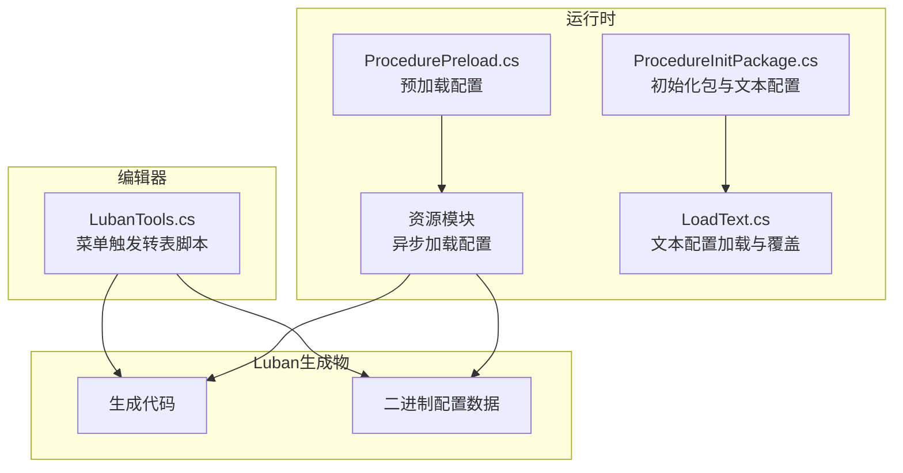
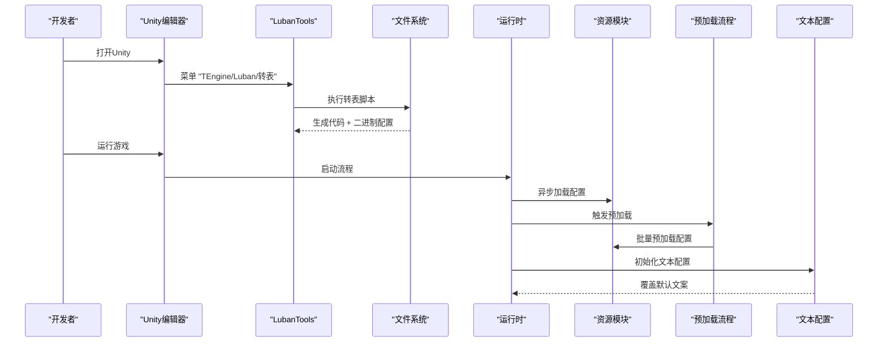
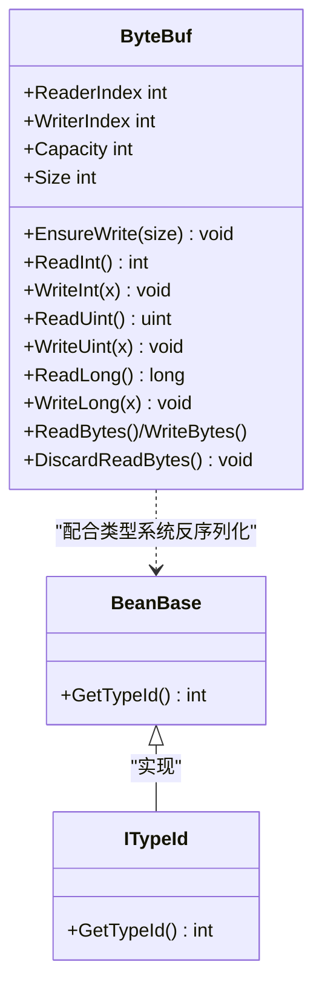
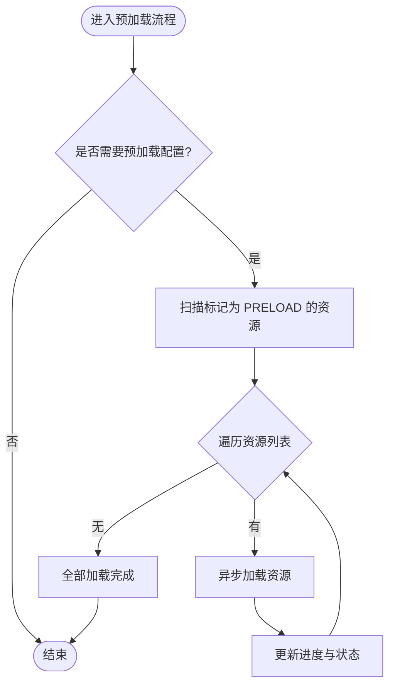
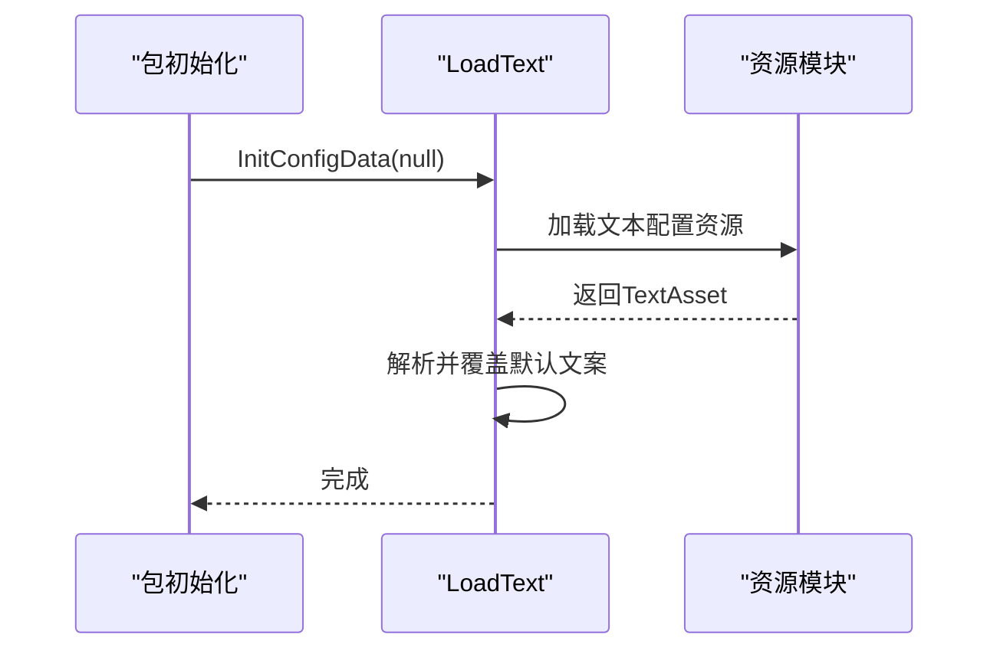
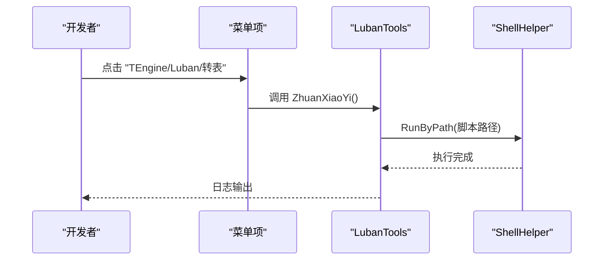
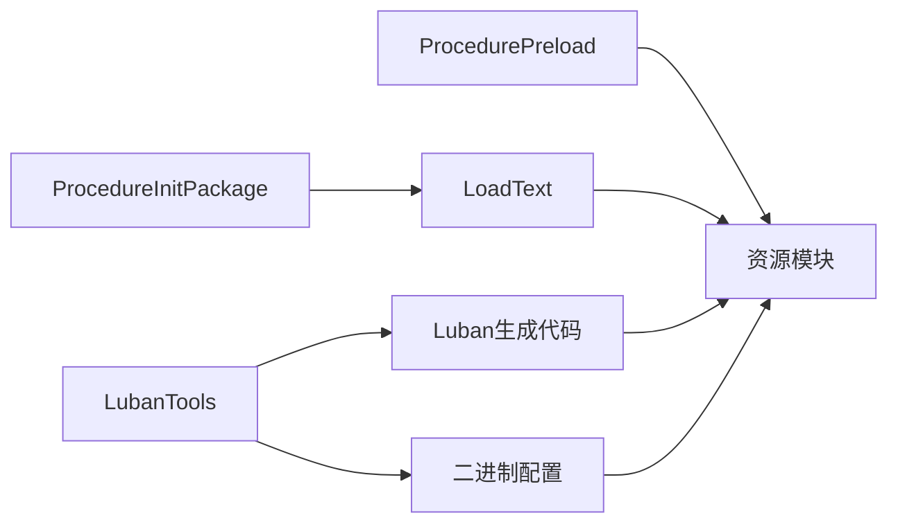

# 配置系统

<cite>
**本文引用的文件**
- [LubanTools.cs](file://Assets/TEngine/Editor/LubanTools/LubanTools.cs)
- [BeanBase.cs](file://Assets/GameScripts/HotFix/GameProto/LubanLib/BeanBase.cs)
- [ITypeId.cs](file://Assets/GameScripts/HotFix/GameProto/LubanLib/ITypeId.cs)
- [ByteBuf.cs](file://Assets/GameScripts/HotFix/GameProto/LubanLib/ByteBuf.cs)
- [LoadText.cs](file://Assets/Launcher/Scripts/LoadText.cs)
- [ProcedurePreload.cs](file://Assets/GameScripts/Procedure/ProcedurePreload.cs)
- [ProcedureInitPackage.cs](file://Assets/GameScripts/Procedure/ProcedureInitPackage.cs)
- [systemPatterns.md](file://memory-bank/systemPatterns.md)
</cite>

## 目录
1. [简介](#简介)
2. [项目结构](#项目结构)
3. [核心组件](#核心组件)
4. [架构总览](#架构总览)
5. [详细组件分析](#详细组件分析)
6. [依赖关系分析](#依赖关系分析)
7. [性能考量](#性能考量)
8. [故障排查指南](#故障排查指南)
9. [结论](#结论)
10. [附录](#附录)

## 简介
本文件面向TEngine配置系统，聚焦Luban配置表体系的设计与实现，涵盖配置文件格式、序列化/反序列化、类型系统、加载模式（同步/异步/懒加载）、性能优化（内存映射、缓存、增量更新）、版本管理与热更新支持、使用指南与最佳实践。文档基于仓库中的实际代码与设计说明进行梳理，帮助开发者快速理解并正确使用配置系统。

## 项目结构
TEngine配置系统由“编辑器工具链 + 运行时加载 + 预加载流程 + 文本配置”四部分组成：
- 编辑器工具链：通过菜单触发Luban编译脚本，生成代码与二进制配置。
- 运行时加载：通过资源模块按需加载配置二进制或文本，并提供类型安全访问。
- 预加载流程：在启动阶段批量预加载配置资源，减少首帧延迟。
- 文本配置：用于启动UI文案等运行时文本资源的动态加载与覆盖。

图表来源
- [LubanTools.cs:1-20](file://Assets/TEngine/Editor/LubanTools/LubanTools.cs#L1-L20)
- [ProcedurePreload.cs:118-150](file://Assets/GameScripts/Procedure/ProcedurePreload.cs#L118-L150)
- [ProcedureInitPackage.cs:30-90](file://Assets/GameScripts/Procedure/ProcedureInitPackage.cs#L30-L90)
- [LoadText.cs:84-139](file://Assets/Launcher/Scripts/LoadText.cs#L84-L139)

章节来源
- [LubanTools.cs:1-20](file://Assets/TEngine/Editor/LubanTools/LubanTools.cs#L1-L20)
- [ProcedurePreload.cs:118-150](file://Assets/GameScripts/Procedure/ProcedurePreload.cs#L118-L150)
- [ProcedureInitPackage.cs:30-90](file://Assets/GameScripts/Procedure/ProcedureInitPackage.cs#L30-L90)
- [LoadText.cs:84-139](file://Assets/Launcher/Scripts/LoadText.cs#L84-L139)

## 核心组件
- Luban类型系统与序列化基元
  - 抽象基类与类型标识：BeanBase、ITypeId提供统一的类型识别能力。
  - 序列化缓冲区：ByteBuf提供高性能的二进制读写、变长编码、内存复用与安全边界检查。
- 配置加载与管理
  - 预加载流程：ProcedurePreload负责批量预加载配置资源，避免首帧卡顿。
  - 文本配置：LoadText支持从TextAsset加载UI文案并覆盖默认值。
  - 包初始化：ProcedureInitPackage在不同运行模式下初始化资源包并触发文本配置加载。
- 编辑器工具链
  - LubanTools菜单项触发转表脚本，生成代码与二进制配置。

章节来源
- [BeanBase.cs:1-8](file://Assets/GameScripts/HotFix/GameProto/LubanLib/BeanBase.cs#L1-L8)
- [ITypeId.cs:1-8](file://Assets/GameScripts/HotFix/GameProto/LubanLib/ITypeId.cs#L1-L8)
- [ByteBuf.cs:1-800](file://Assets/GameScripts/HotFix/GameProto/LubanLib/ByteBuf.cs#L1-L800)
- [ProcedurePreload.cs:118-150](file://Assets/GameScripts/Procedure/ProcedurePreload.cs#L118-L150)
- [LoadText.cs:84-139](file://Assets/Launcher/Scripts/LoadText.cs#L84-L139)
- [ProcedureInitPackage.cs:30-90](file://Assets/GameScripts/Procedure/ProcedureInitPackage.cs#L30-L90)
- [LubanTools.cs:1-20](file://Assets/TEngine/Editor/LubanTools/LubanTools.cs#L1-L20)

## 架构总览
Luban配置系统采用“编辑器生成 + 运行时加载”的双阶段架构：
- 编辑器阶段：通过LubanTools菜单执行转表脚本，生成C#代码与二进制配置数据。
- 运行时阶段：资源模块异步加载二进制配置；预加载流程在启动时批量加载；文本配置在包初始化后加载并覆盖默认文案。

图表来源
- [LubanTools.cs:8-18](file://Assets/TEngine/Editor/LubanTools/LubanTools.cs#L8-L18)
- [ProcedurePreload.cs:126-150](file://Assets/GameScripts/Procedure/ProcedurePreload.cs#L126-L150)
- [ProcedureInitPackage.cs:30-90](file://Assets/GameScripts/Procedure/ProcedureInitPackage.cs#L30-L90)
- [LoadText.cs:84-139](file://Assets/Launcher/Scripts/LoadText.cs#L84-L139)

## 详细组件分析

### 组件A：Luban类型系统与序列化基元
- 设计要点
  - BeanBase与ITypeId提供统一的类型标识接口，便于运行时按类型检索与反序列化。
  - ByteBuf提供高性能二进制缓冲区，支持变长整数编码、对齐读写、容量自动扩容、安全边界检查与内存复用。
- 数据结构与复杂度
  - 读写操作均摊O(1)，容量按倍数增长，避免频繁分配。
  - 变长编码在常见小数值场景下显著节省带宽。
- 错误处理
  - 读取越界抛出序列化异常，确保数据一致性。
- 性能影响
  - 零拷贝与对齐读写减少CPU指令与分支预测失败。
  - 安全边界检查在调试构建中提升稳定性。

图表来源
- [BeanBase.cs:1-8](file://Assets/GameScripts/HotFix/GameProto/LubanLib/BeanBase.cs#L1-L8)
- [ITypeId.cs:1-8](file://Assets/GameScripts/HotFix/GameProto/LubanLib/ITypeId.cs#L1-L8)
- [ByteBuf.cs:41-800](file://Assets/GameScripts/HotFix/GameProto/LubanLib/ByteBuf.cs#L41-L800)

章节来源
- [BeanBase.cs:1-8](file://Assets/GameScripts/HotFix/GameProto/LubanLib/BeanBase.cs#L1-L8)
- [ITypeId.cs:1-8](file://Assets/GameScripts/HotFix/GameProto/LubanLib/ITypeId.cs#L1-L8)
- [ByteBuf.cs:10-800](file://Assets/GameScripts/HotFix/GameProto/LubanLib/ByteBuf.cs#L10-L800)

### 组件B：配置加载流程（预加载与异步加载）
- 预加载策略
  - 在启动阶段扫描标记为“PRELOAD”的资源，异步批量加载，减少首帧等待。
  - 支持WebGL平台的特殊预加载集合。
- 异步加载策略
  - 使用资源模块的异步API加载单个配置，避免阻塞主线程。
- 懒加载策略
  - 未在预加载阶段加载的配置，在首次访问时再加载，平衡内存占用与响应速度。

图表来源
- [ProcedurePreload.cs:118-150](file://Assets/GameScripts/Procedure/ProcedurePreload.cs#L118-L150)
- [ProcedurePreload.cs:152-156](file://Assets/GameScripts/Procedure/ProcedurePreload.cs#L152-L156)

章节来源
- [ProcedurePreload.cs:118-150](file://Assets/GameScripts/Procedure/ProcedurePreload.cs#L118-L150)
- [ProcedurePreload.cs:152-156](file://Assets/GameScripts/Procedure/ProcedurePreload.cs#L152-L156)

### 组件C：文本配置加载与覆盖
- 设计要点
  - LoadText支持从TextAsset加载文本配置，并覆盖默认文案，便于热更新与多语言切换。
- 工作流
  - 包初始化后触发文本配置加载；若传入空资源则使用默认文案。
- 适用场景
  - 启动UI文案、提示语、引导文本等运行时可替换的文本资源。

图表来源
- [ProcedureInitPackage.cs:30-90](file://Assets/GameScripts/Procedure/ProcedureInitPackage.cs#L30-L90)
- [LoadText.cs:84-139](file://Assets/Launcher/Scripts/LoadText.cs#L84-L139)

章节来源
- [ProcedureInitPackage.cs:30-90](file://Assets/GameScripts/Procedure/ProcedureInitPackage.cs#L30-L90)
- [LoadText.cs:84-139](file://Assets/Launcher/Scripts/LoadText.cs#L84-L139)

### 组件D：编辑器转表工具链
- 设计要点
  - 通过菜单项触发转表脚本，跨平台支持（Windows/Linux/macOS）。
- 工作流
  - 选择菜单项 → 自动定位脚本路径 → 执行脚本 → 生成代码与二进制配置。

图表来源
- [LubanTools.cs:8-18](file://Assets/TEngine/Editor/LubanTools/LubanTools.cs#L8-L18)

章节来源
- [LubanTools.cs:1-20](file://Assets/TEngine/Editor/LubanTools/LubanTools.cs#L1-L20)

## 依赖关系分析
- 组件耦合
  - 预加载流程依赖资源模块的异步加载能力。
  - 文本配置加载依赖包初始化流程。
  - Luban类型系统与序列化基元为配置访问提供统一抽象。
- 外部依赖
  - 资源模块（YooAsset）提供包初始化与异步加载。
  - Unity编辑器提供菜单与Shell执行能力。

图表来源
- [ProcedurePreload.cs:118-150](file://Assets/GameScripts/Procedure/ProcedurePreload.cs#L118-L150)
- [ProcedureInitPackage.cs:30-90](file://Assets/GameScripts/Procedure/ProcedureInitPackage.cs#L30-L90)
- [LoadText.cs:84-139](file://Assets/Launcher/Scripts/LoadText.cs#L84-L139)
- [LubanTools.cs:8-18](file://Assets/TEngine/Editor/LubanTools/LubanTools.cs#L8-L18)

章节来源
- [ProcedurePreload.cs:118-150](file://Assets/GameScripts/Procedure/ProcedurePreload.cs#L118-L150)
- [ProcedureInitPackage.cs:30-90](file://Assets/GameScripts/Procedure/ProcedureInitPackage.cs#L30-L90)
- [LoadText.cs:84-139](file://Assets/Launcher/Scripts/LoadText.cs#L84-L139)
- [LubanTools.cs:1-20](file://Assets/TEngine/Editor/LubanTools/LubanTools.cs#L1-L20)

## 性能考量
- 内存映射与零拷贝
  - ByteBuf支持直接包装字节数组，避免额外复制。
- 缓存策略
  - 预加载批量缓存配置资源，减少首次访问延迟。
  - 文本配置按需加载并缓存解析结果。
- 增量更新
  - 通过资源模块的包管理与版本控制，实现配置的增量更新与热补丁。
- 异步优先
  - 所有IO操作采用异步方式，避免阻塞主线程；支持取消令牌以中断长时间任务。

章节来源
- [systemPatterns.md:489-504](file://memory-bank/systemPatterns.md#L489-L504)
- [ProcedurePreload.cs:103-116](file://Assets/GameScripts/Procedure/ProcedurePreload.cs#L103-L116)
- [LoadText.cs:84-139](file://Assets/Launcher/Scripts/LoadText.cs#L84-L139)

## 故障排查指南
- 资源初始化失败
  - 包清单缺失或网络异常：检查包清单是否存在，确认网络可达性。
- 预加载失败
  - 资源地址无效或加载回调未正确处理：检查资源地址与回调逻辑。
- 文本配置未生效
  - TextAsset为空或解析失败：确认资源存在且格式正确。

章节来源
- [ProcedureInitPackage.cs:92-110](file://Assets/GameScripts/Procedure/ProcedureInitPackage.cs#L92-L110)
- [ProcedurePreload.cs:158-162](file://Assets/GameScripts/Procedure/ProcedurePreload.cs#L158-L162)
- [LoadText.cs:84-89](file://Assets/Launcher/Scripts/LoadText.cs#L84-L89)

## 结论
TEngine配置系统以Luban为核心，结合编辑器转表与运行时异步加载，形成高效、可维护的配置方案。通过预加载、缓存与异步策略，系统在性能与体验之间取得良好平衡；通过类型系统与序列化基元，确保配置访问的类型安全与高性能。版本管理与热更新支持进一步增强了系统的可演进性。

## 附录
- 使用指南与最佳实践
  - 配置文件编写：使用Luban数据模型定义配置表结构，导出为二进制与生成代码。
  - 加载方法：在启动流程中启用预加载；对热点配置采用懒加载；对非关键配置采用异步加载。
  - 数据访问：通过生成的类型安全接口访问配置；必要时使用ByteBuf进行高性能读写。
  - 版本管理与热更新：利用资源模块的包管理与版本控制，实现配置的增量更新与回滚。
  - 性能优化：优先使用异步加载；合理设置预加载集合；对高频访问配置进行缓存；避免在主线程执行IO。

章节来源
- [systemPatterns.md:468-530](file://memory-bank/systemPatterns.md#L468-L530)
- [ProcedurePreload.cs:118-150](file://Assets/GameScripts/Procedure/ProcedurePreload.cs#L118-L150)
- [ProcedureInitPackage.cs:30-90](file://Assets/GameScripts/Procedure/ProcedureInitPackage.cs#L30-L90)
- [LoadText.cs:84-139](file://Assets/Launcher/Scripts/LoadText.cs#L84-L139)
- [LubanTools.cs:1-20](file://Assets/TEngine/Editor/LubanTools/LubanTools.cs#L1-L20)