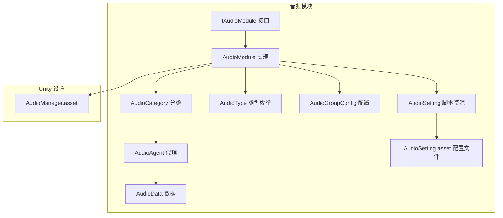
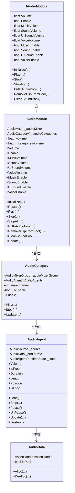
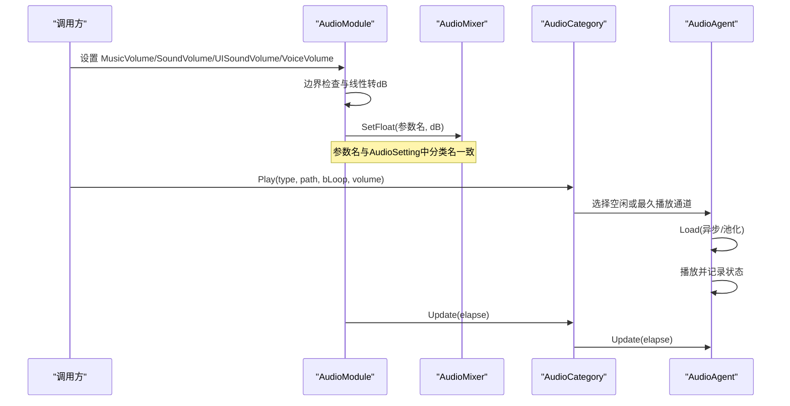
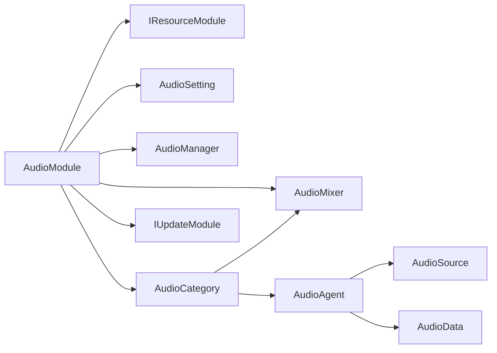

# 音量控制系统

<cite>
**本文引用的文件**
- [AudioModule.cs](file://Assets/TEngine/Runtime/Module/AudioModule/AudioModule.cs)
- [AudioSetting.cs](file://Assets/TEngine/Runtime/Module/AudioModule/AudioSetting.cs)
- [AudioGroupConfig.cs](file://Assets/TEngine/Runtime/Module/AudioModule/AudioGroupConfig.cs)
- [AudioCategory.cs](file://Assets/TEngine/Runtime/Module/AudioModule/AudioCategory.cs)
- [AudioAgent.cs](file://Assets/TEngine/Runtime/Module/AudioModule/AudioAgent.cs)
- [AudioAgentRuntimeState.cs](file://Assets/TEngine/Runtime/Module/AudioModule/AudioAgentRuntimeState.cs)
- [AudioData.cs](file://Assets/TEngine/Runtime/Module/AudioModule/AudioData.cs)
- [IAudioModule.cs](file://Assets/TEngine/Runtime/Module/AudioModule/IAudioModule.cs)
- [AudioType.cs](file://Assets/TEngine/Runtime/Module/AudioModule/AudioType.cs)
- [AudioSetting.asset](file://Assets/TEngine/Settings/AudioSetting.asset)
- [AudioManager.asset](file://ProjectSettings/AudioManager.asset)
- [Module.cs](file://Assets/TEngine/Runtime/Core/Module.cs)
- [ProcedureLaunch.cs](file://Assets/GameScripts/Procedure/ProcedureLaunch.cs)
- [Constant.cs](file://Assets/TEngine/Runtime/Core/Constant/Constant.cs)
</cite>

## 目录
1. [简介](#简介)
2. [项目结构](#项目结构)
3. [核心组件](#核心组件)
4. [架构总览](#架构总览)
5. [详细组件分析](#详细组件分析)
6. [依赖关系分析](#依赖关系分析)
7. [性能考量](#性能考量)
8. [故障排查指南](#故障排查指南)
9. [结论](#结论)
10. [附录](#附录)

## 简介
本技术文档围绕 TEngine 的音量控制系统展开，系统性阐述总音量控制、分类音量控制、实时音量调节等核心功能；详解 AudioMixer 的集成方式与参数设置，覆盖音乐、音效、UI 音效、语音四类音量的独立控制机制；解释音量值的计算公式与对数刻度转换（分贝 dB），说明为何使用 dB 值而非线性值；给出实时更新机制与性能优化策略；提供配置方法与自定义设置，包括 AudioSetting.asset 中的配置项；并通过代码片段路径展示如何动态调整各类音量，以及在游戏中的典型应用场景。

## 项目结构
TEngine 的音频模块位于 TEngine/Runtime/Module/AudioModule 目录下，核心文件包括：
- 接口与实现：IAudioModule、AudioModule
- 配置与类型：AudioSetting、AudioGroupConfig、AudioType
- 分类与代理：AudioCategory、AudioAgent、AudioAgentRuntimeState、AudioData
- 运行时模块基类：Module
- 配置资源：AudioSetting.asset
- Unity 工程设置：ProjectSettings/AudioManager.asset
- 使用示例：ProcedureLaunch.cs 中的初始化读取与设置

图表来源
- [AudioModule.cs:11-396](file://Assets/TEngine/Runtime/Module/AudioModule/AudioModule.cs#L11-L396)
- [AudioCategory.cs:12-100](file://Assets/TEngine/Runtime/Module/AudioModule/AudioCategory.cs#L12-L100)
- [AudioAgent.cs:10-220](file://Assets/TEngine/Runtime/Module/AudioModule/AudioAgent.cs#L10-L220)
- [AudioSetting.cs:5-9](file://Assets/TEngine/Runtime/Module/AudioModule/AudioSetting.cs#L5-L9)
- [AudioSetting.asset:15-47](file://Assets/TEngine/Settings/AudioSetting.asset#L15-L47)
- [AudioManager.asset](file://ProjectSettings/AudioManager.asset)

章节来源
- [AudioModule.cs:11-396](file://Assets/TEngine/Runtime/Module/AudioModule/AudioModule.cs#L11-L396)
- [AudioSetting.asset:15-47](file://Assets/TEngine/Settings/AudioSetting.asset#L15-L47)

## 核心组件
- IAudioModule：定义总音量、分类音量、开关、初始化、播放、停止、资源池等接口契约。
- AudioModule：IAudioModule 的具体实现，负责：
  - 总音量 Volume 与总开关 Enable 的设置与同步到 AudioListener
  - 分类音量 MusicVolume/SoundVolume/UISoundVolume/VoiceVolume 的设置与 dB 转换
  - 分类开关 MusicEnable/SoundEnable/UISoundEnable/VoiceEnable 的管理
  - AudioMixer 的加载与查找，AudioCategory 的构建与轮询
  - 资源池与播放调度
- AudioSetting/AudioGroupConfig：定义音频轨道组配置，包含每类音量初始值、最大通道数、3D 衰减模式与距离参数等。
- AudioCategory：按配置创建多个 AudioAgent，负责同一分类下的播放调度与生命周期管理。
- AudioAgent：单个音频播放代理，封装 AudioSource、资源加载、渐隐、状态机等。
- AudioAgentRuntimeState：代理运行时状态机，涵盖空闲、加载、播放、渐隐、结束。
- AudioData：资源句柄包装，配合内存池回收。
- AudioType：四类音量类型枚举（Sound/UISound/Music/Voice）。
- Module：模块基类，AudioModule 实现 IUpdateModule 以便轮询更新各分类。

章节来源
- [IAudioModule.cs:8-127](file://Assets/TEngine/Runtime/Module/AudioModule/IAudioModule.cs#L8-L127)
- [AudioModule.cs:11-396](file://Assets/TEngine/Runtime/Module/AudioModule/AudioModule.cs#L11-L396)
- [AudioSetting.cs:5-9](file://Assets/TEngine/Runtime/Module/AudioModule/AudioSetting.cs#L5-L9)
- [AudioGroupConfig.cs:11-69](file://Assets/TEngine/Runtime/Module/AudioModule/AudioGroupConfig.cs#L11-L69)
- [AudioCategory.cs:12-195](file://Assets/TEngine/Runtime/Module/AudioModule/AudioCategory.cs#L12-L195)
- [AudioAgent.cs:10-418](file://Assets/TEngine/Runtime/Module/AudioModule/AudioAgent.cs#L10-L418)
- [AudioAgentRuntimeState.cs:6-32](file://Assets/TEngine/Runtime/Module/AudioModule/AudioAgentRuntimeState.cs#L6-L32)
- [AudioData.cs:8-65](file://Assets/TEngine/Runtime/Module/AudioModule/AudioData.cs#L8-L65)
- [AudioType.cs:7-33](file://Assets/TEngine/Runtime/Module/AudioModule/AudioType.cs#L7-L33)
- [Module.cs:8-39](file://Assets/TEngine/Runtime/Core/Module.cs#L8-L39)

## 架构总览
TEngine 音频系统采用“模块 + 分类 + 代理”的分层架构：
- 模块层：AudioModule 统一管理总音量、总开关、分类音量与开关、AudioMixer、资源池与轮询。
- 分类层：AudioCategory 按类型维护一组 AudioAgent，负责通道复用与播放调度。
- 代理层：AudioAgent 封装 AudioSource，处理资源加载、播放、渐隐、状态机与生命周期。
- 配置层：AudioSetting/AudioGroupConfig 提供初始配置，AudioSetting.asset 在工程中落地。
- 集成层：通过 Unity AudioMixer 的 Master/子组层级映射到具体分类，实现分组混音与独立控制。

图表来源
- [IAudioModule.cs:8-127](file://Assets/TEngine/Runtime/Module/AudioModule/IAudioModule.cs#L8-L127)
- [AudioModule.cs:11-396](file://Assets/TEngine/Runtime/Module/AudioModule/AudioModule.cs#L11-L396)
- [AudioCategory.cs:12-195](file://Assets/TEngine/Runtime/Module/AudioModule/AudioCategory.cs#L12-L195)
- [AudioAgent.cs:10-418](file://Assets/TEngine/Runtime/Module/AudioModule/AudioAgent.cs#L10-L418)
- [AudioData.cs:8-65](file://Assets/TEngine/Runtime/Module/AudioModule/AudioData.cs#L8-L65)

## 详细组件分析

### 总音量与总开关
- 总音量 Volume：直接设置 AudioListener 的音量，范围受禁用状态与边界保护影响。
- 总开关 Enable：控制整体输出，true 时恢复 Volume，false 时强制静音。
- 实时更新：通过 AudioListener.volume 即时生效，确保全局静音与恢复的一致性。

章节来源
- [AudioModule.cs:44-91](file://Assets/TEngine/Runtime/Module/AudioModule/AudioModule.cs#L44-L91)

### 分类音量与开关
- 分类音量：MusicVolume/SoundVolume/UISoundVolume/VoiceVolume
  - 设置时对输入进行边界限制（最小值用于避免 log10(0)）
  - 将线性音量转换为 dB：Mathf.Log10(volume) * 20
  - 写入对应的 AudioMixer 参数名（如 MusicVolume、SoundVolume 等）
- 分类开关：
  - MusicEnable：通过读取 Mixer 参数判断是否大于阈值（近似 0 dB），设置时采用 0 dB 或 -80 dB 的快速切换策略
  - SoundEnable/UISoundEnable/VoiceEnable：直接控制分类内部的播放通道集合

章节来源
- [AudioModule.cs:96-316](file://Assets/TEngine/Runtime/Module/AudioModule/AudioModule.cs#L96-L316)

### AudioMixer 集成与参数映射
- AudioMixer 加载：若外部未传入则从 Resources/AudioMixer 加载
- 分类映射：根据 AudioType 查找 Master 下的 Mixer Group，再绑定到具体 Mixer 参数
- 参数命名：与 AudioSetting.asset 中的分类名保持一致，确保运行时正确写入

章节来源
- [AudioModule.cs:379-395](file://Assets/TEngine/Runtime/Module/AudioModule/AudioModule.cs#L379-L395)
- [AudioCategory.cs:74-100](file://Assets/TEngine/Runtime/Module/AudioModule/AudioCategory.cs#L74-L100)

### 配置与自定义设置
- AudioSetting.asset：定义四类音量的初始值、mute 状态、agentHelperCount（通道数）、AudioType、3D 衰减模式与距离参数
- AudioGroupConfig：序列化配置项，提供 Name/Mute/Volume/AgentHelperCount/AudioType/audioRolloffMode/minDistance/maxDistance
- 初始化：AudioModule.Initialize 读取配置数组，为每类创建 AudioCategory 并预设初始音量

章节来源
- [AudioSetting.asset:15-47](file://Assets/TEngine/Settings/AudioSetting.asset#L15-L47)
- [AudioGroupConfig.cs:11-69](file://Assets/TEngine/Runtime/Module/AudioModule/AudioGroupConfig.cs#L11-L69)
- [AudioModule.cs:341-396](file://Assets/TEngine/Runtime/Module/AudioModule/AudioModule.cs#L341-L396)

### 实时音量调节流程

图表来源
- [AudioModule.cs:441-458](file://Assets/TEngine/Runtime/Module/AudioModule/AudioModule.cs#L441-L458)
- [AudioCategory.cs:122-164](file://Assets/TEngine/Runtime/Module/AudioModule/AudioCategory.cs#L122-L164)
- [AudioAgent.cs:228-362](file://Assets/TEngine/Runtime/Module/AudioModule/AudioAgent.cs#L228-L362)

### 音量值计算与对数刻度转换
- 输入范围：0.0001 到 1.0（避免 log10(0)）
- 转换公式：dB = Mathf.Log10(linear) * 20
- 为什么用 dB：
  - 人类听觉感知接近对数特性，dB 能更自然地匹配感知曲线
  - 便于实现宽范围的细腻调节（例如从几乎无声到最大音量）
  - Mixer 参数通常以 dB 表示，直接写入更高效

章节来源
- [AudioModule.cs:114-116](file://Assets/TEngine/Runtime/Module/AudioModule/AudioModule.cs#L114-L116)
- [AudioModule.cs:141-143](file://Assets/TEngine/Runtime/Module/AudioModule/AudioModule.cs#L141-L143)
- [AudioModule.cs:168-170](file://Assets/TEngine/Runtime/Module/AudioModule/AudioModule.cs#L168-L170)
- [AudioModule.cs:195-197](file://Assets/TEngine/Runtime/Module/AudioModule/AudioModule.cs#L195-L197)

### 实时更新机制与轮询
- AudioModule 实现 IUpdateModule，在 Update 中遍历每个 AudioCategory 调用其 Update
- AudioCategory.Update 驱动内部所有 AudioAgent 的状态推进（播放、渐隐、结束）
- 保证播放状态与资源释放的及时性，避免泄漏

章节来源
- [Module.cs:8-16](file://Assets/TEngine/Runtime/Core/Module.cs#L8-L16)
- [AudioModule.cs:560-569](file://Assets/TEngine/Runtime/Module/AudioModule/AudioModule.cs#L560-L569)
- [AudioCategory.cs:185-194](file://Assets/TEngine/Runtime/Module/AudioModule/AudioCategory.cs#L185-L194)
- [AudioAgent.cs:368-401](file://Assets/TEngine/Runtime/Module/AudioModule/AudioAgent.cs#L368-L401)

### 动态调整音量的代码示例路径
以下为常用场景的代码片段路径（请在对应文件中查看具体实现）：
- 设置音乐音量：[设置 MusicVolume:96-118](file://Assets/TEngine/Runtime/Module/AudioModule/AudioModule.cs#L96-L118)
- 设置音效音量：[设置 SoundVolume:123-145](file://Assets/TEngine/Runtime/Module/AudioModule/AudioModule.cs#L123-L145)
- 设置 UI 音效音量：[设置 UISoundVolume:150-172](file://Assets/TEngine/Runtime/Module/AudioModule/AudioModule.cs#L150-L172)
- 设置语音音量：[设置 VoiceVolume:177-199](file://Assets/TEngine/Runtime/Module/AudioModule/AudioModule.cs#L177-L199)
- 启用/禁用音乐：[MusicEnable:204-241](file://Assets/TEngine/Runtime/Module/AudioModule/AudioModule.cs#L204-L241)
- 启用/禁用音效/UI/语音：[SoundEnable/UISoundEnable/VoiceEnable:246-316](file://Assets/TEngine/Runtime/Module/AudioModule/AudioModule.cs#L246-L316)
- 初始化并读取持久化音量：[ProcedureLaunch.cs:85-89](file://Assets/GameScripts/Procedure/ProcedureLaunch.cs#L85-L89)
- 常量键名：[Constant.cs:13-17](file://Assets/TEngine/Runtime/Core/Constant/Constant.cs#L13-L17)

章节来源
- [AudioModule.cs:96-199](file://Assets/TEngine/Runtime/Module/AudioModule/AudioModule.cs#L96-L199)
- [ProcedureLaunch.cs:85-89](file://Assets/GameScripts/Procedure/ProcedureLaunch.cs#L85-L89)
- [Constant.cs:13-17](file://Assets/TEngine/Runtime/Core/Constant/Constant.cs#L13-L17)

### 音量控制的应用场景
- 主菜单：仅音乐音量可调，音效/UI/语音维持默认
- 游戏内：三类音量均可调，语音与 UI 音效单独控制
- 设置面板：读取 PlayerPrefs 中的键值（如 Setting.MusicVolume）并回填到对应分类音量
- 音效池化：预加载常用音效，减少卡顿与资源重复加载

章节来源
- [ProcedureLaunch.cs:85-89](file://Assets/GameScripts/Procedure/ProcedureLaunch.cs#L85-L89)
- [AudioModule.cs:499-514](file://Assets/TEngine/Runtime/Module/AudioModule/AudioModule.cs#L499-L514)

## 依赖关系分析
- AudioModule 依赖：
  - IResourceModule：用于异步/同步加载 AudioClip
  - AudioMixer：用于分组混音与参数写入
  - AudioSetting/AudioGroupConfig：用于初始化分类与通道数
  - Unity AudioManager：全局音频系统设置
- AudioCategory 依赖：
  - AudioMixer：查找 Master/子组并绑定
  - AudioAgent：管理通道集合
- AudioAgent 依赖：
  - AudioSource：实际播放载体
  - AudioData：资源句柄与池化回收
- IUpdateModule：AudioModule 作为模块被框架轮询驱动

图表来源
- [AudioModule.cs:320-396](file://Assets/TEngine/Runtime/Module/AudioModule/AudioModule.cs#L320-L396)
- [AudioCategory.cs:74-100](file://Assets/TEngine/Runtime/Module/AudioModule/AudioCategory.cs#L74-L100)
- [AudioAgent.cs:204-220](file://Assets/TEngine/Runtime/Module/AudioModule/AudioAgent.cs#L204-L220)
- [Module.cs:8-16](file://Assets/TEngine/Runtime/Core/Module.cs#L8-L16)

章节来源
- [AudioModule.cs:320-396](file://Assets/TEngine/Runtime/Module/AudioModule/AudioModule.cs#L320-L396)
- [AudioCategory.cs:74-100](file://Assets/TEngine/Runtime/Module/AudioModule/AudioCategory.cs#L74-L100)
- [AudioAgent.cs:204-220](file://Assets/TEngine/Runtime/Module/AudioModule/AudioAgent.cs#L204-L220)
- [Module.cs:8-16](file://Assets/TEngine/Runtime/Core/Module.cs#L8-L16)

## 性能考量
- 对数刻度转换：使用 Log10 转 dB，避免频繁计算，且一次设置即可生效
- 通道复用：AudioCategory 内部按空闲优先、最久播放优先策略复用通道，减少创建销毁开销
- 渐隐策略：停止时采用短时渐隐，避免突停带来的音频撕裂感
- 资源池：PutInAudioPool/RemoveClipFromPool/CleanSoundPool 支持热更新与减少 GC
- 轮询更新：统一在 AudioModule.Update 中推进各分类，避免分散更新导致的不一致

章节来源
- [AudioModule.cs:560-569](file://Assets/TEngine/Runtime/Module/AudioModule/AudioModule.cs#L560-L569)
- [AudioCategory.cs:122-164](file://Assets/TEngine/Runtime/Module/AudioModule/AudioCategory.cs#L122-L164)
- [AudioAgent.cs:269-285](file://Assets/TEngine/Runtime/Module/AudioModule/AudioAgent.cs#L269-L285)
- [AudioAgent.cs:368-401](file://Assets/TEngine/Runtime/Module/AudioModule/AudioAgent.cs#L368-L401)
- [AudioModule.cs:499-553](file://Assets/TEngine/Runtime/Module/AudioModule/AudioModule.cs#L499-L553)

## 故障排查指南
- 音量无效或静音：
  - 检查 _bUnityAudioDisabled 标志位与总开关 Enable
  - 确认分类开关（如 MusicEnable）是否被置为 false
- dB 参数未生效：
  - 确认 AudioMixer 参数名与 AudioSetting 中分类名一致
  - 检查 Mixer 层级是否存在 Master/子组映射
- 音效无法播放：
  - 检查分类 Enable 与通道数（agentHelperCount）是否足够
  - 查看 AudioAgent 状态机是否停留在 End 或 Loading
- 资源加载失败：
  - 确认资源路径与池化标志，检查异步回调是否成功赋值 clip

章节来源
- [AudioModule.cs:44-91](file://Assets/TEngine/Runtime/Module/AudioModule/AudioModule.cs#L44-L91)
- [AudioModule.cs:204-241](file://Assets/TEngine/Runtime/Module/AudioModule/AudioModule.cs#L204-L241)
- [AudioCategory.cs:46-66](file://Assets/TEngine/Runtime/Module/AudioModule/AudioCategory.cs#L46-L66)
- [AudioAgent.cs:313-362](file://Assets/TEngine/Runtime/Module/AudioModule/AudioAgent.cs#L313-L362)

## 结论
TEngine 的音量控制系统通过模块化设计实现了总音量与分类音量的精细控制，结合对数刻度转换与 AudioMixer 分组混音，既满足了用户体验上的自然感知，又兼顾了性能与可维护性。借助 AudioSetting.asset 的配置能力与资源池机制，开发者可以灵活定制不同场景下的音量策略，并在运行时进行动态调整。

## 附录

### 配置方法与自定义设置
- 在工程中创建或编辑 AudioSetting.asset，设置四类音量的初始值、通道数、3D 衰减模式与距离参数
- 在代码中读取持久化音量并设置到对应分类音量
- 如需扩展新分类，可在 AudioType 中新增枚举值，并在 AudioSetting.asset 中添加对应配置

章节来源
- [AudioSetting.asset:15-47](file://Assets/TEngine/Settings/AudioSetting.asset#L15-L47)
- [AudioType.cs:7-33](file://Assets/TEngine/Runtime/Module/AudioModule/AudioType.cs#L7-L33)
- [ProcedureLaunch.cs:85-89](file://Assets/GameScripts/Procedure/ProcedureLaunch.cs#L85-L89)