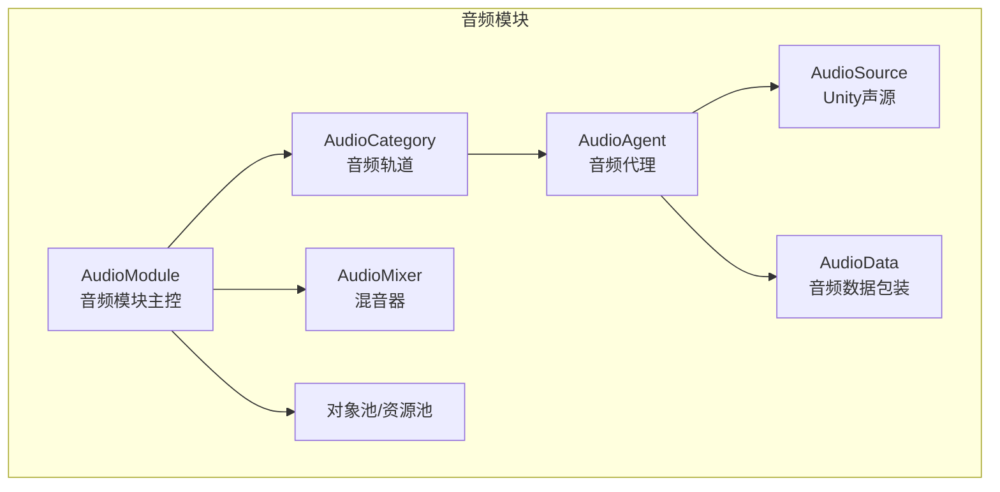
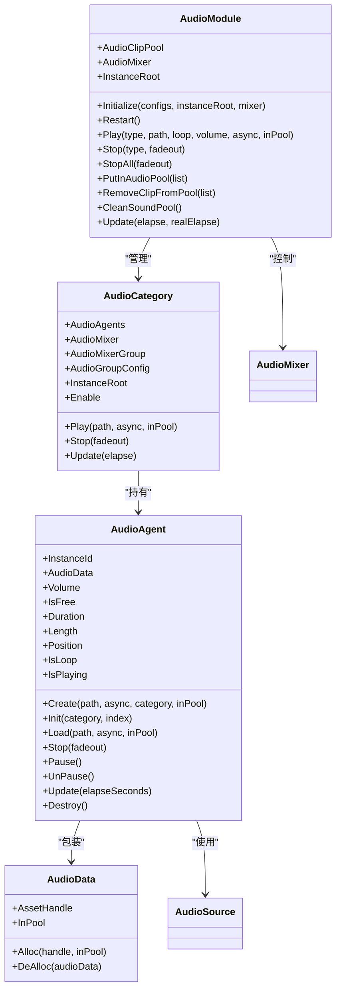
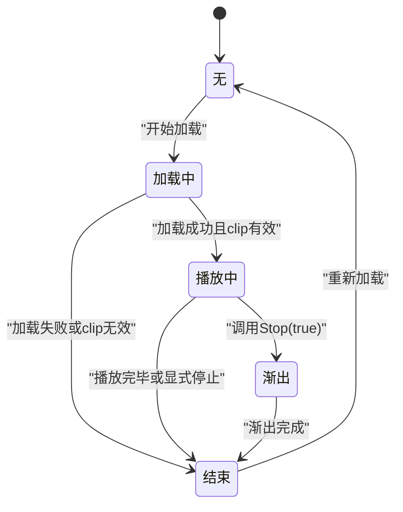
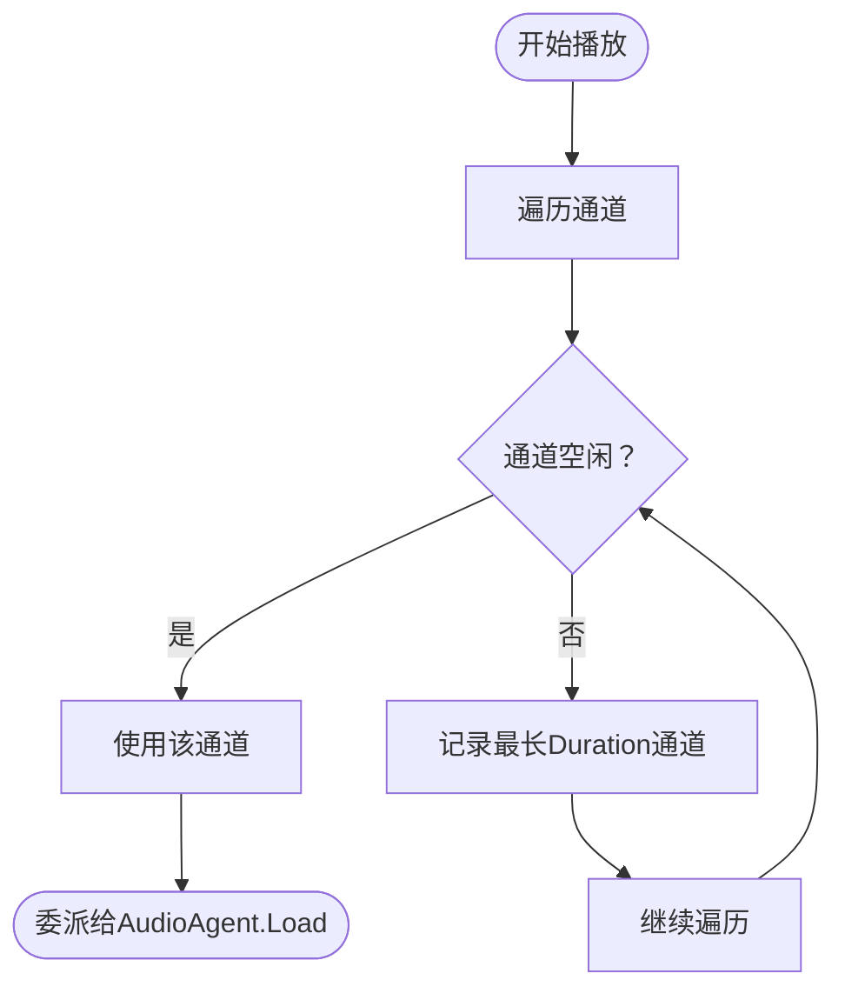
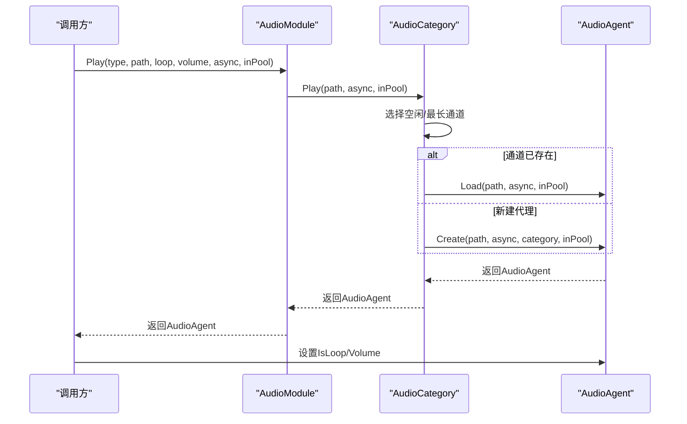
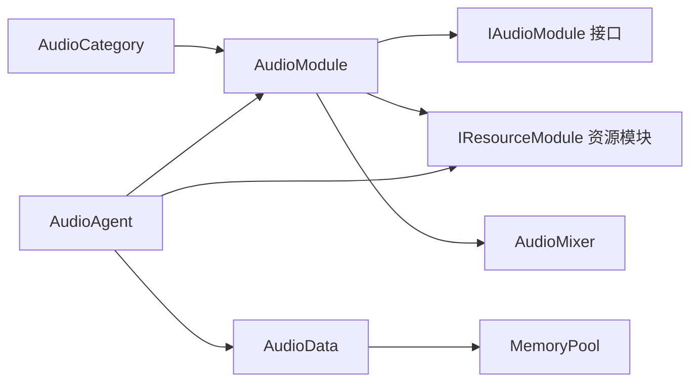

# 音频代理管理

<cite>
**本文引用的文件**
- [AudioAgent.cs](file://Assets/TEngine/Runtime/Module/AudioModule/AudioAgent.cs)
- [AudioAgentRuntimeState.cs](file://Assets/TEngine/Runtime/Module/AudioModule/AudioAgentRuntimeState.cs)
- [AudioCategory.cs](file://Assets/TEngine/Runtime/Module/AudioModule/AudioCategory.cs)
- [AudioData.cs](file://Assets/TEngine/Runtime/Module/AudioModule/AudioData.cs)
- [AudioModule.cs](file://Assets/TEngine/Runtime/Module/AudioModule/AudioModule.cs)
- [AudioSetting.cs](file://Assets/TEngine/Runtime/Module/AudioModule/AudioSetting.cs)
- [AudioGroupConfig.cs](file://Assets/TEngine/Runtime/Module/AudioModule/AudioGroupConfig.cs)
- [AudioType.cs](file://Assets/TEngine/Runtime/Module/AudioModule/AudioType.cs)
- [IAudioModule.cs](file://Assets/TEngine/Runtime/Module/AudioModule/IAudioModule.cs)
- [AudioSetting.asset](file://Assets/TEngine/Settings/AudioSetting.asset)
</cite>

## 目录
1. [简介](#简介)
2. [项目结构](#项目结构)
3. [核心组件](#核心组件)
4. [架构总览](#架构总览)
5. [详细组件分析](#详细组件分析)
6. [依赖关系分析](#依赖关系分析)
7. [性能考量](#性能考量)
8. [故障排查指南](#故障排查指南)
9. [结论](#结论)
10. [附录：使用示例与最佳实践](#附录使用示例与最佳实践)

## 简介
本文件面向TEngine音频代理管理系统，系统性阐述AudioAgent的设计原理与实现机制，覆盖音频代理的生命周期管理、状态转换、资源分配与回收、池化与复用策略，以及与AudioSource的关系。同时给出音频代理在播放、暂停、停止等运行时状态下的处理逻辑，并提供异步加载、循环播放、音量控制等使用示例与最佳实践。

## 项目结构
TEngine的音频模块位于模块目录下，围绕AudioModule、AudioCategory、AudioAgent、AudioData等核心类组织，配合AudioSetting与AudioGroupConfig进行配置驱动，形成“模块-轨道-代理-数据”的分层架构。

图表来源
- [AudioModule.cs:341-396](file://Assets/TEngine/Runtime/Module/AudioModule/AudioModule.cs#L341-L396)
- [AudioCategory.cs:74-100](file://Assets/TEngine/Runtime/Module/AudioModule/AudioCategory.cs#L74-L100)
- [AudioAgent.cs:202-220](file://Assets/TEngine/Runtime/Module/AudioModule/AudioAgent.cs#L202-L220)
- [AudioData.cs:8-66](file://Assets/TEngine/Runtime/Module/AudioModule/AudioData.cs#L8-L66)

章节来源
- [AudioModule.cs:322-396](file://Assets/TEngine/Runtime/Module/AudioModule/AudioModule.cs#L322-L396)
- [AudioCategory.cs:74-100](file://Assets/TEngine/Runtime/Module/AudioModule/AudioCategory.cs#L74-L100)
- [AudioAgent.cs:10-220](file://Assets/TEngine/Runtime/Module/AudioModule/AudioAgent.cs#L10-L220)
- [AudioData.cs:8-66](file://Assets/TEngine/Runtime/Module/AudioModule/AudioData.cs#L8-L66)

## 核心组件
- AudioModule：音频模块主控，负责初始化、全局音量/开关控制、轨道管理、更新调度、资源池维护。
- AudioCategory：音频轨道（按类型划分），管理一组AudioAgent实例，负责通道选择与播放委派。
- AudioAgent：音频代理，封装单个AudioSource，负责加载、播放、暂停、停止、渐出、状态机与资源生命周期。
- AudioData：对资源句柄的轻量包装，配合内存池进行分配/回收。
- IAudioModule：音频模块对外接口契约。
- AudioSetting/AudioGroupConfig：配置驱动，定义各轨道的参数（数量、音量、衰减模型、距离等）。

章节来源
- [IAudioModule.cs:8-128](file://Assets/TEngine/Runtime/Module/AudioModule/IAudioModule.cs#L8-L128)
- [AudioModule.cs:11-571](file://Assets/TEngine/Runtime/Module/AudioModule/AudioModule.cs#L11-L571)
- [AudioCategory.cs:12-196](file://Assets/TEngine/Runtime/Module/AudioModule/AudioCategory.cs#L12-L196)
- [AudioAgent.cs:10-419](file://Assets/TEngine/Runtime/Module/AudioModule/AudioAgent.cs#L10-L419)
- [AudioData.cs:8-66](file://Assets/TEngine/Runtime/Module/AudioModule/AudioData.cs#L8-L66)
- [AudioSetting.cs:5-10](file://Assets/TEngine/Runtime/Module/AudioModule/AudioSetting.cs#L5-L10)
- [AudioGroupConfig.cs:11-70](file://Assets/TEngine/Runtime/Module/AudioModule/AudioGroupConfig.cs#L11-L70)

## 架构总览
音频模块采用“模块-轨道-代理-数据”分层设计：
- 模块层：AudioModule集中管理混音器、全局开关与音量、轨道列表、更新循环与资源池。
- 轨道层：AudioCategory按类型（音乐/音效/UI/语音）组织，每个轨道维护固定数量的AudioAgent通道。
- 代理层：AudioAgent持有独立的AudioSource，封装加载、播放、暂停、停止、渐出与状态机。
- 数据层：AudioData包装资源句柄，配合MemoryPool进行对象复用。

图表来源
- [AudioModule.cs:11-571](file://Assets/TEngine/Runtime/Module/AudioModule/AudioModule.cs#L11-L571)
- [AudioCategory.cs:12-196](file://Assets/TEngine/Runtime/Module/AudioModule/AudioCategory.cs#L12-L196)
- [AudioAgent.cs:10-419](file://Assets/TEngine/Runtime/Module/AudioModule/AudioAgent.cs#L10-L419)
- [AudioData.cs:8-66](file://Assets/TEngine/Runtime/Module/AudioModule/AudioData.cs#L8-L66)

## 详细组件分析

### AudioAgent：音频代理与状态机
AudioAgent是音频播放的最小执行单元，内部持有一个AudioSource并维护一个运行时状态机，负责资源加载、播放控制与生命周期管理。

- 关键职责
  - 初始化：创建GameObject与AudioSource，绑定到指定AudioMixerGroup，设置衰减与距离参数。
  - 加载：支持同步/异步加载AudioClip，支持池化缓存命中；若处于播放中则延迟加载。
  - 播放：设置clip后立即播放，进入播放状态；若clip为空则直接结束。
  - 控制：暂停/恢复、停止（支持渐出）、音量/循环属性代理。
  - 更新：轮询播放状态，处理渐出过程与结束态切换。
  - 销毁：释放托管对象与资源句柄。

- 运行时状态机
  - None：初始态。
  - Loading：异步加载中。
  - Playing：正在播放。
  - FadingOut：渐出中。
  - End：结束态。

图表来源
- [AudioAgentRuntimeState.cs:6-33](file://Assets/TEngine/Runtime/Module/AudioModule/AudioAgentRuntimeState.cs#L6-L33)
- [AudioAgent.cs:244-362](file://Assets/TEngine/Runtime/Module/AudioModule/AudioAgent.cs#L244-L362)
- [AudioAgent.cs:370-401](file://Assets/TEngine/Runtime/Module/AudioModule/AudioAgent.cs#L370-L401)

- 生命周期与资源分配
  - 初始化：创建宿主GameObject与AudioSource，设置输出混音组与3D衰减参数。
  - 加载：优先检查池化缓存；异步加载时标记Loading；完成后创建AudioData并绑定clip。
  - 播放：设置loop/volume，播放并进入Playing；否则进入End。
  - 渐出：累计计时，线性降低音量，结束后Stop并恢复音量。
  - 销毁：销毁GameObject与AudioData，释放资源句柄。

- 与AudioSource的关系
  - AudioAgent不直接暴露AudioSource，而是通过属性代理（Volume、IsLoop、Position等）间接控制。
  - AudioData作为资源句柄的包装，确保资源释放与池化策略的一致性。

章节来源
- [AudioAgent.cs:189-220](file://Assets/TEngine/Runtime/Module/AudioModule/AudioAgent.cs#L189-L220)
- [AudioAgent.cs:228-264](file://Assets/TEngine/Runtime/Module/AudioModule/AudioAgent.cs#L228-L264)
- [AudioAgent.cs:313-362](file://Assets/TEngine/Runtime/Module/AudioModule/AudioAgent.cs#L313-L362)
- [AudioAgent.cs:368-401](file://Assets/TEngine/Runtime/Module/AudioModule/AudioAgent.cs#L368-L401)
- [AudioAgent.cs:406-419](file://Assets/TEngine/Runtime/Module/AudioModule/AudioAgent.cs#L406-L419)
- [AudioAgentRuntimeState.cs:6-33](file://Assets/TEngine/Runtime/Module/AudioModule/AudioAgentRuntimeState.cs#L6-L33)

### AudioCategory：轨道与通道管理
AudioCategory按音频类型（音乐/音效/UI/语音）组织，维护固定数量的AudioAgent通道，负责选择可用通道并委派播放请求。

- 关键职责
  - 构造：根据AudioGroupConfig创建AudioMixerGroup与InstanceRoot，批量初始化AudioAgent。
  - 播放：遍历通道寻找空闲或最久未使用的通道，委派给AudioAgent.Load。
  - 停止：对所有通道调用Stop。
  - 更新：对所有通道调用Update。

- 通道选择策略
  - 优先选择AudioData为空或IsFree=true的通道；
  - 若无可播放通道，则选择Duration最长的通道（用于渐出复用）。

图表来源
- [AudioCategory.cs:122-164](file://Assets/TEngine/Runtime/Module/AudioModule/AudioCategory.cs#L122-L164)

章节来源
- [AudioCategory.cs:74-100](file://Assets/TEngine/Runtime/Module/AudioModule/AudioCategory.cs#L74-L100)
- [AudioCategory.cs:122-164](file://Assets/TEngine/Runtime/Module/AudioModule/AudioCategory.cs#L122-L164)
- [AudioCategory.cs:170-179](file://Assets/TEngine/Runtime/Module/AudioModule/AudioCategory.cs#L170-L179)
- [AudioCategory.cs:185-194](file://Assets/TEngine/Runtime/Module/AudioModule/AudioCategory.cs#L185-L194)

### AudioModule：模块主控与全局管理
AudioModule是音频系统的中枢，负责：
- 初始化：加载AudioSetting，构建各AudioCategory，建立InstanceRoot与AudioMixer。
- 播放：根据类型委派到对应AudioCategory，设置loop/volume并返回AudioAgent。
- 停止：按类型或全部停止。
- 更新：逐轨道更新。
- 资源池：预热、移除、清空AudioClip池。

图表来源
- [AudioModule.cs:441-458](file://Assets/TEngine/Runtime/Module/AudioModule/AudioModule.cs#L441-L458)
- [AudioCategory.cs:122-164](file://Assets/TEngine/Runtime/Module/AudioModule/AudioCategory.cs#L122-L164)
- [AudioAgent.cs:189-195](file://Assets/TEngine/Runtime/Module/AudioModule/AudioAgent.cs#L189-L195)

章节来源
- [AudioModule.cs:322-396](file://Assets/TEngine/Runtime/Module/AudioModule/AudioModule.cs#L322-L396)
- [AudioModule.cs:441-458](file://Assets/TEngine/Runtime/Module/AudioModule/AudioModule.cs#L441-L458)
- [AudioModule.cs:465-493](file://Assets/TEngine/Runtime/Module/AudioModule/AudioModule.cs#L465-L493)
- [AudioModule.cs:555-569](file://Assets/TEngine/Runtime/Module/AudioModule/AudioModule.cs#L555-L569)

### AudioData：资源包装与池化
AudioData是对资源句柄的轻量包装，配合MemoryPool实现对象复用，避免频繁GC。

- 关键点
  - Alloc/DeAlloc：从池中获取/归还，确保InPool与AssetHandle正确设置。
  - RecycleToPool：非池化时释放句柄，置空引用，标记未入池。

章节来源
- [AudioData.cs:8-66](file://Assets/TEngine/Runtime/Module/AudioModule/AudioData.cs#L8-L66)

### 配置与设置：AudioSetting/AudioGroupConfig/AudioType
- AudioSetting：Unity资源，包含AudioGroupConfig数组，用于定义各轨道的名称、音量、通道数、衰减模型与距离范围。
- AudioGroupConfig：每条轨道的配置项，如AudioType、AgentHelperCount、音量、衰减模式、min/maxDistance。
- AudioType：轨道类型枚举（Sound/UISound/Music/Voice/Max）。

章节来源
- [AudioSetting.asset:15-48](file://Assets/TEngine/Settings/AudioSetting.asset#L15-L48)
- [AudioGroupConfig.cs:11-70](file://Assets/TEngine/Runtime/Module/AudioModule/AudioGroupConfig.cs#L11-L70)
- [AudioType.cs:7-34](file://Assets/TEngine/Runtime/Module/AudioModule/AudioType.cs#L7-L34)

## 依赖关系分析
- 模块耦合
  - AudioModule依赖IAudioModule接口与IResourceModule（资源模块）进行资源加载与池化。
  - AudioCategory依赖AudioModule的InstanceRoot与AudioMixer。
  - AudioAgent依赖AudioModule与IResourceModule进行资源加载与池化，依赖AudioData进行资源句柄管理。
- 外部依赖
  - Unity AudioMixer/AudioSource。
  - YooAsset资源系统（AssetHandle）。

图表来源
- [IAudioModule.cs:8-128](file://Assets/TEngine/Runtime/Module/AudioModule/IAudioModule.cs#L8-L128)
- [AudioModule.cs:11-571](file://Assets/TEngine/Runtime/Module/AudioModule/AudioModule.cs#L11-L571)
- [AudioAgent.cs:10-419](file://Assets/TEngine/Runtime/Module/AudioModule/AudioAgent.cs#L10-L419)
- [AudioData.cs:8-66](file://Assets/TEngine/Runtime/Module/AudioModule/AudioData.cs#L8-L66)

章节来源
- [IAudioModule.cs:8-128](file://Assets/TEngine/Runtime/Module/AudioModule/IAudioModule.cs#L8-L128)
- [AudioModule.cs:11-571](file://Assets/TEngine/Runtime/Module/AudioModule/AudioModule.cs#L11-L571)
- [AudioAgent.cs:10-419](file://Assets/TEngine/Runtime/Module/AudioModule/AudioAgent.cs#L10-L419)
- [AudioData.cs:8-66](file://Assets/TEngine/Runtime/Module/AudioModule/AudioData.cs#L8-L66)

## 性能考量
- 池化与复用
  - 资源池：AudioModule维护AudioClipPool，支持预热与清理，减少重复加载开销。
  - 对象池：AudioData基于MemoryPool，避免频繁分配。
- 通道复用
  - 当无空闲通道时，AudioCategory选择Duration最长的通道进行渐出复用，降低创建销毁频率。
- 异步加载
  - 支持异步加载，避免主线程阻塞；加载完成后再委派给AudioAgent，保证流畅性。
- 3D音频参数
  - 通过AudioGroupConfig设置衰减模式与距离，合理配置可减少不必要的计算。

[本节为通用性能建议，无需特定文件引用]

## 故障排查指南
- 播放无声音
  - 检查Enable与各轨道Enable状态，确认未被全局或轨道禁用。
  - 检查AudioMixer中的对应轨道开关与音量。
- 音量异常
  - 检查全局Volume与轨道Volume设置，确认未被置零。
- 资源未释放
  - 确认AudioData的DeAlloc调用与MemoryPool回收流程。
  - 使用CleanSoundPool清理池化资源，避免泄漏。
- 渐出无效
  - 确认Stop(true)调用与FadingOut状态流转。
- 通道不足
  - 提升AudioGroupConfig中的AgentHelperCount，或优化播放策略。

章节来源
- [AudioModule.cs:44-91](file://Assets/TEngine/Runtime/Module/AudioModule/AudioModule.cs#L44-L91)
- [AudioModule.cs:495-553](file://Assets/TEngine/Runtime/Module/AudioModule/AudioModule.cs#L495-L553)
- [AudioAgent.cs:270-285](file://Assets/TEngine/Runtime/Module/AudioModule/AudioAgent.cs#L270-L285)
- [AudioAgent.cs:377-398](file://Assets/TEngine/Runtime/Module/AudioModule/AudioAgent.cs#L377-L398)
- [AudioCategory.cs:122-164](file://Assets/TEngine/Runtime/Module/AudioModule/AudioCategory.cs#L122-L164)

## 结论
TEngine音频代理管理系统通过模块-轨道-代理-数据的清晰分层，实现了对Unity AudioSource的统一封装与高效管理。AudioAgent的状态机与池化策略有效降低了资源与对象分配的开销，配合AudioModule的全局控制与AudioCategory的通道复用，满足多场景下的音频播放需求。通过合理的配置与使用，可在保证性能的同时获得稳定的音频体验。

[本节为总结性内容，无需特定文件引用]

## 附录：使用示例与最佳实践
- 异步加载
  - 在播放时传入bAsync=true，利用异步加载避免卡顿；加载完成后由模块自动委派播放。
  - 参考路径：[AudioAgent.cs:242-252](file://Assets/TEngine/Runtime/Module/AudioModule/AudioAgent.cs#L242-L252)
- 循环播放
  - 播放后设置AudioAgent.IsLoop=true，实现背景音乐等循环播放。
  - 参考路径：[AudioModule.cs:450-457](file://Assets/TEngine/Runtime/Module/AudioModule/AudioModule.cs#L450-L457)
- 音量控制
  - 使用AudioAgent.Volume设置单个代理音量；或通过AudioModule的各轨道Volume统一调节。
  - 参考路径：[AudioAgent.cs:68-79](file://Assets/TEngine/Runtime/Module/AudioModule/AudioAgent.cs#L68-L79)，[AudioModule.cs:96-199](file://Assets/TEngine/Runtime/Module/AudioModule/AudioModule.cs#L96-L199)
- 池化与预热
  - 使用AudioModule.PutInAudioPool预热常用音效，减少首帧加载延迟。
  - 参考路径：[AudioModule.cs:499-514](file://Assets/TEngine/Runtime/Module/AudioModule/AudioModule.cs#L499-L514)
- 渐出复用
  - 当通道紧张时，系统会自动对最久播放的通道执行渐出复用，确保新播放无缝接入。
  - 参考路径：[AudioCategory.cs:132-144](file://Assets/TEngine/Runtime/Module/AudioModule/AudioCategory.cs#L132-L144)，[AudioAgent.cs:270-285](file://Assets/TEngine/Runtime/Module/AudioModule/AudioAgent.cs#L270-L285)