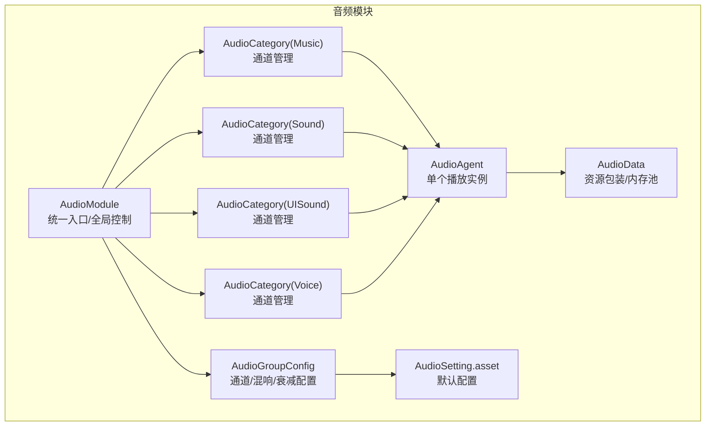
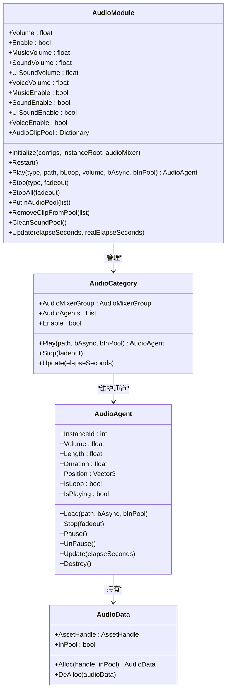
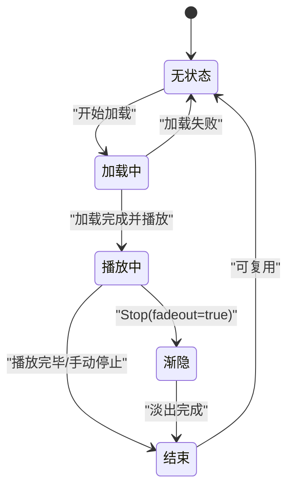
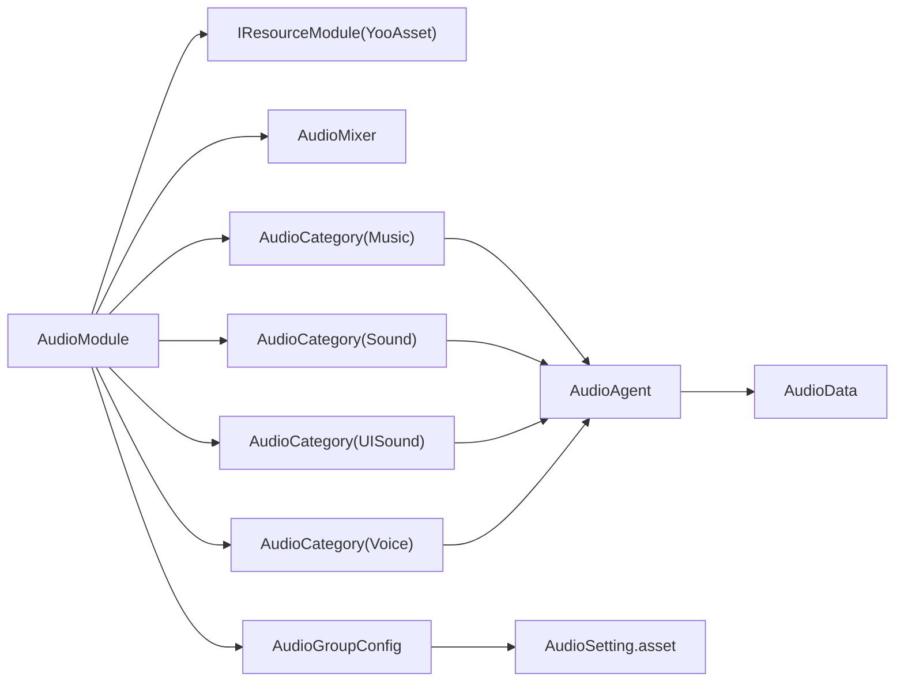

# 音频播放控制

<cite>
**本文引用的文件**
- [AudioModule.cs](file://Assets/TEngine/Runtime/Module/AudioModule/AudioModule.cs)
- [IAudioModule.cs](file://Assets/TEngine/Runtime/Module/AudioModule/IAudioModule.cs)
- [AudioAgent.cs](file://Assets/TEngine/Runtime/Module/AudioModule/AudioAgent.cs)
- [AudioCategory.cs](file://Assets/TEngine/Runtime/Module/AudioModule/AudioCategory.cs)
- [AudioGroupConfig.cs](file://Assets/TEngine/Runtime/Module/AudioModule/AudioGroupConfig.cs)
- [AudioType.cs](file://Assets/TEngine/Runtime/Module/AudioModule/AudioType.cs)
- [AudioAgentRuntimeState.cs](file://Assets/TEngine/Runtime/Module/AudioModule/AudioAgentRuntimeState.cs)
- [AudioData.cs](file://Assets/TEngine/Runtime/Module/AudioModule/AudioData.cs)
- [Module.cs](file://Assets/TEngine/Runtime/Core/Module.cs)
- [AudioSetting.asset](file://Assets/TEngine/Settings/AudioSetting.asset)
</cite>

## 目录
1. [简介](#简介)
2. [项目结构](#项目结构)
3. [核心组件](#核心组件)
4. [架构总览](#架构总览)
5. [详细组件分析](#详细组件分析)
6. [依赖关系分析](#依赖关系分析)
7. [性能考量](#性能考量)
8. [故障排查指南](#故障排查指南)
9. [结论](#结论)
10. [附录：API 完整文档](#附录api-完整文档)

## 简介
本文件系统性梳理 TEngine 音频播放控制系统，覆盖以下关键主题：
- 基础控制：播放、停止、暂停、循环播放、淡出停止
- 类型化控制：音乐、音效、UI 音效、语音四类音频的独立开关与音量
- 异步加载：bAsync 参数与异步播放流程
- 资源池化：bInPool 参数与预加载回收机制
- 并发与复用：最大并发通道数、空闲/最久复用策略、fadeout 复用
- 完整 API 文档：参数、返回值、异常与最佳实践
- 场景示例：背景音乐、音效触发、UI 点击音效等

## 项目结构
音频模块位于 TEngine 运行时模块目录下，采用“模块 + 分类 + 代理 + 数据”的分层组织：
- 模块层：AudioModule 提供统一入口与全局控制
- 分类层：AudioCategory 表示一类音频（如音乐/音效），管理多个通道
- 代理层：AudioAgent 代表单个 AudioSource 实例，负责播放、停止、淡出、更新
- 数据层：AudioData 包装资源句柄，配合内存池与对象池
- 配置层：AudioGroupConfig 描述每类音频的混响组、通道数、衰减模型等
- 设置层：AudioSetting.asset 提供默认配置（名称、通道数、音量、衰减）

图表来源
- [AudioModule.cs:341-396](file://Assets/TEngine/Runtime/Module/AudioModule/AudioModule.cs#L341-L396)
- [AudioCategory.cs:74-100](file://Assets/TEngine/Runtime/Module/AudioModule/AudioCategory.cs#L74-L100)
- [AudioAgent.cs:189-220](file://Assets/TEngine/Runtime/Module/AudioModule/AudioAgent.cs#L189-L220)
- [AudioData.cs:8-66](file://Assets/TEngine/Runtime/Module/AudioModule/AudioData.cs#L8-L66)
- [AudioGroupConfig.cs:11-70](file://Assets/TEngine/Runtime/Module/AudioModule/AudioGroupConfig.cs#L11-L70)
- [AudioSetting.asset:15-48](file://Assets/TEngine/Settings/AudioSetting.asset#L15-L48)

章节来源
- [AudioModule.cs:322-396](file://Assets/TEngine/Runtime/Module/AudioModule/AudioModule.cs#L322-L396)
- [AudioCategory.cs:74-100](file://Assets/TEngine/Runtime/Module/AudioModule/AudioCategory.cs#L74-L100)
- [AudioSetting.asset:15-48](file://Assets/TEngine/Settings/AudioSetting.asset#L15-L48)

## 核心组件
- AudioModule：模块入口，负责初始化、全局开关/音量、各类停止、对象池、轮询
- AudioCategory：按类型管理若干 AudioAgent 通道，负责空闲/最久复用选择
- AudioAgent：单个播放实例，封装 AudioSource，负责加载、播放、停止、暂停、淡出、更新
- AudioData：资源包装，支持内存池与对象池回收
- AudioGroupConfig：音频轨道配置（通道数、音量、衰减）
- AudioType：音频类型枚举（Sound、UISound、Music、Voice、Max）
- AudioAgentRuntimeState：代理运行时状态机（None、Loading、Playing、FadingOut、End）

章节来源
- [AudioModule.cs:11-318](file://Assets/TEngine/Runtime/Module/AudioModule/AudioModule.cs#L11-L318)
- [AudioCategory.cs:12-196](file://Assets/TEngine/Runtime/Module/AudioModule/AudioCategory.cs#L12-L196)
- [AudioAgent.cs:10-419](file://Assets/TEngine/Runtime/Module/AudioModule/AudioAgent.cs#L10-L419)
- [AudioData.cs:8-66](file://Assets/TEngine/Runtime/Module/AudioModule/AudioData.cs#L8-L66)
- [AudioGroupConfig.cs:11-70](file://Assets/TEngine/Runtime/Module/AudioModule/AudioGroupConfig.cs#L11-L70)
- [AudioType.cs:7-34](file://Assets/TEngine/Runtime/Module/AudioModule/AudioType.cs#L7-L34)
- [AudioAgentRuntimeState.cs:6-33](file://Assets/TEngine/Runtime/Module/AudioModule/AudioAgentRuntimeState.cs#L6-L33)

## 架构总览
音频系统遵循“模块-分类-代理”三层结构，模块持有各类型分类，分类维护固定数量的代理通道；代理负责具体资源加载与播放生命周期。

图表来源
- [AudioModule.cs:341-571](file://Assets/TEngine/Runtime/Module/AudioModule/AudioModule.cs#L341-L571)
- [AudioCategory.cs:122-196](file://Assets/TEngine/Runtime/Module/AudioModule/AudioCategory.cs#L122-L196)
- [AudioAgent.cs:189-419](file://Assets/TEngine/Runtime/Module/AudioModule/AudioAgent.cs#L189-L419)
- [AudioData.cs:44-66](file://Assets/TEngine/Runtime/Module/AudioModule/AudioData.cs#L44-L66)

## 详细组件分析

### 组件一：AudioModule（模块入口）
- 职责
  - 初始化与重启：加载混响器、构建各类型分类、分配实例根节点
  - 全局控制：总开关、总音量、各类音量与开关
  - 播放调度：根据类型路由到对应分类，设置循环/音量
  - 停止控制：按类型或全部停止，支持 fadeout
  - 对象池：预加载、移除、清空
  - 轮询：驱动各分类更新
- 关键点
  - bUnityAudioDisabled 保护：在编辑器禁用 Unity 音频时直接短路
  - 混响器映射：通过字符串名写入分贝值，实现线性音量到 dB 的转换
  - 并发复用：委托 AudioCategory 选择空闲或最久通道

章节来源
- [AudioModule.cs:322-571](file://Assets/TEngine/Runtime/Module/AudioModule/AudioModule.cs#L322-L571)
- [Module.cs:22-39](file://Assets/TEngine/Runtime/Core/Module.cs#L22-L39)

### 组件二：AudioCategory（音频分类）
- 职责
  - 维护固定数量的 AudioAgent 通道
  - 选择可用通道：优先空闲，否则选择持续时间最长的通道（最久）
  - 停止/更新：遍历通道执行相应操作
- 并发与复用
  - 通道数由 AudioGroupConfig.AgentHelperCount 决定
  - 选择策略：空闲优先，否则复用最久通道，避免新旧冲突

章节来源
- [AudioCategory.cs:122-196](file://Assets/TEngine/Runtime/Module/AudioModule/AudioCategory.cs#L122-L196)
- [AudioGroupConfig.cs:22-69](file://Assets/TEngine/Runtime/Module/AudioModule/AudioGroupConfig.cs#L22-L69)

### 组件三：AudioAgent（播放代理）
- 生命周期状态机
  - None/Loading/Playing/FadingOut/End
- 加载与播放
  - 支持同步/异步加载，支持对象池命中
  - 加载完成后绑定到 AudioSource 并开始播放
- 控制能力
  - 停止：支持 fadeout 渐消
  - 暂停/恢复
  - 循环切换
  - 音量与位置
- 更新逻辑
  - Playing：检测 AudioSource.isPlaying，结束则进入 End
  - FadingOut：按固定时长线性淡出，结束后可触发 pendingLoad 或重置音量

图表来源
- [AudioAgentRuntimeState.cs:6-33](file://Assets/TEngine/Runtime/Module/AudioModule/AudioAgentRuntimeState.cs#L6-L33)
- [AudioAgent.cs:368-401](file://Assets/TEngine/Runtime/Module/AudioModule/AudioAgent.cs#L368-L401)

章节来源
- [AudioAgent.cs:189-419](file://Assets/TEngine/Runtime/Module/AudioModule/AudioAgent.cs#L189-L419)

### 组件四：AudioData（资源包装）
- 作用
  - 包装 AssetHandle，记录是否来自对象池
  - 与内存池结合，避免频繁 GC
- 回收
  - 非池化资源释放句柄
  - 池化资源仅标记 InPool=false，不释放句柄

章节来源
- [AudioData.cs:8-66](file://Assets/TEngine/Runtime/Module/AudioModule/AudioData.cs#L8-L66)

### 组件五：配置与类型
- AudioType：Sound、UISound、Music、Voice、Max
- AudioGroupConfig：通道数、音量、衰减模型、最小/最大距离
- AudioSetting.asset：默认配置数组，用于初始化

章节来源
- [AudioType.cs:7-34](file://Assets/TEngine/Runtime/Module/AudioModule/AudioType.cs#L7-L34)
- [AudioGroupConfig.cs:11-70](file://Assets/TEngine/Runtime/Module/AudioModule/AudioGroupConfig.cs#L11-L70)
- [AudioSetting.asset:15-48](file://Assets/TEngine/Settings/AudioSetting.asset#L15-L48)

## 依赖关系分析
- 模块依赖
  - AudioModule 依赖 IResourceModule（YooAsset）进行资源加载
  - 使用 AudioMixer 进行混响与分组
- 分类依赖
  - AudioCategory 依赖 AudioMixerGroup 与实例根节点
- 代理依赖
  - AudioAgent 依赖 AudioSource、AudioData、IResourceModule
- 配置依赖
  - AudioSetting.asset 提供初始配置，AudioGroupConfig 作为运行期配置载体

图表来源
- [AudioModule.cs:322-396](file://Assets/TEngine/Runtime/Module/AudioModule/AudioModule.cs#L322-L396)
- [AudioCategory.cs:74-100](file://Assets/TEngine/Runtime/Module/AudioModule/AudioCategory.cs#L74-L100)
- [AudioAgent.cs:189-220](file://Assets/TEngine/Runtime/Module/AudioModule/AudioAgent.cs#L189-L220)
- [AudioData.cs:44-66](file://Assets/TEngine/Runtime/Module/AudioModule/AudioData.cs#L44-L66)
- [AudioGroupConfig.cs:11-70](file://Assets/TEngine/Runtime/Module/AudioModule/AudioGroupConfig.cs#L11-L70)
- [AudioSetting.asset:15-48](file://Assets/TEngine/Settings/AudioSetting.asset#L15-L48)

章节来源
- [AudioModule.cs:322-396](file://Assets/TEngine/Runtime/Module/AudioModule/AudioModule.cs#L322-L396)
- [AudioCategory.cs:74-100](file://Assets/TEngine/Runtime/Module/AudioModule/AudioCategory.cs#L74-L100)
- [AudioAgent.cs:189-220](file://Assets/TEngine/Runtime/Module/AudioModule/AudioAgent.cs#L189-L220)
- [AudioData.cs:44-66](file://Assets/TEngine/Runtime/Module/AudioModule/AudioData.cs#L44-L66)
- [AudioGroupConfig.cs:11-70](file://Assets/TEngine/Runtime/Module/AudioModule/AudioGroupConfig.cs#L11-L70)
- [AudioSetting.asset:15-48](file://Assets/TEngine/Settings/AudioSetting.asset#L15-L48)

## 性能考量
- 并发通道数
  - 由 AudioGroupConfig.AgentHelperCount 控制，建议根据类型特性合理分配
  - Music/UISound 通道数较少，保证主旋律与交互音效清晰
- 复用策略
  - 空闲优先，最久复用避免频繁创建销毁
  - fadeout 复用减少突兀中断
- 资源池化
  - bInPool 与对象池结合，减少重复加载与 GC
  - 预热：提前 PutInAudioPool，提升首帧体验
- 异步加载
  - bAsync 在主线程压力大时避免卡顿
  - 注意资源释放：非池化资源会在加载完成后释放句柄

## 故障排查指南
- 无法播放
  - 检查 Enable/MusicEnable/SoundEnable/UISoundEnable/VoiceEnable 开关
  - 检查 Unity 音频是否被禁用（编辑器环境）
- 音量异常
  - 确认总音量与分类音量范围在允许区间
  - 检查混响器 dB 映射是否正确
- 并发溢出
  - 观察日志是否有“无可用通道”提示
  - 调整 AudioGroupConfig.AgentHelperCount
- 淡出无效
  - 确认调用 Stop(fadeout=true)
  - 检查 Update 是否正常轮询
- 资源泄漏
  - 非池化资源加载完成后会自动释放
  - 池化资源需显式 CleanSoundPool 或 RemoveClipFromPool

章节来源
- [AudioModule.cs:443-458](file://Assets/TEngine/Runtime/Module/AudioModule/AudioModule.cs#L443-L458)
- [AudioCategory.cs:160-164](file://Assets/TEngine/Runtime/Module/AudioModule/AudioCategory.cs#L160-L164)
- [AudioAgent.cs:270-285](file://Assets/TEngine/Runtime/Module/AudioModule/AudioAgent.cs#L270-L285)
- [AudioAgent.cs:368-401](file://Assets/TEngine/Runtime/Module/AudioModule/AudioAgent.cs#L368-L401)

## 结论
TEngine 音频系统通过模块-分类-代理分层设计，实现了类型化控制、并发复用、异步加载与对象池化，满足音乐、音效、UI 音效、语音等多场景需求。合理配置通道数与音量、善用异步与池化，可在保证流畅度的同时获得稳定的播放体验。

## 附录：API 完整文档

### 1. 模块初始化与重启
- 方法
  - Initialize(AudioGroupConfig[] audioGroupConfigs, Transform instanceRoot = null, AudioMixer audioMixer = null)
  - Restart()
- 参数
  - audioGroupConfigs：音频轨道组配置数组
  - instanceRoot：实例化根节点（可选）
  - audioMixer：混响器（可选，未提供则从资源加载）
- 返回值
  - 无
- 异常
  - audioGroupConfigs 为空时抛出异常
- 说明
  - 初始化会为每种 AudioType 构建 AudioCategory，并设置实例根节点与混响器

章节来源
- [IAudioModule.cs:79-84](file://Assets/TEngine/Runtime/Module/AudioModule/IAudioModule.cs#L79-L84)
- [AudioModule.cs:341-396](file://Assets/TEngine/Runtime/Module/AudioModule/AudioModule.cs#L341-L396)

### 2. 播放控制
- 方法
  - Play(AudioType type, string path, bool bLoop = false, float volume = 1.0f, bool bAsync = false, bool bInPool = false)
- 参数
  - type：音频类型（Sound/UISound/Music/Voice）
  - path：音频资源路径
  - bLoop：是否循环
  - volume：音量（0~1）
  - bAsync：是否异步加载
  - bInPool：是否使用对象池
- 返回值
  - AudioAgent：播放代理；若无可用通道或禁用则返回 null
- 异常
  - 无显式异常；通道不足时记录错误日志
- 说明
  - bAsync：异步加载避免主线程阻塞
  - bInPool：命中池化资源可复用句柄，减少加载
  - 循环与音量在返回的 AudioAgent 上设置

章节来源
- [IAudioModule.cs:96](file://Assets/TEngine/Runtime/Module/AudioModule/IAudioModule.cs#L96)
- [AudioModule.cs:441-458](file://Assets/TEngine/Runtime/Module/AudioModule/AudioModule.cs#L441-L458)
- [AudioCategory.cs:122-164](file://Assets/TEngine/Runtime/Module/AudioModule/AudioCategory.cs#L122-L164)

### 3. 停止控制
- 方法
  - Stop(AudioType type, bool fadeout)
  - StopAll(bool fadeout)
- 参数
  - type：目标音频类型
  - fadeout：是否渐消
- 返回值
  - 无
- 说明
  - Stop：停止指定类型的所有播放
  - StopAll：停止所有类型
  - fadeout：通过淡出策略复用通道，避免突停

章节来源
- [IAudioModule.cs:103](file://Assets/TEngine/Runtime/Module/AudioModule/IAudioModule.cs#L103)
- [IAudioModule.cs:109](file://Assets/TEngine/Runtime/Module/AudioModule/IAudioModule.cs#L109)
- [AudioModule.cs:465-493](file://Assets/TEngine/Runtime/Module/AudioModule/AudioModule.cs#L465-L493)

### 4. 对象池管理
- 方法
  - PutInAudioPool(List<string> list)
  - RemoveClipFromPool(List<string> list)
  - CleanSoundPool()
- 参数
  - list：音频资源路径列表
- 返回值
  - 无
- 说明
  - 预热常用资源，减少首帧加载延迟
  - 移除与清空用于资源回收与切换场景

章节来源
- [IAudioModule.cs:115](file://Assets/TEngine/Runtime/Module/AudioModule/IAudioModule.cs#L115)
- [IAudioModule.cs:121](file://Assets/TEngine/Runtime/Module/AudioModule/IAudioModule.cs#L121)
- [IAudioModule.cs:126](file://Assets/TEngine/Runtime/Module/AudioModule/IAudioModule.cs#L126)
- [AudioModule.cs:499-553](file://Assets/TEngine/Runtime/Module/AudioModule/AudioModule.cs#L499-L553)

### 5. 全局与分类控制
- 属性
  - Volume：总音量（0~1）
  - Enable：总开关
  - MusicVolume/SoundVolume/UISoundVolume/VoiceVolume：分类音量
  - MusicEnable/SoundEnable/UISoundEnable/VoiceEnable：分类开关
  - AudioMixer/InstanceRoot：混响器与实例根节点
  - AudioClipPool：对象池字典
- 说明
  - 通过混响器写入 dB 值实现音量控制
  - 分类开关为真时才允许播放

章节来源
- [IAudioModule.cs:13-18](file://Assets/TEngine/Runtime/Module/AudioModule/IAudioModule.cs#L13-L18)
- [IAudioModule.cs:23-38](file://Assets/TEngine/Runtime/Module/AudioModule/IAudioModule.cs#L23-L38)
- [IAudioModule.cs:43-58](file://Assets/TEngine/Runtime/Module/AudioModule/IAudioModule.cs#L43-L58)
- [IAudioModule.cs:63-69](file://Assets/TEngine/Runtime/Module/AudioModule/IAudioModule.cs#L63-L69)
- [IAudioModule.cs:70](file://Assets/TEngine/Runtime/Module/AudioModule/IAudioModule.cs#L70)
- [AudioModule.cs:44-91](file://Assets/TEngine/Runtime/Module/AudioModule/AudioModule.cs#L44-L91)
- [AudioModule.cs:96-199](file://Assets/TEngine/Runtime/Module/AudioModule/AudioModule.cs#L96-L199)
- [AudioModule.cs:204-316](file://Assets/TEngine/Runtime/Module/AudioModule/AudioModule.cs#L204-L316)

### 6. 代理控制（返回的 AudioAgent）
- 属性
  - InstanceId：AudioSource 实例 ID
  - Volume：代理音量
  - Length：音频长度
  - Duration：已播放时长
  - Position：位置
  - IsLoop：是否循环
  - IsPlaying：是否正在播放
- 方法
  - Load(path, bAsync, bInPool)
  - Stop(fadeout)
  - Pause()/UnPause()
  - Update(elapseSeconds)
  - Destroy()
- 说明
  - Load 支持池化命中与异步加载
  - Stop(fadeout=true) 启动淡出复用
  - Update 驱动状态机推进

章节来源
- [AudioAgent.cs:58-179](file://Assets/TEngine/Runtime/Module/AudioModule/AudioAgent.cs#L58-L179)
- [AudioAgent.cs:228-362](file://Assets/TEngine/Runtime/Module/AudioModule/AudioAgent.cs#L228-L362)
- [AudioAgent.cs:368-401](file://Assets/TEngine/Runtime/Module/AudioModule/AudioAgent.cs#L368-L401)
- [AudioAgent.cs:406-419](file://Assets/TEngine/Runtime/Module/AudioModule/AudioAgent.cs#L406-L419)

### 7. 异步加载机制
- bAsync 参数
  - true：异步加载，避免主线程卡顿
  - false：同步加载，立即可用但可能阻塞
- 流程
  - 异步加载完成后回调 OnAssetLoadComplete，绑定到 AudioSource 并播放
  - 若处于播放中且再次 Load，将先 Stop(fadeout)，再排队 pendingLoad

章节来源
- [AudioAgent.cs:242-264](file://Assets/TEngine/Runtime/Module/AudioModule/AudioAgent.cs#L242-L264)
- [AudioAgent.cs:313-362](file://Assets/TEngine/Runtime/Module/AudioModule/AudioAgent.cs#L313-L362)

### 8. 池化与预加载
- bInPool 参数
  - true：尝试从对象池获取；成功则复用句柄
  - false：加载完成后释放句柄
- 预加载
  - PutInAudioPool：批量预热
  - CleanSoundPool/RemoveClipFromPool：回收与清理

章节来源
- [AudioAgent.cs:236-240](file://Assets/TEngine/Runtime/Module/AudioModule/AudioAgent.cs#L236-L240)
- [AudioAgent.cs:317-321](file://Assets/TEngine/Runtime/Module/AudioModule/AudioAgent.cs#L317-L321)
- [AudioModule.cs:499-553](file://Assets/TEngine/Runtime/Module/AudioModule/AudioModule.cs#L499-L553)

### 9. 最大并发与复用策略
- 并发上限
  - 由 AudioGroupConfig.AgentHelperCount 决定
- 复用策略
  - 空闲优先；若无可空闲，选择持续时间最长的通道进行复用
  - fadeout 复用：在淡出期间可触发 pendingLoad，实现无缝复用

章节来源
- [AudioCategory.cs:129-164](file://Assets/TEngine/Runtime/Module/AudioModule/AudioCategory.cs#L129-L164)
- [AudioAgent.cs:270-285](file://Assets/TEngine/Runtime/Module/AudioModule/AudioAgent.cs#L270-L285)
- [AudioAgent.cs:377-398](file://Assets/TEngine/Runtime/Module/AudioModule/AudioAgent.cs#L377-L398)

### 10. 场景示例（实现思路）
- 背景音乐播放
  - 选择 Music 类型，设置 bLoop=true，必要时 bAsync=true
  - 使用 MusicVolume/MusicEnable 控制
- 音效触发
  - 选择 Sound 类型，bAsync=false 以确保即时播放
  - 可结合池化预热高频音效
- UI 点击音效
  - 选择 UISound 类型，bAsync=false，音量较小
  - 可使用 StopAll(false) 清理干扰音效
- 语音播报
  - 选择 Voice 类型，bAsync=false，音量适中
  - 播放前检查 VoiceEnable

章节来源
- [AudioType.cs:12-27](file://Assets/TEngine/Runtime/Module/AudioModule/AudioType.cs#L12-L27)
- [AudioModule.cs:441-458](file://Assets/TEngine/Runtime/Module/AudioModule/AudioModule.cs#L441-L458)
- [AudioModule.cs:465-493](file://Assets/TEngine/Runtime/Module/AudioModule/AudioModule.cs#L465-L493)