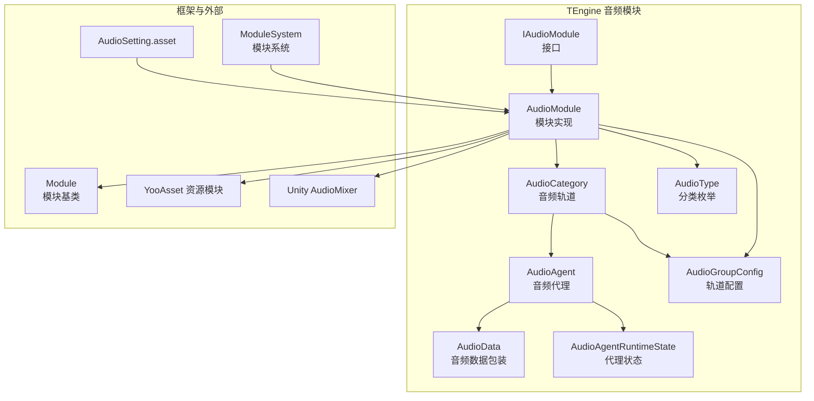
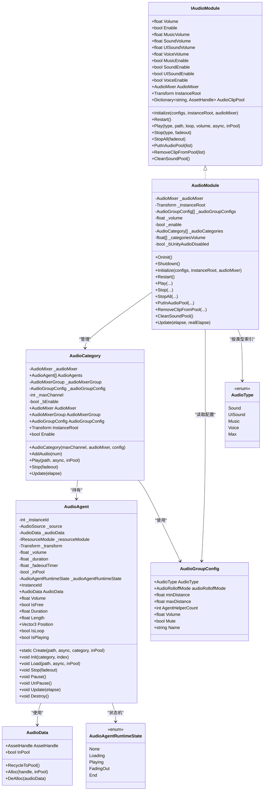
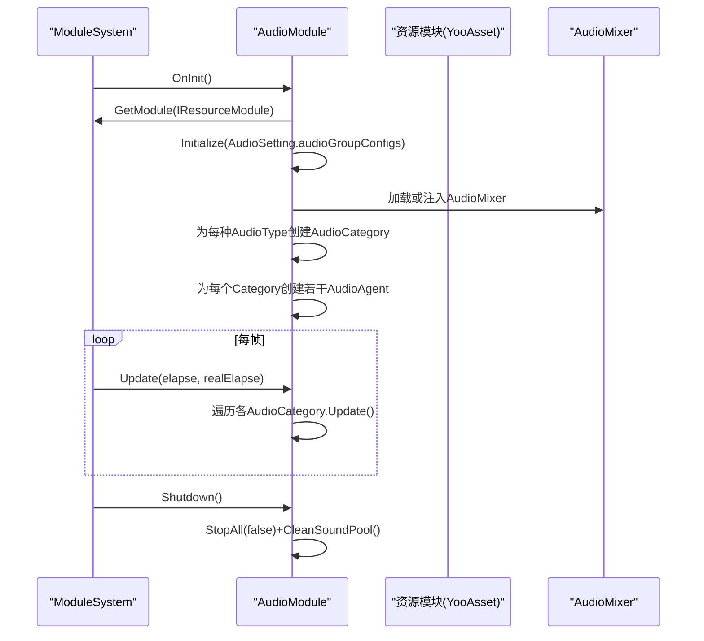
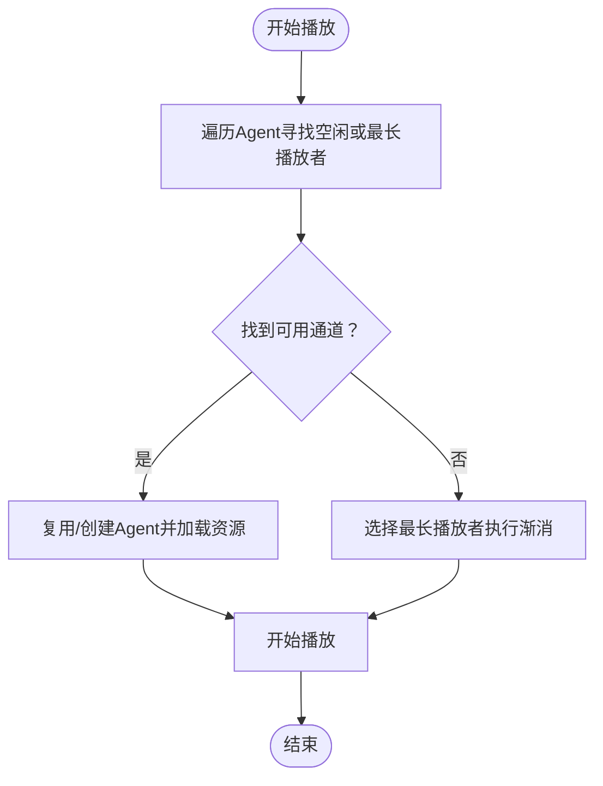
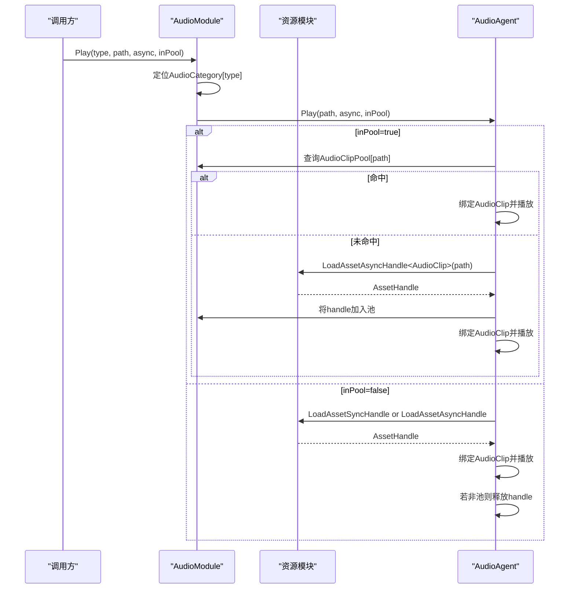
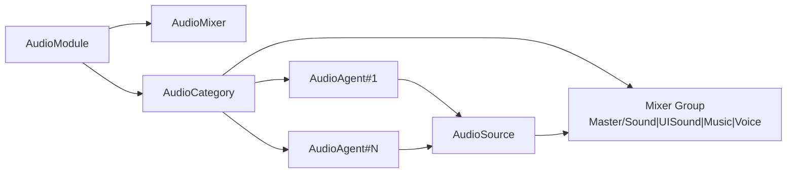
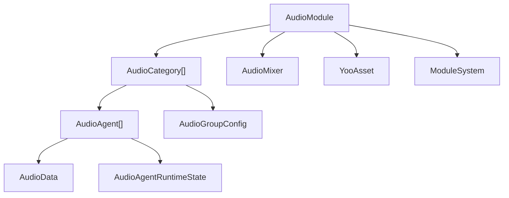

# 音频模块架构

<cite>
**本文引用的文件**
- [AudioModule.cs](file://Assets/TEngine/Runtime/Module/AudioModule/AudioModule.cs)
- [IAudioModule.cs](file://Assets/TEngine/Runtime/Module/AudioModule/IAudioModule.cs)
- [AudioCategory.cs](file://Assets/TEngine/Runtime/Module/AudioModule/AudioCategory.cs)
- [AudioAgent.cs](file://Assets/TEngine/Runtime/Module/AudioModule/AudioAgent.cs)
- [AudioGroupConfig.cs](file://Assets/TEngine/Runtime/Module/AudioModule/AudioGroupConfig.cs)
- [AudioType.cs](file://Assets/TEngine/Runtime/Module/AudioModule/AudioType.cs)
- [AudioData.cs](file://Assets/TEngine/Runtime/Module/AudioModule/AudioData.cs)
- [AudioAgentRuntimeState.cs](file://Assets/TEngine/Runtime/Module/AudioModule/AudioAgentRuntimeState.cs)
- [Module.cs](file://Assets/TEngine/Runtime/Core/Module.cs)
- [ModuleSystem.cs](file://Assets/TEngine/Runtime/Core/ModuleSystem.cs)
- [AudioSetting.asset](file://Assets/TEngine/Settings/AudioSetting.asset)
- [AudioMixer.mixer](file://Assets/TEngine/Runtime/Module/AudioModule/Resources/AudioMixer.mixer)
</cite>

## 目录
1. [简介](#简介)
2. [项目结构](#项目结构)
3. [核心组件](#核心组件)
4. [架构总览](#架构总览)
5. [详细组件分析](#详细组件分析)
6. [依赖关系分析](#依赖关系分析)
7. [性能考量](#性能考量)
8. [故障排查指南](#故障排查指南)
9. [结论](#结论)
10. [附录：初始化与配置示例](#附录初始化与配置示例)

## 简介
本文件面向TEngine音频模块（AudioModule），系统性阐述其整体设计原理、架构模式与实现细节，覆盖模块初始化流程、音频分类系统、音频组配置、生命周期管理（启动/重启/关闭）、与资源模块的集成、与Unity AudioMixer的交互、线程安全与性能优化策略，并提供架构图与组件关系图，帮助开发者快速理解与高效扩展。

## 项目结构
音频模块位于TEngine运行时模块目录下，采用“按功能分层+按职责划分”的组织方式：
- 接口与实现分离：IAudioModule定义对外能力；AudioModule作为具体实现。
- 分层职责清晰：AudioCategory负责轨道/类别管理；AudioAgent负责单个音频播放代理；AudioGroupConfig与AudioType描述配置与分类；AudioData封装资源句柄与池化回收。
- 与框架集成：通过ModuleSystem注册与轮询；通过Module基类统一生命周期；通过YooAsset资源模块加载音频资源。
- 设置与混音器：通过AudioSetting.asset配置各轨道参数；通过AudioMixer.mixer在Unity中落地混音层级。

图表来源
- [AudioModule.cs:11-396](file://Assets/TEngine/Runtime/Module/AudioModule/AudioModule.cs#L11-L396)
- [IAudioModule.cs:8-127](file://Assets/TEngine/Runtime/Module/AudioModule/IAudioModule.cs#L8-L127)
- [AudioCategory.cs:12-100](file://Assets/TEngine/Runtime/Module/AudioModule/AudioCategory.cs#L12-L100)
- [AudioAgent.cs:10-220](file://Assets/TEngine/Runtime/Module/AudioModule/AudioAgent.cs#L10-L220)
- [AudioData.cs:8-65](file://Assets/TEngine/Runtime/Module/AudioModule/AudioData.cs#L8-L65)
- [AudioGroupConfig.cs:11-70](file://Assets/TEngine/Runtime/Module/AudioModule/AudioGroupConfig.cs#L11-L70)
- [AudioType.cs:7-33](file://Assets/TEngine/Runtime/Module/AudioModule/AudioType.cs#L7-L33)
- [AudioAgentRuntimeState.cs:6-32](file://Assets/TEngine/Runtime/Module/AudioModule/AudioAgentRuntimeState.cs#L6-L32)
- [Module.cs:22-39](file://Assets/TEngine/Runtime/Core/Module.cs#L22-L39)
- [ModuleSystem.cs:9-200](file://Assets/TEngine/Runtime/Core/ModuleSystem.cs#L9-L200)
- [AudioSetting.asset:15-47](file://Assets/TEngine/Settings/AudioSetting.asset#L15-L47)
- [AudioMixer.mixer](file://Assets/TEngine/Runtime/Module/AudioModule/Resources/AudioMixer.mixer)

章节来源
- [AudioModule.cs:11-396](file://Assets/TEngine/Runtime/Module/AudioModule/AudioModule.cs#L11-L396)
- [AudioSetting.asset:15-47](file://Assets/TEngine/Settings/AudioSetting.asset#L15-L47)

## 核心组件
- IAudioModule：定义音频模块对外能力，包括总音量/开关、各类音量/开关、初始化/重启、播放/停止、资源池管理等。
- AudioModule：IAudioModule的具体实现，负责模块生命周期、与AudioMixer交互、与资源模块集成、全局更新调度。
- AudioCategory：按AudioType划分的音频轨道，维护一组AudioAgent，负责选择可用通道、播放调度与统一停止。
- AudioAgent：单个音频播放代理，封装AudioSource、资源加载、播放状态、淡出逻辑、池化策略。
- AudioData：对YooAsset AssetHandle的轻量包装，配合内存池进行回收。
- AudioGroupConfig：每类音频的轨道配置（音量、静音、通道数、3D衰减模式与距离范围等）。
- AudioType：音频分类枚举（Sound/UISound/Music/Voice/Max）。
- AudioAgentRuntimeState：代理运行时状态机（None/Loading/Playing/FadingOut/End）。
- Module/ModuleSystem：模块基类与模块系统，提供注册、轮询、关闭等通用能力。

章节来源
- [IAudioModule.cs:8-127](file://Assets/TEngine/Runtime/Module/AudioModule/IAudioModule.cs#L8-L127)
- [AudioModule.cs:11-396](file://Assets/TEEngine/Runtime/Module/AudioModule/AudioModule.cs#L11-L396)
- [AudioCategory.cs:12-196](file://Assets/TEngine/Runtime/Module/AudioModule/AudioCategory.cs#L12-L196)
- [AudioAgent.cs:10-419](file://Assets/TEngine/Runtime/Module/AudioModule/AudioAgent.cs#L10-L419)
- [AudioData.cs:8-65](file://Assets/TEngine/Runtime/Module/AudioModule/AudioData.cs#L8-L65)
- [AudioGroupConfig.cs:11-70](file://Assets/TEngine/Runtime/Module/AudioModule/AudioGroupConfig.cs#L11-L70)
- [AudioType.cs:7-33](file://Assets/TEngine/Runtime/Module/AudioModule/AudioType.cs#L7-L33)
- [AudioAgentRuntimeState.cs:6-32](file://Assets/TEngine/Runtime/Module/AudioModule/AudioAgentRuntimeState.cs#L6-L32)
- [Module.cs:22-39](file://Assets/TEngine/Runtime/Core/Module.cs#L22-L39)
- [ModuleSystem.cs:9-200](file://Assets/TEngine/Runtime/Core/ModuleSystem.cs#L9-L200)

## 架构总览
音频模块采用“模块-轨道-代理”三层架构：
- 模块层：AudioModule负责全局配置、与AudioMixer对接、与资源模块对接、模块生命周期与轮询。
- 轨道层：AudioCategory按AudioType划分，持有多个AudioAgent，负责通道选择与统一控制。
- 代理层：AudioAgent封装单个AudioSource，负责资源加载、播放、状态机与淡出。

图表来源
- [IAudioModule.cs:8-127](file://Assets/TEngine/Runtime/Module/AudioModule/IAudioModule.cs#L8-L127)
- [AudioModule.cs:11-396](file://Assets/TEngine/Runtime/Module/AudioModule/AudioModule.cs#L11-L396)
- [AudioCategory.cs:12-196](file://Assets/TEngine/Runtime/Module/AudioModule/AudioCategory.cs#L12-L196)
- [AudioAgent.cs:10-419](file://Assets/TEngine/Runtime/Module/AudioModule/AudioAgent.cs#L10-L419)
- [AudioData.cs:8-65](file://Assets/TEngine/Runtime/Module/AudioModule/AudioData.cs#L8-L65)
- [AudioGroupConfig.cs:11-70](file://Assets/TEngine/Runtime/Module/AudioModule/AudioGroupConfig.cs#L11-L70)
- [AudioType.cs:7-33](file://Assets/TEngine/Runtime/Module/AudioModule/AudioType.cs#L7-L33)
- [AudioAgentRuntimeState.cs:6-32](file://Assets/TEngine/Runtime/Module/AudioModule/AudioAgentRuntimeState.cs#L6-L32)

## 详细组件分析

### 模块初始化与生命周期
- 启动：模块系统调用AudioModule.OnInit，获取资源模块并基于AudioSetting中的AudioGroupConfig数组初始化各轨道。
- 初始化：若未显式传入AudioMixer则从Resources加载默认混音器；为每个AudioType创建AudioCategory并预分配指定数量的AudioAgent。
- 运行期：模块系统每帧调用AudioModule.Update，转发给各AudioCategory.Update，驱动代理状态机与淡出逻辑。
- 重启：清空对象池，销毁并重建所有AudioAgent，重新走初始化流程。
- 关闭：停止所有播放并清空对象池。

图表来源
- [AudioModule.cs:322-396](file://Assets/TEngine/Runtime/Module/AudioModule/AudioModule.cs#L322-L396)
- [ModuleSystem.cs:29-42](file://Assets/TEngine/Runtime/Core/ModuleSystem.cs#L29-L42)
- [AudioSetting.asset:15-47](file://Assets/TEngine/Settings/AudioSetting.asset#L15-L47)
- [AudioMixer.mixer](file://Assets/TEngine/Runtime/Module/AudioModule/Resources/AudioMixer.mixer)

章节来源
- [AudioModule.cs:322-396](file://Assets/TEngine/Runtime/Module/AudioModule/AudioModule.cs#L322-L396)
- [ModuleSystem.cs:29-42](file://Assets/TEngine/Runtime/Core/ModuleSystem.cs#L29-L42)

### 音频分类系统与轨道管理
- 分类：通过AudioType区分Sound/UISound/Music/Voice四类。
- 轨道：AudioCategory按AudioType创建，绑定到AudioMixer对应的组；每个Category内部维护固定数量的AudioAgent。
- 通道选择：播放时遍历Agent，优先选择空闲者；若无空闲，选择已播放时长最长者（用于渐消复用）。
- 统一控制：Category.Enable为false时，会强制停止所有Agent；Stop(fadeout)对所有Agent执行停止策略。

图表来源
- [AudioCategory.cs:122-164](file://Assets/TEngine/Runtime/Module/AudioModule/AudioCategory.cs#L122-L164)
- [AudioAgent.cs:270-285](file://Assets/TEngine/Runtime/Module/AudioModule/AudioAgent.cs#L270-L285)

章节来源
- [AudioCategory.cs:122-164](file://Assets/TEngine/Runtime/Module/AudioModule/AudioCategory.cs#L122-L164)
- [AudioAgent.cs:270-285](file://Assets/TEngine/Runtime/Module/AudioModule/AudioAgent.cs#L270-L285)

### 与资源模块的集成与对象池
- 异步/同步加载：AudioAgent根据bAsync选择异步或同步加载AudioClip。
- 对象池：当bInPool为true时，优先从IAudioModule.AudioClipPool命中；命中后直接绑定到AudioSource并播放；未命中则加载后加入池。
- 回收：CleanSoundPool遍历池内句柄并释放；AudioData在非池场景下会在加载完成后按需释放。

图表来源
- [AudioModule.cs:499-514](file://Assets/TEngine/Runtime/Module/AudioModule/AudioModule.cs#L499-L514)
- [AudioAgent.cs:228-264](file://Assets/TEngine/Runtime/Module/AudioModule/AudioAgent.cs#L228-L264)
- [AudioAgent.cs:313-362](file://Assets/TEngine/Runtime/Module/AudioModule/AudioAgent.cs#L313-L362)

章节来源
- [AudioModule.cs:499-514](file://Assets/TEngine/Runtime/Module/AudioModule/AudioModule.cs#L499-L514)
- [AudioAgent.cs:228-264](file://Assets/TEngine/Runtime/Module/AudioModule/AudioAgent.cs#L228-L264)
- [AudioAgent.cs:313-362](file://Assets/TEngine/Runtime/Module/AudioModule/AudioAgent.cs#L313-L362)

### 与Unity AudioMixer的交互
- 混音器注入：若未传入AudioMixer，模块从Resources加载默认AudioMixer；否则使用外部注入。
- 分组映射：AudioCategory根据AudioType在AudioMixer中查找匹配组（Master/分类），并为每个Agent设置输出组。
- 音量控制：通过AudioMixer.SetFloat写入分贝值；Enable/Disable通过设置分贝阈值或直接切换Category.Enable实现。
- 3D参数：AudioAgent继承AudioGroupConfig中的衰减模式与距离参数。

图表来源
- [AudioModule.cs:379-396](file://Assets/TEngine/Runtime/Module/AudioModule/AudioModule.cs#L379-L396)
- [AudioCategory.cs:81-99](file://Assets/TEngine/Runtime/Module/AudioModule/AudioCategory.cs#L81-L99)
- [AudioAgent.cs:212-218](file://Assets/TEngine/Runtime/Module/AudioModule/AudioAgent.cs#L212-L218)

章节来源
- [AudioModule.cs:379-396](file://Assets/TEngine/Runtime/Module/AudioModule/AudioModule.cs#L379-L396)
- [AudioCategory.cs:81-99](file://Assets/TEngine/Runtime/Module/AudioModule/AudioCategory.cs#L81-L99)
- [AudioAgent.cs:212-218](file://Assets/TEngine/Runtime/Module/AudioModule/AudioAgent.cs#L212-L218)

### 线程安全与并发注意事项
- 资源加载：AudioAgent在Load中根据bAsync选择异步/同步；异步回调在主线程触发（由资源模块保证），避免跨线程访问AudioSource。
- 播放状态：AudioAgent内部通过状态机（AudioAgentRuntimeState）串行化加载、播放、淡出等操作，避免竞态。
- 模块轮询：ModuleSystem在主循环中统一调度各模块Update，确保AudioModule.Update与AudioAgent.Update在主线程执行。
- 注意事项：若在编辑器环境下Unity禁用音频（unityAudioDisabled），模块将直接返回，不进行任何播放与混音器操作。

章节来源
- [AudioAgent.cs:242-252](file://Assets/TEngine/Runtime/Module/AudioModule/AudioAgent.cs#L242-L252)
- [AudioModule.cs:362-377](file://Assets/TEngine/Runtime/Module/AudioModule/AudioModule.cs#L362-L377)
- [ModuleSystem.cs:29-42](file://Assets/TEngine/Runtime/Core/ModuleSystem.cs#L29-L42)

## 依赖关系分析
- 内部耦合
  - AudioModule强依赖AudioCategory数组与AudioMixer；AudioCategory强依赖AudioGroupConfig与AudioMixerGroup。
  - AudioAgent依赖IResourceModule与AudioData，间接依赖MemoryPool与YooAsset。
- 外部依赖
  - Unity AudioMixer：用于分组与音量控制。
  - YooAsset：用于音频资源的异步/同步加载与句柄管理。
  - ModuleSystem：用于模块注册、轮询与关闭。
- 循环依赖
  - 无直接循环依赖；模块通过接口解耦，Category与Agent通过ModuleSystem间接获取模块根。

图表来源
- [AudioModule.cs:17-396](file://Assets/TEngine/Runtime/Module/AudioModule/AudioModule.cs#L17-L396)
- [AudioCategory.cs:14-100](file://Assets/TEngine/Runtime/Module/AudioModule/AudioCategory.cs#L14-L100)
- [AudioAgent.cs:14-220](file://Assets/TEngine/Runtime/Module/AudioModule/AudioAgent.cs#L14-L220)
- [AudioData.cs:8-65](file://Assets/TEngine/Runtime/Module/AudioModule/AudioData.cs#L8-L65)
- [AudioGroupConfig.cs:11-70](file://Assets/TEngine/Runtime/Module/AudioModule/AudioGroupConfig.cs#L11-L70)
- [AudioAgentRuntimeState.cs:6-32](file://Assets/TEngine/Runtime/Module/AudioModule/AudioAgentRuntimeState.cs#L6-L32)
- [ModuleSystem.cs:9-200](file://Assets/TEngine/Runtime/Core/ModuleSystem.cs#L9-L200)

章节来源
- [AudioModule.cs:17-396](file://Assets/TEngine/Runtime/Module/AudioModule/AudioModule.cs#L17-L396)
- [AudioCategory.cs:14-100](file://Assets/TEngine/Runtime/Module/AudioModule/AudioCategory.cs#L14-L100)
- [AudioAgent.cs:14-220](file://Assets/TEngine/Runtime/Module/AudioModule/AudioAgent.cs#L14-L220)
- [AudioData.cs:8-65](file://Assets/TEngine/Runtime/Module/AudioModule/AudioData.cs#L8-L65)
- [AudioGroupConfig.cs:11-70](file://Assets/TEngine/Runtime/Module/AudioModule/AudioGroupConfig.cs#L11-L70)
- [AudioAgentRuntimeState.cs:6-32](file://Assets/TEngine/Runtime/Module/AudioModule/AudioAgentRuntimeState.cs#L6-L32)
- [ModuleSystem.cs:9-200](file://Assets/TEngine/Runtime/Core/ModuleSystem.cs#L9-L200)

## 性能考量
- 通道复用与渐消：当无空闲通道时，优先选择最长播放者执行渐消，避免频繁创建销毁GameObject与AudioSource带来的开销。
- 对象池：池化AudioClip可显著降低重复加载成本；注意在非池场景下及时释放句柄，避免内存泄漏。
- 混音器调用：批量设置音量通过AudioMixer.SetFloat完成，建议集中更新，避免每帧多次调用。
- 3D参数：合理设置minDistance/maxDistance与衰减模式，减少不必要的3D计算。
- 主线程约束：所有AudioSource操作必须在主线程执行，避免额外的线程同步成本。

## 故障排查指南
- 无法播放
  - 检查Unity音频是否被禁用（编辑器环境）。
  - 检查AudioMixer是否正确加载，混音器组是否存在。
  - 检查AudioGroupConfig中的AgentHelperCount是否为正数。
- 音量无效
  - 确认通过IAudioModule.Volume/MusicVolume等属性设置，而非直接修改AudioSource.volume。
  - 确认Enable与各分类Enable均为true。
- 资源加载失败
  - 检查资源路径与资源模块配置；确认异步加载回调是否正确处理。
  - 池化场景下检查AudioClipPool是否已存在该路径。
- 性能问题
  - 减少同时播放的音频数量；适当增大AgentHelperCount；避免频繁创建销毁。
  - 使用池化与异步加载；避免每帧大量同步加载。

章节来源
- [AudioModule.cs:362-377](file://Assets/TEngine/Runtime/Module/AudioModule/AudioModule.cs#L362-L377)
- [AudioAgent.cs:242-252](file://Assets/TEngine/Runtime/Module/AudioModule/AudioAgent.cs#L242-L252)
- [AudioModule.cs:499-514](file://Assets/TEngine/Runtime/Module/AudioModule/AudioModule.cs#L499-L514)

## 结论
TEngine音频模块通过清晰的分层设计与严格的主线程约束，实现了对Unity AudioMixer的高效集成与稳定的多轨道播放能力。借助对象池与通道复用策略，模块在保证易用性的同时兼顾了性能与可维护性。开发者可通过AudioSetting与AudioGroupConfig灵活配置各轨道参数，并通过IAudioModule统一管理播放与资源生命周期。

## 附录：初始化与配置示例
以下示例展示如何在项目中初始化与配置音频模块（请参考相应文件路径以定位具体实现）：

- 在模块系统中注册并初始化音频模块
  - 参考路径：[AudioModule.cs:322-326](file://Assets/TEngine/Runtime/Module/AudioModule/AudioModule.cs#L322-L326)
- 从设置文件读取轨道配置并初始化
  - 参考路径：[AudioSetting.asset:15-47](file://Assets/TEngine/Settings/AudioSetting.asset#L15-L47)
- 为每类音频创建轨道并绑定混音器组
  - 参考路径：[AudioModule.cs:389-395](file://Assets/TEngine/Runtime/Module/AudioModule/AudioModule.cs#L389-L395)
- 为轨道预分配音频代理
  - 参考路径：[AudioCategory.cs:91-99](file://Assets/TEngine/Runtime/Module/AudioModule/AudioCategory.cs#L91-L99)
- 通过资源模块异步加载音频并进入池化
  - 参考路径：[AudioAgent.cs:242-247](file://Assets/TEngine/Runtime/Module/AudioModule/AudioAgent.cs#L242-L247)
- 设置总音量与分类音量
  - 参考路径：[AudioModule.cs:96-118](file://Assets/TEngine/Runtime/Module/AudioModule/AudioModule.cs#L96-L118)