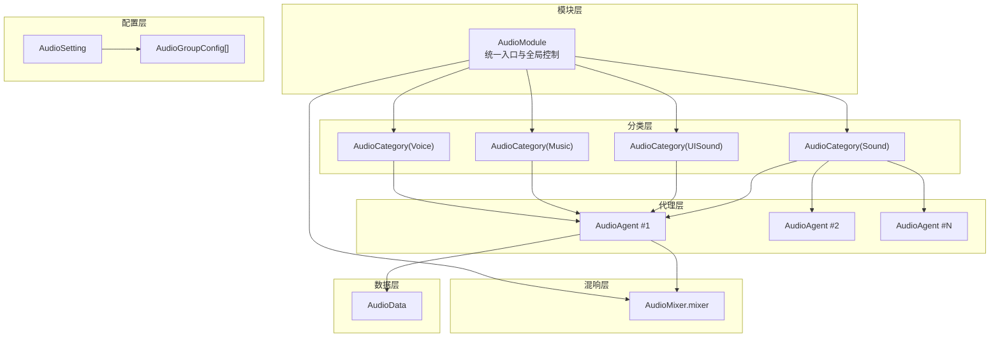
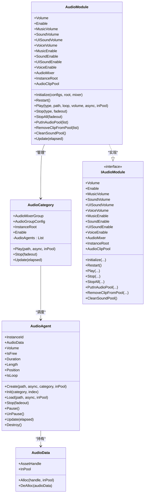
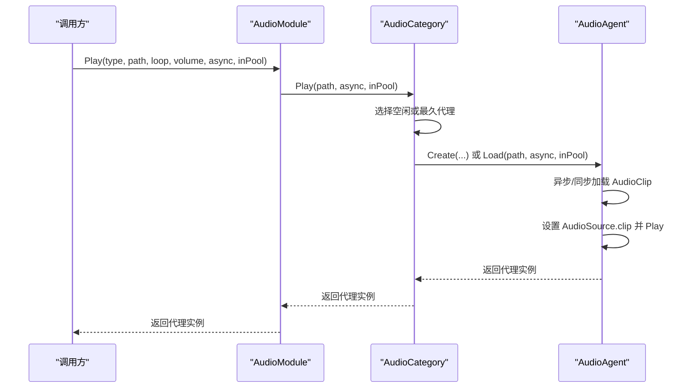
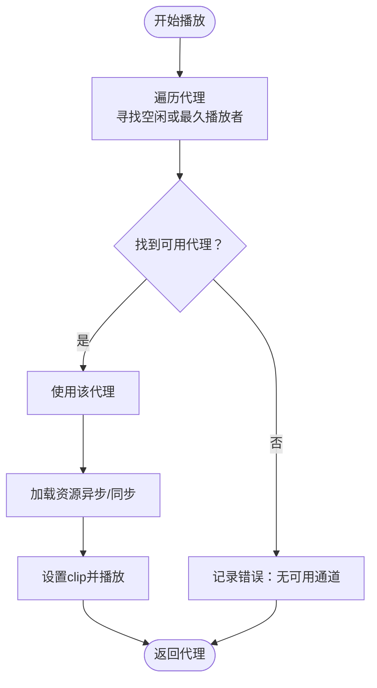
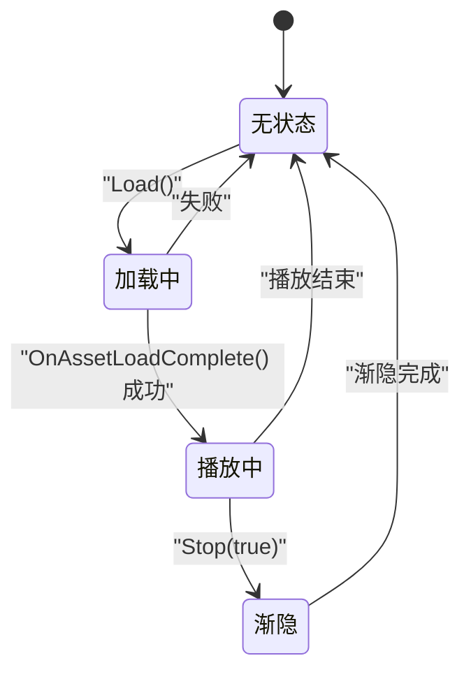
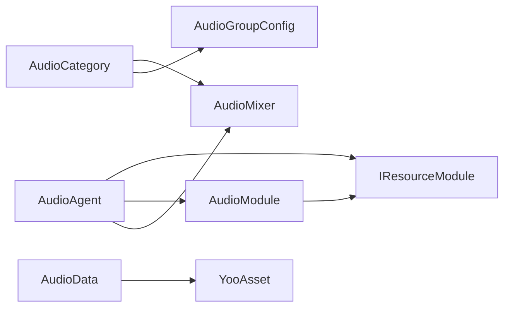

# 音频系统

<cite>
**本文引用的文件**
- [AudioModule.cs](file://Assets/TEngine/Runtime/Module/AudioModule/AudioModule.cs)
- [AudioAgent.cs](file://Assets/TEngine/Runtime/Module/AudioModule/AudioAgent.cs)
- [AudioCategory.cs](file://Assets/TEngine/Runtime/Module/AudioModule/AudioCategory.cs)
- [AudioType.cs](file://Assets/TEngine/Runtime/Module/AudioModule/AudioType.cs)
- [AudioSetting.cs](file://Assets/TEngine/Runtime/Module/AudioModule/AudioSetting.cs)
- [AudioGroupConfig.cs](file://Assets/TEngine/Runtime/Module/AudioModule/AudioGroupConfig.cs)
- [AudioData.cs](file://Assets/TEngine/Runtime/Module/AudioModule/AudioData.cs)
- [AudioAgentRuntimeState.cs](file://Assets/TEngine/Runtime/Module/AudioModule/AudioAgentRuntimeState.cs)
- [IAudioModule.cs](file://Assets/TEngine/Runtime/Module/AudioModule/IAudioModule.cs)
- [AudioSetting.asset](file://Assets/TEngine/Settings/AudioSetting.asset)
- [AudioMixer.mixer](file://Assets/TEngine/Runtime/Module/AudioModule/Resources/AudioMixer.mixer)
</cite>

## 目录
1. [简介](#简介)
2. [项目结构](#项目结构)
3. [核心组件](#核心组件)
4. [架构总览](#架构总览)
5. [详细组件分析](#详细组件分析)
6. [依赖关系分析](#依赖关系分析)
7. [性能考量](#性能考量)
8. [故障排查指南](#故障排查指南)
9. [结论](#结论)
10. [附录](#附录)

## 简介
本文件面向TEngine音频系统，提供从整体架构到实现细节、性能优化、使用指南与故障排查的完整技术文档。重点覆盖：
- 音频模块整体设计：模块化、分类管理、代理复用与资源池
- 核心功能：音量控制、开关控制、播放管理、音效与背景音乐处理
- 运行时流程：初始化、播放调度、渐隐、更新循环
- 配置方法与自定义音频代理开发指引
- 使用示例与常见问题解决方案

## 项目结构
TEngine音频系统位于模块目录下，采用“模块-分类-代理-资源”分层组织：
- 模块层：AudioModule 提供统一入口与全局控制
- 分类层：AudioCategory 按类型划分（音效、UI音效、音乐、语音），每类维护多个代理通道
- 代理层：AudioAgent 管理单个 AudioSource 的生命周期与播放状态
- 数据层：AudioData 封装资源句柄与对象池回收
- 配置层：AudioSetting + AudioGroupConfig 定义各分类的轨道数量、衰减模型、距离参数等
- 混响层：AudioMixer.mixer 提供混音与分组控制

图示来源
- [AudioModule.cs:341-396](file://Assets/TEngine/Runtime/Module/AudioModule/AudioModule.cs#L341-L396)
- [AudioCategory.cs:74-100](file://Assets/TEngine/Runtime/Module/AudioModule/AudioCategory.cs#L74-L100)
- [AudioAgent.cs:189-220](file://Assets/TEngine/Runtime/Module/AudioModule/AudioAgent.cs#L189-L220)
- [AudioData.cs:8-66](file://Assets/TEngine/Runtime/Module/AudioModule/AudioData.cs#L8-L66)
- [AudioSetting.cs:5-10](file://Assets/TEngine/Runtime/Module/AudioModule/AudioSetting.cs#L5-L10)
- [AudioGroupConfig.cs:11-70](file://Assets/TEngine/Runtime/Module/AudioModule/AudioGroupConfig.cs#L11-L70)
- [AudioMixer.mixer:300-420](file://Assets/TEngine/Runtime/Module/AudioModule/Resources/AudioMixer.mixer#L300-L420)

章节来源
- [AudioModule.cs:322-396](file://Assets/TEngine/Runtime/Module/AudioModule/AudioModule.cs#L322-L396)
- [AudioCategory.cs:74-100](file://Assets/TEngine/Runtime/Module/AudioModule/AudioCategory.cs#L74-L100)
- [AudioAgent.cs:189-220](file://Assets/TEngine/Runtime/Module/AudioModule/AudioAgent.cs#L189-L220)
- [AudioSetting.cs:5-10](file://Assets/TEngine/Runtime/Module/AudioModule/AudioSetting.cs#L5-L10)
- [AudioGroupConfig.cs:11-70](file://Assets/TEngine/Runtime/Module/AudioModule/AudioGroupConfig.cs#L11-L70)
- [AudioMixer.mixer:300-420](file://Assets/TEngine/Runtime/Module/AudioModule/Resources/AudioMixer.mixer#L300-L420)

## 核心组件
- AudioModule：音频模块主控制器，负责初始化、全局音量/开关、分类调度、资源池管理、更新循环
- AudioCategory：按类型管理一组 AudioAgent，负责选择可用通道、播放调度与停止
- AudioAgent：单个音频播放代理，封装 AudioSource、资源加载、播放状态、渐隐逻辑
- AudioData：资源句柄包装与对象池回收
- AudioType：音频类型枚举（Sound、UISound、Music、Voice）
- AudioGroupConfig：分类配置（类型、轨道数、音量、衰减模型、距离等）
- AudioSetting：音频设置资源，包含分类配置数组
- AudioMixer.mixer：混响器资源，定义 Master 与各分类/子组音量参数
- IAudioModule：对外接口契约

章节来源
- [AudioModule.cs:11-91](file://Assets/TEngine/Runtime/Module/AudioModule/AudioModule.cs#L11-L91)
- [AudioCategory.cs:12-66](file://Assets/TEngine/Runtime/Module/AudioModule/AudioCategory.cs#L12-L66)
- [AudioAgent.cs:10-97](file://Assets/TEngine/Runtime/Module/AudioModule/AudioAgent.cs#L10-L97)
- [AudioData.cs:8-66](file://Assets/TEngine/Runtime/Module/AudioModule/AudioData.cs#L8-L66)
- [AudioType.cs:7-34](file://Assets/TEngine/Runtime/Module/AudioModule/AudioType.cs#L7-L34)
- [AudioGroupConfig.cs:11-70](file://Assets/TEngine/Runtime/Module/AudioModule/AudioGroupConfig.cs#L11-L70)
- [AudioSetting.cs:5-10](file://Assets/TEngine/Runtime/Module/AudioModule/AudioSetting.cs#L5-L10)
- [AudioMixer.mixer:300-420](file://Assets/TEngine/Runtime/Module/AudioModule/Resources/AudioMixer.mixer#L300-L420)
- [IAudioModule.cs:8-128](file://Assets/TEngine/Runtime/Module/AudioModule/IAudioModule.cs#L8-L128)

## 架构总览
AudioModule 作为核心，持有各分类 AudioCategory；每个分类维护固定数量的 AudioAgent；每个代理封装一个 AudioSource 并通过 AudioMixer.mixer 输出到对应分组。播放时由分类选择空闲或最久未使用的代理进行复用，支持异步加载与资源池。

图示来源
- [AudioModule.cs:11-91](file://Assets/TEngine/Runtime/Module/AudioModule/AudioModule.cs#L11-L91)
- [AudioCategory.cs:12-66](file://Assets/TEngine/Runtime/Module/AudioModule/AudioCategory.cs#L12-L66)
- [AudioAgent.cs:10-97](file://Assets/TEngine/Runtime/Module/AudioModule/AudioAgent.cs#L10-L97)
- [AudioData.cs:8-66](file://Assets/TEngine/Runtime/Module/AudioModule/AudioData.cs#L8-L66)
- [IAudioModule.cs:8-128](file://Assets/TEngine/Runtime/Module/AudioModule/IAudioModule.cs#L8-L128)

## 详细组件分析

### AudioModule：音频模块实现机制
- 初始化与重启
  - 从设置资源加载分类配置，创建实例根节点，加载混响器
  - 为每种类型构建 AudioCategory，并预分配指定数量的代理通道
- 全局控制
  - 总音量与开关：通过 AudioListener.volume 控制
  - 分类音量：通过 AudioMixer 参数映射（对数刻度 dB）
  - 分类开关：音乐采用 dB 门限判断与直接设置 dB 的方式实现
- 播放管理
  - Play(type, path, ...)：委托给对应分类的 Play，内部选择空闲或最久播放代理
  - Stop/StopAll：停止指定类型或全部类型
- 资源池
  - PutInAudioPool：将资源加入池并异步加载
  - RemoveClipFromPool/CleanSoundPool：释放池内资源
- 更新循环
  - Update(elapsed)：遍历各分类，驱动代理更新（播放结束检测、渐隐）

图示来源
- [AudioModule.cs:441-458](file://Assets/TEngine/Runtime/Module/AudioModule/AudioModule.cs#L441-L458)
- [AudioCategory.cs:122-164](file://Assets/TEngine/Runtime/Module/AudioModule/AudioCategory.cs#L122-L164)
- [AudioAgent.cs:189-264](file://Assets/TEngine/Runtime/Module/AudioModule/AudioAgent.cs#L189-L264)

章节来源
- [AudioModule.cs:322-396](file://Assets/TEngine/Runtime/Module/AudioModule/AudioModule.cs#L322-L396)
- [AudioModule.cs:441-493](file://Assets/TEngine/Runtime/Module/AudioModule/AudioModule.cs#L441-L493)
- [AudioModule.cs:499-553](file://Assets/TEngine/Runtime/Module/AudioModule/AudioModule.cs#L499-L553)
- [AudioModule.cs:560-569](file://Assets/TEngine/Runtime/Module/AudioModule/AudioModule.cs#L560-L569)

### AudioCategory：音频分类与调度
- 组织结构
  - 依据 AudioGroupConfig 创建对应 Mixer Group，并建立实例根节点
  - 预分配固定数量的 AudioAgent 列表
- 播放策略
  - 优先选择空闲代理；若无空闲，选择已播放时长最长的代理进行复用
  - 支持异步加载与资源池命中
- 停止与更新
  - Stop(fadeout)：逐个代理停止
  - Update(elapsed)：逐个代理更新状态

图示来源
- [AudioCategory.cs:122-164](file://Assets/TEngine/Runtime/Module/AudioModule/AudioCategory.cs#L122-L164)

章节来源
- [AudioCategory.cs:74-100](file://Assets/TEngine/Runtime/Module/AudioModule/AudioCategory.cs#L74-L100)
- [AudioCategory.cs:122-179](file://Assets/TEngine/Runtime/Module/AudioModule/AudioCategory.cs#L122-L179)

### AudioAgent：音频代理与播放状态
- 生命周期
  - Init：创建 GameObject 与 AudioSource，绑定 Mixer Group，设置 Rolloff 与距离参数
  - Load：根据资源池命中与否决定直接使用池句柄或加载新资源
  - Play：设置 clip 并播放，进入播放状态
  - Stop/Pause/Unpause：停止或暂停控制
  - Update：播放结束检测、渐隐计时与体积衰减
  - Destroy：销毁 GameObject 与回收 AudioData
- 状态机
  - None、Loading、Playing、FadingOut、End

图示来源
- [AudioAgent.cs:368-401](file://Assets/TEngine/Runtime/Module/AudioModule/AudioAgent.cs#L368-L401)
- [AudioAgentRuntimeState.cs:6-33](file://Assets/TEngine/Runtime/Module/AudioModule/AudioAgentRuntimeState.cs#L6-L33)

章节来源
- [AudioAgent.cs:189-264](file://Assets/TEngine/Runtime/Module/AudioModule/AudioAgent.cs#L189-L264)
- [AudioAgent.cs:313-362](file://Assets/TEngine/Runtime/Module/AudioModule/AudioAgent.cs#L313-L362)
- [AudioAgent.cs:368-401](file://Assets/TEngine/Runtime/Module/AudioModule/AudioAgent.cs#L368-L401)
- [AudioAgentRuntimeState.cs:6-33](file://Assets/TEngine/Runtime/Module/AudioModule/AudioAgentRuntimeState.cs#L6-L33)

### 音量控制与混响器对接
- 总音量/开关：AudioListener.volume
- 分类音量：通过 AudioMixer 参数（如 MusicVolume、SoundVolume、UISoundVolume、VoiceVolume）设置，值为对数刻度（dB）
- 音乐开关：通过设置对应参数 dB 值或查询 dB 阈值实现

章节来源
- [AudioModule.cs:44-91](file://Assets/TEngine/Runtime/Module/AudioModule/AudioModule.cs#L44-L91)
- [AudioModule.cs:96-199](file://Assets/TEngine/Runtime/Module/AudioModule/AudioModule.cs#L96-L199)
- [AudioModule.cs:204-316](file://Assets/TEngine/Runtime/Module/AudioModule/AudioModule.cs#L204-L316)
- [AudioMixer.mixer:314-344](file://Assets/TEngine/Runtime/Module/AudioModule/Resources/AudioMixer.mixer#L314-L344)

### 配置与自定义音频代理
- 配置方法
  - 在编辑器中创建 AudioSetting 资源，填写 AudioGroupConfig 数组
  - 每项包含：名称、是否静音、初始音量、代理数量、类型、衰减模式、最小/最大距离
  - 运行时由 AudioModule 读取并初始化
- 自定义音频代理
  - 若需扩展代理行为，可在现有 AudioAgent 基础上增加字段与方法
  - 注意与 AudioCategory 的协作与资源池交互

章节来源
- [AudioSetting.cs:5-10](file://Assets/TEngine/Runtime/Module/AudioModule/AudioSetting.cs#L5-L10)
- [AudioSetting.asset:15-48](file://Assets/TEngine/Settings/AudioSetting.asset#L15-L48)
- [AudioGroupConfig.cs:11-70](file://Assets/TEngine/Runtime/Module/AudioModule/AudioGroupConfig.cs#L11-L70)
- [AudioAgent.cs:189-220](file://Assets/TEngine/Runtime/Module/AudioModule/AudioAgent.cs#L189-L220)

## 依赖关系分析
- 模块耦合
  - AudioModule 依赖 IResourceModule 进行资源加载
  - AudioCategory 依赖 AudioMixer 与 AudioGroupConfig
  - AudioAgent 依赖 IAudioModule 与 IResourceModule
- 外部依赖
  - Unity AudioMixer 与 AudioSource
  - YooAsset 资源系统

图示来源
- [AudioModule.cs:324-325](file://Assets/TEngine/Runtime/Module/AudioModule/AudioModule.cs#L324-L325)
- [AudioCategory.cs:81-89](file://Assets/TEngine/Runtime/Module/AudioModule/AudioCategory.cs#L81-L89)
- [AudioAgent.cs:204-205](file://Assets/TEngine/Runtime/Module/AudioModule/AudioAgent.cs#L204-L205)
- [AudioData.cs:13](file://Assets/TEngine/Runtime/Module/AudioModule/AudioData.cs#L13)

章节来源
- [AudioModule.cs:324-325](file://Assets/TEngine/Runtime/Module/AudioModule/AudioModule.cs#L324-L325)
- [AudioCategory.cs:81-89](file://Assets/TEngine/Runtime/Module/AudioModule/AudioCategory.cs#L81-L89)
- [AudioAgent.cs:204-205](file://Assets/TEngine/Runtime/Module/AudioModule/AudioAgent.cs#L204-L205)
- [AudioData.cs:13](file://Assets/TEngine/Runtime/Module/AudioModule/AudioData.cs#L13)

## 性能考量
- 资源管理
  - 使用资源池缓存已加载 AudioClip，减少重复加载与 GC 抖动
  - 池内资源在不再使用时及时释放，避免内存泄漏
- 播放调度
  - 代理复用策略：优先空闲，其次最久未使用，避免频繁创建销毁
  - 渐隐停止：在切换或复用时平滑过渡，避免突兀停顿
- 混响与参数
  - 合理设置分类音量与 dB 映射，避免过度压缩或失真
  - 3D 音效的 rolloff 模式与距离参数应结合场景规模调整
- 更新频率
  - 仅在必要时进行资源加载与混响器参数写入，避免每帧高频操作

章节来源
- [AudioModule.cs:499-553](file://Assets/TEngine/Runtime/Module/AudioModule/AudioModule.cs#L499-L553)
- [AudioCategory.cs:122-164](file://Assets/TEngine/Runtime/Module/AudioModule/AudioCategory.cs#L122-L164)
- [AudioAgent.cs:270-285](file://Assets/TEngine/Runtime/Module/AudioModule/AudioAgent.cs#L270-L285)
- [AudioAgent.cs:377-398](file://Assets/TEngine/Runtime/Module/AudioModule/AudioAgent.cs#L377-L398)

## 故障排查指南
- 无法播放或报错“无可用通道”
  - 检查对应分类的代理数量是否过少
  - 确认分类 Enable 是否被意外关闭
- 音量无效或静音
  - 检查总开关与分类开关状态
  - 确认混响器参数 dB 值是否异常
- 资源加载失败
  - 确认资源路径正确且已打包
  - 检查资源池是否命中，未命中时确认异步加载回调是否触发
- 渐隐不生效
  - 确认 Stop(fadeout) 调用与 Update(elapsed) 循环正常执行
  - 检查代理状态是否正确进入 FadingOut

章节来源
- [AudioCategory.cs:122-164](file://Assets/TEngine/Runtime/Module/AudioModule/AudioCategory.cs#L122-L164)
- [AudioModule.cs:465-493](file://Assets/TEngine/Runtime/Module/AudioModule/AudioModule.cs#L465-L493)
- [AudioAgent.cs:270-285](file://Assets/TEngine/Runtime/Module/AudioModule/AudioAgent.cs#L270-L285)
- [AudioAgent.cs:377-398](file://Assets/TEngine/Runtime/Module/AudioModule/AudioAgent.cs#L377-L398)

## 结论
TEngine 音频系统通过模块-分类-代理三层架构实现了高内聚、低耦合的音频播放体系。借助资源池与代理复用策略，系统在保证流畅播放的同时兼顾了性能与内存效率。配合灵活的分类配置与混响器参数，能够满足游戏内音效、UI、背景音乐与语音的多样化需求。

## 附录
- 使用示例（步骤说明）
  - 创建 AudioSetting 资源并配置分类
  - 在游戏初始化阶段调用 AudioModule.Initialize 加载配置
  - 通过 AudioModule.Play 播放不同类型音频
  - 使用 Volume/Enable 与分类音量/开关进行全局与分类级控制
  - 使用 PutInAudioPool 预热常用音效，提升首帧体验
- 常见问题
  - 代理数量不足导致无法播放：适当提高分类代理数量
  - 3D 音效听不到：检查 rolloff 模式与 min/max distance
  - 资源池未生效：确认资源路径与池内句柄生命周期