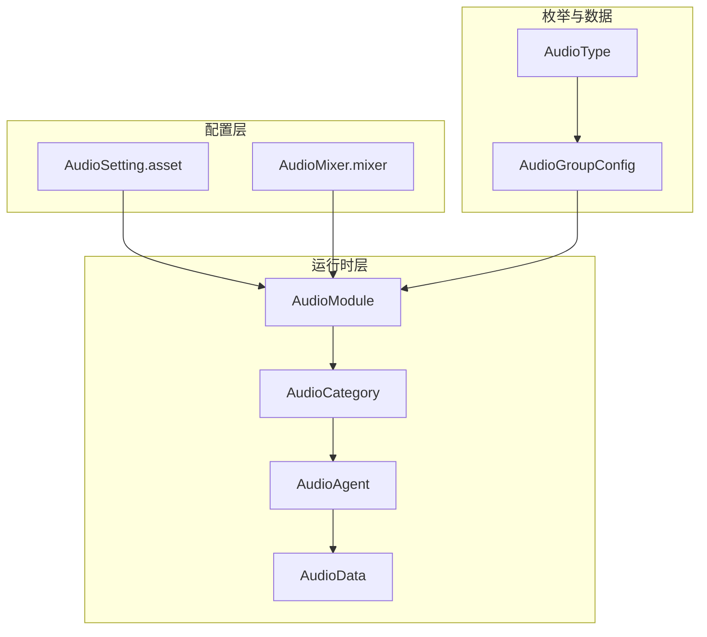
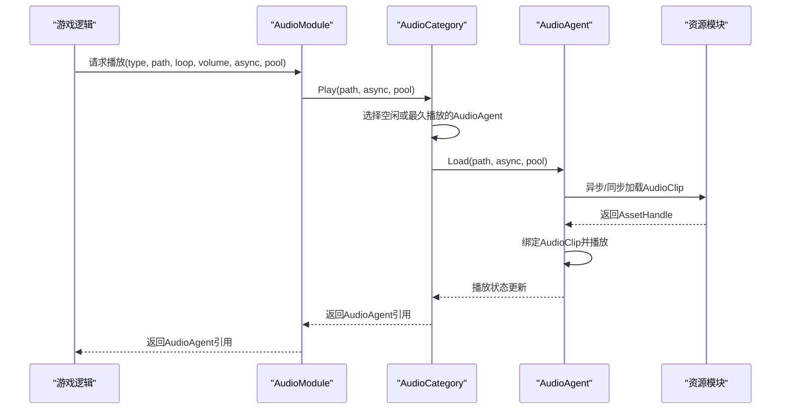
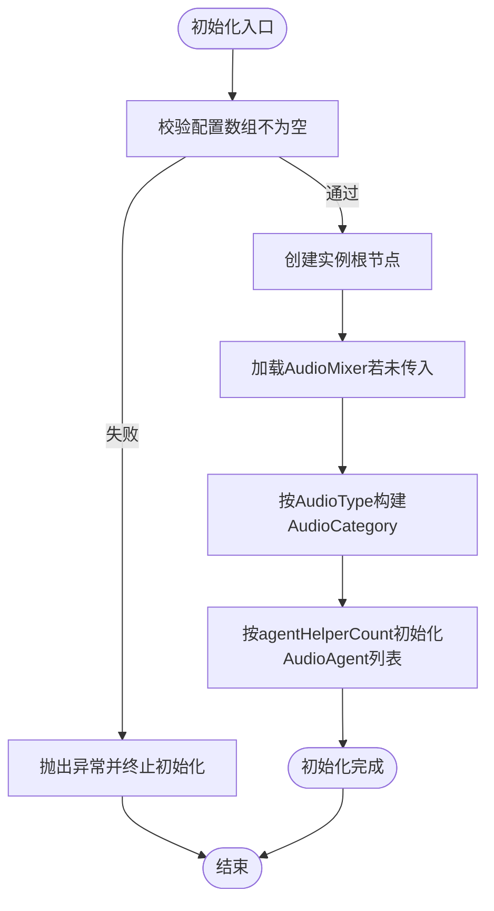
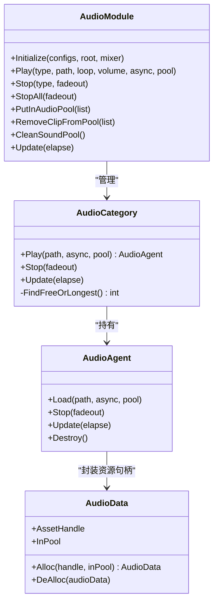
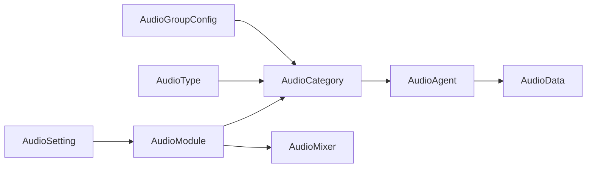

# 音频资源配置

<cite>
**本文引用的文件**
- [AudioSetting.asset](file://Assets/TEngine/Settings/AudioSetting.asset)
- [AudioSetting.cs](file://Assets/TEngine/Runtime/Module/AudioModule/AudioSetting.cs)
- [AudioGroupConfig.cs](file://Assets/TEngine/Runtime/Module/AudioModule/AudioGroupConfig.cs)
- [AudioType.cs](file://Assets/TEngine/Runtime/Module/AudioModule/AudioType.cs)
- [AudioModule.cs](file://Assets/TEngine/Runtime/Module/AudioModule/AudioModule.cs)
- [AudioCategory.cs](file://Assets/TEngine/Runtime/Module/AudioModule/AudioCategory.cs)
- [AudioAgent.cs](file://Assets/TEngine/Runtime/Module/AudioModule/AudioAgent.cs)
- [AudioData.cs](file://Assets/TEngine/Runtime/Module/AudioModule/AudioData.cs)
- [AudioMixer.mixer](file://Assets/TEngine/Runtime/Module/AudioModule/Resources/AudioMixer.mixer)
</cite>

## 目录
1. [简介](#简介)
2. [项目结构](#项目结构)
3. [核心组件](#核心组件)
4. [架构总览](#架构总览)
5. [详细组件分析](#详细组件分析)
6. [依赖关系分析](#依赖关系分析)
7. [性能考量](#性能考量)
8. [故障排查指南](#故障排查指南)
9. [结论](#结论)
10. [附录](#附录)

## 简介
本文件面向TEngine音频资源配置系统，围绕AudioSetting.asset配置文件与相关运行时组件，系统性说明以下内容：
- AudioSetting.asset的配置结构与参数含义（音频轨道组、代理数量、默认音量、3D衰减等）
- AudioGroupConfig的配置方法与设置原则
- 音频资源组织与命名规范（存放位置、文件格式、资源引用）
- 配置加载与验证机制（读取、参数校验、错误处理）
- 最佳实践（多平台适配、性能优化、内存管理）
- 配置示例与常见问题解决方案

## 项目结构
TEngine音频系统主要由以下层次构成：
- 配置层：AudioSetting.asset（运行时配置）、AudioMixer.mixer（混音器蓝图）
- 运行时层：AudioModule（模块入口）、AudioCategory（轨道）、AudioAgent（代理）、AudioData（资源句柄封装）
- 枚举与数据结构：AudioType（音效分类）

图表来源
- [AudioSetting.asset:1-48](file://Assets/TEngine/Settings/AudioSetting.asset#L1-L48)
- [AudioMixer.mixer:300-420](file://Assets/TEngine/Runtime/Module/AudioModule/Resources/AudioMixer.mixer#L300-L420)
- [AudioModule.cs:322-396](file://Assets/TEngine/Runtime/Module/AudioModule/AudioModule.cs#L322-L396)
- [AudioCategory.cs:74-100](file://Assets/TEngine/Runtime/Module/AudioModule/AudioCategory.cs#L74-L100)
- [AudioAgent.cs:189-220](file://Assets/TEngine/Runtime/Module/AudioModule/AudioAgent.cs#L189-L220)
- [AudioData.cs:8-66](file://Assets/TEngine/Runtime/Module/AudioModule/AudioData.cs#L8-L66)
- [AudioType.cs:7-33](file://Assets/TEngine/Runtime/Module/AudioModule/AudioType.cs#L7-L33)
- [AudioGroupConfig.cs:11-70](file://Assets/TEngine/Runtime/Module/AudioModule/AudioGroupConfig.cs#L11-L70)

章节来源
- [AudioSetting.asset:1-48](file://Assets/TEngine/Settings/AudioSetting.asset#L1-L48)
- [AudioMixer.mixer:300-420](file://Assets/TEngine/Runtime/Module/AudioModule/Resources/AudioMixer.mixer#L300-L420)

## 核心组件
- AudioSetting：承载全局音频轨道组配置数组，供模块初始化使用。
- AudioGroupConfig：单个轨道组的配置项，包含名称、静音、音量、代理数量、音效类型、3D衰减模式与距离范围等。
- AudioType：音效分类枚举，与AudioMixer中的分组名称保持一致。
- AudioModule：音频模块入口，负责初始化混音器、构建各轨道、播放/停止音频、资源池管理、更新轮询。
- AudioCategory：单个音效类型的轨道容器，维护多个AudioAgent并进行播放调度。
- AudioAgent：具体音频播放代理，负责资源加载、播放、淡出、生命周期管理。
- AudioData：对资源句柄的封装，配合对象池回收。

章节来源
- [AudioSetting.cs:5-9](file://Assets/TEngine/Runtime/Module/AudioModule/AudioSetting.cs#L5-L9)
- [AudioGroupConfig.cs:11-70](file://Assets/TEngine/Runtime/Module/AudioModule/AudioGroupConfig.cs#L11-L70)
- [AudioType.cs:7-33](file://Assets/TEngine/Runtime/Module/AudioModule/AudioType.cs#L7-L33)
- [AudioModule.cs:11-326](file://Assets/TEngine/Runtime/Module/AudioModule/AudioModule.cs#L11-L326)
- [AudioCategory.cs:12-100](file://Assets/TEngine/Runtime/Module/AudioModule/AudioCategory.cs#L12-L100)
- [AudioAgent.cs:10-220](file://Assets/TEngine/Runtime/Module/AudioModule/AudioAgent.cs#L10-L220)
- [AudioData.cs:8-66](file://Assets/TEngine/Runtime/Module/AudioModule/AudioData.cs#L8-L66)

## 架构总览
AudioModule在初始化时读取AudioSetting.asset中的AudioGroupConfig数组，按AudioType建立对应的AudioCategory，每个Category内部维护固定数量的AudioAgent（由agentHelperCount决定）。播放时AudioModule将请求路由到对应AudioCategory，AudioCategory选择空闲或最久未使用的AudioAgent进行复用；AudioAgent通过资源模块异步/同步加载AudioClip并播放。

图表来源
- [AudioModule.cs:441-458](file://Assets/TEngine/Runtime/Module/AudioModule/AudioModule.cs#L441-L458)
- [AudioCategory.cs:122-164](file://Assets/TEngine/Runtime/Module/AudioModule/AudioCategory.cs#L122-L164)
- [AudioAgent.cs:228-264](file://Assets/TEngine/Runtime/Module/AudioModule/AudioAgent.cs#L228-L264)

## 详细组件分析

### AudioSetting.asset 配置详解
- 结构组成
  - audioGroupConfigs：数组，每项对应一个音频轨道组配置。
- 关键字段
  - name：轨道组名称（用于标识与日志输出）。
  - mute：是否静音（true则该轨道整体静音）。
  - volume：默认音量（0~1），受模块总音量与分类音量影响。
  - agentHelperCount：该轨道可用的AudioAgent数量（即并发播放上限）。
  - AudioType：音效类型枚举值，映射到AudioMixer中的分组。
  - audioRolloffMode：3D声音衰减模式（对AudioSource生效）。
  - minDistance/maxDistance：3D声音最小/最大距离（对AudioSource生效）。
- 示例解读（来自仓库配置）
  - Music：1个代理，音量0.5，3D衰减Logarithmic，min=15，max=50。
  - Sound：4个代理，音量0.5，3D衰减Linear，min=1，max=500。
  - UISound：4个代理，音量0.5，3D衰减Linear，min=1，max=500。
  - Voice：1个代理，音量0.5，3D衰减Linear，min=1，max=500。

章节来源
- [AudioSetting.asset:15-47](file://Assets/TEngine/Settings/AudioSetting.asset#L15-L47)
- [AudioGroupConfig.cs:13-47](file://Assets/TEngine/Runtime/Module/AudioModule/AudioGroupConfig.cs#L13-L47)

### AudioGroupConfig 配置方法与设置原则
- 字段说明
  - name：轨道名称，建议与AudioMixer分组一致，便于调试与匹配。
  - mute：可按需关闭某类音效（如仅测试背景音乐时关闭Sound）。
  - volume：默认音量，最终输出音量还受AudioModule总音量与分类音量控制。
  - agentHelperCount：决定并发播放上限，过大导致AudioSource过多，CPU/GPU压力增大；过小导致新播放被拒绝或复用冲突。
  - AudioType：必须与AudioMixer中“Master/分类名”一致，否则无法正确匹配分组。
  - audioRolloffMode/minDistance/maxDistance：3D音效的空间表现，合理设置可提升沉浸感。
- 设置原则
  - 不同类型区分并发需求：背景音乐通常1~2个即可；UI音效与环境音效可设为4~8；语音建议1~2。
  - 3D场景优先使用Logarithmic并设置合理的min/max；平面2D场景可使用Linear或关闭3D。
  - 初始音量统一设为0.5，后续通过分类音量与总音量调节。

章节来源
- [AudioGroupConfig.cs:11-70](file://Assets/TEngine/Runtime/Module/AudioModule/AudioGroupConfig.cs#L11-L70)
- [AudioType.cs:7-33](file://Assets/TEngine/Runtime/Module/AudioModule/AudioType.cs#L7-L33)

### 音频资源组织与命名规范
- 存放位置
  - 音频文件建议放置于资源包中，遵循项目资源打包规范；播放时通过资源模块按路径加载。
- 文件格式
  - 支持Unity标准音频格式（如OGG、MP3、WAV等），建议根据平台与体积选择合适格式。
- 资源引用
  - 播放接口传入资源路径字符串，AudioAgent通过资源模块异步/同步加载AudioClip。
  - 支持将常用音频加入对象池，减少重复加载开销。

章节来源
- [AudioAgent.cs:228-264](file://Assets/TEngine/Runtime/Module/AudioModule/AudioAgent.cs#L228-L264)
- [AudioModule.cs:499-514](file://Assets/TEngine/Runtime/Module/AudioModule/AudioModule.cs#L499-L514)

### 配置加载与验证机制
- 加载流程
  - AudioModule.OnInit读取Settings.AudioSetting.audioGroupConfigs并调用Initialize。
  - Initialize校验配置数组非空，创建实例根节点，加载AudioMixer（若未显式传入）。
  - 为每个AudioType构建AudioCategory，并按agentHelperCount初始化AudioAgent列表。
- 参数校验
  - 配置数组为空时抛出异常，防止模块初始化失败。
  - 分类音量设置会进行Clamp限制，避免越界。
- 错误处理
  - 编辑器下检测Unity音频是否被禁用，若禁用则直接返回，避免无效操作。
  - 资源加载失败时AudioAgent状态置为End，避免悬挂状态。

图表来源
- [AudioModule.cs:341-396](file://Assets/TEngine/Runtime/Module/AudioModule/AudioModule.cs#L341-L396)

章节来源
- [AudioModule.cs:322-396](file://Assets/TEngine/Runtime/Module/AudioModule/AudioModule.cs#L322-L396)

### 播放调度与资源池
- 并发调度
  - AudioCategory在播放时遍历AudioAgent，优先选择空闲者；若无空闲，则选择播放时长最长者进行复用。
- 资源池
  - AudioModule提供PutInAudioPool/RemoveClipFromPool/CleanSoundPool接口，结合AudioAgent的池化标志，减少重复加载。
- 淡出复用
  - AudioAgent支持fadeout模式，在停止时渐弱至结束再复用，避免突兀切换。

图表来源
- [AudioModule.cs:441-514](file://Assets/TEngine/Runtime/Module/AudioModule/AudioModule.cs#L441-L514)
- [AudioCategory.cs:122-164](file://Assets/TEngine/Runtime/Module/AudioModule/AudioCategory.cs#L122-L164)
- [AudioAgent.cs:228-401](file://Assets/TEngine/Runtime/Module/AudioModule/AudioAgent.cs#L228-L401)
- [AudioData.cs:44-66](file://Assets/TEngine/Runtime/Module/AudioModule/AudioData.cs#L44-L66)

章节来源
- [AudioModule.cs:441-571](file://Assets/TEngine/Runtime/Module/AudioModule/AudioModule.cs#L441-L571)
- [AudioCategory.cs:122-196](file://Assets/TEngine/Runtime/Module/AudioModule/AudioCategory.cs#L122-L196)
- [AudioAgent.cs:228-419](file://Assets/TEngine/Runtime/Module/AudioModule/AudioAgent.cs#L228-L419)
- [AudioData.cs:44-66](file://Assets/TEngine/Runtime/Module/AudioModule/AudioData.cs#L44-L66)

## 依赖关系分析
- AudioModule依赖AudioSetting（配置）、AudioMixer（混音器）、IResourceModule（资源加载）。
- AudioCategory依赖AudioMixerGroup（分组匹配）、AudioGroupConfig（配置）、AudioAgent（播放代理）。
- AudioAgent依赖IResourceModule（加载）、AudioData（资源句柄封装）。
- AudioType与AudioMixer分组名称保持一致，确保运行时分组匹配成功。

图表来源
- [AudioModule.cs:322-396](file://Assets/TEngine/Runtime/Module/AudioModule/AudioModule.cs#L322-L396)
- [AudioCategory.cs:74-100](file://Assets/TEngine/Runtime/Module/AudioModule/AudioCategory.cs#L74-L100)
- [AudioAgent.cs:204-220](file://Assets/TEngine/Runtime/Module/AudioModule/AudioAgent.cs#L204-L220)
- [AudioMixer.mixer:300-420](file://Assets/TEngine/Runtime/Module/AudioModule/Resources/AudioMixer.mixer#L300-L420)

章节来源
- [AudioModule.cs:322-396](file://Assets/TEngine/Runtime/Module/AudioModule/AudioModule.cs#L322-L396)
- [AudioMixer.mixer:300-420](file://Assets/TEngine/Runtime/Module/AudioModule/Resources/AudioMixer.mixer#L300-L420)

## 性能考量
- 并发与代理数量
  - 合理设置agentHelperCount，避免AudioSource过多导致CPU/GPU压力；高频UI点击音效可适当提高。
- 3D衰减与距离
  - 3D场景使用Logarithmic并设置合理min/max，减少不必要的远距离衰减计算。
- 资源加载策略
  - 对常用音效使用对象池，减少重复加载；异步加载避免主线程卡顿。
- 淡出与复用
  - 使用fadeout复用可减少频繁创建销毁，但需注意淡出时间与体验平衡。
- 总音量与分类音量
  - 通过分类音量与总音量分层控制，避免多次乘方运算，提升性能。

## 故障排查指南
- 无法播放或立即结束
  - 检查AudioAgent状态是否在加载完成后仍未绑定AudioClip，确认资源路径正确且资源存在。
  - 若AudioClip为null，AudioAgent状态会置为End，检查资源加载回调与对象池逻辑。
- 音量无效或静音
  - 检查AudioModule的Enable与Volume、分类音量（MusicVolume/SoundVolume/UISoundVolume/VoiceVolume）是否被设置为0或禁用。
  - 在编辑器下确认Unity音频未被禁用。
- 分类音效不生效
  - 确认AudioType与AudioMixer中“Master/分类名”一致，否则AudioMixer分组匹配失败。
- 并发播放受限
  - 检查agentHelperCount是否过小；若无空闲AudioAgent，将返回null或复用最久播放者。
- 资源泄漏
  - 确保不再使用的AudioClip从对象池移除或模块关闭时清理；AudioData在回收时会释放非池化句柄。

章节来源
- [AudioAgent.cs:313-362](file://Assets/TEngine/Runtime/Module/AudioModule/AudioAgent.cs#L313-L362)
- [AudioModule.cs:441-514](file://Assets/TEngine/Runtime/Module/AudioModule/AudioModule.cs#L441-L514)
- [AudioCategory.cs:122-164](file://Assets/TEngine/Runtime/Module/AudioModule/AudioCategory.cs#L122-L164)

## 结论
TEngine音频资源配置系统通过AudioSetting.asset与AudioMixer.mixer协同工作，实现了灵活的轨道分组、并发控制与资源管理。合理设置AudioGroupConfig的各项参数，结合对象池与淡出复用策略，可在保证音效质量的同时兼顾性能与稳定性。建议在不同平台与场景下进行针对性调优，并持续监控资源加载与AudioSource数量，确保最佳用户体验。

## 附录

### 配置示例与最佳实践
- 示例一：背景音乐（低并发、空间感强）
  - agentHelperCount：1~2
  - audioRolloffMode：Logarithmic
  - minDistance/maxDistance：根据场景设置
- 示例二：UI点击音效（高频、短促）
  - agentHelperCount：4~8
  - audioRolloffMode：Linear 或 None
  - volume：略低于环境音效
- 示例三：环境音效（中等并发）
  - agentHelperCount：4~6
  - audioRolloffMode：Linear
- 示例四：语音（清晰度优先）
  - agentHelperCount：1~2
  - audioRolloffMode：Linear
- 多平台适配
  - 移动端：降低并发与3D计算复杂度；优先使用压缩格式。
  - 桌面端：可适度提高并发与3D效果。
- 内存管理
  - 对常用音效预热并加入对象池；模块关闭时清空池子，避免泄漏。
- 命名规范
  - 资源路径统一前缀（如“Audios/...”），便于资源模块定位与打包。