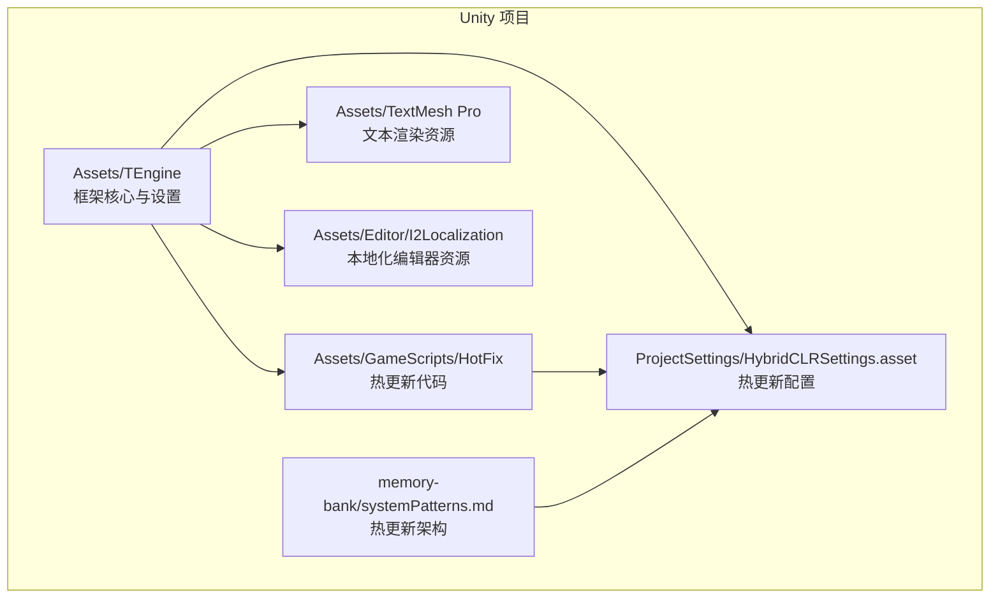
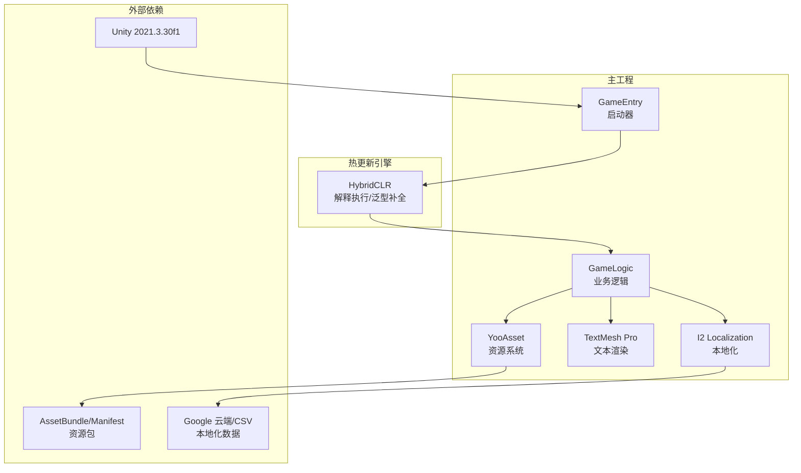
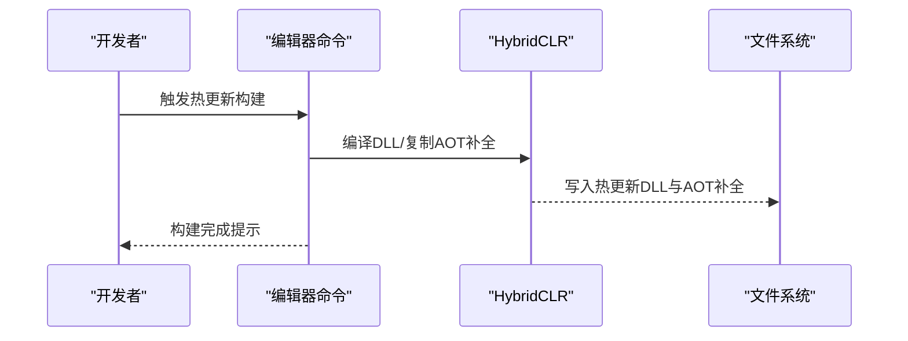
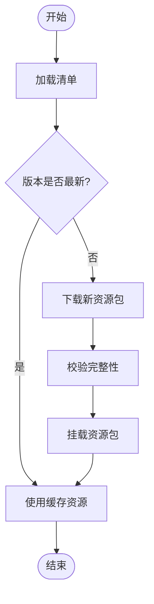
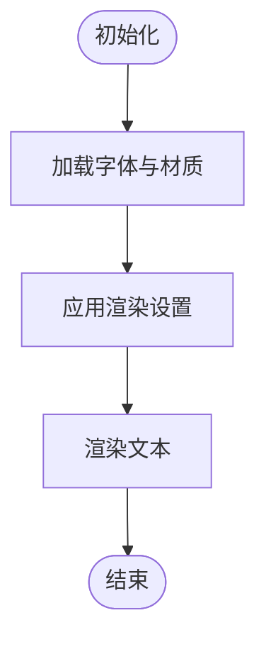
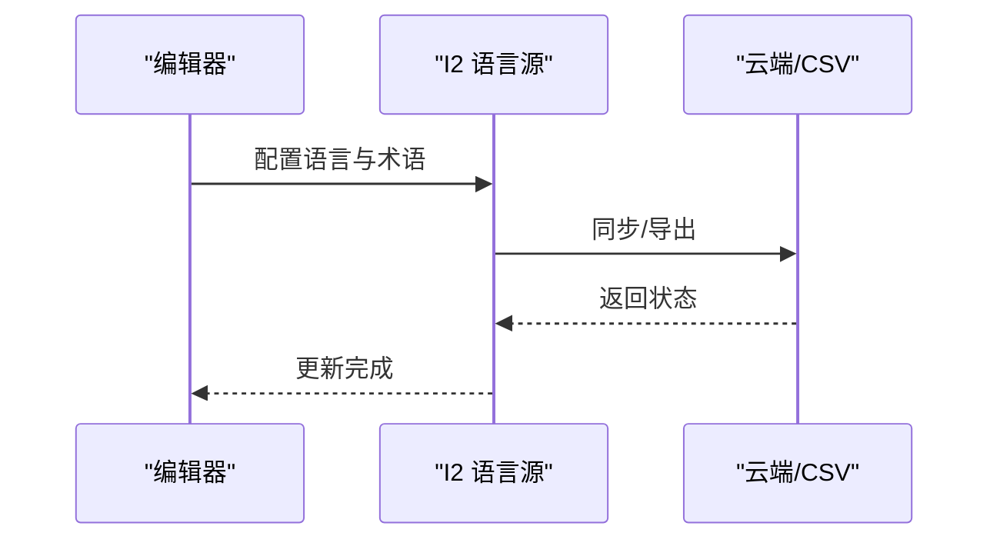
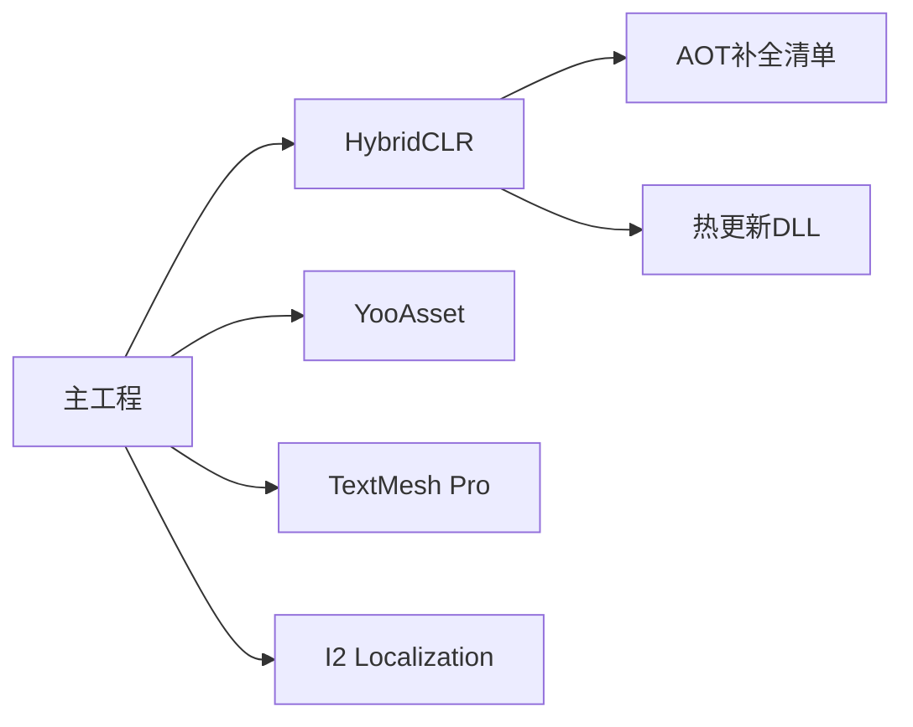

# 技术栈说明

<cite>
**本文引用的文件**
- [package.json](file://Assets/TEngine/package.json)
- [HybridCLRSettings.asset](file://ProjectSettings/HybridCLRSettings.asset)
- [YooAssetSettings.asset](file://Assets/TEngine/Settings/Resources/YooAssetSettings.asset)
- [TMP Settings.asset](file://Assets/TextMesh Pro/Resources/TMP Settings.asset)
- [I2Languages.asset](file://Assets/Editor/I2Localization/I2Languages.asset)
- [TEngine.Runtime.asmdef](file://Assets/TEngine/Runtime/TEngine.Runtime.asmdef)
- [GameLogic.asmdef](file://Assets/GameScripts/HotFix/GameLogic/GameLogic.asmdef)
- [BuildDLLCommand.cs](file://Assets/TEngine/Editor/HybridCLR/BuildDLLCommand.cs)
- [TEngineSettingsProvider.cs](file://Assets/Editor/TEngineSettingsProvider/TEngineSettingsProvider.cs)
- [UpdateSettingEditor.cs](file://Assets/TEngine/Editor/Utility/UpdateSettingEditor.cs)
- [systemPatterns.md](file://memory-bank/systemPatterns.md)
- [SetSpriteObject.cs](file://Assets/TEngine/Runtime/Module/ResourceModule/Extension/Implement/SetSpriteObject.cs)
- [LoadAssetObject.cs](file://Assets/TEngine/Runtime/Module/ResourceModule/Extension/LoadAssetObject.cs)
- [ResourceExtComponent.cs](file://Assets/TEngine/Runtime/Module/ResourceModule/Extension/ResourceExtComponent.cs)
</cite>

## 目录
1. [引言](#引言)
2. [项目结构](#项目结构)
3. [核心组件](#核心组件)
4. [架构总览](#架构总览)
5. [详细组件分析](#详细组件分析)
6. [依赖关系分析](#依赖关系分析)
7. [性能考虑](#性能考虑)
8. [故障排除指南](#故障排除指南)
9. [结论](#结论)
10. [附录](#附录)

## 引言
本技术栈说明面向TEngine框架，系统梳理其核心技术组成与协作方式，重点覆盖以下方面：
- 开发环境：Unity 2021.3.30f1
- 热更新：HybridCLR（IL2CPP + 解释执行 + AOT补全）
- 资源管理：YooAsset
- 文本渲染：TextMesh Pro
- 本地化：I2 Localization
- 第三方插件与Sirenix使用说明
- 版本兼容性与升级路径建议
- 购买与导入要求

通过本说明，读者可以理解各技术选型的原因、优势以及在TEngine中的集成方式，并据此进行开发、维护与升级。

## 项目结构
TEngine采用模块化与分层架构组织，核心目录与关键文件如下：
- Assets/TEngine：框架核心代码与运行时、编辑器扩展、设置资源
- Assets/TextMesh Pro：文本渲染相关资源与着色器
- Assets/Editor/I2Localization：本地化编辑器资源
- Assets/GameScripts/HotFix：热更新逻辑与协议代码
- ProjectSettings/HybridCLRSettings.asset：HybridCLR热更新配置
- memory-bank/systemPatterns.md：热更新架构流程图与说明

**图表来源**
- [package.json](file://Assets/TEngine/package.json#L11)
- [HybridCLRSettings.asset:15-39](file://ProjectSettings/HybridCLRSettings.asset#L15-L39)
- [systemPatterns.md:317-351](file://memory-bank/systemPatterns.md#L317-L351)

**章节来源**
- [package.json](file://Assets/TEngine/package.json#L11)
- [HybridCLRSettings.asset:15-39](file://ProjectSettings/HybridCLRSettings.asset#L15-L39)
- [systemPatterns.md:317-351](file://memory-bank/systemPatterns.md#L317-L351)

## 核心组件
本节从技术选型与优势角度，逐一说明TEngine的关键依赖及其在项目中的定位与作用。

- Unity 2021.3.30f1
  - 作为统一开发与构建平台，提供稳定的脚本编译、图形管线支持与工具链生态。
  - 与HybridCLR、YooAsset、TextMesh Pro、I2 Localization等组件形成良好兼容。
  - 项目元数据明确声明该版本要求，确保团队开发一致性。

- HybridCLR 热更新
  - 采用“IL2CPP + 解释执行 + AOT补全”的混合模式，兼顾性能与热更新灵活性。
  - 支持AOT泛型补全与方法桥接，减少反射开销，提升运行效率。
  - 通过设置文件指定热更新程序集与AOT补全清单，保障运行期类型安全与稳定性。

- YooAsset 资源管理
  - 提供离线包/在线包一体化的资源加载与更新机制，支持AB打包、版本管理与增量更新。
  - 设置项定义默认资源目录与清单前缀，便于统一管理与发布。

- TextMesh Pro 文本渲染
  - 基于SDF字形的高质量字体渲染，支持阴影、描边、渐变与多语言字符。
  - 默认设置启用自动换行、字距调整、表情符号支持等，满足多端一致表现。

- I2 Localization 本地化
  - 提供术语库、语言源与编辑器工具，支持Google云端同步、CSV导出与场景内实时预览。
  - 编辑器资源包含语言源配置、术语表与同步参数，便于跨团队协作。

**章节来源**
- [package.json](file://Assets/TEngine/package.json#L11)
- [HybridCLRSettings.asset:15-39](file://ProjectSettings/HybridCLRSettings.asset#L15-L39)
- [YooAssetSettings.asset:15-17](file://Assets/TEngine/Settings/Resources/YooAssetSettings.asset#L15-L17)
- [TMP Settings.asset:15-45](file://Assets/TextMesh Pro/Resources/TMP Settings.asset#L15-L45)
- [I2Languages.asset:15-41](file://Assets/Editor/I2Localization/I2Languages.asset#L15-L41)

## 架构总览
TEngine的整体技术栈围绕“主工程 + 热更新引擎 + 资源与文本/本地化”展开，核心流程如下：

**图表来源**
- [systemPatterns.md:317-351](file://memory-bank/systemPatterns.md#L317-L351)
- [HybridCLRSettings.asset:15-39](file://ProjectSettings/HybridCLRSettings.asset#L15-L39)
- [YooAssetSettings.asset:15-17](file://Assets/TEngine/Settings/Resources/YooAssetSettings.asset#L15-L17)
- [TMP Settings.asset:15-45](file://Assets/TextMesh Pro/Resources/TMP Settings.asset#L15-L45)
- [I2Languages.asset:15-41](file://Assets/Editor/I2Localization/I2Languages.asset#L15-L41)

## 详细组件分析

### HybridCLR 热更新组件
- 组件职责
  - 将热更新DLL与AOT补全程序集纳入构建流程，实现运行时动态加载与执行。
  - 提供编辑器命令以启用/禁用热更新、编译DLL并复制到目标路径。
- 关键配置
  - 热更新程序集列表与AOT补全清单由设置文件维护，确保类型可达性与序列化兼容。
  - 输出目录与链接XML、AOT通用引用文件路径可定制，便于CI/CD集成。
- 升级路径
  - 保持Unity版本与HybridCLR版本匹配；升级时优先更新设置文件中的程序集白名单与AOT补全项。
  - 使用编辑器命令重新编译并复制DLL，验证运行期行为。

**图表来源**
- [BuildDLLCommand.cs:86-117](file://Assets/TEngine/Editor/HybridCLR/BuildDLLCommand.cs#L86-L117)
- [HybridCLRSettings.asset:15-39](file://ProjectSettings/HybridCLRSettings.asset#L15-L39)

**章节来源**
- [BuildDLLCommand.cs:86-117](file://Assets/TEngine/Editor/HybridCLR/BuildDLLCommand.cs#L86-L117)
- [TEngineSettingsProvider.cs:52-92](file://Assets/Editor/TEngineSettingsProvider/TEngineSettingsProvider.cs#L52-L92)
- [UpdateSettingEditor.cs:40-95](file://Assets/TEngine/Editor/Utility/UpdateSettingEditor.cs#L40-L95)
- [HybridCLRSettings.asset:15-39](file://ProjectSettings/HybridCLRSettings.asset#L15-L39)

### YooAsset 资源管理组件
- 组件职责
  - 统一管理资源包、版本与清单，支持离线包与在线包的加载策略。
- 关键配置
  - 默认资源目录名与清单前缀在设置中定义，便于发布与回滚。
- 升级路径
  - 新增或变更资源包时，更新清单与加载策略；确保版本号递增与兼容性检查。

**图表来源**
- [YooAssetSettings.asset:15-17](file://Assets/TEngine/Settings/Resources/YooAssetSettings.asset#L15-L17)

**章节来源**
- [YooAssetSettings.asset:15-17](file://Assets/TEngine/Settings/Resources/YooAssetSettings.asset#L15-L17)

### TextMesh Pro 文本渲染组件
- 组件职责
  - 提供高质量SDF字体渲染，支持阴影、描边、渐变与表情符号。
- 关键配置
  - 默认字体、字号、容器尺寸、表情符号支持等在设置中集中管理。
- 升级路径
  - 更换字体或材质时，更新字体资产与着色器参数；确保不同平台的纹理格式与分辨率适配。

**图表来源**
- [TMP Settings.asset:15-45](file://Assets/TextMesh Pro/Resources/TMP Settings.asset#L15-L45)

**章节来源**
- [TMP Settings.asset:15-45](file://Assets/TextMesh Pro/Resources/TMP Settings.asset#L15-L45)

### I2 Localization 本地化组件
- 组件职责
  - 提供术语库、语言源与编辑器工具，支持云端同步与CSV导出。
- 关键配置
  - 语言源、术语表、同步参数与编码等在编辑器资源中配置。
- 升级路径
  - 导入新语言或更新术语时，同步至云端或CSV；发布前进行一致性校验。

**图表来源**
- [I2Languages.asset:15-41](file://Assets/Editor/I2Localization/I2Languages.asset#L15-L41)

**章节来源**
- [I2Languages.asset:15-41](file://Assets/Editor/I2Localization/I2Languages.asset#L15-L41)

### Sirenix 插件使用说明
- 使用范围
  - 框架在资源模块扩展中引入Odin Inspector特性，用于增强Inspector可视化与调试体验。
- 适用场景
  - 资源扩展组件与加载辅助类中，通过属性标注简化调试与配置。
- 注意事项
  - 仅在编辑器或需要可视化调试的场景使用，避免影响运行时性能。

**章节来源**
- [SetSpriteObject.cs](file://Assets/TEngine/Runtime/Module/ResourceModule/Extension/Implement/SetSpriteObject.cs#L6)
- [LoadAssetObject.cs](file://Assets/TEngine/Runtime/Module/ResourceModule/Extension/LoadAssetObject.cs#L2)
- [ResourceExtComponent.cs](file://Assets/TEngine/Runtime/Module/ResourceModule/Extension/ResourceExtComponent.cs#L8)

## 依赖关系分析
TEngine的依赖关系体现为“主工程对热更新引擎的依赖、热更新对AOT补全与DLL的依赖、业务模块对资源/文本/本地化的依赖”。

**图表来源**
- [GameLogic.asmdef:4-15](file://Assets/GameScripts/HotFix/GameLogic/GameLogic.asmdef#L4-L15)
- [TEngine.Runtime.asmdef:4-13](file://Assets/TEngine/Runtime/TEngine.Runtime.asmdef#L4-L13)
- [HybridCLRSettings.asset:20-34](file://ProjectSettings/HybridCLRSettings.asset#L20-L34)

**章节来源**
- [GameLogic.asmdef:4-15](file://Assets/GameScripts/HotFix/GameLogic/GameLogic.asmdef#L4-L15)
- [TEngine.Runtime.asmdef:4-13](file://Assets/TEngine/Runtime/TEngine.Runtime.asmdef#L4-L13)
- [HybridCLRSettings.asset:20-34](file://ProjectSettings/HybridCLRSettings.asset#L20-L34)

## 性能考虑
- 热更新
  - 合理控制热更新程序集数量，避免过度反射与装箱；利用AOT补全降低泛型实例化开销。
  - 在编辑器中预编译并复制DLL，减少构建时间与运行期延迟。
- 资源管理
  - 使用YooAsset的清单与版本机制，避免重复加载与内存碎片；按需加载与及时释放。
- 文本渲染
  - 合理设置字体大小与材质参数，避免过高的纹理分辨率；启用必要的缓存与批处理。
- 本地化
  - 控制术语数量与复杂度，减少运行期字符串拼接；使用批量加载与缓存。

## 故障排除指南
- 热更新未生效
  - 检查设置文件中的热更新程序集与AOT补全清单是否正确；确认编辑器命令已执行并复制DLL。
  - 参考：[BuildDLLCommand.cs:86-117](file://Assets/TEngine/Editor/HybridCLR/BuildDLLCommand.cs#L86-L117)，[UpdateSettingEditor.cs:40-95](file://Assets/TEngine/Editor/Utility/UpdateSettingEditor.cs#L40-L95)
- 资源加载异常
  - 校验清单版本与资源包完整性；确认默认资源目录与清单前缀配置正确。
  - 参考：[YooAssetSettings.asset:15-17](file://Assets/TEngine/Settings/Resources/YooAssetSettings.asset#L15-L17)
- 文本渲染问题
  - 检查字体资产与材质参数；确保表情符号与特殊字符可用。
  - 参考：[TMP Settings.asset:15-45](file://Assets/TextMesh Pro/Resources/TMP Settings.asset#L15-L45)
- 本地化不显示或乱码
  - 校验语言源与术语表；确认编码与同步参数；必要时重新导出CSV。
  - 参考：[I2Languages.asset:15-41](file://Assets/Editor/I2Localization/I2Languages.asset#L15-L41)

**章节来源**
- [BuildDLLCommand.cs:86-117](file://Assets/TEngine/Editor/HybridCLR/BuildDLLCommand.cs#L86-L117)
- [UpdateSettingEditor.cs:40-95](file://Assets/TEngine/Editor/Utility/UpdateSettingEditor.cs#L40-L95)
- [YooAssetSettings.asset:15-17](file://Assets/TEngine/Settings/Resources/YooAssetSettings.asset#L15-L17)
- [TMP Settings.asset:15-45](file://Assets/TextMesh Pro/Resources/TMP Settings.asset#L15-L45)
- [I2Languages.asset:15-41](file://Assets/Editor/I2Localization/I2Languages.asset#L15-L41)

## 结论
TEngine通过Unity 2021.3.30f1提供稳定开发基础，结合HybridCLR实现灵活高效的热更新，配合YooAsset完成资源生命周期管理，借助TextMesh Pro与I2 Localization完善文本与本地化体验。上述组件在项目中协同工作，形成一套完整且可扩展的技术栈。遵循本文提供的版本兼容性与升级路径建议，可有效降低维护成本并提升迭代效率。

## 附录
- 版本与兼容性
  - Unity：2021.3.30f1
  - HybridCLR：通过设置文件与编辑器命令进行启用/禁用与编译
  - YooAsset：通过设置资源定义默认目录与清单前缀
  - TextMesh Pro：通过设置资源集中管理渲染参数
  - I2 Localization：通过编辑器资源管理语言源与术语
- 升级路径建议
  - 热更新：优先更新设置文件中的程序集白名单与AOT补全项，重新编译并验证
  - 资源：新增/变更资源包时更新清单与版本号，确保兼容性
  - 文本：更换字体或材质时同步更新字体资产与着色器参数
  - 本地化：导入新语言或更新术语后同步至云端或CSV并校验
- 第三方插件与导入要求
  - Sirenix：在资源模块扩展中使用Odin Inspector特性，注意仅在需要可视化调试的场景使用
  - 其他插件：根据项目实际需求引入并遵循官方导入流程