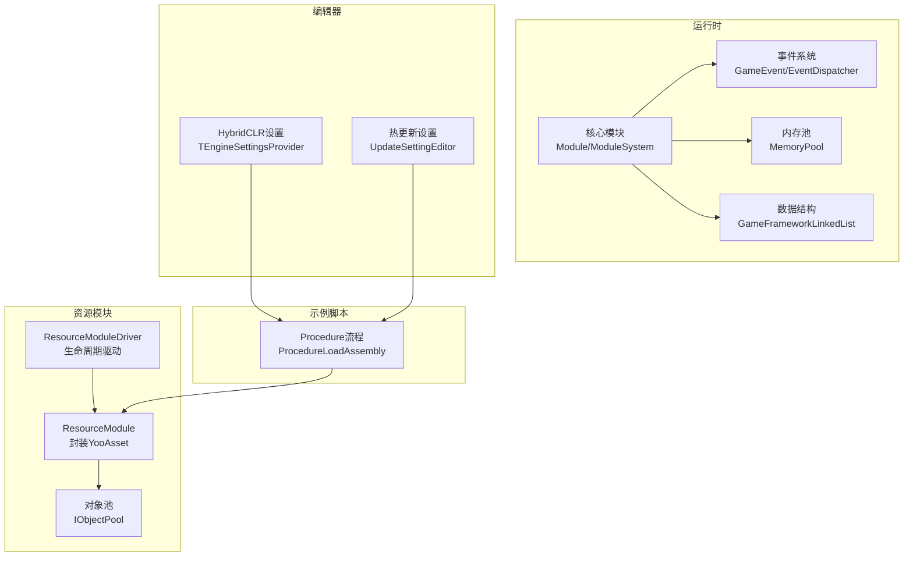
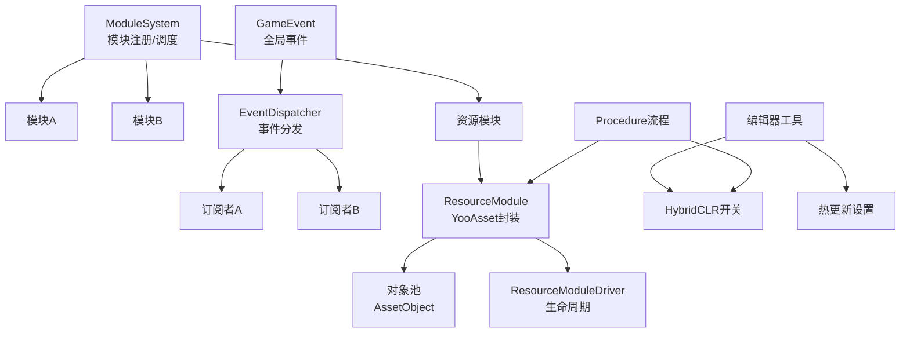
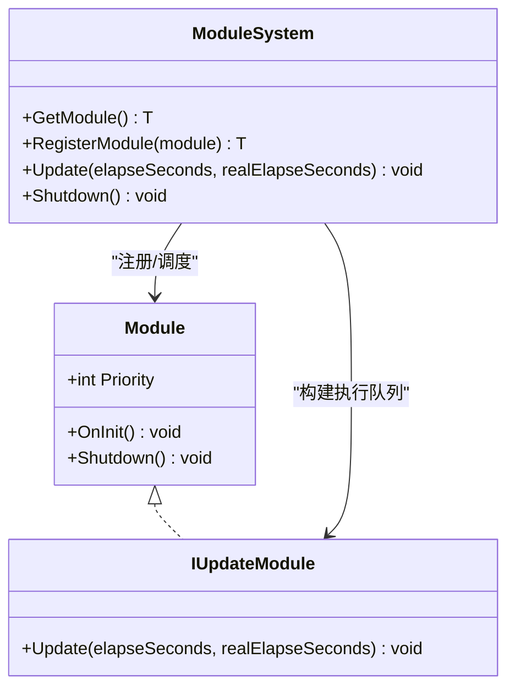
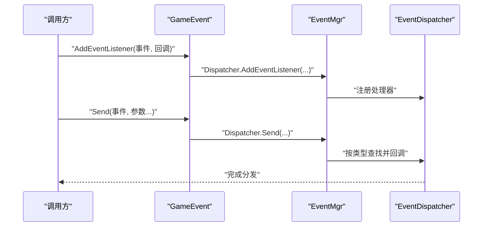
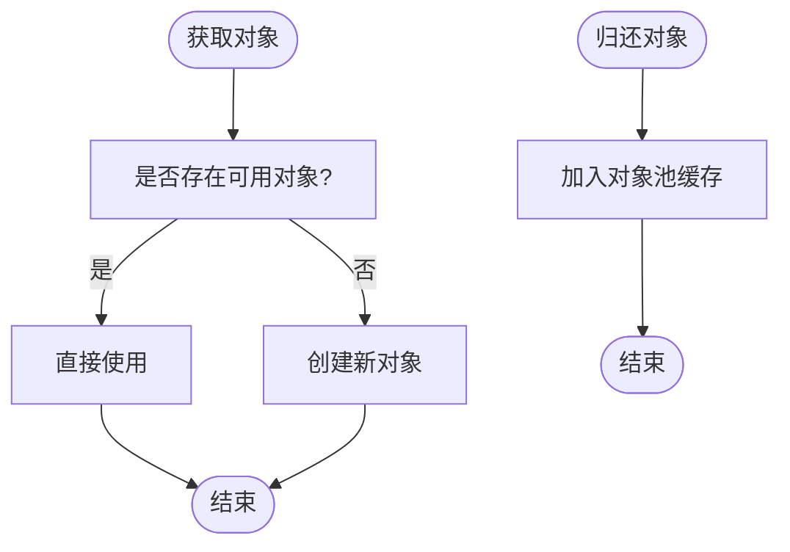
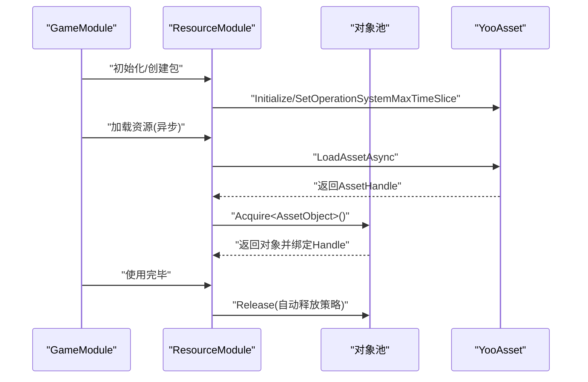
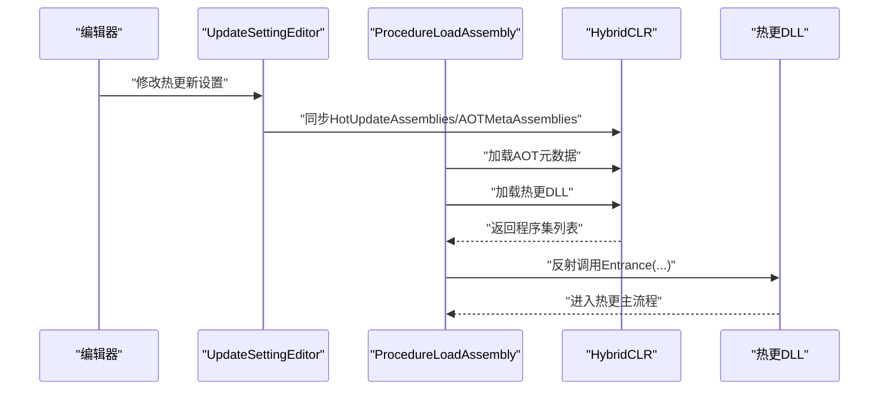
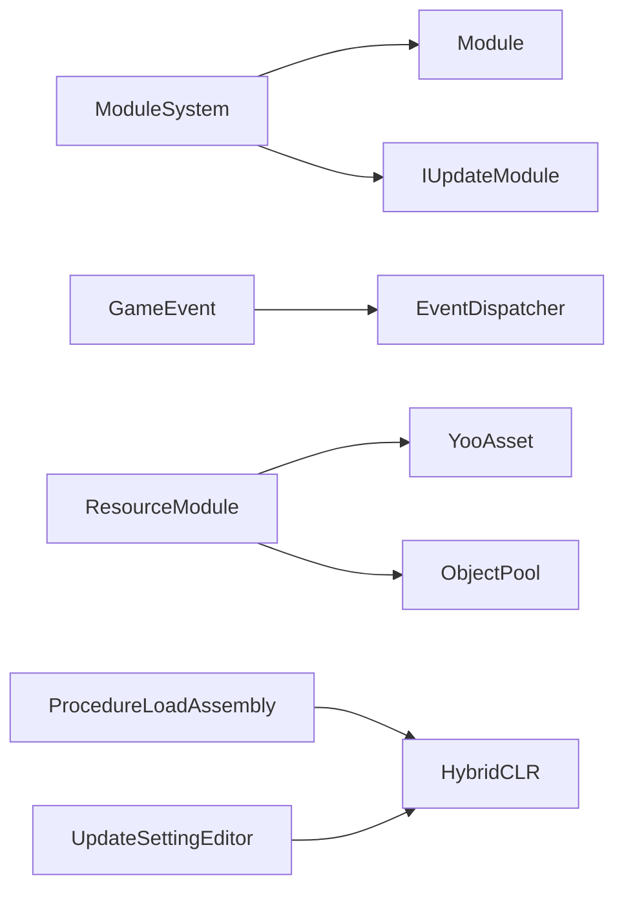

# 核心特性展示

<cite>
**本文引用的文件**
- [Module.cs](file://Assets/TEngine/Runtime/Core/Module.cs)
- [ModuleSystem.cs](file://Assets/TEngine/Runtime/Core/ModuleSystem.cs)
- [MemoryPool.cs](file://Assets/TEngine/Runtime/Core/MemoryPool/MemoryPool.cs)
- [EventDispatcher.cs](file://Assets/TEngine/Runtime/Core/GameEvent/EventDispatcher.cs)
- [GameEvent.cs](file://Assets/TEngine/Runtime/Core/GameEvent/GameEvent.cs)
- [GameFrameworkLinkedList.cs](file://Assets/TEngine/Runtime/Core/DataStruct/GameFrameworkLinkedList.cs)
- [Constant.cs](file://Assets/TEngine/Runtime/Core/Constant/Constant.cs)
- [UpdateSettingEditor.cs](file://Assets/Editor/Utility/UpdateSettingEditor.cs)
- [TEngineSettingsProvider.cs](file://Assets/Editor/TEngineSettingsProvider/TEngineSettingsProvider.cs)
- [ProcedureLoadAssembly.cs](file://Assets/GameScripts/Procedure/ProcedureLoadAssembly.cs)
- [ResourceModule.cs](file://Assets/TEngine/Runtime/Module/ResourceModule/ResourceModule.cs)
- [ResourceModule.Pool.cs](file://Assets/TEngine/Runtime/Module/ResourceModule/ResourceModule.Pool.cs)
- [ResourceModule.AssetObject.cs](file://Assets/TEngine/Runtime/Module/ResourceModule/ResourceModule.AssetObject.cs)
- [ResourceModuleDriver.cs](file://Assets/TEngine/Runtime/Module/ResourceModule/ResourceModuleDriver.cs)
- [systemPatterns.md](file://memory-bank/systemPatterns.md)
</cite>

## 目录
1. [简介](#简介)
2. [项目结构](#项目结构)
3. [核心组件](#核心组件)
4. [架构总览](#架构总览)
5. [详细组件分析](#详细组件分析)
6. [依赖关系分析](#依赖关系分析)
7. [性能考量](#性能考量)
8. [故障排查指南](#故障排查指南)
9. [结论](#结论)
10. [附录](#附录)

## 简介
本文件聚焦TEngine框架的核心特性，围绕以下主题展开：开箱即用的开发体验、商业化的热更新流程（基于HybridCLR）、YooAsset资源管理的自动释放机制、LRU与ARC资源内存管理策略、UI模块商业化开发流程、事件系统的全局管理能力、内存池与对象池的性能优化、配置表模块的懒加载与异步加载支持。通过代码级架构图与流程图，结合实际应用场景与使用价值，帮助开发者快速理解并高效利用框架能力。

## 项目结构
TEngine采用“运行时+编辑器扩展+示例脚本”的分层组织方式：
- 运行时（Runtime）：核心模块、事件系统、内存池、数据结构等
- 编辑器（Editor）：HybridCLR开关、热更新设置、工具面板等
- 示例脚本（GameScripts）：流程控制（Procedure）、热更入口等
- 资源模块（ResourceModule）：封装YooAsset，提供对象池与自动释放策略

图表来源
- [ModuleSystem.cs:9-208](file://Assets/TEngine/Runtime/Core/ModuleSystem.cs#L9-L208)
- [GameEvent.cs:8-601](file://Assets/TEngine/Runtime/Core/GameEvent/GameEvent.cs#L8-L601)
- [MemoryPool.cs:9-208](file://Assets/TEngine/Runtime/Core/MemoryPool/MemoryPool.cs#L9-L208)
- [GameFrameworkLinkedList.cs:12-393](file://Assets/TEngine/Runtime/Core/DataStruct/GameFrameworkLinkedList.cs#L12-L393)
- [ResourceModule.cs:119-405](file://Assets/TEngine/Runtime/Module/ResourceModule/ResourceModule.cs#L119-L405)
- [ResourceModule.Pool.cs:5-46](file://Assets/TEngine/Runtime/Module/ResourceModule/ResourceModule.Pool.cs#L5-L46)
- [ResourceModuleDriver.cs:12-52](file://Assets/TEngine/Runtime/Module/ResourceModule/ResourceModuleDriver.cs#L12-L52)
- [TEngineSettingsProvider.cs:52-92](file://Assets/Editor/TEngineSettingsProvider/TEngineSettingsProvider.cs#L52-L92)
- [UpdateSettingEditor.cs:40-95](file://Assets/Editor/Utility/UpdateSettingEditor.cs#L40-L95)
- [ProcedureLoadAssembly.cs:41-148](file://Assets/GameScripts/Procedure/ProcedureLoadAssembly.cs#L41-L148)

章节来源
- [ModuleSystem.cs:9-208](file://Assets/TEngine/Runtime/Core/ModuleSystem.cs#L9-L208)
- [ResourceModule.cs:119-405](file://Assets/TEngine/Runtime/Module/ResourceModule/ResourceModule.cs#L119-L405)

## 核心组件
- 模块化系统：统一的模块注册、优先级调度与生命周期管理
- 事件系统：全局事件管理与多参数分发
- 内存池：通用对象池与严格校验、统计能力
- 数据结构：链表节点缓存复用，降低GC压力
- 资源模块：YooAsset包装层，对象池+自动释放策略
- 编辑器工具：HybridCLR开关与热更新设置同步

章节来源
- [Module.cs:22-39](file://Assets/TEngine/Runtime/Core/Module.cs#L22-L39)
- [ModuleSystem.cs:9-208](file://Assets/TEngine/Runtime/Core/ModuleSystem.cs#L9-L208)
- [GameEvent.cs:8-601](file://Assets/TEngine/Runtime/Core/GameEvent/GameEvent.cs#L8-L601)
- [EventDispatcher.cs:9-188](file://Assets/TEngine/Runtime/Core/GameEvent/EventDispatcher.cs#L9-L188)
- [MemoryPool.cs:9-208](file://Assets/TEngine/Runtime/Core/MemoryPool/MemoryPool.cs#L9-L208)
- [GameFrameworkLinkedList.cs:12-393](file://Assets/TEngine/Runtime/Core/DataStruct/GameFrameworkLinkedList.cs#L12-L393)
- [ResourceModule.cs:119-405](file://Assets/TEngine/Runtime/Module/ResourceModule/ResourceModule.cs#L119-L405)

## 架构总览
TEngine通过模块系统驱动各子系统协同工作；事件系统提供跨模块解耦通信；资源模块以YooAsset为核心，结合对象池与自动释放策略实现高性能资源管理；编辑器工具负责热更新配置与开关控制；示例流程负责热更DLL加载与入口调用。

图表来源
- [ModuleSystem.cs:29-60](file://Assets/TEngine/Runtime/Core/ModuleSystem.cs#L29-L60)
- [GameEvent.cs:13-18](file://Assets/TEngine/Runtime/Core/GameEvent/GameEvent.cs#L13-L18)
- [EventDispatcher.cs:9-188](file://Assets/TEngine/Runtime/Core/GameEvent/EventDispatcher.cs#L9-L188)
- [ResourceModule.cs:119-405](file://Assets/TEngine/Runtime/Module/ResourceModule/ResourceModule.cs#L119-L405)
- [ResourceModuleDriver.cs:12-52](file://Assets/TEngine/Runtime/Module/ResourceModule/ResourceModuleDriver.cs#L12-L52)
- [TEngineSettingsProvider.cs:52-92](file://Assets/Editor/TEngineSettingsProvider/TEngineSettingsProvider.cs#L52-L92)
- [UpdateSettingEditor.cs:40-95](file://Assets/Editor/Utility/UpdateSettingEditor.cs#L40-L95)
- [ProcedureLoadAssembly.cs:41-148](file://Assets/GameScripts/Procedure/ProcedureLoadAssembly.cs#L41-L148)

## 详细组件分析

### 模块化系统与开箱即用体验
- 模块接口与抽象类定义模块生命周期
- 模块系统按优先级插入链表，统一Update执行队列
- 支持注册自定义模块与自动创建默认实现
- 提供统一Shutdown清理，含内存池与缓存清理

图表来源
- [Module.cs:8-39](file://Assets/TEngine/Runtime/Core/Module.cs#L8-L39)
- [ModuleSystem.cs:68-194](file://Assets/TEngine/Runtime/Core/ModuleSystem.cs#L68-L194)

章节来源
- [Module.cs:22-39](file://Assets/TEngine/Runtime/Core/Module.cs#L22-L39)
- [ModuleSystem.cs:9-208](file://Assets/TEngine/Runtime/Core/ModuleSystem.cs#L9-L208)

### 事件系统：全局管理与多参数分发
- 全局GameEvent门面类，内部持有EventMgr与EventDispatcher
- 支持整型与字符串事件类型，多参数Send/Listener
- 事件表按类型维护回调链，支持清理与严格模式

图表来源
- [GameEvent.cs:28-37](file://Assets/TEngine/Runtime/Core/GameEvent/GameEvent.cs#L28-L37)
- [EventDispatcher.cs:32-184](file://Assets/TEngine/Runtime/Core/GameEvent/EventDispatcher.cs#L32-L184)

章节来源
- [GameEvent.cs:8-601](file://Assets/TEngine/Runtime/Core/GameEvent/GameEvent.cs#L8-L601)
- [EventDispatcher.cs:9-188](file://Assets/TEngine/Runtime/Core/GameEvent/EventDispatcher.cs#L9-L188)

### 内存池与对象池：性能优化基石
- MemoryPool提供Acquire/Release/Add/Remove/RemoveAll等接口
- 支持严格类型校验与全量统计，便于诊断
- 对象池与资源模块结合，实现AssetObject的自动释放与复用

图表来源
- [MemoryPool.cs:71-101](file://Assets/TEngine/Runtime/Core/MemoryPool/MemoryPool.cs#L71-L101)
- [ResourceModule.Pool.cs:5-46](file://Assets/TEngine/Runtime/Module/ResourceModule/ResourceModule.Pool.cs#L5-L46)

章节来源
- [MemoryPool.cs:9-208](file://Assets/TEngine/Runtime/Core/MemoryPool/MemoryPool.cs#L9-L208)
- [ResourceModule.Pool.cs:5-46](file://Assets/TEngine/Runtime/Module/ResourceModule/ResourceModule.Pool.cs#L5-L46)

### 数据结构：链表节点缓存复用
- GameFrameworkLinkedList对LinkedListNode进行缓存复用，减少频繁分配
- Clear/Remove时将节点放回缓存，避免GC抖动

章节来源
- [GameFrameworkLinkedList.cs:12-393](file://Assets/TEngine/Runtime/Core/DataStruct/GameFrameworkLinkedList.cs#L12-L393)

### 资源模块：YooAsset集成与自动释放
- ResourceModule封装YooAsset，提供包管理、下载器、缓存清理等能力
- 通过IObjectPool<AssetObject>实现资源对象池，支持自动释放间隔、容量、过期时间与优先级
- ResourceModuleDriver负责生命周期钩子，如低内存回调与卸载策略

图表来源
- [ResourceModule.cs:119-405](file://Assets/TEngine/Runtime/Module/ResourceModule/ResourceModule.cs#L119-L405)
- [ResourceModule.Pool.cs:5-46](file://Assets/TEngine/Runtime/Module/ResourceModule/ResourceModule.Pool.cs#L5-L46)
- [ResourceModule.AssetObject.cs:11-42](file://Assets/TEngine/Runtime/Module/ResourceModule/ResourceModule.AssetObject.cs#L11-L42)
- [ResourceModuleDriver.cs:12-52](file://Assets/TEngine/Runtime/Module/ResourceModule/ResourceModuleDriver.cs#L12-L52)

章节来源
- [ResourceModule.cs:119-405](file://Assets/TEngine/Runtime/Module/ResourceModule/ResourceModule.cs#L119-L405)
- [ResourceModule.Pool.cs:5-46](file://Assets/TEngine/Runtime/Module/ResourceModule/ResourceModule.Pool.cs#L5-L46)
- [ResourceModule.AssetObject.cs:11-42](file://Assets/TEngine/Runtime/Module/ResourceModule/ResourceModule.AssetObject.cs#L11-L42)
- [ResourceModuleDriver.cs:12-52](file://Assets/TEngine/Runtime/Module/ResourceModule/ResourceModuleDriver.cs#L12-L52)

### 商业化热更新流程：HybridCLR集成
- 编辑器提供HybridCLR开关与热更新设置同步
- 流程控制器在启动阶段加载AOT元数据与热更DLL，最终调用热更入口方法
- 通过UpdateSettingEditor同步HybridCLRSettings中的热更新程序集列表

图表来源
- [TEngineSettingsProvider.cs:52-92](file://Assets/Editor/TEngineSettingsProvider/TEngineSettingsProvider.cs#L52-L92)
- [UpdateSettingEditor.cs:40-95](file://Assets/Editor/Utility/UpdateSettingEditor.cs#L40-L95)
- [ProcedureLoadAssembly.cs:50-148](file://Assets/GameScripts/Procedure/ProcedureLoadAssembly.cs#L50-L148)
- [systemPatterns.md:317-351](file://memory-bank/systemPatterns.md#L317-L351)

章节来源
- [TEngineSettingsProvider.cs:52-92](file://Assets/Editor/TEngineSettingsProvider/TEngineSettingsProvider.cs#L52-L92)
- [UpdateSettingEditor.cs:40-95](file://Assets/Editor/Utility/UpdateSettingEditor.cs#L40-L95)
- [ProcedureLoadAssembly.cs:41-148](file://Assets/GameScripts/Procedure/ProcedureLoadAssembly.cs#L41-L148)
- [systemPatterns.md:317-351](file://memory-bank/systemPatterns.md#L317-L351)

### UI模块商业化开发流程
- UI模块通过模块化注册与事件系统实现解耦
- 常量定义语言与音效设置键名，便于统一管理
- 结合资源模块与对象池，实现UI预制体的高效加载与回收

章节来源
- [Constant.cs:6-20](file://Assets/TEngine/Runtime/Core/Constant/Constant.cs#L6-L20)
- [ModuleSystem.cs:68-194](file://Assets/TEngine/Runtime/Core/ModuleSystem.cs#L68-L194)
- [ResourceModule.Pool.cs:5-46](file://Assets/TEngine/Runtime/Module/ResourceModule/ResourceModule.Pool.cs#L5-L46)

### 配置表模块：懒加载与异步加载
- 资源模块提供异步加载能力，结合对象池与自动释放策略，适合配置表等小资源的懒加载场景
- 通过包管理与下载器，支持离线与在线混合模式

章节来源
- [ResourceModule.cs:352-366](file://Assets/TEngine/Runtime/Module/ResourceModule/ResourceModule.cs#L352-L366)
- [ResourceModule.cs:373-381](file://Assets/TEngine/Runtime/Module/ResourceModule/ResourceModule.cs#L373-L381)

## 依赖关系分析
- 模块系统依赖模块接口与优先级排序，统一调度
- 事件系统依赖全局门面与底层分发器
- 资源模块依赖YooAsset与对象池，提供自动释放策略
- 编辑器工具依赖HybridCLR设置，驱动流程控制器加载热更DLL

图表来源
- [ModuleSystem.cs:9-208](file://Assets/TEngine/Runtime/Core/ModuleSystem.cs#L9-L208)
- [GameEvent.cs:8-601](file://Assets/TEngine/Runtime/Core/GameEvent/GameEvent.cs#L8-L601)
- [ResourceModule.cs:119-405](file://Assets/TEngine/Runtime/Module/ResourceModule/ResourceModule.cs#L119-L405)
- [ProcedureLoadAssembly.cs:41-148](file://Assets/GameScripts/Procedure/ProcedureLoadAssembly.cs#L41-L148)
- [UpdateSettingEditor.cs:40-95](file://Assets/Editor/Utility/UpdateSettingEditor.cs#L40-L95)

章节来源
- [ModuleSystem.cs:9-208](file://Assets/TEngine/Runtime/Core/ModuleSystem.cs#L9-L208)
- [GameEvent.cs:8-601](file://Assets/TEngine/Runtime/Core/GameEvent/GameEvent.cs#L8-L601)
- [ResourceModule.cs:119-405](file://Assets/TEngine/Runtime/Module/ResourceModule/ResourceModule.cs#L119-L405)
- [ProcedureLoadAssembly.cs:41-148](file://Assets/GameScripts/Procedure/ProcedureLoadAssembly.cs#L41-L148)
- [UpdateSettingEditor.cs:40-95](file://Assets/Editor/Utility/UpdateSettingEditor.cs#L40-L95)

## 性能考量
- 模块系统通过延迟构建执行列表与优先级插入，减少每次Update的遍历成本
- 内存池与对象池配合链表节点缓存，显著降低GC频率
- 资源模块的自动释放间隔与过期时间可调，平衡内存占用与加载延迟
- 事件系统按类型索引，避免全量回调遍历

## 故障排查指南
- 模块获取失败：确认接口类型与实现类命名空间一致，避免非接口类型传入
- 热更新DLL缺失：检查ENABLE_HYBRIDCLR定义与LogicMainDll文件存在性
- 资源加载异常：核对包名、版本号与YooAsset初始化状态
- 事件未触发：确认事件类型与回调签名一致，检查事件表是否清理

章节来源
- [ModuleSystem.cs:68-89](file://Assets/TEngine/Runtime/Core/ModuleSystem.cs#L68-L89)
- [ProcedureLoadAssembly.cs:124-148](file://Assets/GameScripts/Procedure/ProcedureLoadAssembly.cs#L124-L148)
- [ResourceModule.cs:119-125](file://Assets/TEngine/Runtime/Module/ResourceModule/ResourceModule.cs#L119-L125)

## 结论
TEngine通过模块化、事件系统、内存池与对象池、YooAsset资源管理以及HybridCLR热更新，形成了完整的商业化开发闭环。这些特性在提升开发效率的同时，兼顾了运行时性能与可维护性，适用于中大型游戏项目的持续迭代与快速交付。

## 附录
- 实际应用场景建议
  - 开箱即用：使用模块系统快速搭建业务模块，统一生命周期与更新节奏
  - 热更新：在编辑器中启用HybridCLR，配置热更新程序集，流程阶段加载DLL并调用热更入口
  - 资源管理：对UI与配置表等小资源使用对象池与自动释放策略，结合异步加载降低卡顿
  - 事件通信：通过全局事件系统实现跨模块解耦，避免紧耦合回调链