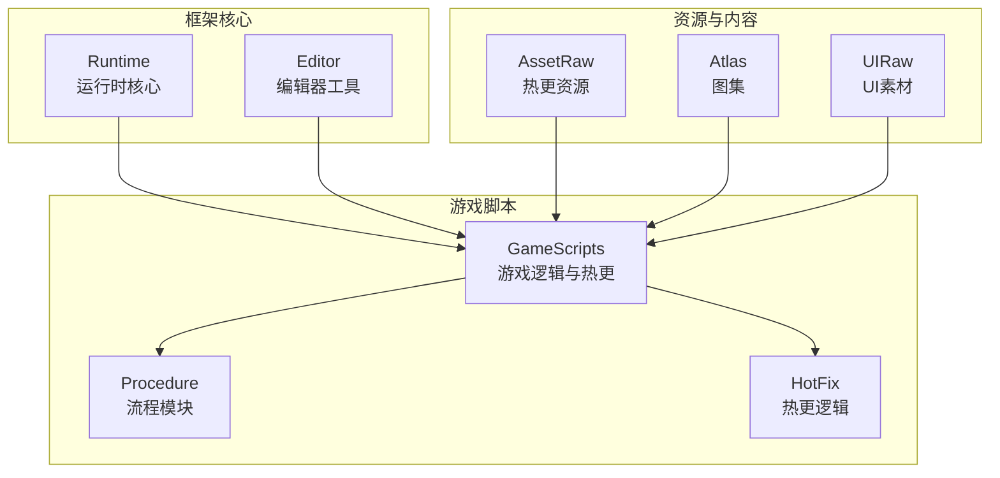
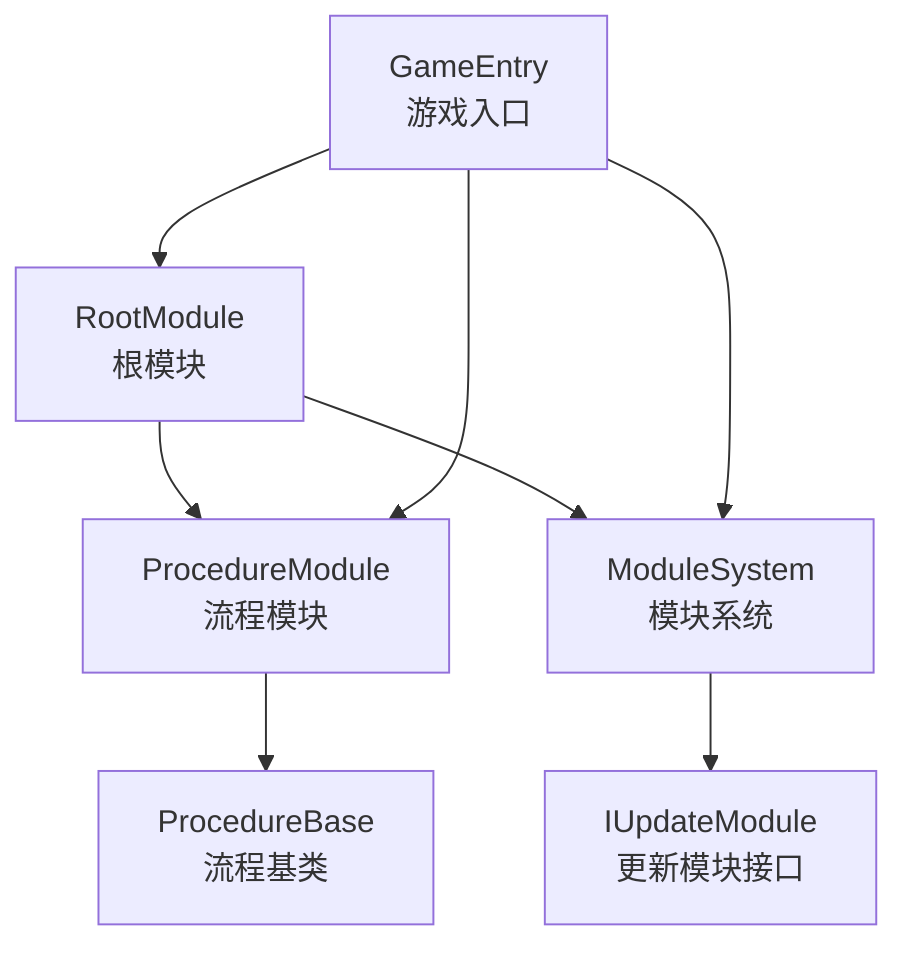
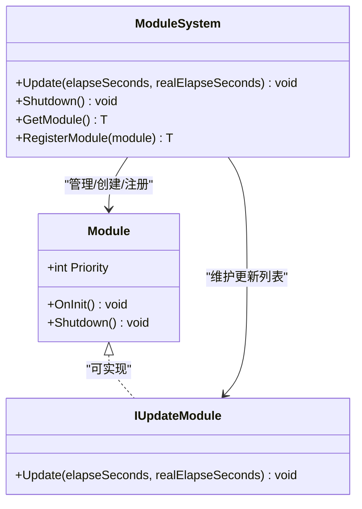
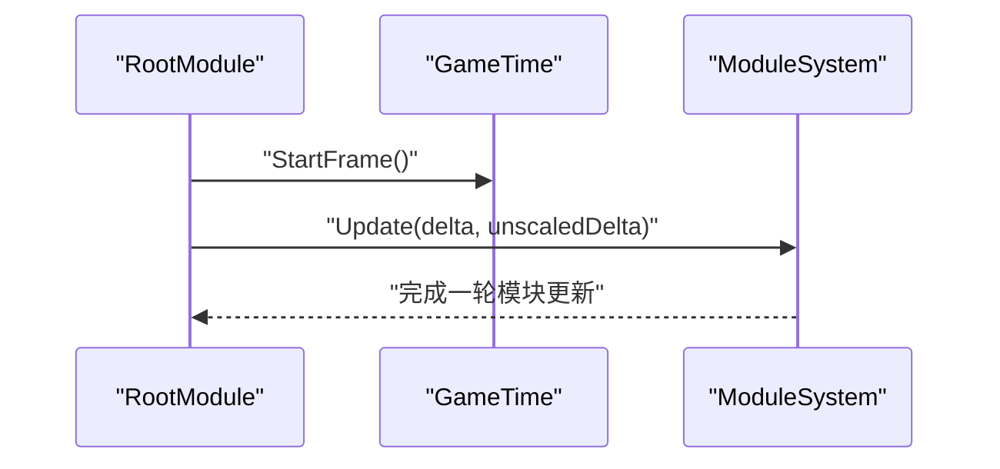
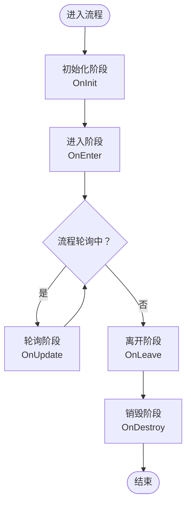
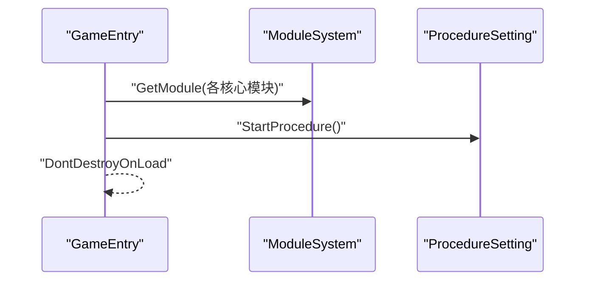
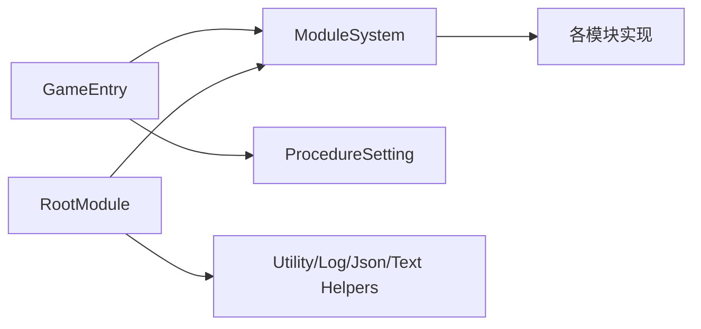

# 框架介绍

<cite>
**本文引用的文件**
- [README.md](file://Assets/TEngine/README.md)
- [package.json](file://Assets/TEngine/package.json)
- [GameEntry.cs](file://Assets/GameScripts/GameEntry.cs)
- [Module.cs](file://Assets/TEngine/Runtime/Core/Module.cs)
- [ModuleSystem.cs](file://Assets/TEngine/Runtime/Core/ModuleSystem.cs)
- [RootModule.cs](file://Assets/TEngine/Runtime/Module/RootModule.cs)
- [ProcedureBase.cs](file://Assets/TEngine/Runtime/Module/ProcedureModule/ProcedureBase.cs)
- [Constant.cs](file://Assets/TEngine/Runtime/Core/Constant/Constant.cs)
</cite>

## 目录
1. [引言](#引言)
2. [项目结构](#项目结构)
3. [核心组件](#核心组件)
4. [架构总览](#架构总览)
5. [详细组件分析](#详细组件分析)
6. [依赖关系分析](#依赖关系分析)
7. [性能考量](#性能考量)
8. [故障排查指南](#故障排查指南)
9. [结论](#结论)
10. [附录](#附录)

## 引言
TEngine 是一个面向商业级 Unity 的全平台解决方案，强调“简单易用、开箱即用、功能强大”。它通过清晰的模块化架构、完善的生命周期管理与可扩展的模块系统，帮助团队在较短时间内完成从资源管理、事件系统、内存与对象池、到流程控制与 UI 的完整开发链路。框架支持多平台发布，已在 Steam、微信小游戏、App Store 等平台落地；同时集成热更新、配置表、资源管理等关键能力，满足中大型项目的工程化需求。

## 项目结构
TEngine 将核心能力分为运行时与编辑器两大部分，配合 GameScripts 中的热更与主流程脚本，形成“框架内核 + 热更逻辑 + 启动流程”的协作模式。下图展示了项目结构与模块职责的高层映射：

图表来源
- [README.md: 61-83:61-83](file://Assets/TEngine/README.md#L61-L83)

章节来源
- [README.md: 61-83:61-83](file://Assets/TEngine/README.md#L61-L83)

## 核心组件
- 模块系统与模块抽象
  - 模块接口与抽象类定义了统一的生命周期与优先级策略，便于按优先级排序与统一调度。
  - 模块系统负责模块的创建、注册、更新列表构建与统一关闭，确保模块间解耦与可替换。
- 根模块与驱动
  - 根模块作为全局驱动，负责初始化日志、文本、JSON 辅助器，设置帧率、后台运行、休眠策略等，并在每帧驱动模块系统更新。
- 流程模块
  - 流程基类基于有限状态机（FSM）实现，提供进入、轮询、离开、销毁等阶段钩子，支撑启动、资源初始化、登录、游戏主场景等流程编排。
- 设置与常量
  - 提供常用设置键位（如语言、音量等）的集中管理，便于跨模块共享与持久化。

章节来源
- [Module.cs: 8-39:8-39](file://Assets/TEngine/Runtime/Core/Module.cs#L8-L39)
- [ModuleSystem.cs: 9-208:9-208](file://Assets/TEngine/Runtime/Core/ModuleSystem.cs#L9-L208)
- [RootModule.cs: 10-304:10-304](file://Assets/TEngine/Runtime/Module/RootModule.cs#L10-L304)
- [ProcedureBase.cs: 8-59:8-59](file://Assets/TEngine/Runtime/Module/ProcedureModule/ProcedureBase.cs#L8-L59)
- [Constant.cs: 6-21:6-21](file://Assets/TEngine/Runtime/Core/Constant/Constant.cs#L6-L21)

## 架构总览
TEngine 的整体运行时架构围绕“根模块驱动 + 模块系统 + 流程模块 + 热更逻辑”展开。根模块在启动时初始化各类辅助器与系统参数，并在每帧推动模块系统执行；模块系统根据模块优先级维护更新列表，统一调度实现了更新接口的模块；流程模块通过 FSM 驱动不同阶段的业务逻辑；热更逻辑在 GameEntry 中被引导，结合资源与配置模块完成启动序列。

图表来源
- [RootModule.cs: 116-167:116-167](file://Assets/TEngine/Runtime/Module/RootModule.cs#L116-L167)
- [ModuleSystem.cs: 29-60:29-60](file://Assets/TEngine/Runtime/Core/ModuleSystem.cs#L29-L60)
- [ProcedureBase.cs: 8-59:8-59](file://Assets/TEngine/Runtime/Module/ProcedureModule/ProcedureBase.cs#L8-L59)
- [GameEntry.cs: 6-14:6-14](file://Assets/GameScripts/GameEntry.cs#L6-L14)

## 详细组件分析

### 模块系统与模块抽象
- 设计要点
  - 模块抽象类提供优先级、初始化与关闭接口，模块系统据此维护两个链表：模块链表与更新模块链表，并在必要时重建执行列表，保证 O(n) 遍历更新。
  - 通过接口类型获取模块，内部通过命名空间与接口名推导具体实现类型，实现松耦合的模块发现与创建。
- 更新机制
  - 每帧调用模块系统的 Update，遍历更新列表，依次调用各模块的 Update，确保逻辑时间与真实时间参数传递给模块。
- 关闭与清理
  - 关闭时逆序关闭模块，清空字典与链表，回收内存池与缓存，保障资源释放与状态重置。

图表来源
- [Module.cs: 8-39:8-39](file://Assets/TEngine/Runtime/Core/Module.cs#L8-L39)
- [ModuleSystem.cs: 9-208:9-208](file://Assets/TEngine/Runtime/Core/ModuleSystem.cs#L9-L208)

章节来源
- [Module.cs: 8-39:8-39](file://Assets/TEngine/Runtime/Core/Module.cs#L8-L39)
- [ModuleSystem.cs: 9-208:9-208](file://Assets/TEngine/Runtime/Core/ModuleSystem.cs#L9-L208)

### 根模块与驱动
- 职责
  - 初始化文本、日志、JSON 辅助器，设置帧率、时间缩放、后台运行与休眠策略。
  - 在每帧开始时推进帧计时，并调用模块系统进行统一更新。
  - 应用低内存回调时，尝试释放对象池与资源模块的闲置资源，降低内存压力。
- 生命周期
  - Awake 初始化与设置；OnDestroy 在非编辑器环境下触发模块系统关闭；OnApplicationQuit 注销事件。

图表来源
- [RootModule.cs: 140-154:140-154](file://Assets/TEngine/Runtime/Module/RootModule.cs#L140-L154)
- [RootModule.cs: 136-138:136-138](file://Assets/TEngine/Runtime/Module/RootModule.cs#L136-L138)
- [ModuleSystem.cs: 29-42:29-42](file://Assets/TEngine/Runtime/Core/ModuleSystem.cs#L29-L42)

章节来源
- [RootModule.cs: 10-304:10-304](file://Assets/TEngine/Runtime/Module/RootModule.cs#L10-L304)

### 流程模块与流程基类
- 设计要点
  - 流程基类继承自 FSM 状态，提供 OnInit、OnEnter、OnUpdate、OnLeave、OnDestroy 等阶段钩子，便于在不同阶段执行初始化、轮询与清理。
  - 结合流程模块与状态机，可实现启动、资源初始化、登录、游戏主场景等复杂流程的编排与切换。
- 使用建议
  - 在 GameEntry 中启动首个流程，随后在流程之间通过状态转移推进业务。

图表来源
- [ProcedureBase.cs: 14-56:14-56](file://Assets/TEngine/Runtime/Module/ProcedureModule/ProcedureBase.cs#L14-L56)

章节来源
- [ProcedureBase.cs: 8-59:8-59](file://Assets/TEngine/Runtime/Module/ProcedureModule/ProcedureBase.cs#L8-L59)

### 游戏入口与启动序列
- GameEntry 作为启动入口，负责：
  - 获取并初始化多个核心模块（更新驱动、资源、调试、FSM 等）。
  - 启动流程设置中的起始流程，确保后续流程按顺序推进。
  - 保持自身在场景切换时不被销毁，维持全局驱动。

图表来源
- [GameEntry.cs: 6-14:6-14](file://Assets/GameScripts/GameEntry.cs#L6-L14)

章节来源
- [GameEntry.cs: 4-15:4-15](file://Assets/GameScripts/GameEntry.cs#L4-L15)

## 依赖关系分析
- 组件内聚与解耦
  - 模块系统通过接口类型管理模块，避免模块间的直接耦合；模块优先级决定初始化与关闭顺序，提升可控性。
  - 根模块仅承担驱动与系统参数设置，不直接处理业务逻辑，符合单一职责原则。
- 外部依赖与集成点
  - 框架文档指出集成了热更新、配置表与资源管理等能力，这些能力在模块系统之上提供服务，由模块统一接入与调度。
- 可能的循环依赖
  - 模块系统通过延迟构建更新列表与接口类型解析，避免在创建阶段产生循环依赖；流程模块与模块系统通过接口交互，不直接依赖具体实现。

图表来源
- [GameEntry.cs: 6-14:6-14](file://Assets/GameScripts/GameEntry.cs#L6-L14)
- [ModuleSystem.cs: 68-89:68-89](file://Assets/TEngine/Runtime/Core/ModuleSystem.cs#L68-L89)
- [RootModule.cs: 214-285:214-285](file://Assets/TEngine/Runtime/Module/RootModule.cs#L214-L285)

章节来源
- [ModuleSystem.cs: 68-89:68-89](file://Assets/TEngine/Runtime/Core/ModuleSystem.cs#L68-L89)
- [RootModule.cs: 214-285:214-285](file://Assets/TEngine/Runtime/Module/RootModule.cs#L214-L285)

## 性能考量
- 模块更新路径优化
  - 模块系统在需要时才重建更新列表，避免每次帧都进行昂贵的排序与复制；通过固定容量的列表减少 GC 抖动。
- 时间参数分离
  - 逻辑时间与真实时间分离，便于模块在不同时间尺度下进行精确计算，兼顾性能与一致性。
- 内存与资源管理
  - 根模块在低内存事件中主动释放对象池与资源模块的闲置资源，有助于在内存紧张时快速回收。
- 帧率与后台运行
  - 通过目标帧率、时间缩放、后台运行与休眠策略的统一设置，平衡性能与体验。

章节来源
- [ModuleSystem.cs: 29-42:29-42](file://Assets/TEngine/Runtime/Core/ModuleSystem.cs#L29-L42)
- [RootModule.cs: 131-134:131-134](file://Assets/TEngine/Runtime/Module/RootModule.cs#L131-L134)
- [RootModule.cs: 287-302:287-302](file://Assets/TEngine/Runtime/Module/RootModule.cs#L287-L302)

## 故障排查指南
- 模块获取失败
  - 症状：通过接口获取模块时报错，提示无法找到模块类型。
  - 排查：确认模块实现类的命名空间与接口名匹配，且模块类型可被反射解析；检查模块是否正确注册或实现接口。
- 模块未更新
  - 症状：模块 OnInit 已执行，但 Update 未被调用。
  - 排查：确认模块实现 IUpdateModule 接口；检查模块优先级是否影响插入位置；确认模块系统 Update 是否被调用。
- 启动流程未生效
  - 症状：GameEntry 启动后流程未推进。
  - 排查：确认流程设置中的起始流程已正确配置；检查流程基类的进入/轮询逻辑是否按预期执行。
- 低内存问题
  - 症状：设备内存告警导致卡顿或崩溃。
  - 排查：确认对象池与资源模块的低内存回调是否被触发；评估资源引用与释放策略。

章节来源
- [ModuleSystem.cs: 71-89:71-89](file://Assets/TEngine/Runtime/Core/ModuleSystem.cs#L71-L89)
- [ModuleSystem.cs: 165-191:165-191](file://Assets/TEngine/Runtime/Core/ModuleSystem.cs#L165-L191)
- [GameEntry.cs: 12-12:12-12](file://Assets/GameScripts/GameEntry.cs#L12-L12)
- [RootModule.cs: 287-302:287-302](file://Assets/TEngine/Runtime/Module/RootModule.cs#L287-L302)

## 结论
TEngine 以模块化为核心，结合流程模块与根模块驱动，提供了“简单易用、开箱即用、功能强大”的商业级 Unity 解决方案。其清晰的职责划分、可扩展的模块系统、完善的生命周期管理与多平台支持，使其适用于需要一套完整开发流程的团队与项目。通过热更新、配置表与资源管理等能力的集成，TEngine 能够在保证高性能与可扩展性的同时，显著缩短开发周期并降低维护成本。

## 附录
- 包信息与版本
  - 包名称与版本、Unity 版本要求、关键词与仓库链接等信息可在包描述文件中查看。
- 快速上手与文档
  - 框架 README 提供了文档索引与 Demo 分支链接，便于快速了解与试用。

章节来源
- [package.json: 1-28:1-28](file://Assets/TEngine/package.json#L1-L28)
- [README.md: 33-50:33-50](file://Assets/TEngine/README.md#L33-L50)