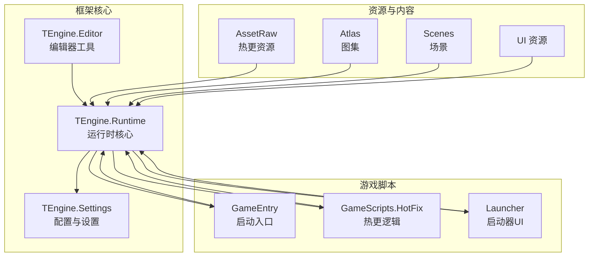
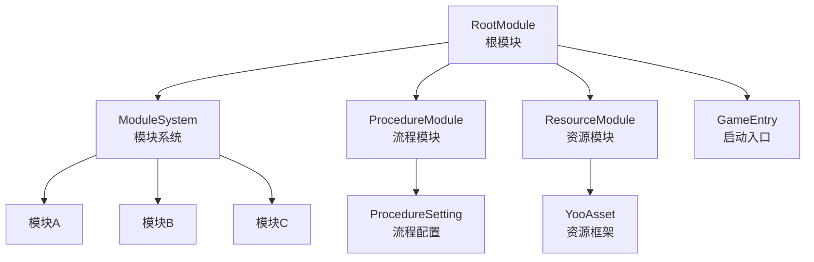
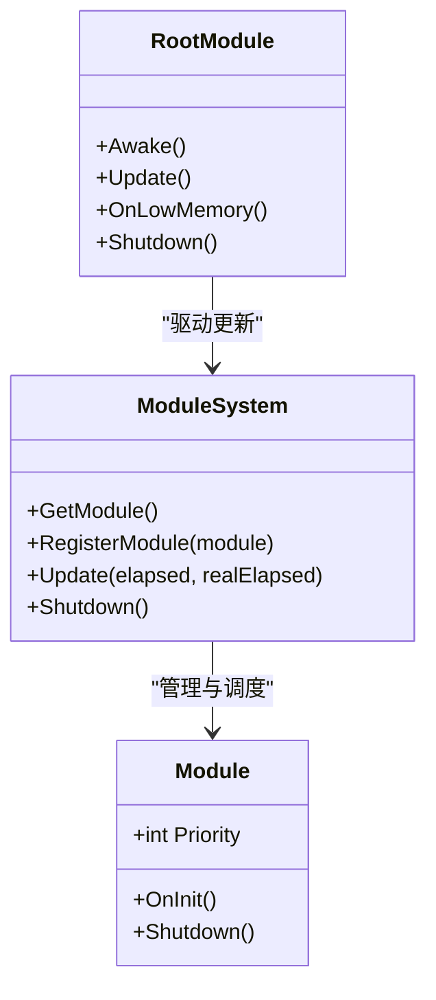
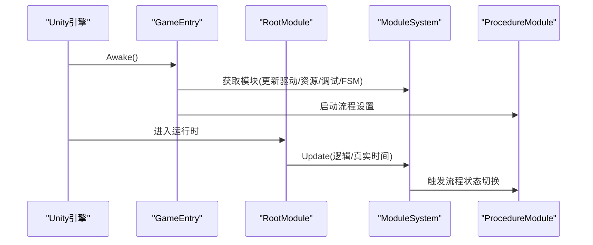
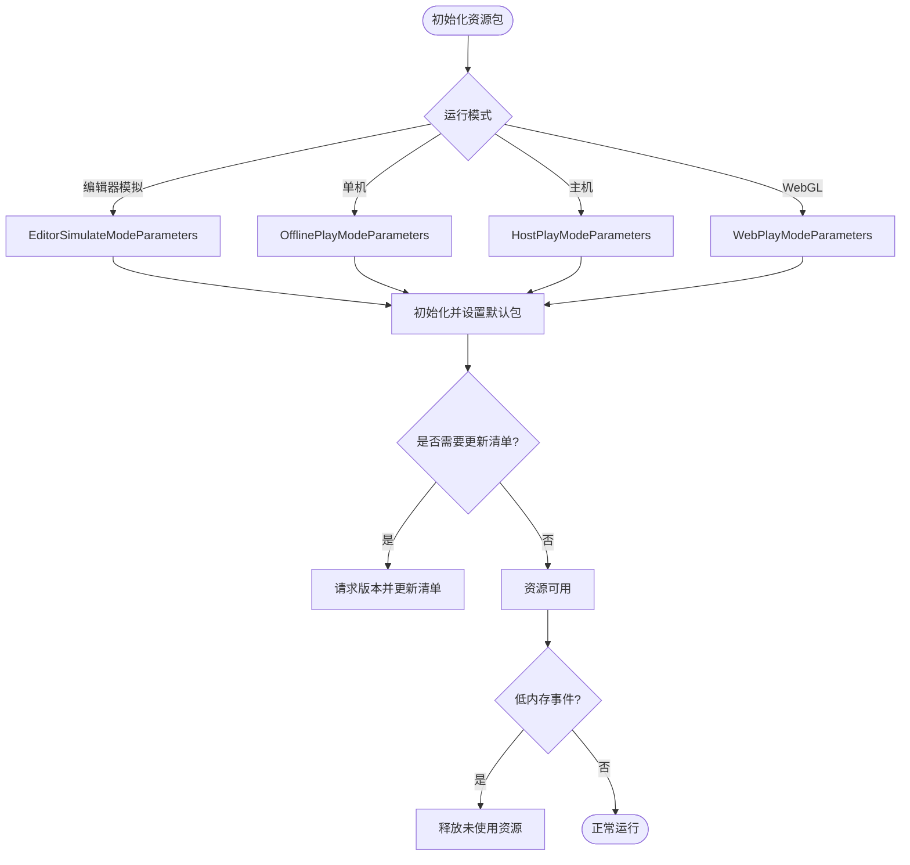
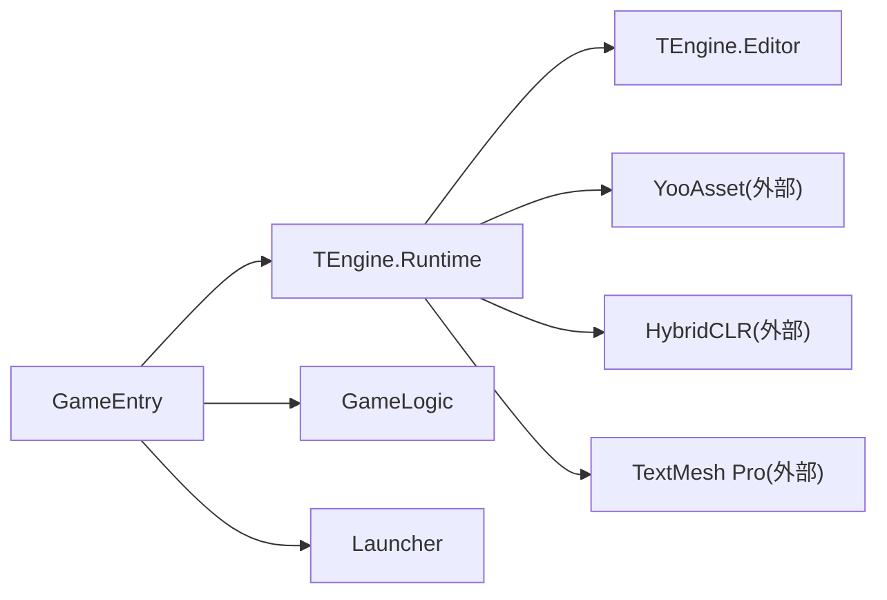

# 项目概述

<cite>
**本文引用的文件**
- [README.md](file://Assets/TEngine/README.md)
- [package.json](file://Assets/TEngine/package.json)
- [GameEntry.cs](file://Assets/GameScripts/GameEntry.cs)
- [ModuleSystem.cs](file://Assets/TEngine/Runtime/Core/ModuleSystem.cs)
- [Module.cs](file://Assets/TEngine/Runtime/Core/Module.cs)
- [RootModule.cs](file://Assets/TEngine/Runtime/Module/RootModule.cs)
- [ResourceModule.cs](file://Assets/TEngine/Runtime/Module/ResourceModule/ResourceModule.cs)
- [ProcedureBase.cs](file://Assets/TEngine/Runtime/Module/ProcedureModule/ProcedureBase.cs)
- [ProcedureSetting.asset](file://Assets/TEngine/Settings/ProcedureSetting.asset)
- [TEngine.Runtime.asmdef](file://Assets/TEngine/Runtime/TEngine.Runtime.asmdef)
- [TEngine.Editor.asmdef](file://Assets/TEngine/Editor/TEngine.Editor.asmdef)
- [GameLogic.asmdef](file://Assets/GameScripts/HotFix/GameLogic/GameLogic.asmdef)
- [Launcher.asmdef](file://Assets/Launcher/Launcher.asmdef)
</cite>

## 目录
1. [引言](#引言)
2. [项目结构](#项目结构)
3. [核心组件](#核心组件)
4. [架构总览](#架构总览)
5. [详细组件分析](#详细组件分析)
6. [依赖分析](#依赖分析)
7. [性能考虑](#性能考虑)
8. [故障排查指南](#故障排查指南)
9. [结论](#结论)
10. [附录](#附录)

## 引言
TEngine 是一个面向商业级 Unity 的全平台解决方案，强调“开箱即用、文档清晰、高性能、可扩展”。它基于 Unity 2021.3.30f1，集成 HybridCLR 实现热更新、YooAsset 提供资源管理与自动释放、Luben（Luban）支持配置表的懒加载与异步加载，覆盖从启动流程、资源管理到 UI、事件、内存池、对象池等模块化能力。项目已在多平台（如 Steam、微信小游戏、App Store）落地验证，适合追求快速上手与稳定扩展的团队。

## 项目结构
TEngine 将运行时与编辑器代码分离，采用程序集定义（asmdef）划分模块边界，配合 GameScripts 中的热更程序集组织业务逻辑，形成“框架核心 + 热更逻辑 + 启动流程”的清晰分层。

图表来源
- [GameEntry.cs:1-15](file://Assets/GameScripts/GameEntry.cs#L1-L15)
- [TEngine.Runtime.asmdef:1-29](file://Assets/TEngine/Runtime/TEngine.Runtime.asmdef#L1-L29)
- [TEngine.Editor.asmdef:1-25](file://Assets/TEngine/Editor/TEngine.Editor.asmdef#L1-L25)
- [GameLogic.asmdef:1-31](file://Assets/GameScripts/HotFix/GameLogic/GameLogic.asmdef#L1-L31)
- [Launcher.asmdef:1-17](file://Assets/Launcher/Launcher.asmdef#L1-L17)

章节来源
- [README.md:61-83](file://Assets/TEngine/README.md#L61-L83)
- [package.json:11](file://Assets/TEngine/package.json#L11)

## 核心组件
- 模块系统与根模块
  - 模块系统负责模块生命周期、优先级排序与统一更新调度；根模块负责初始化日志、文本、JSON 辅助器，以及驱动模块系统更新。
- 启动入口
  - GameEntry 在 Awake 阶段获取若干核心模块并启动流程设置，随后常驻对象进入游戏循环。
- 流程模块
  - 通过 ProcedureModule 与 ProcedureSetting 配置启动流程序列，覆盖清缓存、下载器创建、资源初始化、装配加载、预加载、闪屏、启动游戏等阶段。
- 资源模块
  - 基于 YooAsset 的资源包管理、多运行模式（单机、联机、WebGL、编辑器模拟）、清单更新、边玩边下、自动释放与低内存回收策略。

章节来源
- [ModuleSystem.cs:1-208](file://Assets/TEngine/Runtime/Core/ModuleSystem.cs#L1-L208)
- [Module.cs:1-40](file://Assets/TEngine/Runtime/Core/Module.cs#L1-L40)
- [RootModule.cs:1-304](file://Assets/TEngine/Runtime/Module/RootModule.cs#L1-L304)
- [GameEntry.cs:1-15](file://Assets/GameScripts/GameEntry.cs#L1-L15)
- [ProcedureBase.cs:1-59](file://Assets/TEngine/Runtime/Module/ProcedureModule/ProcedureBase.cs#L1-L59)
- [ProcedureSetting.asset:15-27](file://Assets/TEngine/Settings/ProcedureSetting.asset#L15-L27)
- [ResourceModule.cs:1-1252](file://Assets/TEngine/Runtime/Module/ResourceModule/ResourceModule.cs#L1-L1252)

## 架构总览
TEngine 采用“根模块驱动 + 模块系统 + 流程模块 + 资源模块”的分层架构。根模块在 Unity 生命周期中初始化辅助器与系统参数，并在 Update 中统一调度模块系统；模块系统按优先级维护模块链表与更新列表，确保高效执行；流程模块以状态机形式串联启动流程；资源模块封装 YooAsset，提供跨平台、多模式的资源加载与管理能力。

图表来源
- [RootModule.cs:116-144](file://Assets/TEngine/Runtime/Module/RootModule.cs#L116-L144)
- [ModuleSystem.cs:29-60](file://Assets/TEngine/Runtime/Core/ModuleSystem.cs#L29-L60)
- [ProcedureSetting.asset:15-27](file://Assets/TEngine/Settings/ProcedureSetting.asset#L15-L27)
- [ResourceModule.cs:119-138](file://Assets/TEngine/Runtime/Module/ResourceModule/ResourceModule.cs#L119-L138)
- [GameEntry.cs:6-12](file://Assets/GameScripts/GameEntry.cs#L6-L12)

## 详细组件分析

### 模块系统与根模块
- 模块系统
  - 维护模块字典、更新链表与执行列表，支持动态创建模块、按优先级插入、延迟重建执行列表，保证高效更新与低 GC。
- 根模块
  - 初始化文本、日志、JSON 辅助器，设置帧率、时间缩放、后台运行与休眠策略；在低内存事件中联动对象池与资源模块回收。

图表来源
- [Module.cs:18-39](file://Assets/TEngine/Runtime/Core/Module.cs#L18-L39)
- [ModuleSystem.cs:68-120](file://Assets/TEngine/Runtime/Core/ModuleSystem.cs#L68-L120)
- [RootModule.cs:116-167](file://Assets/TEngine/Runtime/Module/RootModule.cs#L116-L167)

章节来源
- [ModuleSystem.cs:1-208](file://Assets/TEngine/Runtime/Core/ModuleSystem.cs#L1-L208)
- [Module.cs:1-40](file://Assets/TEngine/Runtime/Core/Module.cs#L1-L40)
- [RootModule.cs:1-304](file://Assets/TEngine/Runtime/Module/RootModule.cs#L1-L304)

### 启动流程与流程模块
- 启动入口
  - GameEntry 在 Awake 中获取更新驱动、资源模块、调试模块、FSM 模块，并启动流程设置。
- 流程配置
  - ProcedureSetting 定义可用流程类型与入口流程，贯穿清缓存、下载器、资源初始化、装配加载、预加载、闪屏、启动游戏等阶段。

图表来源
- [GameEntry.cs:6-12](file://Assets/GameScripts/GameEntry.cs#L6-L12)
- [RootModule.cs:140-144](file://Assets/TEngine/Runtime/Module/RootModule.cs#L140-L144)
- [ModuleSystem.cs:29-42](file://Assets/TEngine/Runtime/Core/ModuleSystem.cs#L29-L42)
- [ProcedureSetting.asset:15-27](file://Assets/TEngine/Settings/ProcedureSetting.asset#L15-L27)

章节来源
- [GameEntry.cs:1-15](file://Assets/GameScripts/GameEntry.cs#L1-L15)
- [ProcedureBase.cs:1-59](file://Assets/TEngine/Runtime/Module/ProcedureModule/ProcedureBase.cs#L1-L59)
- [ProcedureSetting.asset:15-27](file://Assets/TEngine/Settings/ProcedureSetting.asset#L15-L27)

### 资源模块与热更新
- 资源系统
  - 支持编辑器模拟、单机、主机、WebGL 多运行模式；提供清单版本请求与更新、下载器创建、缓存清理、低内存回收、强制卸载等能力。
- 热更新
  - 结合 HybridCLR 与 YooAsset，实现资源与逻辑的热更新、边玩边下与跨平台部署。

图表来源
- [ResourceModule.cs:119-261](file://Assets/TEngine/Runtime/Module/ResourceModule/ResourceModule.cs#L119-L261)
- [ResourceModule.cs:390-447](file://Assets/TEngine/Runtime/Module/ResourceModule/ResourceModule.cs#L390-L447)

章节来源
- [ResourceModule.cs:1-1252](file://Assets/TEngine/Runtime/Module/ResourceModule/ResourceModule.cs#L1-L1252)

### 技术栈概览
- Unity 版本：2021.3.30f1
- 热更新：HybridCLR（零成本、高性能）
- 资源管理：YooAsset（百万 DAU 验证）
- 配置表：Luben（Luban）支持懒加载、异步加载、同步加载
- UI 字体：TextMesh Pro
- 其他：UniTask（Cysharp）用于异步任务

章节来源
- [package.json:11](file://Assets/TEngine/package.json#L11)
- [README.md:46-50](file://Assets/TEngine/README.md#L46-L50)

## 依赖分析
TEngine 通过 asmdef 明确模块边界与依赖关系，运行时与编辑器分别声明各自引用的程序集与版本宏，热更逻辑与启动器独立成集，降低耦合与编译成本。

图表来源
- [TEngine.Runtime.asmdef:4-12](file://Assets/TEngine/Runtime/TEngine.Runtime.asmdef#L4-L12)
- [TEngine.Editor.asmdef:4-12](file://Assets/TEngine/Editor/TEngine.Editor.asmdef#L4-L12)
- [GameLogic.asmdef:4-14](file://Assets/GameScripts/HotFix/GameLogic/GameLogic.asmdef#L4-L14)
- [Launcher.asmdef:4-6](file://Assets/Launcher/Launcher.asmdef#L4-L6)

章节来源
- [TEngine.Runtime.asmdef:1-29](file://Assets/TEngine/Runtime/TEngine.Runtime.asmdef#L1-L29)
- [TEngine.Editor.asmdef:1-25](file://Assets/TEngine/Editor/TEngine.Editor.asmdef#L1-L25)
- [GameLogic.asmdef:1-31](file://Assets/GameScripts/HotFix/GameLogic/GameLogic.asmdef#L1-L31)
- [Launcher.asmdef:1-17](file://Assets/Launcher/Launcher.asmdef#L1-L17)

## 性能考虑
- 模块系统
  - 通过优先级链表与延迟重建执行列表，避免频繁分配与遍历，提升更新效率。
- 资源管理
  - YooAsset 提供多运行模式与自动释放，结合低内存回调与缓存清理，降低内存峰值与碎片。
- 异步与时间片
  - UniTask 与可配置的时间片切片，平衡主线程负载与加载流畅度。
- 平台适配
  - WebGL 与微信小游戏等特殊路径的参数与行为优化，保障多端一致体验。

## 故障排查指南
- 启动流程异常
  - 检查 ProcedureSetting 中入口流程与可用流程类型是否正确配置。
- 资源加载失败
  - 确认运行模式与资源包初始化参数；检查清单版本请求与更新流程；关注低内存事件触发后的回收策略。
- 热更新问题
  - 核对 HybridCLR 配置与 DLL 构建流程；确认资源包命名与默认包设置一致。

章节来源
- [ProcedureSetting.asset:15-27](file://Assets/TEngine/Settings/ProcedureSetting.asset#L15-L27)
- [ResourceModule.cs:119-261](file://Assets/TEngine/Runtime/Module/ResourceModule/ResourceModule.cs#L119-L261)
- [RootModule.cs:287-302](file://Assets/TEngine/Runtime/Module/RootModule.cs#L287-L302)

## 结论
TEngine 以模块化、可扩展为核心设计理念，结合 HybridCLR 与 YooAsset，提供从启动流程、资源管理到热更新的完整商业级能力。其清晰的项目结构、完善的模块系统与跨平台适配，使其成为中小型团队快速构建高质量 Unity 产品的优选方案。

## 附录
- 适用场景
  - 移动端、WebGL、小程序等多平台游戏；需要热更新与资源热更的长线运营项目。
- 目标用户
  - 追求快速上手与稳定扩展的独立开发者与中小团队。