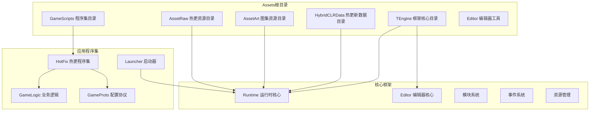
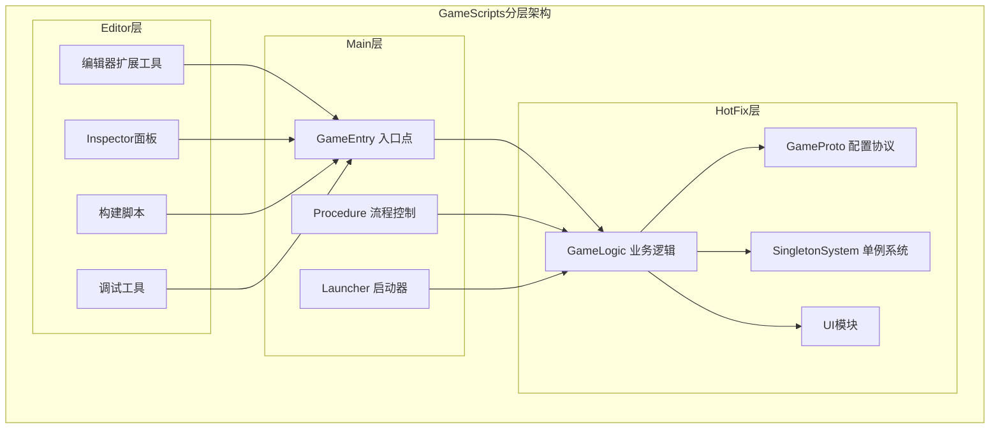
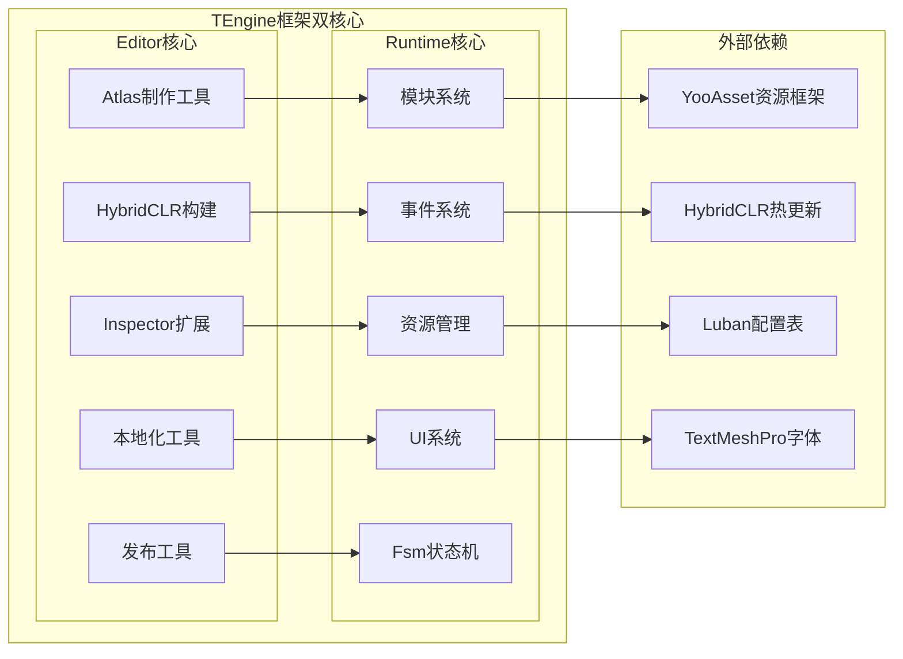
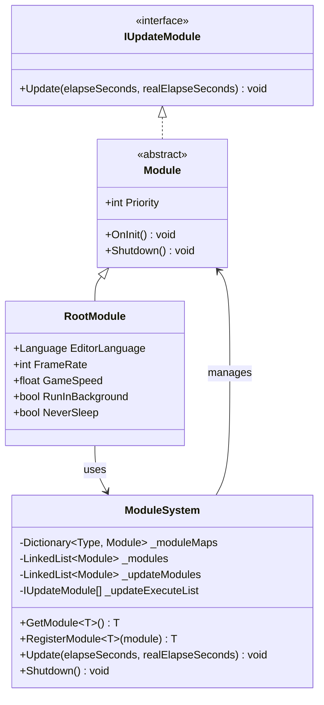
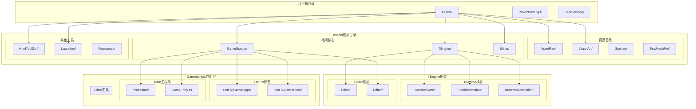

# 项目结构概览

<cite>
**本文档引用的文件**
- [README.md](file://Assets/TEngine/README.md)
- [GameEntry.cs](file://Assets/GameScripts/GameEntry.cs)
- [Module.cs](file://Assets/TEngine/Runtime/Core/Module.cs)
- [ModuleSystem.cs](file://Assets/TEngine/Runtime/Core/ModuleSystem.cs)
- [RootModule.cs](file://Assets/TEngine/Runtime/Module/RootModule.cs)
- [ProcedureBase.cs](file://Assets/TEngine/Runtime/Module/ProcedureModule/ProcedureBase.cs)
- [ProcedureLaunch.cs](file://Assets/GameScripts/Procedure/ProcedureLaunch.cs)
- [GameApp.cs](file://Assets/GameScripts/HotFix/GameLogic/GameApp.cs)
- [TEngine.Editor.asmdef](file://Assets/TEngine/Editor/TEngine.Editor.asmdef)
- [TEngine.Runtime.asmdef](file://Assets/TEngine/Runtime/TEngine.Runtime.asmdef)
- [GameLogic.asmdef](file://Assets/GameScripts/HotFix/GameLogic/GameLogic.asmdef)
- [GameProto.asmdef](file://Assets/GameScripts/HotFix/GameProto/GameProto.asmdef)
- [ProcedureSetting.asset](file://Assets/TEngine/Settings/ProcedureSetting.asset)
</cite>

## 目录
1. [简介](#简介)
2. [项目结构总览](#项目结构总览)
3. [核心目录详解](#核心目录详解)
4. [GameScripts分层架构](#gamescripts分层架构)
5. [TEngine框架架构](#teengine框架架构)
6. [模块系统与依赖关系](#模块系统与依赖关系)
7. [项目结构图](#项目结构图)
8. [总结](#总结)

## 简介

TEngine是一个基于Unity的全平台游戏框架解决方案，专为需要上手快、文档清晰、高性能且可扩展性强的商业级项目而设计。该框架采用模块化架构，结合HybridCLR热更新技术、YooAsset资源管理框架和Luban配置表系统，提供了完整的移动端游戏开发基础设施。

## 项目结构总览

基于仓库的实际结构，TEngine项目的整体组织遵循"Assets根目录 + 核心框架 + 应用程序集"的三层架构模式：

**图表来源**
- [README.md:61-83](file://Assets/TEngine/README.md#L61-L83)

**章节来源**
- [README.md:61-83](file://Assets/TEngine/README.md#L61-L83)

## 核心目录详解

### AssetRaw 热更资源目录
AssetRaw作为热更新资源的核心存储位置，包含了游戏中所有可热更新的资源文件。该目录下包含Actor、Audios、Configs、DLL、Effects、Fonts、Materials、Scenes、Shaders、UI、UIRaw等多个子目录，每个子目录负责不同类型的资源管理。

### AssetArt 图集资源目录
AssetArt专门用于存放自动生成的图集资源，其中的Atlas目录包含多个spriteatlasv2文件，这些图集经过优化处理，用于提升游戏运行时的渲染性能。

### HybridCLRData 热更新数据目录
该目录存储HybridCLR热更新相关的数据文件，为C#代码的热更新机制提供必要的支持。

### TEngine框架核心目录
TEngine目录是整个框架的核心所在，分为Editor和Runtime两个主要部分：
- **Editor**: 包含编辑器扩展工具、Inspector面板、构建工具等开发期辅助功能
- **Runtime**: 包含运行时的核心模块，如模块系统、事件系统、资源管理、UI系统等

### GameScripts程序集目录
GameScripts是应用层的主要程序集，采用分层架构设计，确保代码的高内聚低耦合。

**章节来源**
- [README.md:64-82](file://Assets/TEngine/README.md#L64-L82)

## GameScripts分层架构

GameScripts目录采用了清晰的分层架构，每层都有明确的职责划分：

**图表来源**
- [README.md:69-77](file://Assets/TEngine/README.md#L69-L77)

### Editor编辑器程序集
Editor层专注于开发期的辅助工具，包括：
- 自定义Inspector面板
- 资源引用查找工具
- 构建流程自动化
- 调试和诊断工具

### Main主程序程序集
Main层是应用的启动和控制中心：
- **GameEntry**: 应用程序的入口点，负责初始化核心模块
- **Procedure**: 实现状态机驱动的流程控制系统
- **Launcher**: 提供启动器功能，管理应用启动流程

### HotFix热更程序集
HotFix层是游戏的核心业务逻辑，采用模块化设计：
- **GameLogic**: 包含业务逻辑、UI模块、单例系统等
- **GameProto**: 存放配置表协议和数据结构
- **GameBase**: 游戏基础框架组件
- **BattleCore**: 核心战斗系统

**章节来源**
- [README.md:69-77](file://Assets/TEngine/README.md#L69-L77)

## TEngine框架架构

TEngine框架采用双核心架构设计，分别服务于编辑器开发期和运行时生产期：

**图表来源**
- [README.md:80-82](file://Assets/TEngine/README.md#L80-L82)

### Editor编辑器核心代码
Editor层提供了丰富的开发期工具：
- **AtlasMakerEditor**: 自动图集生成和管理
- **HybridCLR**: 热更新构建和调试支持
- **Inspector**: 自定义Inspector面板扩展
- **Localization**: 多语言本地化工具
- **ReleaseTools**: 发布和打包工具

### Runtime运行时核心代码
Runtime层是框架的核心执行引擎：
- **ModuleSystem**: 模块化系统，支持动态模块加载和管理
- **EventSystem**: 事件驱动架构，支持松耦合通信
- **ResourceManager**: 资源生命周期管理
- **UIFramework**: 商业化UI系统
- **FsmModule**: 状态机模块，支持复杂流程控制

**章节来源**
- [README.md:80-82](file://Assets/TEngine/README.md#L80-L82)

## 模块系统与依赖关系

TEngine的模块系统是整个框架的核心，它实现了松耦合的组件化架构：

**图表来源**
- [Module.cs:22-39](file://Assets/TEngine/Runtime/Core/Module.cs#L22-L39)
- [ModuleSystem.cs:9-208](file://Assets/TEngine/Runtime/Core/ModuleSystem.cs#L9-L208)
- [RootModule.cs:10-304](file://Assets/TEngine/Runtime/Module/RootModule.cs#L10-L304)

### 模块生命周期管理
模块系统通过统一的生命周期管理机制，确保模块的正确初始化、更新和销毁：

1. **模块注册**: 通过接口类型进行模块注册，支持动态创建
2. **优先级排序**: 按优先级对模块进行排序，确保正确的初始化顺序
3. **更新调度**: 对实现IUpdateModule接口的模块进行统一更新调度
4. **资源清理**: 应用关闭时进行完整的资源清理

### 模块间通信机制
框架采用事件驱动的松耦合通信方式：
- **事件系统**: 支持类型安全的事件发布订阅
- **模块接口**: 通过接口定义模块间的契约
- **依赖注入**: 自动解析模块依赖关系

**章节来源**
- [Module.cs:1-40](file://Assets/TEngine/Runtime/Core/Module.cs#L1-L40)
- [ModuleSystem.cs:1-208](file://Assets/TEngine/Runtime/Core/ModuleSystem.cs#L1-L208)
- [RootModule.cs:1-304](file://Assets/TEngine/Runtime/Module/RootModule.cs#L1-L304)

## 项目结构图

基于实际项目结构，TEngine项目的完整架构如下：

**图表来源**
- [README.md:61-83](file://Assets/TEngine/README.md#L61-L83)

## 总结

TEngine框架通过精心设计的项目结构，为Unity游戏开发提供了完整的基础设施。其核心特点包括：

1. **清晰的分层架构**: 从资源管理到业务逻辑的完整分层，确保代码的可维护性和可扩展性
2. **模块化设计**: 通过模块系统实现松耦合的组件化架构
3. **热更新支持**: 集成HybridCLR热更新技术，支持代码的动态更新
4. **工具链完善**: 提供从开发到发布的完整工具链支持
5. **性能优化**: 采用多种优化策略，包括图集生成、资源管理等

这种架构设计使得开发者能够专注于业务逻辑的实现，同时获得框架提供的强大基础设施支持。无论是小型独立游戏还是大型商业项目，TEngine都能提供合适的解决方案。